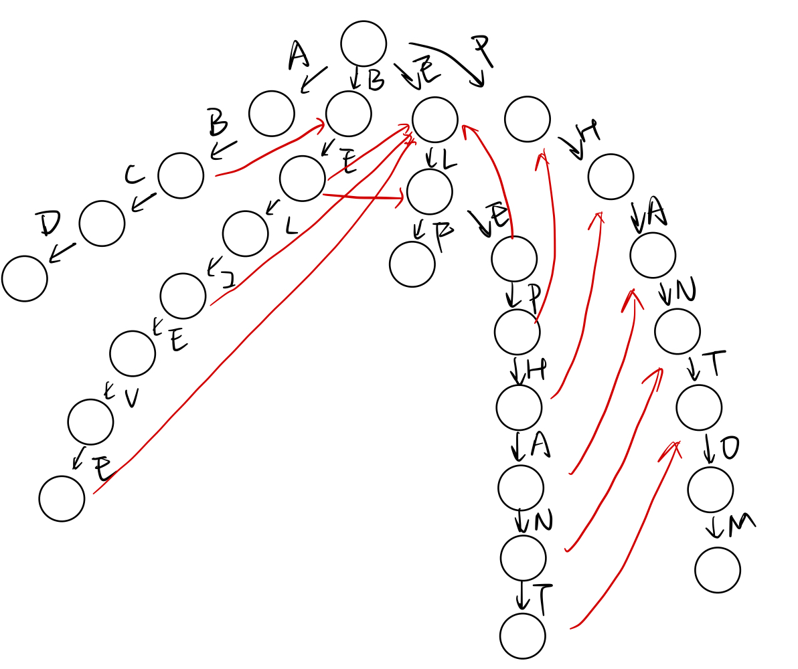

假设有一个文本（n words）和大量关键字（m keywords），如何在文本中匹配所有关键字？
简单实现，可以将每个关键字与文本进行比较，伪代码如下图，这样时间复杂度为O(n*m)，是非常缓慢的，有没有更高效的算法实现呢？

```java
for(i=0;i<m;i++){
    if(keywords[i] in words){
        print("find" + keywords[i]);
    }
}
```

<!-- more -->

贝尔实验室的Alfred Aho和Margaret Corasick发现了一种只扫描一遍文本就能完成这项任务的算法，该算法依据他们的名字命名为Aho-Corasick匹配算法，简称AC算法。该算法通过有限自动机巧妙地将字符比较转化为状态转移，此算法的时间复杂度与关键字的数目无关，只跟文本长度有关，其时间复杂度为O(n)，优于O(n*m)，匹配效率提升m倍。

AC算法的主要思想就是构造的有限状态自动机，根据有限状态自动机会根据输入进行模式串匹配。有限状态自动机会随着字符的输入而发生状态转移，转移的状态有如下三种：

1. success状态，即AC自动机根据输入有能直接到达的状态（没有发生跳转）；
2. failure状态，即AC自动机根据输入没有直接到达的状态，这时候就会发生跳转，跳转到其他一个路径（比如AC根节点就是其第一个孩子的所有failure状态）
3. output状态，即成功匹配到一个输入段

以上三个阶段分别对应算法中的三个步骤：

1. 建立Pattern tree；即建立自动机，简单来说就是根据输入的字符串构造一棵“树”；
2. 建立failure状态，即在每个叶子节点上加上failure状态（根节点不需要），即标注当前输入串到当前叶子节点时，若不能继续匹配所能跳转的路径；
3. 比对text，即成功到达output状态的时候，代表一次匹配成功。

举例说明：
如果有ABCD,BELIEVE,ELF,ELEPHANT,PHANTOM五个字符串，则构成AC自动机如下：

其中黑色箭头代表success状态走向，红色箭头代表failure状态走向（其余所有节点没有标注红色箭头的全部指向根节点，包括根节点本身），红色节点代表output状态；即输入一个模式串，沿着上面的pattern tree状态走，只要走到红色节点，代表一次匹配成功。

匹配流程：输入一个字符串，先匹配success状态，若success状态匹配无法匹配，则匹配failure状态，直到找到output节点。

实现代码可以参考：[https://github.com/hankcs/aho-corasick](https://github.com/hankcs/aho-corasick)
