在这篇文章中，我们将介绍一下NLP中经常使用的自监督任务。文章将重点介绍任务的构建思路，模型的具体实现在这里不再详细展开。
<!-- more -->

## Center Word PredictionPermalink

在这个任务中，我们将获取固定窗口大小的句子片段，通过中心词周围的词来预测中心词。如下图所示：

在上面的例子中，窗口大小为1，即我们取中心词左右各1个词作为窗口，然后通过窗口中的信息来预测中心词。
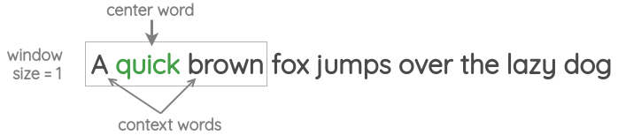

该任务使用的方法也被称为`“Continuous Bag of Words”`，在[Word2Vec](https://arxiv.org/abs/1301.3781)论文中被提出。

## Neighbor Word Prediction

在这个任务中，我们同样确定一个窗口大小，但与上面的任务相反，通过中心词来预测周围的词。如下所示：
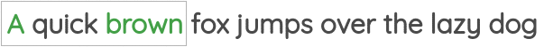
该任务也被称为`“skip-gram”`，在[Word2Vec](https://arxiv.org/abs/1301.3781)论文中被提出。

## Neighbor Sentence Prediction

在这个任务中，我们取三个相邻的句子，然后通过中间的句子预测前后句子。这和之前`“skip-gram”`的思路是一致的，只是将词级别的预测变为了句子级别的预测。
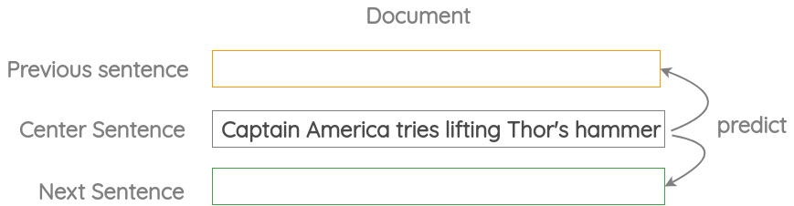

该任务在[Skip-Thought Vectors](https://arxiv.org/abs/1506.06726)论文中被提出。

## Auto-regressive Language Modeling

在这个任务中，我们通过前文来预测当前的token:

而通过前文预测当前token是完全不需要人为标注的，因为我们只需要语料就行了，如下所示：
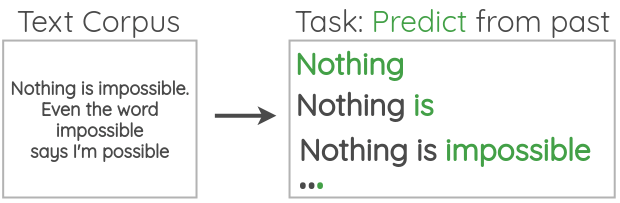
该任务对应的最为人们熟知的模型就是[GPT](https://s3-us-west-2.amazonaws.com/openai-assets/research-covers/language-unsupervised/language_understanding_paper.pdf)。

## Masked Language Modeling

在这个任务中，我们随机对文本中的token进行遮盖，然后对其进行预测，和`Auto-regressive Language Modeling`只能使用前文信息不同，`Masked Language Modeling`可以同时使用前文和后文的信息来预测当前token。
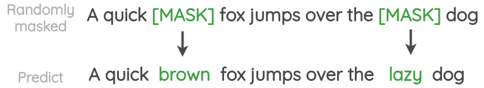
该任务对应的最为人们熟知的模型就是[BERT](https://arxiv.org/abs/1810.04805)。

## Next Sentence Prediction

该任务预测两个句子是不是前后文的关系：
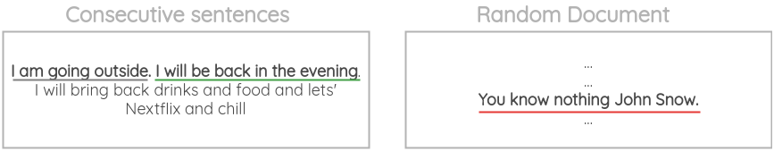
具体是预测句子B是否是句子A的后文，如下所示：
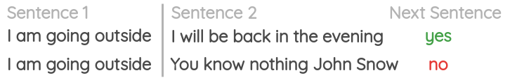
该任务同样是在[BERT](https://arxiv.org/abs/1810.04805)中被提出的。  
*在后面的研究中NSP任务的被证明有效性不是很大。*

## Sentence Order PredictionPermalink

该任务预测两条文本的前后关系：
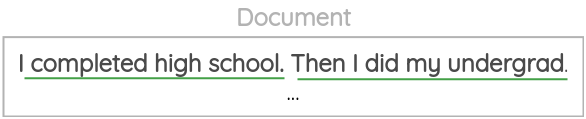
具体来说是预测句子A和句子B的顺序是否正确，如下所示：
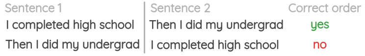
该任务在[ALBERT](https://arxiv.org/abs/1909.11942)中被提出，用来替代NSP任务。

## Sentence PermutationPermalink

该任务获取多个句子片段并打乱顺序，然后通过模型恢复其原始顺序：

该任务在[BART](https://arxiv.org/abs/1910.13461)中被使用。

## Document Rotation

在该任务中，先随机选取一段话中的一个token，然后以该token为基准对句子进行翻转，最后由模型将翻转后的句子恢复成原始的句子。

该任务在[BART](https://arxiv.org/abs/1910.13461)中被使用。

## Emoji Prediction

如下所示，将一句话中的文本和表情分开，并将表情作为预测的label，这样就将任务构建成了通过一段话来预测对应的表情。
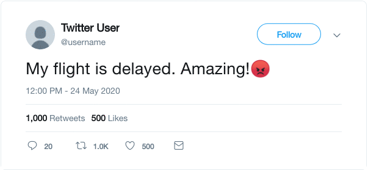
该任务在[DeepMoji](https://arxiv.org/abs/1708.00524)中被使用。

## Gap Sentence Generation

该任务将文档作为输入，并遮掩文档中重要的句子，然后由模型将被遮掩的句子恢复：
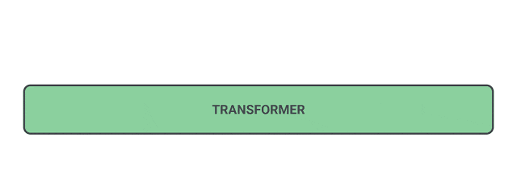
该任务在[PEGASUS](https://arxiv.org/abs/1708.00524)中被使用。
