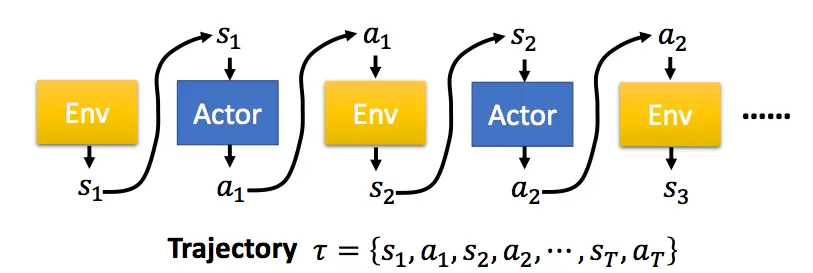
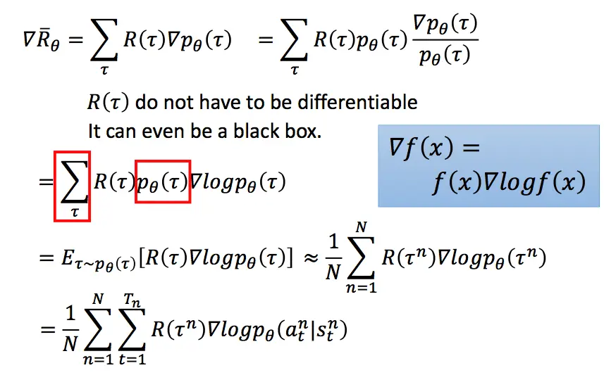
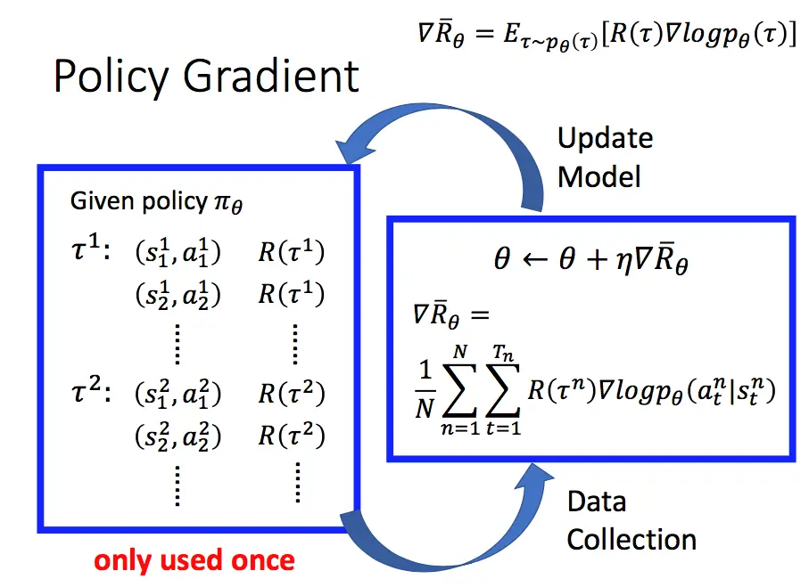
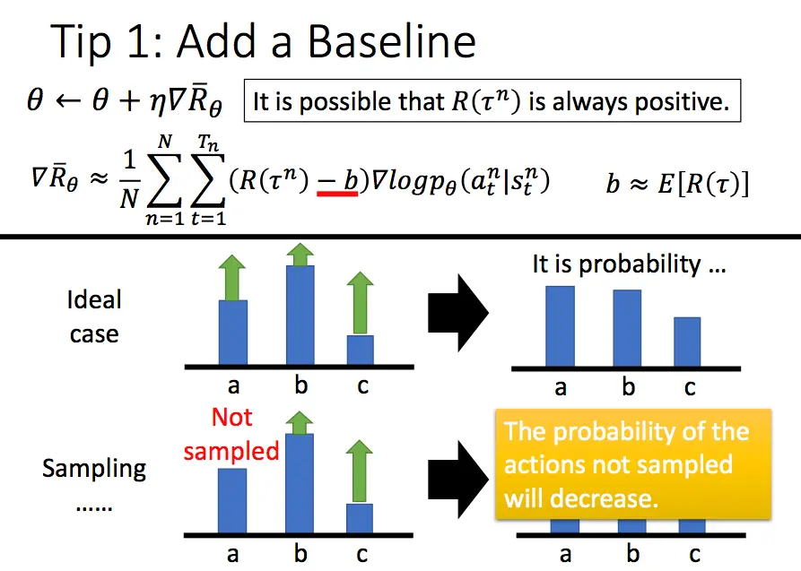
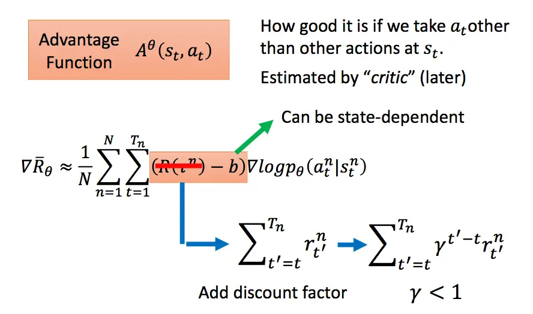
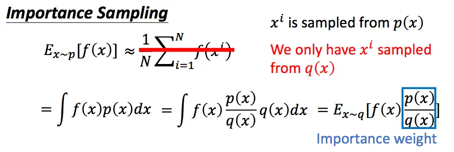
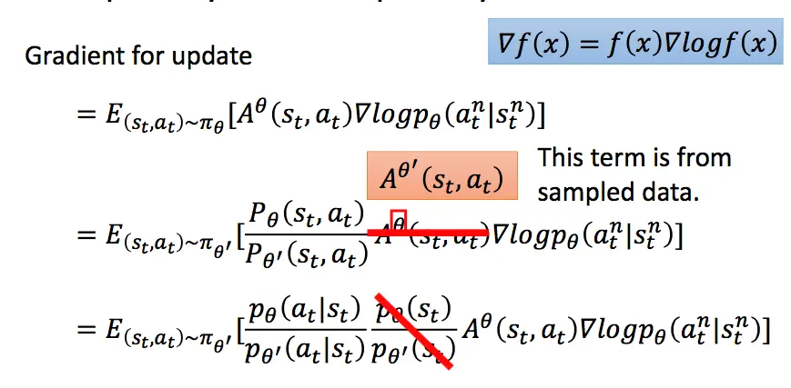
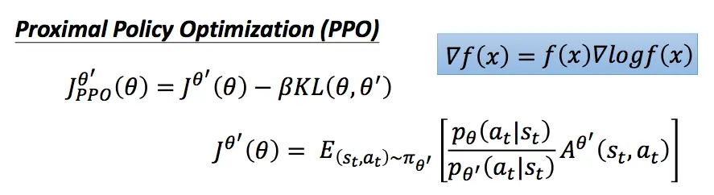
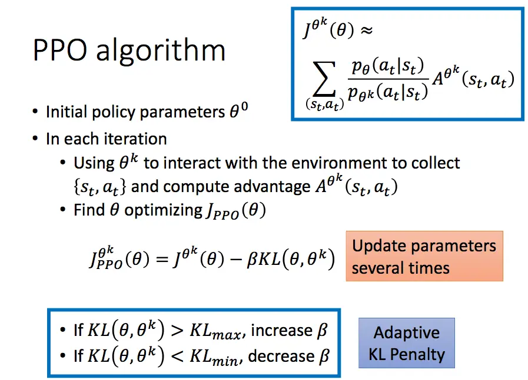
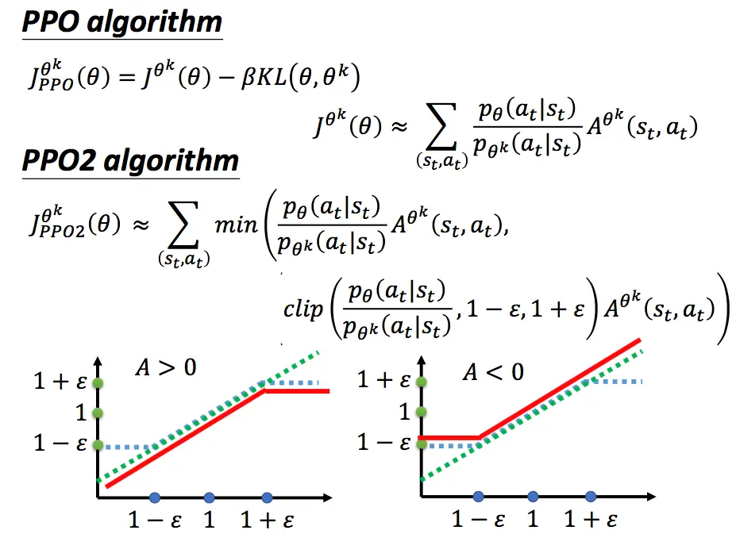

参考:

* [https://www.jianshu.com/p/9f113adc0c50](https://www.jianshu.com/p/9f113adc0c50)
* [https://zhuanlan.zhihu.com/p/468828804](https://zhuanlan.zhihu.com/p/468828804)
* [https://www.bilibili.com/video/av24724071/?p=4](https://www.bilibili.com/video/av24724071/?p=4)

<!-- more -->

## PG（Policy Gradient）算法

强化学习中，有一个Agent作为我们的智能体，它根据策略$\pi$在不同的环境状态$s$下选择相应的动作来执行，环境根据Agent的动作，反馈新的状态以及奖励，Agent又根据新的状态选择新的动作，这样不断循环，直到游戏结束，便完成了eposide。在深度强化学习中，策略$\pi$是由神经网络构成，神经网络参数为$\theta$，表示成$\pi_{\theta}$。

一个完整的eposide序列，用$\tau$表示。而一个特定的$\tau$序列发生的概率为：
$$
\begin{align}
    p_{\theta}(\tau)  \\
    & =p(s_1)p_{\theta}(a_1|s_1)p(s_2|s_1,a_1)p_{\theta}(a_2|s_2)p(s_3|s_2,a_2)...  \\
    & =p(s_1)\prod_{t=1}^Tp_{\theta}(a_t|s_t)p(s_{t+1}|s_t,a_t)
\end{align}
$$


如果是固定的开局方式，上式中的$p(s_1)$可以省略掉。


对于一个完整的$\tau$序列，其在整个游戏期间获得的总奖励用$R(\tau)$表示。对于给定参数$\theta$的策略，其奖励期望为：
$$\bar{R}_{\theta}=\sum_{\tau}R(\tau)p_{\theta}(\tau)=E_{\tau \sim p_{\theta}(\tau)}[R(\tau)]$$

对于一个游戏，我们自然希望通过调整策略参数$\theta$，得到的$\bar{R}_{\theta}$越大越好。所以就可以使用下面梯度下降的方式来求解，将$\bar{R}_{\theta}$对$\theta$求导：

上面的过程中，我们首先利用log函数求导的特点进行转化，随后用N次采样的平均值来近似期望，最后将$p_{\theta}$展开，将与$\theta$无关的项去掉，即得到了最终的结果。

形象的解释上面的式子：每一条采样到的数据序列都希望$\theta$向着自己的方向进行更新。而在总体上，我们希望$\theta$向着奖励比较大的那条序列，因此用每条序列的奖励来加权平均他们的更新方向。


假设第三条数据的奖励很大，通过上述式子的更新策略，使得$p_{\theta}(a_t^3|s_t^3)$发生的概率更大，以后再遇到$s_t^3$这个状态的时候，我们就更倾向于采取$a_t^3$这个动作。


所以，一个PG方法的完整过程如下：

我们首先采集数据，然后基于前面得到的梯度更新公式更新参数，随后再根据更新后的策略再次采集数据，再更新参数，如此循环进行。注意到图中`only used once`，因为在更新参数后，我们的策略已经变了，而先前的数据是基于更新前的策略得到的。

### 增加一个基线

通过上面的介绍可以发现，PG方法在更新策略时，基本思想就是增加reward大的动作出现的概率，减小reward小的策略出现的概率。假设现在有一种情况，我们的reward无论何时都是正的，对于没有采样到的动作，它的reward是0.因此，如果一个比较好的动作没有被采样到，而采样到的不好的动作得到了一个比较小的正reward，那么没有被采样到的好动作的出现概率会越来越小，这显然是不合适的。因此我们需要增加一个奖励的基线，让reward有正有负。一般增加的基线是所获得奖励的平均值。

### 增加折扣因子

类似买股票，未来1块钱的价值要小于当前1块钱的价值，因此未来1块钱变成现在的价值，需要进行一定的折扣。

### 使用优势函数

我们之前介绍的PG方法，对于同一个eposide中的所有数据，使用的奖励都是一样的。这样的做法不够细致，可以将奖励替换成关于$s_t,a_t$的函数，我们把这个函数叫做优势函数:
$$A^{\theta}(s_t, a_t)=Q_{\pi}(s_t,a_t)-V_{\pi}(s_t)=\sum_{t'>t}\gamma^{t'-t}r_{t'}-V_{\phi}(s_t)$$
其中前半部分表示实际的折扣奖励，后半部分$V_{\phi}(s_t)$是拟合的折扣奖励，通过critic来计算得到，它由一个结构与策略网络相同但参数不同的神经网络构成，主要是来拟合从$s_t$到终局的折扣奖励。

$A^{\theta}(s_t, a_t)$表示在$s_t$状态下采用动作$a_t$时，实际得到的折扣奖励相对于模拟折扣奖励的优势。模拟的折扣奖励是在$s_t$状态下所有采样过动作的折扣奖励的拟合（通过critic模型拟合），因此优势函数代表了采用动作$a_t$相对于这些动作的平均优势。

## PPO算法

接着上面的讲，PG方法一个很大的缺点就是参数更新慢，因为我们每更新一次参数都需要进行重新采样，这其实是`on-policy`的策略，即我们想要训练的agent和与环境进行交互的agent是同一个agent。与之对应的是`off-policy`策略，即想要训练的agent和与环境交互的agent不是同一个agent。

那么为了提升我们的训练速度，让采样到的数据可以重复使用，我们可以将`on-policy`的方式转换为`off-policy`的方式。即我们训练的模型是一个actor，与环境交互采样数据的模型使用另一个actor。

通过这种方式，我们的$p(x)$和$q(x)$的分布不能差别太大。  
那么此时我们想要期望奖励最大化，则变为：

最后一项因为假设两个分布不能差太远，所以认为它们是相等的，为了求解方便，直接划掉。此时似然函数变为：
$$J^{\theta'}(\theta)=E_{(s_t,a_t)\sim\pi_{\theta'}}\bigg[\frac{p_{\theta}(a_t|s_t)}{p_{\theta'}(a_t|s_t)}A^{\theta'}(s_t,a_t)\bigg]$$

前面介绍了，我们希望$\theta$和$\theta'$不要差太远。我们可以用KL散度来计算，将其加入PPO模型的似然函数中，变为：

在实际中，我们会动态改变对$\theta$和$\theta'$分布差异的惩罚，如果KL散度太大，则增加这一部分的惩罚；如果小到一定的值，就减小这一部分的惩罚。基于此，我们得到了PPO算法的过程：

PPO算法还有另一种实现方式，不将KL散度直接放入似然函数中，而是进行一定程度的裁剪：

上图中，绿色的线代表min中的第一项，即不做任何处理。蓝色的线为第二项，如果两个分布差距太大，则进行一定程度的裁剪。最后这两项取min，防止$\theta$更新太快。

通过上述介绍，我们可以看到PPO有三个网络参数：

1. $\theta$：训练网络，每次都会被更新。
2. $\theta'$：训练网络副本，负责与环境交互采样数据。
3. $\phi$：奖励模型，拟合折扣奖励。

打个比喻来说，PPO的思路是：
0点时，我与环境进行互动，收集了很多数据。然后利用数据更新我的策略，此时我成为1点的我。当我被更新后，理论上，1点的我再次与环境互动，收集数据，然后把我更新到2点，然后这样往复迭代。

但是如果我仍然想继续0点的我收集的数据来进行更新。因为这些数据是0点的我（而不是1点的我）所收集的。所以，我要对这些数据做一些重要性重采样，让这些数据看起来像是1点的我所收集的。当然这里仅仅是看起来像而已，所以我们要对这个“不像”的程度加以更新时的惩罚（KL）。

其中，更新的方式是：我收集到的每个数据序列，对序列中每个（s, a）的优势程度做评估，评估越好的动作，将来就又在s状态时，让a出现的概率加大。这里评估优势程度的方法，可以用数据后面的总折扣奖励来表示。另外，考虑引入基线的Tip，我们就又引入一个评价者小明，让他跟我们一起学习，他只学习每个状态的期望折扣奖励的平均期望。这样，我们评估（s, a）时，我们就可以吧小明对 s 的评估结果就是 s 状态后续能获得的折扣期望，也就是我们的基线。注意哈：优势函数中，前一半是实际数据中的折扣期望，后一半是估计的折扣期望（小明心中认为s应该得到的分数，即小明对s的期望奖励），如果你选取的动作得到的实际奖励比这个小明心中的奖励高，那小明为你打正分，认为可以提高这个动作的出现概率；如果选取的动作的实际得到的奖励比小明心中的期望还低，那小明为这个动作打负分，你应该减小这个动作的出现概率。这样，小明就成为了一个评判官。

当然，作为评判官，小明自身也要提高自己的知识文化水平，也要在数据中不断的学习打分技巧，这就是对$\phi$的更新了。
