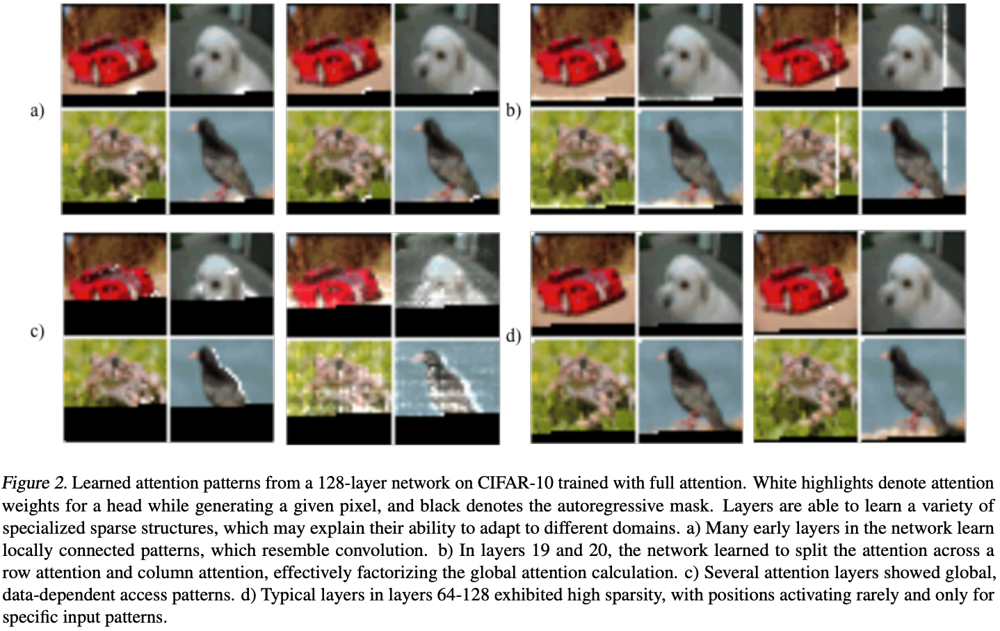
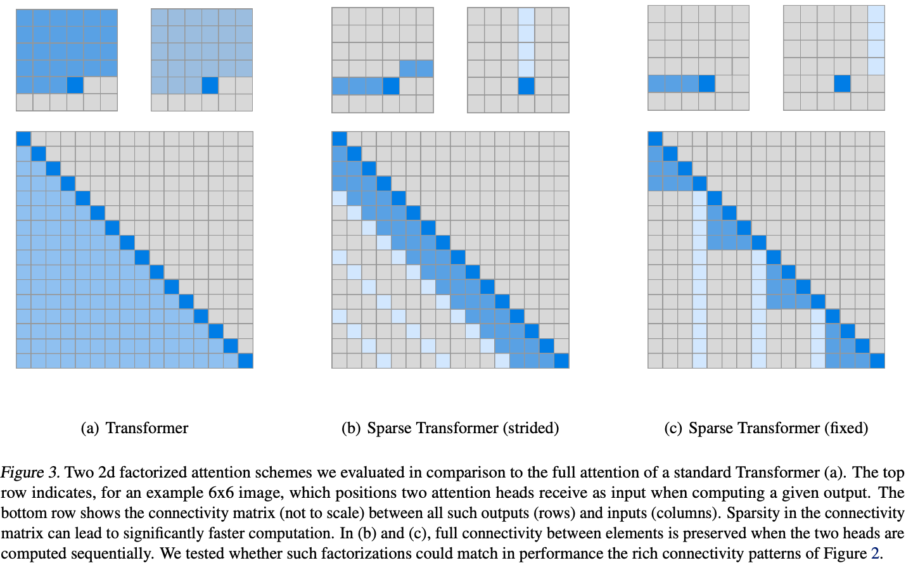
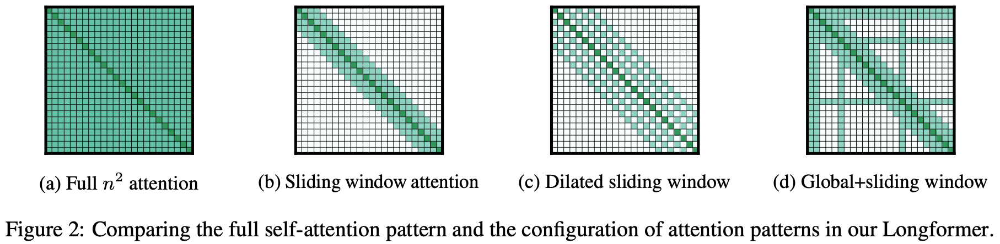
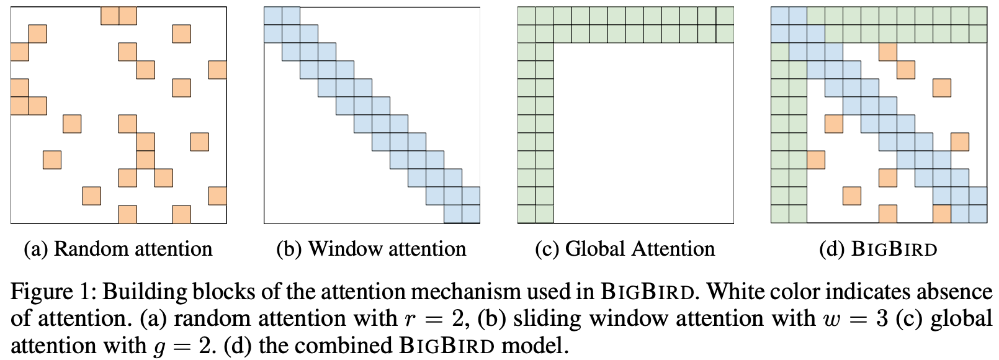
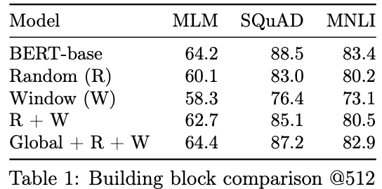
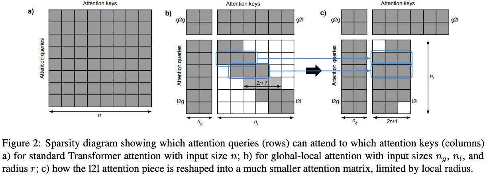
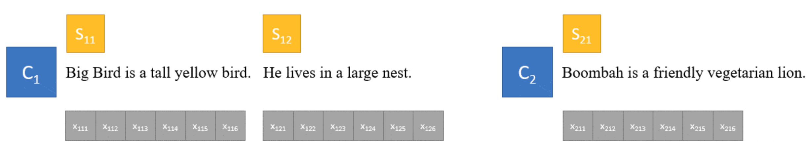
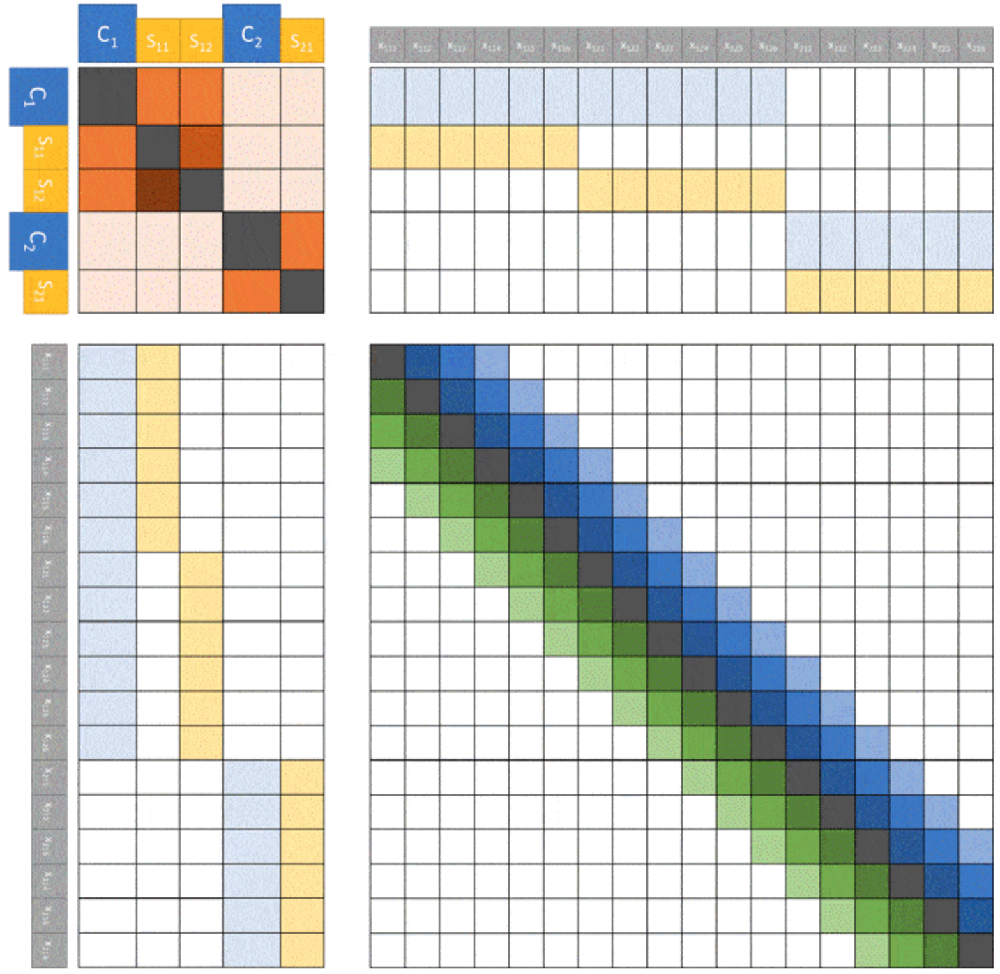

传统Transformer的Self Attention架构会带来$O(n^2)$的复杂度，总结一下对Self Attention结构进行优化的工作。

<!-- more -->

## Sparse Transformer

机构：OpenAI  
论文地址：

* [https://arxiv.org/pdf/1904.10509.pdf](https://arxiv.org/pdf/1904.10509.pdf)

### 前言

自从[Transformer](https://arxiv.org/abs/1706.03762)被提出以来，它依靠强大的效果得到了广泛的关注。Transformer最被诟病的一个问题是它的时间复杂度以及空间复杂度和输入序列的长度成二次方的关系$O(n^2)$。而这篇文章提出的Sparse Transformer方法使用稀疏自注意力替代了传统Transformer的密集自注意力，将Transformer的复杂度降低到$O(n\sqrt{n})$。

### 算法动机

在CIFAR-10数据集上，使用一个128层的自注意力模型。对注意力进行可视化，得到下图：

图中白色区域是注意力机制的高权值位置，黑色区域是被mask掉的位置（由于是自回归生成图片，所以需要将未来信息遮掩）。

* （a）浅层的注意力高权值点集中在当前预测点的附近，也就是说浅层的注意力更关注当前像素周围的纹理信息。
* （b）第19、20层的更关注同行和同列的像素。
* （c）深层的注意力关注图像的全局信息。
* （d）更深层的注意力关注点十分的稀疏。

那么是否可以将稀疏性引入Transformer中呢，这也就是Sparse Transformer提出的动机。

### Sparse Transformer

#### 传统自注意力

像GPT这样的自回归模型，使用的是之前所有时间片的内容来预测当前时间片的结果。传统的Transformer需要为之前的所有时间片计算一个权值，所以传统Transformer的自注意力机制的复杂度是$O(n^2)$。如上图(a)中为$6 \times 6$大小图像的注意力和长度为16的注意力连接矩阵。

#### Factorized Self-Attention

Transformer在进行图像生成时，注意力矩阵与注意力所处的网络深度呈现了明显的相关稀疏性。那么我们能否提前就人工设置好自注意力矩阵的稀疏性呢？这样我们一是能够引入网络结构的归纳偏置，二是能够减轻模型的计算量，提升计算速度。下面就来介绍Sparse Transformer是如何实现这个目标的。

传统的自注意力的计算方式可以表示为：
$$softmax(\frac{QK^T}{\sqrt{d}})$$
该计算方式复杂度最高的地方是$QK^T$，达到了$O(n^2)$。而Sparse Transformer的核心是只让设置好的像素点参与自注意力的计算（注意这里不是只选取设置好位置上的像素点，其他mask掉，因为这样斌不能降低模型的复杂度）。

为了实现上述目标，我们这里引入一个名为连接模式(Connectivity Pattern)的变量，它表示为$S=\{S_1, ..., S_n\}$。其中$S_i$表示预测第$i$个时间片的索引，表示为一个由0和1组成的二维矩阵，二维矩阵中的数值为1表示该位置的像素点参与自注意力的计算。如在上图中，位置为28，则传统自注意力中$6 \times 6$大小的$S_{28}$表示为(a)的上半部分，其中深色部分为1，浅色部分为0。

在Sparse Transformer的自注意力计算中，连接模式只作用在$K$和$V$的计算上，计算过程如下所示。

1. 对于第$i$个时间片的输入，首先使用$key$和$value$的权值矩阵乘以输入特征，得到$K$和$V$。然后再将连接模式$S_i$作用到$K$和$V$上，得到稀疏的特征$K_{S_i}$和$V_{S_i}$。
   $$K_{S_i}=(W_kx_j)_{j \in S_i}, V_{S_i}=(W_vx_j)_{j \in S_i}$$
2. 然后使用稀疏特征得到第$i$个时间片的自注意力结果。
   $$a(x_i,S_i)=softmax(\frac{(W_qx_i)K_{S_i}^{T}}{\sqrt{d}})V_{S_i}$$
3. 最后再将$n$个时间片的结果合并起来，得到最终的结果。
   $$Attend(X, S)=(a(x_i, S_i))_{i \in \{1,...,n\}}$$

其中$W_q$，$W_k$以及$W_v$分别是$Query$，$Key$，$Value$三个向量对应的权值矩阵。Sparse Transformer通过让连接模式作用到$K^T$上，从而降低了$QK^T$的复杂度。

我们这里已经定义好了稀疏自注意力机制的通用计算方式，接下来要做的就是设计不同的连接模式。对于每个自注意力的计算，我们可以使用若干不同的注意力核。在论文中，作者使用了2个注意力核（行+列），也可以扩展到更高的维度。

##### Strided Attention

Strided Attention由两种形式的连接模式组成，如上图(b)所示，其包含行和列两种注意力核。假设步长为$l$，行注意力核指的是在连接模式中，当前时间片的前$l$个时间片的值是1，其余的值是0.列注意力核指的是连接模式中每隔l个时间片的值为1，其余值为0。  
行注意力核和列注意力核的表达式如下：
$$
\begin{matrix}
    A_i^{(1)}=&\{t,t+1,...,i\}, t=max(0, i-l) \\
    A_i^{(2)}=&\{j:(i-j) \space mod \space l = 0\}
\end{matrix}
$$
对于图片生成这一类任务来说，$l$一般为图像的宽或者高。所以复杂度为$O(l)=O(\sqrt{n})$。

##### Fixed Attention

Fixed Attention同样也是由行注意力核和列注意力核组成，如上图中(c)所示。行注意力核是当前时间片同行的的时间片。表示为下面的式子：
$$A_i^{(1)}=\{j:(\lfloor j/l \rfloor=\lfloor i/l \rfloor)\}$$

列注意力核表示为：
$$A_i^{(2)}=\{j:j \space mod \space l \in \{t,t+1,...,l\}\}$$
其中$t=l-c$，Fixed Attention的列注意力核又被叫做滑窗注意力核，超参数$c$相当于滑窗卷积窗口的大小。上述两个注意力核的复杂度同样为$O(\sqrt{n})$。

#### Factorized attention heads

上面介绍了多种不同形式的注意力核，下面将介绍如何既那个这些不同形式的注意力核融入到网络中。

传统的Transformer通过如下方式计算注意力核：
$$attention(X) = W_p \cdot attend(X,S)$$
本文作者提出了一下三种新的方式：

1. 每个残差块使用不同的注意力核类型，一个深层网络是由多个连续的残差块组成的，对于每个残差块，我们可以使用不同类型的注意力核，表示为下式：
   $$attention(X)=W_p \cdot attend(X, A^{(r \space mod \space p)})$$
2. 第二个方式是每个注意力头都计算所有类型的注意力核，然后合并他们的结果，如下式所示：
   $$attention(X)=W_p \cdot attend(X,\bigcup_{m=1}^{p}A^{(m)})$$
3. 第三个方式是对于多头的注意力机制，每组头选择一个形式的注意力核，然后将他们合并起来，如下式所示：
   $$attention(X)=W_p(attend(X,A)^{(i)})_{i \in \{1,...,n_h\}}$$
   其中$n_h$组不同的注意力核会并行计算，然后在特征维度进行特征拼接。实验结果证明这种方式是最好的融合策略。

## Longformer

论文地址：

* [https://arxiv.org/pdf/2004.05150.pdf](https://arxiv.org/pdf/2004.05150.pdf)

论文代码：

* [https://github.com/allenai/longformer](https://github.com/allenai/longformer)

### 摘要

Transformer结构的模型难以处理长序列文本，这是因为Transformer中的self-attention的复杂度是和输入长度成2次方关系的$(O(n^2))$。文章提出了Longformer以解决上述问题。

### Longformer

如下图（a）所示，传统Transformer的所有token都会互相关注，因此复杂度是$O(n^2)$。而Longformer可以将传统Transformer中self-attention的复杂度从$O(n^2)$降低到$O(n)$，从而可以处理更长的序列。

#### 注意力模式

Longformer定义了如下几种形式的改进self-attention。

##### Sliding window

Sliding window如上图(b)所示，每个位置的token只关注其相邻窗口位置的token，相当于CNN的卷积窗口。
给定一个固定窗口大小$w$，每个token关注其左右$\frac{1}{2}$长度的token，则复杂度为$O(n \times w)$。对于一个$l$层的Transformer模型，顶层token的感受野大小为$l \times w$（假设每一层的窗口大小都是$w$），设置合适的窗口大小可以让顶层token关注到所有的输入token。

##### Dilated Sliding Window

Dilated Sliding Window如上图(c)所示。为了进一步提升感受野大小，可以在滑动窗口中加入空洞，相当于CNN中的空洞卷积。给定窗口大小$w$，窗口之间的空洞个数$d$，假设每一层都采用上述参数，则感受野大小为$l \times d \times w$。

此外，作者发现在多头自注意力中，对每个头使用不同的$d$可以有更好的效果。通过设置空洞参数，某些头可以不使用空洞从而可以更加关注附近的信息，而某些头使用空洞去关注长距离的文本信息。

##### Global Attention

全局注意力如上图(d)所示。除了上述两种形式的self-attention之外，作者还定义了全局注意力，即选择一些token关注全局的token。特别的是，全局注意力token是对称的，即全局注意力token会关注所有的token，所有的其他token也会关注全局token。

由于全局注意力token的个数只会相对输入长度较小，且是人为定义的常数，所以全局注意力的复杂度是$O(n)$。

#### 实现细节

1. 上述提出的方法的矩阵乘法没有在Pytorch、Tensorflow等框架中实现，作者自己基于cuda进行了实现。
2. 在训练时进行阶段式的训练方法：序列长度和窗口大小逐步提高。每个阶段窗口大小和序列长度增加一倍，学习率减半。

## Big Bird

机构：Google Research  
论文地址：

* [https://arxiv.org/pdf/2007.14062.pdf](https://arxiv.org/pdf/2007.14062.pdf)

### 摘要

当下各种地表最强的NLP模型都同宗同源于Transformer，但Transformer的完全注意力机制会带来模型的复杂度和序列长度呈二次依赖的问题，即$O(n^2)$。Big Bird模型的核心是使用稀疏注意力机制将二次依赖降至线性。文章中还证明了Big Bird是一个序列函数的通用逼近器，而且是图灵完备的，而且可以保持完全注意力模型的性质。在相同的硬件配置下，Big Bird能够处理的序列长度是BERT的8倍。


一个模型图灵完备意味着一切可以计算的问题模型都能完成，理论上，它可以用来解决任何算法。


### Big Bird架构

由于BERT使用的是完全注意力机制，即每个token都需要关注所有的token，所以内存消耗就是序列长度的二次方。Big Bird中引入了稀疏注意力机制，将二次依赖降至线形，其主要由以下三个部分组成：

#### Random attention

`Random attention`：随机注意力，如上图(a)，每个token随机关注r个token，r为超参数。

#### Sliding window attention

`Sliding window attention`：局部注意力，如上图(b)，每个token关注附近w个token，w为超参数，表示窗口大小。

#### Global attention

`Global attention`：全局注意力，如上图(c)，全局token可以关注到全部的token，同时全部token都会关注到全局token。Global token的定义有两种：

1. ITC(internal transformer construction)，选用现有的一些token作为全局token。
2. ETC(extended transformer construction)，通过添加一些token(比如`[CLS]`)作为全局token。

三种注意力的消融实验，三者联合的效果是最好的：

从模型角度来看，Big Bird和Longformer模型非常类似。相对Longformer模型，Big Bird模型增加了`Random attention`，而在`Sliding window attention`没有使用空洞，其他基本都一致。

## ETC

论文地址：

* [https://arxiv.org/pdf/2007.14062.pdf](https://arxiv.org/pdf/2007.14062.pdf)

论文代码：

* [https://github.com/google-research/google-research/tree/master/etcmodel](https://github.com/google-research/google-research/tree/master/etcmodel)

### Global-Local Attention

ETC接收两个序列作为输入：

1. `global input`： $x^g=(x_1^g,...,x_{n_g}^g)$
2. `long input`： $x_l=(x_1^l,...,x_{n_l}^l)$

其中`long input`输入和传统Transformer一致。而`global input`是新增加的辅助token，其数量远小于`long input`，即$n_g << n_l$。

然后，注意力被分成了如下四部分：

1. global-to-global(g2g)
2. global-to-long(g2l)
3. long-to-global(l2g)
4. long-to-long(l2l)

其中复杂度最高的$l2l$部分被限制在一个固定的半径$r(r<<n_l)$之内，这样$l2l$中的token只能关注到邻近的$2r+1$个token。如下图所示：

而且，ETC的attention矩阵可以更加的灵活，如下所示：

