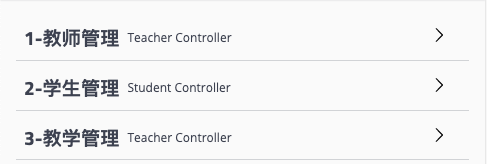

Spring Boot让我们的Spring应用变的更轻量化。我们不必像以前那样繁琐的构建项目、打包应用、部署到Tomcat等应用服务器中来运行我们的业务服务。通过Spring Boot实现的服务，只需要依靠一个Java类，把它打包成jar，并通过java -jar命令就可以运行起来。这一切相较于传统Spring应用来说，已经变得非常的轻便、简单。

总结一下Spring Boot的主要优点：

1. 使所有Spring开发者更快的入门
2. 开箱即用，提供各种默认配置来简化项目配置
3. 内嵌式容器简化Web项目
4. 没有冗余代码生成和XML配置的要求

<!-- more -->

## 快速入门

本文我们将学习如何快速的创建一个Spring Boot应用，并且实现一个简单的Http请求处理。通过这个例子对Spring Boot有一个初步的了解，并体验其结构简单、开发快速的特性。

### 创建基础项目

两种方式：

1. 使用Spring Initializr页面创建
2. 使用IntelliJ IDEA创建

**使用Spring Initializr页面创建**
**第一步**：访问[Spring Initializr](https://start.spring.io/)，进行如下选择


如图所示，几个选项说明：

* `Project`：使用什么构建工具，Maven还是Gradle；
* `Language`：使用什么编程语言，Java、Kotlin还是Groovy；
* `Spring Boot`：选用的Spring Boot版本；
* `Project Metadata`：项目的元数据；根据自己组织的情况输入相关数据；
* `Dependencies`：选择要加入的Spring Boot组件；

**第二步**：点击”Generate“按钮生成项目；此时浏览器会下载一个与上面Artifact名称一样的压缩包。

**第三步**：解压项目包，并用编译器以Maven项目导入，以IntelliJ IDEA为例：
菜单中选择：`File` => `New` => `Project from Existing Sources…`


选择解压后的项目文件夹，点击OK
点击：`Import project from external model`，并选择Maven，点击Next到底为止。
若你的环境有多个版本的JDK，注意到选择Java SDK的时候请选择你在第一步中选择的Java版本

**使用IntelliJ IDEA创建**
**第一步**：菜单栏中选择：`File` => `New` => `Project...`，我们可以看到如下图所示的创建功能窗口。

其中Initial Service Url指向的地址就是Spring官方提供的Spring Initializr工具地址，所以这里创建的工程实际上也是基于它的Web工具来实现的。

**第二步**：点击Next，等待片刻后，我们可以看到如下图所示的工程信息窗口：

其实内容就跟我们用Web版的Spring Initializr是一模一样的，跟之前在页面上一样填写即可。

**第三步**：继续点击Next，进入选择Spring Boot版本和依赖管理的窗口：


**第四步**：点击Next，进入最后关于工程物理存储的一些细节。最后，点击Finish就能完成工程的构建了。

### 项目结构解析


通过上面步骤完成了基础项目的创建。如上图所示，Spring Boot的基础结构共三个文件

1. src/main/java下的程序入口：DemoApplication
2. src/main/resources下的配置文件：application.properties  
（也可以使用application.yml格式的文件）
3. src/test/下的测试入口：DemoApplicationTests

生成的DemoApplication和DemoApplicationTests类都可以直接运行来启动当前创建的项目，由于目前该项目未配合任何数据访问或Web模块，程序会在加载完Spring之后结束运行。

### 项目依赖配置

```xml
<?xml version="1.0" encoding="UTF-8"?>
<project xmlns="http://maven.apache.org/POM/4.0.0" xmlns:xsi="http://www.w3.org/2001/XMLSchema-instance"
         xsi:schemaLocation="http://maven.apache.org/POM/4.0.0 https://maven.apache.org/xsd/maven-4.0.0.xsd">
    <modelVersion>4.0.0</modelVersion>
    <parent>
        <groupId>org.springframework.boot</groupId>
        <artifactId>spring-boot-starter-parent</artifactId>
        <version>2.1.4.RELEASE</version>
        <relativePath/> <!-- lookup parent from repository -->
    </parent>
    <groupId>com.netease.is.example</groupId>
    <artifactId>demo</artifactId>
    <version>0.0.1-SNAPSHOT</version>
    <name>demo</name>
    <description>Demo project for Spring Boot</description>

    <properties>
        <java.version>1.8</java.version>
    </properties>

    <dependencies>
        <dependency>
            <groupId>org.springframework.boot</groupId>
            <artifactId>spring-boot-starter-web</artifactId>
        </dependency>

        <dependency>
            <groupId>org.springframework.boot</groupId>
            <artifactId>spring-boot-starter-test</artifactId>
            <scope>test</scope>
        </dependency>
    </dependencies>

    <build>
        <plugins>
            <plugin>
                <groupId>org.springframework.boot</groupId>
                <artifactId>spring-boot-maven-plugin</artifactId>
            </plugin>
        </plugins>
    </build>

</project>
```

如上所示，主要有四个部分：

1. 项目元数据：创建时候输入的Project Metadata部分，也就是Maven项目的基本元素，包括：groupId（com.netease）、artifactId（项目名）、version、name、description等
2. parent：继承spring-boot-starter-parent的依赖管理，控制版本与打包等内容
3. dependencies：项目具体依赖，这里包含了spring-boot-starter-web用于实现HTTP接口（该依赖中包含了Spring MVC）；spring-boot-starter-test用于编写单元测试的依赖包。
4. build：构建配置部分。默认使用了spring-boot-maven-plugin，配合spring-boot-starter-parent就可以把Spring Boot应用打包成JAR来直接运行。

### Demo：编写一个HTTP接口

创建HelloController类，内容如下：

```java
@RestController
public class HelloController {
    @RequestMapping("/hello")
    public String check() {
        return "Hello world!";
    }
}
```

启动主程序，访问[http://localhost:8080/hello](http://localhost:8080/hello)，可以看到页面返回：Hello World！

### 编写单元测试用例

```java
@RunWith(SpringRunner.class)
@SpringBootTest
class HelloControllerTest {
    private MockMvc mvc;

    @Test
    public void testHelloController() throws Exception {
        mvc = MockMvcBuilders.standaloneSetup(new HelloController()).build();
        RequestBuilder request;
        request = MockMvcRequestBuilders.get("/hello").contentType(MediaType.APPLICATION_JSON).content("")
                .accept(MediaType.APPLICATION_JSON);
        String responseString = mvc.perform(request).andExpect(MockMvcResultMatchers.status().isOk())
                .andDo(MockMvcResultHandlers.print()).andReturn().getResponse().getContentAsString();
    }
}
```

----------------------------------------------------------------------

## 配置文件详解

在快速入门一节中，我们轻松的实现了一个简单的RESTful API应用，体验了一下Spring Boot给我们带来的诸多便利，我们用非常少的代码量就成功实现了一个Web应用，这是传统的Spring应用无法办到的。虽然我们在实现Controller时用到的代码是一样的，但是在配置方面会简单很多。

### 配置基础

我们介绍Spring Boot的工程结构时有提到过`src/main/resources`目录时Spring Boot的配置目录，所以在该目录下建立配置文件。

Spring Boot的默认配置文件位置为：`src/main/resources/application.properties`，
关于Spring Boot应用的配置内容都可以集中在该文件中，可以定义诸如容器端口名、数据库链接信息、日志级别等各种配置信息。比如，我们需要自定义web模块的服务端口号，可以在`application.properties`中添加`server.port=8888`来指定服务端口为8888，也可以通过`spring.application.name=hello`来指定应用名（该名字在Spring Cloud应用中会被注册为服务名）。

Spring Boot的配置文件除了可以使用传统的properties文件之外，还支持现在被广泛推荐使用的yaml文件。yaml采用的配置格式不像properties的配置那样以单纯的键值对来表示，而是以树状形式来表示，如下所示：

```yaml
environments:
    dev:
        url: http://dev.bar.com
        name: Developer Setup
    prod:
        url: http://foo.bar.com
        name: My Cool App
```

与其等价的properties配置如下：

```properties
environments.dev.url=http://dev.bar.com
environments.dev.name=Developer Setup
environments.prod.url=http://foo.bar.com
environments.prod.name=My Cool App
```

yaml采用阶梯化缩进的方式进行配置，其结构显得更为清晰易读，同时配置内容的字符量也得到显著的减少。除此之外，yaml还可以在单个文件中通过使用`spring.profiles`属性来定义多个不同的环境，如下所示：

```yaml
server:
  port: 8881
---
spring:
  profiles: test
server:
  port: 8882
---
spring:
  profiles: prod
server:
  port: 8883
```

配置文件分了三个环境，分别为默认、test和prod，当指定test环境时将使用8882端口；在指定prod环境时，将使用8883端口；没有指定时默认使用8881端口。

### 自定义参数

我们除了可以在Spring Boot的配置文件中设置各个Starter模块中预定义的配置属性之外，还可以在配置文件中定义一些我们需要自定义的属性。如下所示：

```yaml
book:
    name: SpringCloudinAction
    author: WBY
```

然后就可以在应用中使用`@Value`注解来加载这些自定义的参数。

```java
@Component
public class Book {
    @Value("${book.name}")
    private String name;
    @Value("${book.author}")
    private String author;
}
```

#### 参数引用

在`application.properties`中的各个参数之间，我们也可以直接使用PlaceHolder的方式来进行引用，如下：

```yaml
book:
    name: SpringCloud
    author: WBY
    desc: ${book.author} is writing ${book.name}
```

#### 使用随机数

在一些特殊情况下，有些参数我们希望它每次加载的时候不是一个固定的值，比如密匙和服务端口等。在Spring Boot的属性配置文件中，我们可以通过使用`${random}`配置来产生随机的int值、long值或者string字符串，这样我们就可以容易的通过配置来进行属性的随机生成，而不是在程序中通过编码来实现这些逻辑。`${random}`的配置方式主要有以下几种：

```properties
# 随机字符串
com.didispace.blog.values=${random.value}
# 随机int
com.didispace.blog.number=${random.int}
# 随机long
com.didispace.blog.bignumber=${random.long}
# 10以内的随机数
com.didispace.blog.test1=${random.int(10)}
# 10-20的随机数
com.diidspace.blog.test2=${random.int[10, 20]}
```

#### 命令行参数

回顾以下在快速入门中，我们还介绍了如何启动Spring Boot应用，其中提到了使用命令java -jar命令来启动的方式。该命令除了启动应用之外，还可以在命令行中来指定应用的参数，比如：`java -jar xxx.jar --server.port=8888`，直接以命令行的方式，将启动应用的端口设为8888。

#### 多环境配置

我们在开发任何应用的时候，通常同一套程序会被应用和安装到几个不同的环境，比如开发、测试和生产环境。其中每个环境的数据库地址、服务器端口等等配置都会不同，如果在为不同环境打包的时候都要频繁修改i配置文件的话，那必将是个非常繁琐且容易发生错误的事。

对于多环境的配置，各种项目构建工具或是框架的基本思路是一致的，通过配置多份不同环境的配置文件，再通过打包命令指定需要打包的内容之后进行区分打包，Spring Boot也是一样。

在Spring Boot中多环境配置文件名需要满足`application-{profile}.properties`的格式，如：

* `application-dev.properties`对应开发环境
* `application-test.properties`对应测试环境
* `application-prod.properties`对应生产环境

至于哪个具体的配置文件会被加载，需要在`application.properties`文件中通过`spring.profiles.active`属性来设置，其值对应配置文件中的`{profile}`值。如`spring.profiles.active=test`就会加载`application-test.properties`
配置文件。

#### 加载顺序

在上面的例子中，我们将Spring Boot应用需要的配置内容都放在了项目工程中，虽然我们已经能够通过`spring.profiles.active`或是通过`Maven`来实现多环境的支持。但是，当我们的团队逐渐壮大，分工越来越细致之后，往往我们不需要让开发人员知道测试或是生成环境的细节，而是希望由每个环境各自的负责人（QA或是运维）来集中维护这些信息。那么如果还是以这样的方式存储配置内容，对于不同环境配置的修改就不得不去获取工程内容来修改这些配置内容，当应用非常多的时候就变得非常不方便。同时，配置内容都对开发人员可见，本身这也是一种安全隐患。对此，现在出现了很多将配置内容外部化的框架和工具，后续将要介绍的Spring Cloud Config就是其中之一，为了后续能更好的理解Spring Cloud Config的加载机制，我们需要对Spring Boot对数据文件的加载机制有一定的了解。

Spring Boot为了能够更合理的重写各属性的值，使用了下面这种较为特别的属性加载顺序：

1. 命令行中传入的参数。
2. `SPRING_APPLICATION_JSON`中的属性。`SPRING_APPLICATION_JSON`是以JSON格式配置在系统环境变量中的内容。
3. java:comp/env中的JNDI属性。
4. Java的系统属性，可以通过`System.getProperties()`获得的内容。
5. 操作系统的环境变量
6. 通过`random.*`配置的随机属性
7. 位于当前应用jar包之外，针对不同{profile}环境的配置文件内容，例如：`application-{profile}.properties`或是`YAML`定义的配置文件
8. 位于当前应用jar包之内，针对不同{profile}环境的配置文件内容，例如：`application-{profile}.properties`或是`YAML`定义的配置文件
9. 位于当前应用jar包之外的`application.properties`和`YAML`配置内容
10. 位于当前应用jar包之内的`application.properties`和`YAML`配置内容
11. 在`@Configuration`注解修改的类中，通过`@PropertySource`注解定义的属性
12. 应用默认属性，使用`SpringApplication.setDefaultProperties`定义的内容
优先级按上面的顺序有高到低，数字越小优先级越高。

可以看到，其中第7项和第9项都是从应用jar包之外读取配置文件，所以，实现外部化配置的原理就是从此切入，为其指定外部配置文件的加载位置来取代jar包之内的配置内容。通过这样的实现，我们的工程在配置中就变的非常干净，我们只需要在本地放置开发需要的配置即可，而其他环境的配置就可以不用关心，由其对应环境的负责人去维护即可。

### 2.x新特性

在Spring Boot 2.0中推出了Relaxed Binding 2.0，对原有的属性绑定功能做了非常多的改进以帮助我们更容易地在Spring应用中加载和读取配置信息。

#### 配置文件绑定

##### 简单类型

1. 在Spring Boot中对配置属性加载地时候会移除特殊字符。
2. 会将配置以全小写地方式进行匹配和加载。

所以，下面几种配置方式都是等价的：
properties格式:

```properties
spring.jpa.databaseplatform=mysql
spring.jpa.database-platform=mysql
spring.jpa.databasePlatform=mysql
spring.JPA.database_platform=mysql
```

yaml格式:

```yaml
spring:
  jpa:
    databaseplatform: mysql
    database-platform: mysql
    databasePlatform: mysql
    database_platform: mysql
```

##### List类型

在properties文件中使用[]来定位列表类型，比如：

```properties
spring.my-example.url[0]=http://example.com
spring.my-example.url[1]=http://spring.io
```

也支持使用逗号分割的配置方式，上面与下面的配置是等价的：

```properties
spring.my-example.url=http://example.com,http://spring.io
```

而在yaml文件中使用可以使用如下配置：

```yaml
spring:
  my-example:
    url:
      - http://example.com
      - http://spring.io
```

也支持逗号分割的方式：

```yaml
spring:
  my-example:
    url: http://example.com, http://spring.io
```

注意：在Spring Boot 2.0中对于List类型的配置必须是连续的，不然会抛出UnboundConfigurationPropertiesException异常，所以如下配置是不允许的：

```properties
foo[0]=a
foo[2]=b
```

##### Map类型

Map类型在properties和yaml中的标准配置方式如下：

properties格式：

```properties
spring.my-example.foo=bar
spring.my-example.hello=world
```

yaml格式：

```yaml
spring:
  my-example:
    foo: bar
    hello: world
```

注意：如果Map类型的key包含非字母数字和-的字符，需要用[]括起来，比如：

```yaml
spring:
  my-example:
    '[foo.baz]': bar
```

#### 属性的读取

上文介绍了Spring Boot 2.0中对属性绑定的内容，可以看到对于一个属性我们可以有多种不同的表达，但是如果我们要在Spring应用程序的environment中读取属性的时候，每个属性的唯一名称符合如下规则：

1. 通过.分离各个元素
2. 最后一个.将前缀与属性名称分开
3. 必须是字母（a-z）和数字(0-9)
4. 必须是小写字母
5. 用连字符-来分隔单词
6. 唯一允许的其他字符是[和]，用于List的索引
7. 不能以数字开头

所以，如果我们要读取配置文件中`spring.jpa.database-platform`的配置，可以这样写：

```java
this.environment.containsProperty("spring.jpa.database-platform")
```

而下面的方式是无法获取到spring.jpa.database-platform配置内容的：

```java
this.environment.containsProperty("spring.jpa.databasePlatform")
```

注意：使用`@Value`获取配置内容的时候也需要这样的特点

----------------------------------------------------------------------

## 构建RESTful API与单元测试

首先，回顾并详细说明一下在快速入门中使用的`@Controller`、`@RestController`、`@RequestMapping`注解。如果您对Spring MVC不熟悉并且还没有尝试过快速入门案例，建议先看一下快速入门的内容。

1. `@Controller`：修饰class，用来创建处理http请求的对象。
2. `@RestController`：Spring4之后加入的注解，原来在`@Controller`中返回json需要`@ResponseBody`来配合，如果直接用`@RestController`替代`@Controller`就不需要再配置`@ResponseBody`，默认返回json格式。
3. `@RequestMapping`：配置url映射。现在更多的也会直接用以Http Method直接关联的映射注解来定义，比如：`@GetMapping`、`@PostMapping`、`@DeleteMapping`、`@PutMapping`等。

下面我们通过使用Spring MVC来实现一组对User对象操作的RESTful API，配合注释详细说明在Spring MVC中如何映射HTTP请求、如何传参、如何编写单元测试。

**RESTful API具体设计如下：**


### 定义User实体

```java
@Data
private class User {
    private Long id;
    private String name;
    private Integer age;
}
```

注意：这里使用`@Data`注解可以实现在编译器自动添加set和get函数的效果。该注解是lombok提供的，只需要在pom中引入加入下面的依赖就可以支持：

```xml
<dependency>
    <groupId>org.projectlombok</groupId>
    <artifactId>lombok</artifactId>
</dependency>
```

常用的几个注解：

* `@Data`： 注在类上，提供类的get、set、equals、hashCode、canEqual、toString方法
* `@AllArgsConstructor`： 注在类上，提供类的全参构造
* `@NoArgsConstructor`： 注在类上，提供类的无参构造
* `@Setter`： 注在属性上，提供 set 方法
* `@Getter`： 注在属性上，提供 get 方法
* `@EqualsAndHashCode`： 注在类上，提供对应的 equals 和 hashCode 方法
* `@Log4j/@Slf4j`： 注在类上，提供对应的 Logger 对象，变量名为 log

### 定义对User对象的接口操作

```java
@RestController
@RequestMapping(value = "/users")     // 通过这里配置使下面的映射都在/users下
public class UserController {

    // 创建线程安全的Map，模拟users信息的存储
    static Map<Long, User> users = Collections.synchronizedMap(new HashMap<Long, User>());

    /**
     * 处理"/users/"的GET请求，用来获取用户列表
     *
     * @return
     */
    @GetMapping("/")
    public List<User> getUserList() {
        // 还可以通过@RequestParam从页面中传递参数来进行查询条件或者翻页信息的传递
        List<User> r = new ArrayList<User>(users.values());
        return r;
    }

    /**
     * 处理"/users/"的POST请求，用来创建User
     *
     * @param user
     * @return
     */
    @PostMapping("/")
    public String postUser(@RequestBody User user) {
        // @RequestBody注解用来绑定通过http请求中application/json类型上传的数据
        users.put(user.getId(), user);
        return "success";
    }

    /**
     * 处理"/users/{id}"的GET请求，用来获取url中id值的User信息
     *
     * @param id
     * @return
     */
    @GetMapping("/{id}")
    public User getUser(@PathVariable Long id) {
        // url中的id可通过@PathVariable绑定到函数的参数中
        return users.get(id);
    }

    /**
     * 处理"/users/{id}"的PUT请求，用来更新User信息
     *
     * @param id
     * @param user
     * @return
     */
    @PutMapping("/{id}")
    public String putUser(@PathVariable Long id, @RequestBody User user) {
        User u = users.get(id);
        u.setName(user.getName());
        u.setAge(user.getAge());
        users.put(id, u);
        return "success";
    }

    /**
     * 处理"/users/{id}"的DELETE请求，用来删除User
     *
     * @param id
     * @return
     */
    @DeleteMapping("/{id}")
    public String deleteUser(@PathVariable Long id) {
        users.remove(id);
        return "success";
    }

}
```

注意：`@RequestBody`、`@ModelAttribute`和`@RequestParam`三者的用法需要注意，另外url中的id可通过`@PathVariable`绑定到函数的参数中。

### 编写单元测试

下面针对该Controller编写测试用例验证正确性，具体如下。

```java
@RunWith(SpringRunner.class)
@SpringBootTest
public class Chapter21ApplicationTests {

    private MockMvc mvc;

    @Before
    public void setUp() {
        mvc = MockMvcBuilders.standaloneSetup(new UserController()).build();
    }

    @Test
    public void testUserController() throws Exception {
        // 测试UserController
        RequestBuilder request;

        // 1、get查一下user列表，应该为空
        request = get("/users/");
        mvc.perform(request)
                .andExpect(status().isOk())
                .andExpect(content().string(equalTo("[]")));

        // 2、post提交一个user
        request = post("/users/")
                .contentType(MediaType.APPLICATION_JSON)
                .content("{\"id\":1,\"name\":\"测试大师\",\"age\":20}");
        mvc.perform(request)
                .andExpect(content().string(equalTo("success")));

        // 3、get获取user列表，应该有刚才插入的数据
        request = get("/users/");
        mvc.perform(request)
                .andExpect(status().isOk())
                .andExpect(content().string(equalTo("[{\"id\":1,\"name\":\"测试大师\",\"age\":20}]")));

        // 4、put修改id为1的user
        request = put("/users/1")
                .contentType(MediaType.APPLICATION_JSON)
                .content("{\"name\":\"测试终极大师\",\"age\":30}");
        mvc.perform(request)
                .andExpect(content().string(equalTo("success")));

        // 5、get一个id为1的user
        request = get("/users/1");
        mvc.perform(request)
                .andExpect(content().string(equalTo("{\"id\":1,\"name\":\"测试终极大师\",\"age\":30}")));

        // 6、del删除id为1的user
        request = delete("/users/1");
        mvc.perform(request)
                .andExpect(content().string(equalTo("success")));

        // 7、get查一下user列表，应该为空
        request = get("/users/");
        mvc.perform(request)
                .andExpect(status().isOk())
                .andExpect(content().string(equalTo("[]")));

    }

}
```

若需要返回结果可使用如下代码：

```java
public class UserControllerTest extends TestCase {
    private MockMvc mvc;

    @Test
    public void testUserController() throws Exception {
        mvc = MockMvcBuilders.standaloneSetup(new UserController()).build();
        RequestBuilder request;
        String responseString;

        request = MockMvcRequestBuilders.get("/users/");
        responseString = mvc.perform(request).andExpect(MockMvcResultMatchers.status().isOk())
                .andDo(MockMvcResultHandlers.print()).andReturn().getResponse().getContentAsString();

        request = MockMvcRequestBuilders.post("/users/")
                .contentType(MediaType.APPLICATION_JSON)
                .content("{\"id\":1,\"name\":\"测试大师\",\"age\":20}");
        responseString = mvc.perform(request).andExpect(MockMvcResultMatchers.status().isOk())
                .andDo(MockMvcResultHandlers.print()).andReturn().getResponse().getContentAsString();

        request = MockMvcRequestBuilders.get("/users/");
        responseString = mvc.perform(request).andExpect(MockMvcResultMatchers.status().isOk())
                .andDo(MockMvcResultHandlers.print()).andReturn().getResponse().getContentAsString();

        request = MockMvcRequestBuilders.put("/users/1")
                .contentType(MediaType.APPLICATION_JSON)
                .content("{\"name\":\"测试终极大师\",\"age\":30}");
        responseString = mvc.perform(request).andExpect(MockMvcResultMatchers.status().isOk())
                .andDo(MockMvcResultHandlers.print()).andReturn().getResponse().getContentAsString();

        request = MockMvcRequestBuilders.get("/users/1");
        responseString = mvc.perform(request).andExpect(MockMvcResultMatchers.status().isOk())
                .andDo(MockMvcResultHandlers.print()).andReturn().getResponse().getContentAsString();

        request = MockMvcRequestBuilders.delete("/users/1");
        responseString = mvc.perform(request).andExpect(MockMvcResultMatchers.status().isOk())
                .andDo(MockMvcResultHandlers.print()).andReturn().getResponse().getContentAsString();
    }
}


```

由于POST和PUT接口的参数采用`@RequestBody`注解，所以提交的会是一个json字符串，而不是之前的参数形式，这里在定义请求的时候使用contentType(MediaType.APPLICATION_JSON)指定提交内容为json格式，使用content传入要提交的json字符串。如果用`@ModelAttribute`的话就得用param方法添加参数。

----------------------------------------------------------------------

## Dubbo多注册中心

### XML文件配置多注册中心

Dubbo 支持同一服务向多注册中心同时注册，或者不同服务分别注册到不同的注册中心上去，甚至可以同时引用注册在不同注册中心上的同名服务。另外，注册中心是支持自定义扩展的。

#### 多注册中心注册

比如：中文站有些服务来不及在青岛部署，只在杭州部署，而青岛的其它应用需要引用此服务，就可以将服务同时注册到两个注册中心。
下面的例子配置了两个注册中心，分别为`hangzhouRegistry`和`qingdaoRegistry`，并且将服务`helloSetvice`注册到了这两个注册中心中。

```xml
<?xml version="1.0" encoding="UTF-8"?>
<beans xmlns="http://www.springframework.org/schema/beans"
    xmlns:xsi="http://www.w3.org/2001/XMLSchema-instance"
    xmlns:dubbo="http://dubbo.apache.org/schema/dubbo"
    xsi:schemaLocation="http://www.springframework.org/schema/beans http://www.springframework.org/schema/beans/spring-beans-4.3.xsd http://dubbo.apache.org/schema/dubbo http://dubbo.apache.org/schema/dubbo/dubbo.xsd">
    <dubbo:application name="world"  />
    <!-- 多注册中心配置 -->
    <dubbo:registry id="hangzhouRegistry" address="10.20.141.150:9090" />
    <dubbo:registry id="qingdaoRegistry" address="10.20.141.151:9010" default="false" />
    <!-- 向多个注册中心注册 -->
    <dubbo:service interface="com.alibaba.hello.api.HelloService" version="1.0.0" ref="helloService" registry="hangzhouRegistry,qingdaoRegistry" />
</beans>
```

#### 不同服务使用不同注册中心

比如：CRM 有些服务是专门为国际站设计的，有些服务是专门为中文站设计的。
如下例子中配置了两个注册中心，分别为`chinaRegistry`和`intlRegistry`。有两个服务分别为`helloService`和`demoService`，其中`helloService`注册在`chinaRegistry`上，`demoService`注册在`intlRegistry`上。

```xml
<?xml version="1.0" encoding="UTF-8"?>
<beans xmlns="http://www.springframework.org/schema/beans"
    xmlns:xsi="http://www.w3.org/2001/XMLSchema-instance"
    xmlns:dubbo="http://dubbo.apache.org/schema/dubbo"
    xsi:schemaLocation="http://www.springframework.org/schema/beans http://www.springframework.org/schema/beans/spring-beans-4.3.xsd http://dubbo.apache.org/schema/dubbo http://dubbo.apache.org/schema/dubbo/dubbo.xsd">
    <dubbo:application name="world"  />
    <!-- 多注册中心配置 -->
    <dubbo:registry id="chinaRegistry" address="10.20.141.150:9090" />
    <dubbo:registry id="intlRegistry" address="10.20.154.177:9010" default="false" />
    <!-- 向中文站注册中心注册 -->
    <dubbo:service interface="com.alibaba.hello.api.HelloService" version="1.0.0" ref="helloService" registry="chinaRegistry" />
    <!-- 向国际站注册中心注册 -->
    <dubbo:service interface="com.alibaba.hello.api.DemoService" version="1.0.0" ref="demoService" registry="intlRegistry" />
</beans>
```

#### 多注册中心引用

比如：CRM 需同时调用中文站和国际站的 PC2 服务，PC2 在中文站和国际站均有部署，接口及版本号都一样，但连的数据库不一样。
如下`chinaHelloService`通过`chinaRegistry`注册中心调用`com.alibaba.hello.api.HelloService`，`intlHelloService`通过`intlRegistry`注册中心调用`com.alibaba.hello.api.HelloService`。

```xml
<?xml version="1.0" encoding="UTF-8"?>
<beans xmlns="http://www.springframework.org/schema/beans"
    xmlns:xsi="http://www.w3.org/2001/XMLSchema-instance"
    xmlns:dubbo="http://dubbo.apache.org/schema/dubbo"
    xsi:schemaLocation="http://www.springframework.org/schema/beans http://www.springframework.org/schema/beans/spring-beans-4.3.xsd http://dubbo.apache.org/schema/dubbo http://dubbo.apache.org/schema/dubbo/dubbo.xsd">
    <dubbo:application name="world"  />
    <!-- 多注册中心配置 -->
    <dubbo:registry id="chinaRegistry" address="10.20.141.150:9090" />
    <dubbo:registry id="intlRegistry" address="10.20.154.177:9010" default="false" />
    <!-- 引用中文站服务 -->
    <dubbo:reference id="chinaHelloService" interface="com.alibaba.hello.api.HelloService" version="1.0.0" registry="chinaRegistry" />
    <!-- 引用国际站站服务 -->
    <dubbo:reference id="intlHelloService" interface="com.alibaba.hello.api.HelloService" version="1.0.0" registry="intlRegistry" />
</beans>
```

### Spring Boot+YAML配置多注册中心

项目分三个module:

* `spring-boot-dubbo-share`
* `spring-boot-dubbo-provider`
* `spring-boot-dubbo-consumer`

首先在spring-boot-dubbo-share模块中定义个一个接口：

```java
package com.share.service;
 
/**
 * @Author: zj
 * @Date: 2019-09-23
 * @Version 1.0
 */
public interface IDubboPrintService {
    String print(String string);
}
```

然后在spring-boot-dubbo-provider提供服务:

```yml
# -------------------- Dubbo 配置 BEGIN --------------------
dubbo:
  #  registry: # 单注册中心,注意属性级别:dubbo.registry
  #    register: false # true(默认), false:表示服务不注册到注册中心(只订阅,直连服务正常),且dubbo-admin不显示
  #    address: zookeeper://127.0.0.1:2181
  registries: # 多注册中心,注意属性级别:dubbo.registries, 不同的方法可以用@Service(registry = {"registry2"}),指定不同的注册中心
    provider1:
      register: false #默认true, false:表示服务不注册到注册中心
      address: zookeeper://55.55.55.82:2181
    provider2:
      register: false
      address: zookeeper://55.55.55.196:2181
    provider3:
      register: false
      address: zookeeper://55.55.55.139:2181
  application:
    name: myProvider
  #    qos-enable: true # 默认值 true, 是否允许在线运维, 配置和查询服务
  #    qos-port: 22222 # 默认值2222
  #    qos-accept-foreign-ip: false # 默认false , 不允许远程访问 telnet
  scan:
    base-packages: com.provider.serivce
  protocol:
    name: dubbo
    port: 28080
  provider:
    retries: 0        # 服务提供者无需重试
    timeout: 6000     # 默认只有1s
# -------------------- Dubbo 配置 END --------------------
```

注意：开启EnableDubbo这个注解

```java
@SpringBootApplication
@EnableDubbo
@Import(ServletContextUtil.class)
public class DubboProviderApplication extends SpringBootServletInitializer {
 
    public static void main(String[] args) {
        SpringApplication.run(DubboProviderApplication.class, args);
    }
}
```

```java
// registry指定注册中心,默认是全部
@Service(group = "project-dubbo-provider", version = "1.0.0", registry = {"provider1", "provider2", "provider3"})
@org.springframework.stereotype.Service("DP.PrintService1")
public class IDubboPrintServiceImpl implements IDubboPrintService {
    private static final Logger logger = LoggerFactory.getLogger(IDubboPrintServiceImpl.class);
 
    @Override
    public String print(String str) {
        logger.info("{}-{}-{}:{}", "project1", "1.0.0", "provider1 provider2 provider3", str);
        return "provider1+provider2+provider3";
    }
}
```

最后在spring-boot-dubbo-consumer消费服务
注意provider和consumer的register是相互独立的，只在自己的模块里起作用，分别起到区分服务注册中心和区分消费注册中心的作用（每个register的name对应一个zookeeper地址）。

```yml
# -------------------- Dubbo 配置 BEGIN --------------------
dubbo:
  #  registry: # 单注册中心,注意属性级别:dubbo.registry
  #    register: false # true(默认), false:表示服务不注册到注册中心(只订阅,直连服务正常),且dubbo-admin不显示
  #    address: zookeeper://127.0.0.1:2181
  registries: # 多注册中心
#    consumer1:
#      register: true #默认,false:表示服务不注册到注册中心
#      address: zookeeper://55.55.55.82:2181
#    consumer2:
#      address: zookeeper://55.55.55.196:2181
#    consumer3:
#      address: zookeeper://55.55.55.139:2181
    consumer1:
      register: false #表示服务不注册到注册中心(此时下面的地址不会使用，因为comsume走直连)
      address: zookeeper://55.55.55.82:2181
    consumer2:
      register: false #false:表示服务不注册到注册中心(此时下面的地址不会使用，因为comsume走直连)
      address: zookeeper://55.55.55.196:2181
    consumer3:
      register: false #false:表示服务不注册到注册中心(此时下面的地址不会使用，因为comsume走直连)
      address: zookeeper://55.55.55.139:2181
  application:
    name: myConsumer
  scan:
    base-packages: com.consumer.service
  consumer:
    timeout: 3000
    check: false  # 默认true.服务启动时候检查是否可用,服务不可用时无法启动项目, false则不检查
    retries: 2    # 服务重试次数
# -------------------- Dubbo 配置 END --------------------
```

```java
@SpringBootApplication
@EnableDubbo
public class DubboConsumerApplication extends SpringBootServletInitializer {
 
    public static void main(String[] args) {
        SpringApplication.run(DubboConsumerApplication.class, args);
    }
}
```

```java
public class DubboPrintConsumer {
 
    private static final Logger logger = LoggerFactory.getLogger(DubboPrintConsumer.class);
 
    // consumer 相当于xml中的 reference id
    // 如果不是直连,去掉 url = "dubbo://localhost:28080"
    @Reference(url = "dubbo://localhost:28080", group = "project-dubbo-provider", version = "1.0.0", registry = {"consumer1", "consumer2", "consumer3"})
    private IDubboPrintService printService1;
 
    public IDubboPrintService getPrintService1() {
        return printService1;
    }
 
}
```

----------------------------------------------------------------------

## 使用Swagger构建强大的API文档

随着前后端分离架构和微服务架构的流行，我们使用Spring Boot来构建RESTful API项目的场景越来越多。通常我们的一个RESTful API就有可能要服务于多个不同的开发人员或开发团队：IOS开发、Android开发、Web开发甚至其他的后端服务等。为了减少与其他团队平时开发期间的频繁沟通成本，传统做法就是创建一份RESTful API文档来记录所有接口细节，然而这样的做法有以下几个问题：

* 由于接口众多，并且细节复杂（需要考虑不同的HTTP请求类型、HTTP头部信息、HTTP请求内容等），高质量地创建这份文档本身就是件非常吃力的事，下游的抱怨声不绝于耳。
* 随着时间推移，不断修改接口实现的时候都必须同步修改接口文档，而文档与代码又处于两个不同的媒介，除非有严格的管理机制，不然很容易导致不一致现象。

为了解决上面这样的问题，本文将介绍RESTful API的重磅好伙伴Swagger2，它可以轻松的整合到Spring Boot中，并与Spring MVC程序配合组织出强大RESTful API文档。它既可以减少我们创建文档的工作量，同时说明内容又整合入实现代码中，让维护文档和修改代码整合为一体，可以让我们在修改代码逻辑的同时方便的修改文档说明。另外Swagger2也提供了强大的页面测试功能来调试每个RESTful API。具体效果如下图所示：


### 准备工作

首先，我们需要一个Spring Boot实现的RESTful API工程，若您没有做过这类内容，建议先阅读上一篇教程构建一个。

### 整合Swagger

**第一步**：添加swagger-spring-boot-starter依赖

在pom.xml中加入依赖，具体如下：

```xml
<dependency>
    <groupId>com.spring4all</groupId>
    <artifactId>swagger-spring-boot-starter</artifactId>
    <version>1.9.0.RELEASE</version>
</dependency>
```

**第二步**：应用主类中添加@EnableSwagger2Doc注解，具体如下

```java
@EnableSwagger2Doc
@SpringBootApplication
public class Demo2Application {

    public static void main(String[] args) {
        SpringApplication.run(Demo2Application.class, args);
    }

}
```

**第三步**：application.properties中配置文档相关内容，比如

```properties
swagger.title=spring-boot-starter-swagger
swagger.description=Starter for swagger 2.x
swagger.version=1.4.0.RELEASE
swagger.license=Apache License, Version 2.0
swagger.licenseUrl=https://www.apache.org/licenses/LICENSE-2.0.html
swagger.termsOfServiceUrl=https://github.com/dyc87112/spring-boot-starter-swagger
swagger.contact.name=didi
swagger.contact.url=http://blog.didispace.com
swagger.contact.email=dyc87112@qq.com
swagger.base-package=com.didispace
swagger.base-path=/**
```

各参数配置含义如下：

* `swagger.title`：标题
* `swagger.description`：描述
* `swagger.version`：版本
* `swagger.license`：许可证
* `swagger.licenseUrl`：许可证URL
* `swagger.termsOfServiceUrl`：服务条款URL
* `swagger.contact.name`：维护人
* `swagger.contact.url`：维护人URL
* `swagger.contact.email`：维护人email
* `swagger.base-package`：swagger扫描的基础包，默认：全扫描
* `swagger.base-path`：需要处理的基础URL规则，默认：/**

更多配置说明可见官方说明：[https://github.com/SpringForAll/spring-boot-starter-swagger](https://github.com/SpringForAll/spring-boot-starter-swagger)

**第四步**：启动应用，访问：`http://localhost:8080/swagger-ui.html`，就可以看到如下的接口文档页面：


### 添加文档内容

在整合完Swagger之后，在`http://localhost:8080/swagger-ui.html`页面中可以看到，关于各个接口的描述还都是英文或遵循代码定义的名称产生的。这些内容对用户并不友好，所以我们需要自己增加一些说明来丰富文档内容。如下所示，我们通过`@Api`，`@ApiOperation`注解来给API增加说明、通过`@ApiImplicitParam`、`@ApiModel`、`@ApiModelProperty`注解来给参数增加说明。

比如下面的例子：

```java
@Api(tags = "用户管理")
@RestController
@RequestMapping(value = "/users")     // 通过这里配置使下面的映射都在/users下
public class UserController {

    // 创建线程安全的Map，模拟users信息的存储
    static Map<Long, User> users = Collections.synchronizedMap(new HashMap<>());

    @GetMapping("/")
    @ApiOperation(value = "获取用户列表")
    public List<User> getUserList() {
        List<User> r = new ArrayList<>(users.values());
        return r;
    }

    @PostMapping("/")
    @ApiOperation(value = "创建用户", notes = "根据User对象创建用户")
    public String postUser(@RequestBody User user) {
        users.put(user.getId(), user);
        return "success";
    }

    @GetMapping("/{id}")
    @ApiOperation(value = "获取用户详细信息", notes = "根据url的id来获取用户详细信息")
    public User getUser(@PathVariable Long id) {
        return users.get(id);
    }

    @PutMapping("/{id}")
    @ApiImplicitParam(paramType = "path", dataType = "Long", name = "id", value = "用户编号", required = true, example = "1")
    @ApiOperation(value = "更新用户详细信息", notes = "根据url的id来指定更新对象，并根据传过来的user信息来更新用户详细信息")
    public String putUser(@PathVariable Long id, @RequestBody User user) {
        User u = users.get(id);
        u.setName(user.getName());
        u.setAge(user.getAge());
        users.put(id, u);
        return "success";
    }

    @DeleteMapping("/{id}")
    @ApiOperation(value = "删除用户", notes = "根据url的id来指定删除对象")
    public String deleteUser(@PathVariable Long id) {
        users.remove(id);
        return "success";
    }

}

@Data
@ApiModel(description="用户实体")
public class User {

    @ApiModelProperty("用户编号")
    private Long id;
    @ApiModelProperty("用户姓名")
    private String name;
    @ApiModelProperty("用户年龄")
    private Integer age;

}
```

完成上述代码添加后，启动Spring Boot程序，访问：`http://localhost:8080/swagger-ui.html`，就能看到下面这样带中文说明的文档了（其中标出了各个注解与文档元素的对应关系以供参考）：


### API文档访问与调试

在上图请求的页面中，我们看到user的Value是个输入框？是的，Swagger除了查看接口功能外，还提供了调试测试功能，我们可以点击上图中右侧的Model Schema（黄色区域：它指明了User的数据结构），此时Value中就有了user对象的模板，我们只需要稍适修改，点击下方“Try it out！”按钮，即可完成了一次请求调用！  
此时，你也可以通过几个GET请求来验证之前的POST请求是否正确。

----------------------------------------------------------------------

## JSR-303实现请求参数校验

请求参数的校验是很多新手开发非常容易犯错，或存在较多改进点的常见场景。比较常见的问题主要表现在以下几个方面：

* 仅依靠前端框架解决参数校验，缺失服务端的校验。这种情况常见于需要同时开发前后端的时候，虽然程序的正常使用不会有问题，但是开发者忽略了非正常操作。比如绕过前端程序，直接模拟客户端请求，这时候就会突破在前端预设的各种限制，直击各种数据访问接口，使得我们的系统存在安全隐患。
* 大量地使用if/else语句嵌套实现，校验逻辑晦涩难通，不利于长期维护。

所以，针对上面的问题，建议服务端开发在实现接口的时候，对于请求参数必须要有服务端校验以保障数据安全与稳定的系统运行。同时，对于参数的校验实现需要足够优雅，要满足逻辑易读、易维护的基本特点。

接下来，我们就在本篇教程中详细说说，如何优雅地实现Spring Boot服务端的请求参数校验。

### JSR-303

在开始动手实践之前，我们先了解一下接下来我们将使用的一项标准规范：JSR-303

* 什么是JSR？
JSR是Java Specification Requests的缩写，意思是Java 规范提案。是指向JCP(Java Community Process)提出新增一个标准化技术规范的正式请求。任何人都可以提交JSR，以向Java平台增添新的API和服务。JSR已成为Java界的一个重要标准。
* JSR-303定义的是什么标准？
JSR-303 是JAVA EE 6 中的一项子规范，叫做Bean Validation，Hibernate Validator 是 Bean Validation 的参考实现 . Hibernate Validator 提供了 JSR 303 规范中所有内置 constraint 的实现，除此之外还有一些附加的 constraint。
* Bean Validation中内置的constraint

* Hibernate Validator附加的constraint


在JSR-303的标准之下，我们可以通过上面这些注解，优雅的定义各个请求参数的校验。

### 动手实践

#### 快速入门

我们先来做一个简单的例子，比如：定义字段不能为`Null`。只需要两步

**第一步**：在要校验的字段上添加上`@NotNull`注解，具体如下：

```java
@Data
@ApiModel(description="用户实体")
public class User {

    @ApiModelProperty("用户编号")
    private Long id;

    @NotNull
    @ApiModelProperty("用户姓名")
    private String name;

    @NotNull
    @ApiModelProperty("用户年龄")
    private Integer age;

}
```

**第二步**：在需要校验的参数实体前添加`@Valid`注解，具体如下：

```java
@PostMapping("/")
@ApiOperation(value = "创建用户", notes = "根据User对象创建用户")
public String postUser(@Valid @RequestBody User user) {
    users.put(user.getId(), user);
    return "success";
}
```

```bash
curl -X POST \
  http://localhost:8080/users/ \
  -H 'Content-Type: application/json' \
  -H 'Postman-Token: 72745d04-caa5-44a1-be84-ba9c115f4dfb' \
  -H 'cache-control: no-cache' \
  -d '{}'
```

不出意外，你可以得到如下结果：

```json
{
    "timestamp": "2019-10-05T05:45:19.221+0000",
    "status": 400,
    "error": "Bad Request",
    "errors": [
        {
            "codes": [
                "NotNull.user.age",
                "NotNull.age",
                "NotNull.java.lang.Integer",
                "NotNull"
            ],
            "arguments": [
                {
                    "codes": [
                        "user.age",
                        "age"
                    ],
                    "arguments": null,
                    "defaultMessage": "age",
                    "code": "age"
                }
            ],
            "defaultMessage": "不能为null",
            "objectName": "user",
            "field": "age",
            "rejectedValue": null,
            "bindingFailure": false,
            "code": "NotNull"
        },
        {
            "codes": [
                "NotNull.user.name",
                "NotNull.name",
                "NotNull.java.lang.String",
                "NotNull"
            ],
            "arguments": [
                {
                    "codes": [
                        "user.name",
                        "name"
                    ],
                    "arguments": null,
                    "defaultMessage": "name",
                    "code": "name"
                }
            ],
            "defaultMessage": "不能为null",
            "objectName": "user",
            "field": "name",
            "rejectedValue": null,
            "bindingFailure": false,
            "code": "NotNull"
        }
    ],
    "message": "Validation failed for object='user'. Error count: 2",
    "path": "/users/"
}
```

其中返回内容的各参数含义如下：

* `timestamp`：请求时间
* `status`：HTTP返回的状态码，这里返回400，即：请求无效、错误的请求，通常参数校验不通过均为400
* `error`：HTTP返回的错误描述，这里对应的就是400状态的错误描述：Bad Request
* `errors`：具体错误原因，是一个数组类型；因为错误校验可能存在多个字段的错误，比如这里因为定义了两个参数不能为Null，所以存在两条错误记录信息
* `message`：概要错误消息，返回内容中很容易可以知道，这里的错误原因是对user对象的校验失败，其中错误数量为2，而具体的错误信息就定义在上面的errors数组中
* `path`：请求路径

请求的调用端在拿到这个规范化的错误信息之后，就可以方便的解析并作出对应的措施以完成自己的业务逻辑了。

#### 尝试一些其他校验

在完成了上面的例子之后，我们还可以增加一些校验规则，比如：校验字符串的长度、校验数字的大小、校验字符串格式是否为邮箱等。下面我们就来定义一些复杂的校验定义，比如：

```java
@Data
@ApiModel(description="用户实体")
public class User {

    @ApiModelProperty("用户编号")
    private Long id;

    @NotNull
    @Size(min = 2, max = 5)
    @ApiModelProperty("用户姓名")
    private String name;

    @NotNull
    @Max(100)
    @Min(10)
    @ApiModelProperty("用户年龄")
    private Integer age;

    @NotNull
    @Email
    @ApiModelProperty("用户邮箱")
    private String email;

}
```

发起一个可以出发name、age、email都校验不通过的请求，比如下面这样：

```bash
curl -X POST \
  http://localhost:8080/users/ \
  -H 'Content-Type: application/json' \
  -H 'Postman-Token: 114db0f0-bdce-4ba5-baf6-01e5104a68a3' \
  -H 'cache-control: no-cache' \
  -d '{
    "name": "abcdefg",
    "age": 8,
    "email": "aaaa"}'
```

我们将得到如下的错误返回：

```json
{
    "timestamp": "2019-10-05T06:24:30.518+0000",
    "status": 400,
    "error": "Bad Request",
    "errors": [
        {
            "codes": [
                "Size.user.name",
                "Size.name",
                "Size.java.lang.String",
                "Size"
            ],
            "arguments": [
                {
                    "codes": [
                        "user.name",
                        "name"
                    ],
                    "arguments": null,
                    "defaultMessage": "name",
                    "code": "name"
                },
                5,
                2
            ],
            "defaultMessage": "个数必须在2和5之间",
            "objectName": "user",
            "field": "name",
            "rejectedValue": "abcdefg",
            "bindingFailure": false,
            "code": "Size"
        },
        {
            "codes": [
                "Min.user.age",
                "Min.age",
                "Min.java.lang.Integer",
                "Min"
            ],
            "arguments": [
                {
                    "codes": [
                        "user.age",
                        "age"
                    ],
                    "arguments": null,
                    "defaultMessage": "age",
                    "code": "age"
                },
                10
            ],
            "defaultMessage": "最小不能小于10",
            "objectName": "user",
            "field": "age",
            "rejectedValue": 8,
            "bindingFailure": false,
            "code": "Min"
        },
        {
            "codes": [
                "Email.user.email",
                "Email.email",
                "Email.java.lang.String",
                "Email"
            ],
            "arguments": [
                {
                    "codes": [
                        "user.email",
                        "email"
                    ],
                    "arguments": null,
                    "defaultMessage": "email",
                    "code": "email"
                },
                [],
                {
                    "defaultMessage": ".*",
                    "codes": [
                        ".*"
                    ],
                    "arguments": null
                }
            ],
            "defaultMessage": "不是一个合法的电子邮件地址",
            "objectName": "user",
            "field": "email",
            "rejectedValue": "aaaa",
            "bindingFailure": false,
            "code": "Email"
        }
    ],
    "message": "Validation failed for object='user'. Error count: 3",
    "path": "/users/"
}
```

从errors数组中的各个错误明细中，知道各个字段的defaultMessage，可以看到很清晰的错误描述。

#### Swagger文档中的体现

可能有读者会问了，我的接口中是定了这么多。上一篇教程中，不是还教了如何自动生成文档么，那么对于参数的校验逻辑该如何描述呢？

这里要分两种情况，Swagger自身对JSR-303有一定的支持，但是支持的没有那么完善（没有覆盖所有的注解）。

比如，上面我们使用的注解是可以自动生成的，启动上面我们的实验工程，然后访问`http://localhost:8080/swagger-ui.html`，在`Models`中，我们可以看到如下图所示的内容：

其中：name和age字段相比上一篇教程中的文档描述，多了一些关于校验相关的说明；而email字段则没有体现相关校验说明。目前，Swagger共支持以下几个注解：`@NotNull、@Max、@Min、@Size、@Pattern`。在实际开发过程中，我们需要分情况来处理，对于Swagger支持自动生成的可以利用原生支持来产生，如果有部分字段无法产生，则可以在@ApiModelProperty注解中进行描述，添加相应的校验说明，以便于使用方查看。

----------------------------------------------------------------------

## Swagger接口分类与各元素排序问题详解

### 接口的分组

我们在Spring Boot中定义各个接口是以`Controller`作为第一级维度来进行组织的，`Controller`与具体接口之间的关系是一对多的关系。我们可以将同属一个模块的接口定义在一个`Controller`里。默认情况下，Swagger是以`Controller`为单位，对接口进行分组管理的。这个分组的元素在`Swagger`中称为`Tag`，但是这里的`Tag`与接口的关系并不是一对多的，它支持更丰富的多对多关系。

#### 默认分组

首先，我们通过一个简单的例子，来看一下默认情况，Swagger是如何根据`Controller`来组织`Tag`与接口关系的。定义两个`Controller`，分别负责教师管理与学生管理接口，比如下面这样：

```java
@RestController
@RequestMapping(value = "/teacher")
static class TeacherController {

    @GetMapping("/xxx")
    public String xxx() {
        return "xxx";
    }

}

@RestController
@RequestMapping(value = "/student")
static class StudentController {

    @ApiOperation("获取学生清单")
    @GetMapping("/list")
    public String bbb() {
        return "bbb";
    }

    @ApiOperation("获取教某个学生的老师清单")
    @GetMapping("/his-teachers")
    public String ccc() {
        return "ccc";
    }

    @ApiOperation("创建一个学生")
    @PostMapping("/aaa")
    public String aaa() {
        return "aaa";
    }

}
```

启动应用之后，我们可以看到Swagger中这两个`Controller`是这样组织的：


图中标出了Swagger默认生成的`Tag`与Spring Boot中`Controller`展示的内容与位置。

#### 自定义默认分组的名称

接着，我们可以再试一下，通过`@Api`注解来自定义`Tag`，比如这样：

```java
@Api(tags = "教师管理")
@RestController
@RequestMapping(value = "/teacher")
static class TeacherController {

    // ...

}

@Api(tags = "学生管理")
@RestController
@RequestMapping(value = "/student")
static class StudentController {

    // ...

}
```

再次启动应用之后，我们就看到了如下的分组内容，代码中`@Api`定义的`tags`内容替代了默认产生的`teacher-controller`和`student-controller`。


#### 合并Controller分组

到这里，我们还都只是使用了`Tag`与`Controller`一一对应的情况，Swagger中还支持更灵活的分组！从`@Api`注解的属性中，相信聪明的读者一定已经发现`tags`属性其实是个数组类型，我们可以通过定义同名的`Tag`来汇总`Controller`中的接口，比如我们可以定义一个`Tag`为“教学管理”，让这个分组同时包含教师管理和学生管理的所有接口，可以这样来实现：

```java
@Api(tags = {"教师管理", "教学管理"})
@RestController
@RequestMapping(value = "/teacher")
static class TeacherController {

    // ...

}

@Api(tags = {"学生管理", "教学管理"})
@RestController
@RequestMapping(value = "/student")
static class StudentController {

    // ...

}
```

最终效果如下：


#### 更细粒度的接口分组

通过`@Api`可以实现将`Controller`中的接口合并到一个`Tag`中，但是如果我们希望精确到某个接口的合并呢？比如这样的需求：“教学管理”包含“教师管理”中所有接口以及“学生管理”管理中的“获取学生清单”接口（不是全部接口）。

那么上面的实现方式就无法满足了。这时候发，我们可以通过使用`@ApiOperation`注解中的`tags`属性做更细粒度的接口分类定义，比如上面的需求就可以这样子写：

```java
@Api(tags = {"教师管理","教学管理"})
@RestController
@RequestMapping(value = "/teacher")
static class TeacherController {

    @ApiOperation(value = "xxx")
    @GetMapping("/xxx")
    public String xxx() {
        return "xxx";
    }

}

@Api(tags = {"学生管理"})
@RestController
@RequestMapping(value = "/student")
static class StudentController {

    @ApiOperation(value = "获取学生清单", tags = "教学管理")
    @GetMapping("/list")
    public String bbb() {
        return "bbb";
    }

    @ApiOperation("获取教某个学生的老师清单")
    @GetMapping("/his-teachers")
    public String ccc() {
        return "ccc";
    }

    @ApiOperation("创建一个学生")
    @PostMapping("/aaa")
    public String aaa() {
        return "aaa";
    }

}
```

效果如下图所示：


### 内容的顺序

在完成了接口分组之后，对于接口内容的展现顺序又是众多用户特别关注的点，其中主要涉及三个方面：分组的排序、接口的排序以及参数的排序，下面我们就来逐个说说如何配置与使用。

#### 分组的排序

关于分组排序，也就是Tag的排序。目前版本的Swagger支持并不太好，通过文档我们可以找到关于Tag排序的配置方法。

**第一种**：原生Swagger用户，可以通过如下方式：

**第二种**：Swagger Starter用户，可以通过修改配置的方式：

```txt
swagger.ui-config.tags-sorter=alpha
```

似乎找到了希望，但是其实这块并没有什么可选项，一看源码便知：

```java
public enum TagsSorter {
  ALPHA("alpha");

  private final String value;

  TagsSorter(String value) {
    this.value = value;
  }

  @JsonValue
  public String getValue() {
    return value;
  }

  public static TagsSorter of(String name) {
    for (TagsSorter tagsSorter : TagsSorter.values()) {
      if (tagsSorter.value.equals(name)) {
        return tagsSorter;
      }
    }
    return null;
  }
}
```

是的，Swagger只提供了一个选项，就是按字母顺序排列。那么我们要如何实现排序呢？这里笔者给一个不需要扩展源码，仅依靠使用方式的定义来实现排序的建议：为Tag的命名做编号。比如：

```java
@Api(tags = {"1-教师管理","3-教学管理"})
@RestController
@RequestMapping(value = "/teacher")
static class TeacherController {

    // ...

}

@Api(tags = {"2-学生管理"})
@RestController
@RequestMapping(value = "/student")
static class StudentController {

    @ApiOperation(value = "获取学生清单", tags = "3-教学管理")
    @GetMapping("/list")
    public String bbb() {
        return "bbb";
    }

    // ...

}
```

由于原本存在按字母排序的机制在，通过命名中增加数字来帮助排序，可以简单而粗暴的解决分组问题，最后效果如下：


#### 接口的排序

在完成了分组排序问题（虽然不太优雅…）之后，在来看看同一分组内各个接口该如何实现排序。同样的，凡事先查文档，可以看到Swagger也提供了相应的配置，下面也分两种配置方式介绍：

**第一种**：原生Swagger用户，可以通过如下方式：


**第二种**：Swagger Starter用户，可以通过修改配置的方式：

```txt
swagger.ui-config.operations-sorter=alpha
```

很庆幸，这个配置不像Tag的排序配置没有可选项。它提供了两个配置项：`alpha`和`method`，分别代表了按字母表排序以及按方法定义顺序排序。当我们不配置的时候，该配置默认为`alpha`。两种配置的效果对比如下图所示：


#### 参数的排序

完成了接口的排序之后，更细粒度的就是请求参数的排序了。默认情况下，Swagger对Model参数内容的展现也是按字母顺序排列的。所以之前教程中的User对象在文章中展现如下：

如果我们希望可以按照Model中定义的成员变量顺序来展现，那么需要我们通过`@ApiModelProperty`注解的`position`参数来实现位置的设置，比如：

```java
@Data
@ApiModel(description = "用户实体")
public class User {

    @ApiModelProperty(value = "用户编号", position = 1)
    private Long id;

    @NotNull
    @Size(min = 2, max = 5)
    @ApiModelProperty(value = "用户姓名", position = 2)
    private String name;

    @NotNull
    @Max(100)
    @Min(10)
    @ApiModelProperty(value = "用户年龄", position = 3)
    private Integer age;

    @NotNull
    @Email
    @ApiModelProperty(value = "用户邮箱", position = 4)
    private String email;

}
```

最终效果如下：


----------------------------------------------------------------------

## 使用JdbcTemplate访问MySQL数据库

在前面的章节中，我们介绍了如何通过Spring Boot来实现HTTP接口，以及围绕HTTP接口相关的单元测试、文档生成等实用技能。但是，这些内容还不足以帮助我们构建一个动态应用的服务端程序。不论我们是要做App、小程序、还是传统的Web站点，对于用户的信息、相关业务的内容，通常都需要对其进行存储，而不是像第2章节中那样，把用户信息存储在内存中（重启就丢了！）。

对于信息的存储，现在已经有非常非常多的产品可以选择，其中不乏许多非常优秀的开源免费产品，比如：MySQL，Redis等。接下来，在第3章节，我们将继续学习在使用Spring Boot开发服务端程序的时候，如何实现对各流行数据存储产品的增删改查操作。

作为数据访问章节的第一篇，我们将从最为常用的关系型数据库开始。通过一个简单例子，学习在Spring Boot中最基本的数据访问工具：JdbcTemplate。

### 数据源配置

在我们访问数据库的时候，需要先配置一个数据源。
`数据源，简单理解为数据源头，提供了应用程序所需要数据的位置。数据源保证了应用程序与目标数据之间交互的规范和协议。数据源定义的是连接到实际数据库的一条路径而已，数据源中并无真正的数据，它仅仅记录的是你连接到哪个数据库，以及如何连接的，如odbc数据源。也就是说数据源仅仅是数据库的连接名称，一个数据库可以有多个数据源连接。`

> 以前一直以为数据源即是连接池,连接池也是数据源,后来发现越来越不对头,于是恶补了这方面的知识.
> 数据源(DataSource)即数据来源,调用DataSource.getConnection(),即可获取一个连接,而无需关心连到哪个数据库,用户名/密码是什么.这比DriverManager.getConnection(url, user, password)要先进多了.我们就通过这个DataSource.getConnection()方法来弄清什么是数据源与连接池.
> DataSource有两种实现方式
>  
> * 直连数据库方式
> 当调用DataSource.getConnection()时,其实它调用的是DriverManager.getConnection(url, user, password)来获取一个Connection,Connection使用完后被close,断开与数据库的连接,我们称这总方式是直连数据库,因为每次都需要重新建立与数据库之间的连接,而并没有把之前的Connection保留供下次使用.
> * 池化连接方式
> 可以说这种方式就是使用了连接池技术.DataSource内部封装了一个连接池,当你获取DataSource的时候,它已经敲敲的与数据库建立了多个Connection,并将这些Connection放入了连接池,此时调用DataSource.getConnection()它从连接池里取一个Connection返回,Connection使用完后被close,但这个close并不是真正的与数据库断开连接,而是告诉连接池"我"已经被使用完,"你"可以把我分配给其它"人"使用了.就这样连接池里的Connection被循环利用,避免了每次获取Connection时重新去连接数据库.
>  
> 对DataSource的两种实现方式已经介绍完毕,现在知道DataSource与连接池之间的是关系而不是区别了吧,因为DataSource与连接池根本就不是同一类型的东西,只有同一类型的东西才存在区别,例如:oracle与db2都是数据库,它们才存在区别.
>  
> DataSource与连接池的关系是:DataSource利用连接池缓存Connection,以达到系统效率的提升,资源的重复利用.
>  
> 而连接池它可以单独存在,不需要依靠DataSource来获取连接,你可以直接调用连接池提供的方法来获取连接.
>  
> 目前大多数应用服务器都支持池化连接方式的DataSource.

首先，为了连接数据库需要引入jdbc支持，在`pom.xml`中引入如下配置：

```xml
<dependency>
    <groupId>org.springframework.boot</groupId>
    <artifactId>spring-boot-starter-jdbc</artifactId>
</dependency>
```

**连接数据源**
以MySQL数据库为例，先引入MySQL连接的依赖包，在`pom.xml`中加入：

```xml
<dependency>
    <groupId>mysql</groupId>
    <artifactId>mysql-connector-java</artifactId>
</dependency>
```

在`src/main/resources/application.properties`中配置数据源信息

```txt
spring.datasource.url=jdbc:mysql://localhost:3306/test
spring.datasource.username=dbuser
spring.datasource.password=dbpass
spring.datasource.driver-class-name=com.mysql.cj.jdbc.Driver
```

注意：因为Spring Boot 2.1.x默认使用了MySQL 8.0的驱动，所以这里采用`com.mysql.cj.jdbc.Driver`，而不是老的`com.mysql.jdbc.Driver`。

### 使用JdbcTemplate操作数据库

Spring的JdbcTemplate是自动配置的，你可以直接使用`@Autowired`或构造函数（推荐）来注入到你自己的bean中来使用。

下面就来一起完成一个增删改查的例子：

#### 准备数据库

先创建`User`表，包含属性`name`、`age`。可以通过执行下面的建表语句：

```sql
CREATE TABLE `User` (
  `name` varchar(100) COLLATE utf8mb4_general_ci NOT NULL,
  `age` int NOT NULL
) ENGINE=InnoDB DEFAULT CHARSET=utf8mb4 COLLATE=utf8mb4_general_ci
```

#### 编写领域对象

根据数据库中创建的`User`表，创建领域对象：

```java
@Data
@NoArgsConstructor
public class User {

    private String name;
    private Integer age;
}
```

这里使用了Lombok的@Data和@NoArgsConstructor注解来自动生成各参数的Set、Get函数以及不带参数的构造函数。

#### 编写数据访问对象

定义包含有插入、删除、查询的抽象接口UserService

```java
public interface UserService {

    /**
     * 新增一个用户
     *
     * @param name
     * @param age
     */
    int create(String name, Integer age);

    /**
     * 根据name查询用户
     *
     * @param name
     * @return
     */
    List<User> getByName(String name);

    /**
     * 根据name删除用户
     *
     * @param name
     */
    int deleteByName(String name);

    /**
     * 获取用户总量
     */
    int getAllUsers();

    /**
     * 删除所有用户
     */
    int deleteAllUsers();

}
```

通过`JdbcTemplate`实现`UserService`中定义的数据访问操作

```java
@Service
public class UserServiceImpl implements UserService {

    private JdbcTemplate jdbcTemplate;

    UserServiceImpl(JdbcTemplate jdbcTemplate) {
        this.jdbcTemplate = jdbcTemplate;
    }

    @Override
    public int create(String name, Integer age) {
        return jdbcTemplate.update("insert into USER(NAME, AGE) values(?, ?)", name, age);
    }

    @Override
    public List<User> getByName(String name) {
        List<User> users = jdbcTemplate.query("select NAME, AGE from USER where NAME = ?", (resultSet, i) -> {
            User user = new User();
            user.setName(resultSet.getString("NAME"));
            user.setAge(resultSet.getInt("AGE"));
            return user;
        }, name);
        return users;
    }

    @Override
    public int deleteByName(String name) {
        return jdbcTemplate.update("delete from USER where NAME = ?", name);
    }

    @Override
    public int getAllUsers() {
        return jdbcTemplate.queryForObject("select count(1) from USER", Integer.class);
    }

    @Override
    public int deleteAllUsers() {
        return jdbcTemplate.update("delete from USER");
    }

}
```

#### 编写单元测试用例

```java
@RunWith(SpringRunner.class)
@SpringBootTest
public class Chapter31ApplicationTests {

    @Autowired
    private UserService userSerivce;

    @Before
    public void setUp() {
        // 准备，清空user表
        userSerivce.deleteAllUsers();
    }

    @Test
    public void test() throws Exception {
        // 插入5个用户
        userSerivce.create("Tom", 10);
        userSerivce.create("Mike", 11);
        userSerivce.create("Didispace", 30);
        userSerivce.create("Oscar", 21);
        userSerivce.create("Linda", 17);

        // 查询名为Oscar的用户，判断年龄是否匹配
        List<User> userList = userSerivce.getByName("Oscar");
        Assert.assertEquals(21, userList.get(0).getAge().intValue());

        // 查数据库，应该有5个用户
        Assert.assertEquals(5, userSerivce.getAllUsers());

        // 删除两个用户
        userSerivce.deleteByName("Tom");
        userSerivce.deleteByName("Mike");

        // 查数据库，应该有5个用户
        Assert.assertEquals(3, userSerivce.getAllUsers());

    }

}
```

----------------------------------------------------------------------

## 默认数据源Hikari的配置详解

通过上一节的学习，我们已经学会如何应用Spring中的JdbcTemplate来完成对MySQL的数据库读写操作。接下来通过本篇文章，重点说说在访问数据库过程中的一个重要概念：数据源（Data Source），以及Spring Boot中对数据源的创建与配置。

### 基本概念

在开始说明Spring Boot中的数据源配置之前，我们先搞清楚关于数据访问的这些基本概念：

**什么是JDBC？**
Java数据库连接（Java Database Connectivity，简称JDBC）是Java语言中用来规范客户端程序如何来访问数据库的应用程序接口，提供了诸如查询和更新数据库中数据的方法。我们通常说的JDBC是面向关系型数据库的。

JDBC API主要位于JDK中的`java.sql`包中，主要包括

* `DriverManager`：负责加载各种不同驱动程序（Driver），并根据不同的请求，向调用者返回相应的数据库连接（Connection）。
* `Driver`：驱动程序，会将自身加载到DriverManager中去，并处理相应的请求并返回相应的数据库连接（Connection）。
* `Connection`：数据库连接，负责与进行数据库间通讯，SQL执行以及事务处理都是在某个特定Connection环境中进行的。可以产生用以执行SQL的Statement。
* `Statement`：用以执行SQL查询和更新（针对静态SQL语句和单次执行）。
* `PreparedStatement`：用以执行包含动态参数的SQL查询和更新（在服务器端编译，允许重复执行以提高效率）。
* `CallableStatement`：用以调用数据库中的存储过程。
* `SQLException`：代表在数据库连接的建立和关闭和SQL语句的执行过程中发生了例外情况（即错误）。

**什么是数据源？**
可以看到，在`java.sql`中并没有数据源（Data Source）的概念。这是由于在`java.sql`中包含的是JDBC内核API，另外还有个`javax.sql`包，其中包含了JDBC标准的扩展API。而关于数据源（Data Source）的定义，就在`javax.sql`这个扩展包中。

实际上，在JDBC内核API的实现下，就已经可以实现对数据库的访问了，那么我们为什么还需要数据源呢？主要出于以下几个目的：

1. `封装关于数据库访问的各种参数，实现统一管理`
2. `通过对数据库的连接池管理，节省开销并提高效率`

在Java这个自由开放的生态中，已经有非常多优秀的开源数据源可以供大家选择，比如：DBCP、C3P0、Druid、HikariCP等。

而在Spring Boot 2.x中，对数据源的选择也紧跟潮流，采用了目前性能最佳的HikariCP。接下来，我们就来具体说说，这个Spring Boot中的默认数据源配置。

### 默认数据源：HikariCP

由于Spring Boot的自动化配置机制，大部分对于数据源的配置都可以通过配置参数的方式去改变。只有一些特殊情况，比如：更换默认数据源，多数据源共存等情况才需要去修改覆盖初始化的Bean内容。本节我们主要讲Hikari的配置，所以对于使用其他数据源或者多数据源的情况，在之后的教程中学习。

在Spring Boot自动化配置中，对于数据源的配置可以分为两类：

* 通用配置：以`spring.datasource.*`的形式存在，主要是对一些即使使用不同数据源也都需要配置的一些常规内容。比如：数据库链接地址、用户名、密码等。这里就不做过多说明了，通常就这些配置：

    ```txt
    spring.datasource.url=jdbc:mysql://localhost:3306/test
    spring.datasource.username=root
    spring.datasource.password=123456
    spring.datasource.driver-class-name=com.mysql.jdbc.Driver
    ```

* 数据源连接池配置：以`spring.datasource.<数据源名称>.*`的形式存在，比如：Hikari的配置参数就是`spring.datasource.hikari.*`形式。下面这个是我们最常用的几个配置项及对应说明：

    ```txt
    spring.datasource.hikari.minimum-idle=10
    spring.datasource.hikari.maximum-pool-size=20
    spring.datasource.hikari.idle-timeout=500000
    spring.datasource.hikari.max-lifetime=540000
    spring.datasource.hikari.connection-timeout=60000
    spring.datasource.hikari.connection-test-query=SELECT 1
    ```

这些配置的含义：

* `spring.datasource.hikari.minimum-idle`: 最小空闲连接，默认值10，小于0或大于maximum-pool-size，都会重置为maximum-pool-size
* `spring.datasource.hikari.maximum-pool-size`: 最大连接数，小于等于0会被重置为默认值10；大于零小于1会被重置为minimum-idle的值
* `spring.datasource.hikari.idle-timeout`: 空闲连接超时时间，默认值600000（10分钟），大于等于max-lifetime且max-lifetime>0，会被重置为0；不等于0且小于10秒，会被重置为10秒。
* `spring.datasource.hikari.max-lifetime`: 连接最大存活时间，不等于0且小于30秒，会被重置为默认值30分钟.设置应该比mysql设置的超时时间短
* `spring.datasource.hikari.connection-timeout`: 连接超时时间：毫秒，小于250毫秒，否则被重置为默认值30秒
* `spring.datasource.hikari.connection-test-query`: 用于测试连接是否可用的查询语句

更多完整配置项可查看下表：

| name | 描述 | 构造器默认值 | 默认配置validate之后的值 | validate重置 |
| - | - | - | - | - |
| autoCommit | 自动提交从池中返回的连接 | TRUE | TRUE | – |
| connectionTimeout | 等待来自池的连接的最大毫秒数 | SECONDS.toMillis(30) = 30000 | 30000 | 如果小于250毫秒，则被重置回30秒 |
| idleTimeout | 连接允许在池中闲置的最长时间 | MINUTES.toMillis(10) = 600000 | 600000 | 如果idleTimeout+1秒>maxLifetime 且 maxLifetime>0，则会被重置为0（代表永远不会退出）；如果idleTimeout!=0且小于10秒，则会被重置为10秒 |
| maxLifetime | 池中连接最长生命周期 | MINUTES.toMillis(30) = 1800000 | 1800000 | 如果不等于0且小于30秒则会被重置回30分钟 |
| connectionTestQuery | 如果您的驱动程序支持JDBC4，我们强烈建议您不要设置此属性 | null | null | – |
| minimumIdle | 池中维护的最小空闲连接数 | -1 | 10 | minIdle<0或者minIdle>maxPoolSize,则被重置为maxPoolSize |
| maximumPoolSize | 池中最大连接数，包括闲置和使用中的连接 | -1 | 10 | 如果maxPoolSize小于1，则会被重置。当minIdle<=0被重置为DEFAULT_POOL_SIZE则为10;如果minIdle>0则重置为minIdle的值 |
| metricRegistry | 该属性允许您指定一个 Codahale / Dropwizard MetricRegistry 的实例，供池使用以记录各种指标 | null | null | – |
| healthCheckRegistry | 该属性允许您指定池使用的Codahale / Dropwizard HealthCheckRegistry的实例来报告当前健康信息 | null | null | – |
| poolName | 连接池的用户定义名称，主要出现在日志记录和JMX管理控制台中以识别池和池配置 | null | HikariPool-1 | – |
| initializationFailTimeout | 如果池无法成功初始化连接，则此属性控制池是否将 fail fast | 1 | 1 | – |
| isolateInternalQueries | 是否在其自己的事务中隔离内部池查询，例如连接活动测试 | FALSE | FALSE | – |
| allowPoolSuspension | 控制池是否可以通过JMX暂停和恢复 | FALSE | FALSE | – |
| readOnly | 从池中获取的连接是否默认处于只读模式 | FALSE | FALSE | – |
| registerMbeans | 是否注册JMX管理Bean（MBeans） | FALSE | FALSE | – |
| catalog | 为支持 catalog 概念的数据库设置默认 catalog | driver default | null | – |
| connectionInitSql | 该属性设置一个SQL语句，在将每个新连接创建后，将其添加到池中之前执行该语句。 | null | null | – |
| driverClassName | HikariCP将尝试通过仅基于jdbcUrl的DriverManager解析驱动程序，但对于一些较旧的驱动程序，还必须指定driverClassName | null | null | – |
| transactionIsolation | 控制从池返回的连接的默认事务隔离级别 | null | null | – |
| validationTimeout | 连接将被测试活动的最大时间量 | SECONDS.toMillis(5) = 5000 | 5000 | 如果小于250毫秒，则会被重置回5秒 |
| leakDetectionThreshold | 记录消息之前连接可能离开池的时间量，表示可能的连接泄漏 | 0 | 0 | 如果大于0且不是单元测试，则进一步判断：(leakDetectionThreshold < SECONDS.toMillis(2) or (leakDetectionThreshold > maxLifetime && maxLifetime > 0)，会被重置为0 . 即如果要生效则必须>0，而且不能小于2秒，而且当maxLifetime > 0时不能大于maxLifetime |
| dataSource | 这个属性允许你直接设置数据源的实例被池包装，而不是让HikariCP通过反射来构造它 | null | null | – |
| schema | 该属性为支持模式概念的数据库设置默认模式 | driver default | null | – |
| threadFactory | 此属性允许您设置将用于创建池使用的所有线程的java.util.concurrent.ThreadFactory的实例。 | null | null | – |
| scheduledExecutor | 此属性允许您设置将用于各种内部计划任务的java.util.concurrent.ScheduledExecutorService实例 | null | null | – |

----------------------------------------------------------------------

## 使用国产数据源Druid

上一节，我们介绍了Spring Boot在JDBC模块中自动化配置使用的默认数据源HikariCP。接下来这一节，我们将介绍另外一个被广泛应用的开源数据源：Druid。

Druid是由阿里巴巴数据库事业部出品的开源项目。它除了是一个高性能数据库连接池之外，更是一个自带监控的数据库连接池。虽然HikariCP已经很优秀，但是对于国内用户来说，可能对于Druid更为熟悉。所以，对于如何在Spring Boot中使用Druid是后端开发人员必须要掌握的基本技能。

### 配置Druid数据源

**第一步**：在pom.xml中引入druid官方提供的Spring Boot Starter封装。

```xml
<dependency>
    <groupId>com.alibaba</groupId>
    <artifactId>druid-spring-boot-starter</artifactId>
    <version>1.1.21</version>
</dependency>
```

**第二步**：在application.properties中配置数据库连接信息。

Druid的配置都以`spring.datasource.druid`作为前缀，所以根据之前的配置，稍作修改即可：

```txt
spring.datasource.druid.url=jdbc:mysql://localhost:3306/test
spring.datasource.druid.username=root
spring.datasource.druid.password=
spring.datasource.druid.driver-class-name=com.mysql.cj.jdbc.Driver
```

**第三步**：配置Druid的连接池。

与Hikari一样，要用好一个数据源，就要对其连接池做好相应的配置，比如下面这样：

```txt
spring.datasource.druid.initialSize=10
spring.datasource.druid.maxActive=20
spring.datasource.druid.maxWait=60000
spring.datasource.druid.minIdle=1
spring.datasource.druid.timeBetweenEvictionRunsMillis=60000
spring.datasource.druid.minEvictableIdleTimeMillis=300000
spring.datasource.druid.testWhileIdle=true
spring.datasource.druid.testOnBorrow=true
spring.datasource.druid.testOnReturn=false
spring.datasource.druid.poolPreparedStatements=true
spring.datasource.druid.maxOpenPreparedStatements=20
spring.datasource.druid.validationQuery=SELECT 1
spring.datasource.druid.validation-query-timeout=500
spring.datasource.druid.filters=stat
```

关于Druid中各连接池配置的说明可查阅下面的表格：
配置|缺省值|说明
| - | - | - |
name||配置这个属性的意义在于，如果存在多个数据源，监控的时候可以通过名字来区分开来。如果没有配置，将会生成一个名字，格式是：”DataSource-“ + System.identityHashCode(this). 另外配置此属性至少在1.0.5版本中是不起作用的，强行设置name会出错。详情-点此处。
url||连接数据库的url，不同数据库不一样。例如： mysql : jdbc:mysql://10.20.153.104:3306/druid2 oracle : jdbc:oracle:thin:@10.20.149.85:1521:ocnauto
username||连接数据库的用户名
password||连接数据库的密码。如果你不希望密码直接写在配置文件中，可以使用ConfigFilter。详细看这里
driverClassName|根据url自动识别|这一项可配可不配，如果不配置druid会根据url自动识别dbType，然后选择相应的driverClassName
initialSize|0|初始化时建立物理连接的个数。初始化发生在显示调用init方法，或者第一次getConnection时
maxActive|8|最大连接池数量
maxIdle|8|已经不再使用，配置了也没效果
minIdle||最小连接池数量
maxWait||获取连接时最大等待时间，单位毫秒。配置了maxWait之后，缺省启用公平锁，并发效率会有所下降，如果需要可以通过配置useUnfairLock属性为true使用非公平锁。
poolPreparedStatements|false|是否缓存preparedStatement，也就是PSCache。PSCache对支持游标的数据库性能提升巨大，比如说oracle。在mysql下建议关闭。
maxPoolPreparedStatementPerConnectionSize|-1|要启用PSCache，必须配置大于0，当大于0时，poolPreparedStatements自动触发修改为true。在Druid中，不会存在Oracle下PSCache占用内存过多的问题，可以把这个数值配置大一些，比如说100
validationQuery||用来检测连接是否有效的sql，要求是一个查询语句，常用select ‘x’。如果validationQuery为null，testOnBorrow、testOnReturn、testWhileIdle都不会起作用。
validationQueryTimeout||单位：秒，检测连接是否有效的超时时间。底层调用jdbc Statement对象的void setQueryTimeout(int seconds)方法
testOnBorrow|true|申请连接时执行validationQuery检测连接是否有效，做了这个配置会降低性能。
testOnReturn|false|归还连接时执行validationQuery检测连接是否有效，做了这个配置会降低性能。
testWhileIdle|false|建议配置为true，不影响性能，并且保证安全性。申请连接的时候检测，如果空闲时间大于timeBetweenEvictionRunsMillis，执行validationQuery检测连接是否有效。
keepAlive|false （1.0.28）|连接池中的minIdle数量以内的连接，空闲时间超过minEvictableIdleTimeMillis，则会执行keepAlive操作。
timeBetweenEvictionRunsMillis|1分钟（1.0.14）|有两个含义： 1) Destroy线程会检测连接的间隔时间，如果连接空闲时间大于等于minEvictableIdleTimeMillis则关闭物理连接。 2) testWhileIdle的判断依据，详细看testWhileIdle属性的说明
numTestsPerEvictionRun|30分钟（1.0.14）|不再使用，一个DruidDataSource只支持一个EvictionRun
minEvictableIdleTimeMillis||连接保持空闲而不被驱逐的最小时间
connectionInitSqls||物理连接初始化的时候执行的sql
exceptionSorter|根据dbType自动识别|当数据库抛出一些不可恢复的异常时，抛弃连接
filters||属性类型是字符串，通过别名的方式配置扩展插件，常用的插件有： 监控统计用的filter:stat 日志用的filter:log4j 防御sql注入的filter:wall
proxyFilters||类型是List<com.alibaba.druid.filter.Filter>，如果同时配置了filters和proxyFilters，是组合关系，并非替换关系

到这一步，就已经完成了将Spring Boot的默认数据源HikariCP切换到Druid的所有操作。

### 配置Druid监控

既然用了Druid，那么对于Druid的监控功能怎么能不用一下呢？下面就来再进一步做一些配置，来启用Druid的监控。

**第一步**：在pom.xml中引入spring-boot-starter-actuator模块

```xml
<dependency>
    <groupId>org.springframework.boot</groupId>
    <artifactId>spring-boot-starter-actuator</artifactId>
</dependency>
```

**第二步**：在application.properties中添加Druid的监控配置。

```txt
spring.datasource.druid.stat-view-servlet.enabled=true
spring.datasource.druid.stat-view-servlet.url-pattern=/druid/*
spring.datasource.druid.stat-view-servlet.reset-enable=true
spring.datasource.druid.stat-view-servlet.login-username=admin
spring.datasource.druid.stat-view-servlet.login-password=admin
```

上面的配置主要用于开启stat监控统计的界面以及监控内容的相关配置，具体释意如下：

* `spring.datasource.druid.stat-view-servlet.url-pattern`：访问地址规则
* `spring.datasource.druid.stat-view-servlet.reset-enable`：是否允许清空统计数据
* `spring.datasource.druid.stat-view-servlet.login-username`：监控页面的登录账户
* `spring.datasource.druid.stat-view-servlet.login-password`：监控页面的登录密码

**第三步**：针对之前实现的UserService内容，我们创建一个Controller来通过接口去调用数据访问操作：

```java
@Data
@AllArgsConstructor
@RestController
public class UserController {

    private UserService userService;

    @PostMapping("/user")
    public int create(@RequestBody User user) {
        return userService.create(user.getName(), user.getAge());
    }

    @GetMapping("/user/{name}")
    public List<User> getByName(@PathVariable String name) {
        return userService.getByName(name);
    }

    @DeleteMapping("/user/{name}")
    public int deleteByName(@PathVariable String name) {
        return userService.deleteByName(name);
    }

    @GetMapping("/user/count")
    public int getAllUsers() {
        return userService.getAllUsers();
    }

    @DeleteMapping("/user/all")
    public int deleteAllUsers() {
        return userService.deleteAllUsers();
    }

}
```

**第四步**：完成上面所有配置之后，启动应用，访问Druid的监控页面`http://localhost:8080/druid/`，可以看到如下登录页面：

输入上面`spring.datasource.druid.stat-view-servlet.login-username`和`spring.datasource.druid.stat-view-servlet.login-password`配置的登录账户与密码，就能看到如下监控页面：

进入到这边时候，就可以看到对于应用端而言的各种监控数据了。这里讲解几个最为常用的监控页面：

**数据源**：这里可以看到之前我们配置的数据库连接池信息以及当前使用情况的各种指标。

**SQL监控**：该数据源中执行的SQL语句极其统计数据。在这个页面上，我们可以很方便的看到当前这个Spring Boot都执行过哪些SQL，这些SQL的执行频率和执行效率也都可以清晰的看到。如果你这里没看到什么数据？别忘了我们之前创建了一个Controller，用这些接口可以触发UserService对数据库的操作。所以，这里我们可以通过调用接口的方式去触发一些操作，这样SQL监控页面就会产生一些数据：

图中监控项上，执行时间、读取行数、更新行数都通过区间分布的方式表示，将耗时分布成8个区间：

* 0 - 1 耗时0到1毫秒的次数
* 1 - 10 耗时1到10毫秒的次数
* 10 - 100 耗时10到100毫秒的次数
* 100 - 1,000 耗时100到1000毫秒的次数
* 1,000 - 10,000 耗时1到10秒的次数
* 10,000 - 100,000 耗时10到100秒的次数
* 100,000 - 1,000,000 耗时100到1000秒的次数
* 1,000,000 - 耗时1000秒以上的次数

记录耗时区间的发生次数，通过区分分布，可以很方便看出SQL运行的极好、普通和极差的分布。 耗时区分分布提供了“执行+RS时分布”，是将执行时间+ResultSet持有时间合并监控，这个能方便诊断返回行数过多的查询。

**SQL防火墙**：该页面记录了与SQL监控不同维度的监控数据，更多用于对表访问维度、SQL防御维度的统计。


该功能数据记录的统计需要在`spring.datasource.druid.filters`中增加wall属性才会进行记录统计，比如这样：

```txt
spring.datasource.druid.filters=stat,wall
```

注意：这里的所有监控信息是对这个应用实例的数据源而言的，而并不是数据库全局层面的，可以视为应用层的监控，不可能作为中间件层的监控。

----------------------------------------------------------------------

## 使用Spring Data JPA访问MySQL

在数据访问这章的第一篇文章《Spring中使用JdbcTemplate访问数据库》 中，我们已经介绍了如何使用Spring Boot中最基本的jdbc模块来实现关系型数据库的数据读写操作。那么结合Web开发一章的内容，我们就可以利用JDBC模块与Web模块的功能，综合着使用来完成一个适用于很多简单应用场景的后端应用了。

然而当我们有一定的开发经验之后，不难发现，在实际开发过程中，对数据库的操作大多可以归结为：“增删改查”。就最为普遍的单表操作而言，除了表和字段不同外，语句几乎都是类似的，开发人员需要写大量类似而枯燥的语句来完成业务逻辑。

为了解决这些大量枯燥的数据操作语句，诞生了非常多的优秀框架，比如：Hibernate。通过整合Hibernate，我们能够以操作Java实体的方式来完成对数据的操作，通过框架的帮助，对Java实体的变更最终将自动地映射到数据库表中。

在Hibernate的帮助下，Java实体映射到数据库表数据完成之后，再进一步解决抽象各个Java实体基本的“增删改查”操作，我们通常会以泛型的方式封装一个模板Dao来进行抽象简化，但是这样依然不是很方便，我们需要针对每个实体编写一个继承自泛型模板Dao的接口，再编写该接口的实现。虽然一些基础的数据访问已经可以得到很好的复用，但是在代码结构上针对每个实体都会有一堆Dao的接口和实现。

由于模板Dao的实现，使得这些具体实体的Dao层已经变的非常“薄”，有一些具体实体的Dao实现可能完全就是对模板Dao的简单代理，并且往往这样的实现类可能会出现在很多实体上。Spring Data JPA的出现正可以让这样一个已经很“薄”的数据访问层变成只是一层接口的编写方式。比如，下面的例子：

```java
public interface UserRepository extends JpaRepository<User, Long> {

    User findByName(String name);

    @Query("from User u where u.name=:name")
    User findUser(@Param("name") String name);

}
```

我们只需要通过编写一个继承自`JpaRepository`的接口就能完成数据访问，下面以一个具体实例来体验Spring Data JPA给我们带来的强大功能。

### 使用步骤

由于Spring Data JPA依赖于Hibernate。如果您对Hibernate有一定了解，下面内容可以毫不费力的看懂并上手使用它。如果您还是Hibernate新手，您可以先按如下方式入门，再建议回头学习一下Hibernate以帮助这部分的理解和进一步使用。

#### 工程配置

在`pom.xml`中添加相关依赖，加入以下内容：

```xml
<dependency>
    <groupId>org.springframework.boot</groupId>
    <artifactId>spring-boot-starter-data-jpa</artifactId>
</dependency>
```

在`application.xml`中配置：数据库连接信息（如使用嵌入式数据库则不需要）、自动创建表结构的设置，例如使用mysql的情况如下：

```txt
spring.datasource.url=jdbc:mysql://localhost:3306/test
spring.datasource.username=root
spring.datasource.password=
spring.datasource.driver-class-name=com.mysql.cj.jdbc.Driver

spring.jpa.properties.hibernate.hbm2ddl.auto=create-drop
```

`spring.jpa.properties.hibernate.hbm2ddl.auto`是hibernate的配置属性，其主要作用是：自动创建、更新、验证数据库表结构。该参数的几种配置如下：

* `create`：每次加载hibernate时都会删除上一次的生成的表，然后根据你的model类再重新来生成新表，哪怕两次没有任何改变也要这样执行，这就是导致数据库表数据丢失的一个重要原因。
* `create-drop`：每次加载hibernate时根据model类生成表，但是sessionFactory一关闭,表就自动删除。
* `update`：最常用的属性，第一次加载hibernate时根据model类会自动建立起表的结构（前提是先建立好数据库），以后加载hibernate时根据model类自动更新表结构，即使表结构改变了但表中的行仍然存在不会删除以前的行。要注意的是当部署到服务器后，表结构是不会被马上建立起来的，是要等应用第一次运行起来后才会。
* `validate`：每次加载hibernate时，验证创建数据库表结构，只会和数据库中的表进行比较，不会创建新表，但是会插入新值。

至此已经完成基础配置，如果您有在Spring下整合使用过它的话，相信你已经感受到Spring Boot的便利之处：JPA的传统配置在persistence.xml文件中，但是这里我们不需要。当然，最好在构建项目时候按照之前提过的最佳实践的工程结构来组织，这样以确保各种配置都能被框架扫描到。

#### 创建实体

创建一个User实体，包含id（主键）、name（姓名）、age（年龄）属性，通过ORM框架其会被映射到数据库表中，由于配置了`hibernate.hbm2ddl.auto`，在应用启动的时候框架会自动去数据库中创建对应的表。

```java
@Entity
@Data
@NoArgsConstructor
public class User {

    @Id
    @GeneratedValue
    private Long id;

    private String name;
    private Integer age;

    public User(String name, Integer age) {
        this.name = name;
        this.age = age;
    }
}
```

* `@Entity`注解标识了User类是一个持久化的实体
* `@Data`和`@NoArgsConstructor`是Lombok中的注解。用来自动生成各参数的Set、Get函数以及不带参数的构造函数。
* `@Id`和`@GeneratedValue`用来标识User对应对应数据库表中的主键

**注意**：除了这些注解之外，还有很多用来精细化配置映射关系的注解，这里不做具体介绍。后续会出专门一篇来介绍常用注解。读者也可以自行阅读Hibernate的文档来学习这些注解的详细使用方法。

#### 创建数据访问接口

下面针对User实体创建对应的`Repository`接口实现对该实体的数据访问，如下代码：

```java
public interface UserRepository extends JpaRepository<User, Long> {

    User findByName(String name);

    User findByNameAndAge(String name, Integer age);

    @Query("from User u where u.name=:name")
    User findUser(@Param("name") String name);

}
```

在Spring Data JPA中，只需要编写类似上面这样的接口就可实现数据访问。不再像我们以往编写了接口时候还需要自己编写接口实现类，直接减少了我们的文件清单。

下面对上面的UserRepository做一些解释，该接口继承自JpaRepository，通过查看JpaRepository接口的API文档，可以看到该接口本身已经实现了创建（save）、更新（save）、删除（delete）、查询（findAll、findOne）等基本操作的函数，因此对于这些基础操作的数据访问就不需要开发者再自己定义。

在我们实际开发中，JpaRepository接口定义的接口往往还不够或者性能不够优化，我们需要进一步实现更复杂一些的查询或操作。由于本文重点在Spring Boot中整合spring-data-jpa，在这里先抛砖引玉简单介绍一下spring-data-jpa中让我们兴奋的功能，后续再单独开篇讲一下spring-data-jpa中的常见使用。

在上例中，我们可以看到下面两个函数：

* `User findByName(String name)`
* `User findByNameAndAge(String name, Integer age)`

它们分别实现了按name查询User实体和按name和age查询User实体，可以看到我们这里没有任何类SQL语句就完成了两个条件查询方法。这就是Spring-data-jpa的一大特性：**通过解析方法名创建查询**。

除了通过解析方法名来创建查询外，它也提供通过使用@Query 注解来创建查询，您只需要编写JPQL语句，并通过类似“:name”来映射@Param指定的参数，就像例子中的第三个findUser函数一样。

#### 单元测试

在完成了上面的数据访问接口之后，按照惯例就是编写对应的单元测试来验证编写的内容是否正确。这里就不多做介绍，主要通过数据操作和查询来反复验证操作的正确性。

```java
@RunWith(SpringRunner.class)
@SpringBootTest
public class ApplicationTests {

    @Autowired
    private UserRepository userRepository;

    @Test
    public void test() throws Exception {

        // 创建10条记录
        userRepository.save(new User("AAA", 10));
        userRepository.save(new User("BBB", 20));
        userRepository.save(new User("CCC", 30));
        userRepository.save(new User("DDD", 40));
        userRepository.save(new User("EEE", 50));
        userRepository.save(new User("FFF", 60));
        userRepository.save(new User("GGG", 70));
        userRepository.save(new User("HHH", 80));
        userRepository.save(new User("III", 90));
        userRepository.save(new User("JJJ", 100));

        // 测试findAll, 查询所有记录
        Assert.assertEquals(10, userRepository.findAll().size());

        // 测试findByName, 查询姓名为FFF的User
        Assert.assertEquals(60, userRepository.findByName("FFF").getAge().longValue());

        // 测试findUser, 查询姓名为FFF的User
        Assert.assertEquals(60, userRepository.findUser("FFF").getAge().longValue());

        // 测试findByNameAndAge, 查询姓名为FFF并且年龄为60的User
        Assert.assertEquals("FFF", userRepository.findByNameAndAge("FFF", 60).getName());

        // 测试删除姓名为AAA的User
        userRepository.delete(userRepository.findByName("AAA"));

        // 测试findAll, 查询所有记录, 验证上面的删除是否成功
        Assert.assertEquals(9, userRepository.findAll().size());

    }
}
```

----------------------------------------------------------------------

## 使用MyBatis访问MySQL

之前我们已经介绍了两种在Spring Boot中访问关系型数据库的方式：

* 使用spring-boot-starter-jdbc
* 使用spring-boot-starter-data-jpa

虽然Spring Data JPA在国外广泛流行，但是在国内还是MyBatis的天下。所以，今天这篇我们将具体说说如何在Spring Boot中整合MyBatis完成关系型数据库的增删改查操作

**注意**：jbdc、jpa和mybatis是为了减少编写SQL语句所提出的框架，它们通过数据源连接数据库，进行增删改查的操作。

### 整合MyBatis

**第一步**：新建Spring Boot项目，在`pom.xml`中引入MyBatis的Starter以及MySQL Connector依赖，具体如下：

```xml
<dependency>
    <groupId>org.mybatis.spring.boot</groupId>
    <artifactId>mybatis-spring-boot-starter</artifactId>
    <version>2.1.1</version>
</dependency>

<dependency>
    <groupId>mysql</groupId>
    <artifactId>mysql-connector-java</artifactId>
</dependency>
```

关于mybatis-spring-boot-starter的版本需要注意：

* 2.1.x版本适用于：MyBatis 3.5+、Java 8+、Spring Boot 2.1+
* 2.0.x版本适用于：MyBatis 3.5+、Java 8+、Spring Boot 2.0/2.1
* 1.3.x版本适用于：MyBatis 3.4+、Java 6+、Spring Boot 1.5

其中，目前还在维护的是2.1.x版本和1.3.x版本。

**第二步**：同之前介绍的使用jdbc模块和jpa模块一样，在application.properties中配置数据源。

```txt
spring.datasource.url=jdbc:mysql://localhost:3306/test
spring.datasource.username=root
spring.datasource.password=
spring.datasource.driver-class-name=com.mysql.cj.jdbc.Driver
```

**第三步**：Mysql中创建一张用来测试的表，比如：User表，其中包含id(BIGINT)、age(INT)、name(VARCHAR)字段。
具体创建命令如下：

```sql
CREATE TABLE `User` (
  `id` bigint NOT NULL AUTO_INCREMENT,
  `name` varchar(100) COLLATE utf8mb4_general_ci DEFAULT NULL,
  `age` int DEFAULT NULL,
  PRIMARY KEY (`id`)
) ENGINE=InnoDB DEFAULT CHARSET=utf8mb4 COLLATE=utf8mb4_general_ci
```

**第四步**：创建User表的映射对象User：

```java
@Data
@NoArgsConstructor
public class User {

    private Long id;

    private String name;
    private Integer age;

    public User(String name, Integer age) {
        this.name = name;
        this.age = age;
    }
}
```

**第五步**：创建User表的操作接口：UserMapper。在接口中定义两个数据操作，一个插入，一个查询，用于后续单元测试验证。

```java
@Mapper
public interface UserMapper {

    @Select("SELECT * FROM USER WHERE NAME = #{name}")
    User findByName(@Param("name") String name);

    @Insert("INSERT INTO USER(NAME, AGE) VALUES(#{name}, #{age})")
    int insert(@Param("name") String name, @Param("age") Integer age);

}
```

**第六步**：创建单元测试。具体测试逻辑如下：

* 插入一条name=AAA，age=20的记录，然后根据name=AAA查询，并判断age是否为20
* 测试结束回滚数据，保证测试单元每次运行的数据环境独立

```java
@Slf4j
@RunWith(SpringRunner.class)
@SpringBootTest
public class Chapter35ApplicationTests {

    @Autowired
    private UserMapper userMapper;

    @Test
    @Rollback
    public void test() throws Exception {
        userMapper.insert("AAA", 20);
        User u = userMapper.findByName("AAA");
        Assert.assertEquals(20, u.getAge().intValue());
    }

}
```

### 注解配置说明

下面通过几种不同传参方式来实现前文中实现的插入操作，来学习一下MyBatis中常用的一些注解。

#### 使用@Param

在之前的整合示例中我们已经使用了这种最简单的传参方式，如下：

```java
@Insert("INSERT INTO USER(NAME, AGE) VALUES(#{name}, #{age})")
int insert(@Param("name") String name, @Param("age") Integer age);
```

这种方式很好理解，@Param中定义的`name`对应了SQL中的`#{name}`，`age`对应了SQL中的`#{age}`。

#### 使用Map

如下代码，通过Map<String, Object>对象来作为传递参数的容器：

```java
@Insert("INSERT INTO USER(NAME, AGE) VALUES(#{name,jdbcType=VARCHAR}, #{age,jdbcType=INTEGER})")
int insertByMap(Map<String, Object> map);
```

对于Insert语句中需要的参数，我们只需要在map中填入同名的内容即可，具体如下面代码所示：

```java
Map<String, Object> map = new HashMap<>();
map.put("name", "CCC");
map.put("age", 40);
userMapper.insertByMap(map);
```

#### 使用对象

除了Map对象，我们也可直接使用普通的Java对象来作为查询条件的传参，比如我们可以直接使用User对象:

```java
@Insert("INSERT INTO USER(NAME, AGE) VALUES(#{name}, #{age})")
int insertByUser(User user);
```

这样语句中的`#{name}`、`#{age}`就分别对应了User对象中的`name`和`age`属性。

#### 增删改查

MyBatis针对不同的数据库操作分别提供了不同的注解来进行配置，在之前的示例中演示了@Insert，下面针对User表做一组最基本的增删改查作为示例：

```java
public interface UserMapper {

    @Select("SELECT * FROM user WHERE name = #{name}")
    User findByName(@Param("name") String name);

    @Insert("INSERT INTO user(name, age) VALUES(#{name}, #{age})")
    int insert(@Param("name") String name, @Param("age") Integer age);

    @Update("UPDATE user SET age=#{age} WHERE name=#{name}")
    void update(User user);

    @Delete("DELETE FROM user WHERE id =#{id}")
    void delete(Long id);
}
```

在完成了一套增删改查后，不妨我们试试下面的单元测试来验证上面操作的正确性：

```java
@Transactional
@RunWith(SpringRunner.class)
@SpringBootTest
public class ApplicationTests {

    @Autowired
    private UserMapper userMapper;

    @Test
    @Rollback
    public void testUserMapper() throws Exception {
        // insert一条数据，并select出来验证
        userMapper.insert("AAA", 20);
        User u = userMapper.findByName("AAA");
        Assert.assertEquals(20, u.getAge().intValue());
        // update一条数据，并select出来验证
        u.setAge(30);
        userMapper.update(u);
        u = userMapper.findByName("AAA");
        Assert.assertEquals(30, u.getAge().intValue());
        // 删除这条数据，并select验证
        userMapper.delete(u.getId());
        u = userMapper.findByName("AAA");
        Assert.assertEquals(null, u);
    }
}
```

#### 返回结果绑定

对于增、删、改操作相对变化较小。而对于“查”操作，我们往往需要进行多表关联，汇总计算等操作，那么对于查询的结果往往就不再是简单的实体对象了，往往需要返回一个与数据库实体不同的包装类，那么对于这类情况，就可以通过`@Results`和`@Result`注解来进行绑定，具体如下：

```java
@Results({
    @Result(property = "name", column = "name"),
    @Result(property = "age", column = "age")
})
@Select("SELECT name, age FROM user")
List<User> findAll();
```

在上面代码中，@Result中的property属性对应User对象中的成员名，column对应SELECT出的字段名。在该配置中故意没有查出id属性，只对User对应中的name和age对象做了映射配置，这样可以通过下面的单元测试来验证查出的id为null，而其他属性不为null：

```java
@Test
@Rollback
public void testUserMapper() throws Exception {
    List<User> userList = userMapper.findAll();
    for(User user : userList) {
        Assert.assertEquals(null, user.getId());
        Assert.assertNotEquals(null, user.getName());
    }
}
```

#### 动态SQL

MyBatis 最大的特点是可以灵活的支持动态 SQL，在注解版中提供了两种方式来支持，第一种是使用注解来实现，另一种是提供 SQL 类来支持。
`使用注解来实现，用 script 标签包围，然后像 XML 语法一样书写：`

```java
@Update("<script>
  update users
    <set>
      <if test="userName != null">userName=#{userName},</if>
      <if test="nickName != null">nick_name=#{nickName},</if>
    </set>
  where id=#{id}
</script>")
void update(User user);
```

`使用 SQL 构建类来支持，以分页为例进行演示，首先定义一个 UserSql 类，提供方法拼接需要执行的 SQL：`

```java
public class UserSql {
    public String getList(UserParam userParam) {
        StringBuffer sql = new StringBuffer("select id, userName, passWord, user_sex as userSex, nick_name as nickName");
        sql.append(" from users where 1=1 ");
        if (userParam != null) {
            if (StringUtils.isNotBlank(userParam.getUserName())) {
                sql.append(" and userName = #{userName}");
            }
            if (StringUtils.isNotBlank(userParam.getUserSex())) {
                sql.append(" and user_sex = #{userSex}");
            }
        }
        sql.append(" order by id desc");
        sql.append(" limit " + userParam.getBeginLine() + "," + userParam.getPageSize());
        log.info("getList sql is :" +sql.toString());
        return sql.toString();
    }
}
```

或者

```java
public String getCount(UserParam userParam) {
   String sql= new SQL(){{
        SELECT("count(1)");
        FROM("users");
        if (StringUtils.isNotBlank(userParam.getUserName())) {
            WHERE("userName = #{userName}");
        }
        if (StringUtils.isNotBlank(userParam.getUserSex())) {
            WHERE("user_sex = #{userSex}");
        }
        //从这个 toString 可以看出，其内部使用高效的 StringBuilder 实现 SQL 拼接
    }}.toString();

    log.info("getCount sql is :" +sql);
    return sql;
}
```

接下来只需要在 Mapper 中引入这个类和方法即可，相对于 `@SelectProvider`提供查询 SQL 方法导入，还有 `@InsertProvider`、`@UpdateProvider`、`@DeleteProvider`提供给插入、更新、删除的时候使用。

```java
@SelectProvider(type = UserSql.class, method = "getList")
List<UserEntity> getList(UserParam userParam);
```

type：动态生成 SQL 的类
method：类中具体的方法名

----------------------------------------------------------------------

## 使用MyBatis的XML配置方式

上一篇我们介绍了如何在Spring Boot中整合我们国人最常用的MyBatis来实现对关系型数据库的访问。但是上一篇中使用了注解方式来实现，而对于很多MyBatis老用户还是习惯于XML的开发方式，所以这篇，我们就来看看如何使用XML的方式来进行开发。

### 动手试试

**第一步**：在应用主类中增加mapper的扫描包配置：

```java
@MapperScan("com.didispace.chapter36.mapper")
@SpringBootApplication
public class Chapter36Application {

    public static void main(String[] args) {
        SpringApplication.run(Chapter36Application.class, args);
    }

}
```

**第二步**：在第一步中指定的Mapper包下创建User表的Mapper定义：

```java
public interface UserMapper {

    User findByName(@Param("name") String name);

    int insert(@Param("name") String name, @Param("age") Integer age);

}
```

**第三步**：在配置文件中通过mybatis.mapper-locations参数指定xml配置的位置：

```txt
mybatis.mapper-locations=classpath:mapper/*.xml
```

**第四步**：在第三步中指定的xml配置目录下创建User表的mapper配置：

```xml
<?xml version="1.0" encoding="UTF-8" ?>
<!DOCTYPE mapper
        PUBLIC "-//mybatis.org//DTD Mapper 3.0//EN"
        "http://mybatis.org/dtd/mybatis-3-mapper.dtd">
<mapper namespace="com.didispace.chapter36.mapper.UserMapper">
    <select id="findByName" resultType="com.didispace.chapter36.entity.User">
        SELECT * FROM USER WHERE NAME = #{name}
    </select>

    <insert id="insert">
        INSERT INTO USER(NAME, AGE) VALUES(#{name}, #{age})
    </insert>
</mapper>
```

----------------------------------------------------------------------

## JdbcTemplate的多数据源配置

在本系列之前的教程中，我们已经介绍了如何使用目前最常用的三种数据访问方式：

* JdbcTemplate
* Spring Data JPA
* MyBatis

下面我们将分三篇来介绍在这三种数据访问方式之下，当我们需要多个数据源的时候，该如何使用的配置说明。

### 添加多数据源的配置

先在Spring Boot的配置文件application.properties中设置两个你要链接的数据库配置，比如这样：

```txt
spring.datasource.primary.jdbc-url=jdbc:mysql://localhost:3306/test1
spring.datasource.primary.username=root
spring.datasource.primary.password=123456
spring.datasource.primary.driver-class-name=com.mysql.cj.jdbc.Driver

spring.datasource.secondary.jdbc-url=jdbc:mysql://localhost:3306/test2
spring.datasource.secondary.username=root
spring.datasource.secondary.password=123456
spring.datasource.secondary.driver-class-name=com.mysql.cj.jdbc.Driver
```

说明与注意：

* 多数据源配置的时候，与单数据源不同点在于`spring.datasource`之后多设置一个数据源名称`primary`和`secondary`来区分不同的数据源配置，这个前缀将在后续初始化数据源的时候用到。(primary和secondary是自己定义的，可以用其他的代替)
* 数据源连接配置2.x和1.x的配置项是有区别的：2.x使用`spring.datasource.secondary.jdbc-url`，而1.x版本使用`spring.datasource.secondary.url`。如果你在配置的时候发生了这个报错java.lang.IllegalArgumentException: jdbcUrl is required with driverClassName.，那么就是这个配置项的问题。

### 初始化数据源与JdbcTemplate

```java
完成多数据源的配置信息之后，就来创建个配置类来加载这些配置信息，初始化数据源，以及初始化每个数据源要用的JdbcTemplate。你只需要在你的Spring Boot应用下添加下面的这个配置类即可完成！

@Configuration
public class DataSourceConfiguration {

    @Primary
    @Bean
    @ConfigurationProperties(prefix = "spring.datasource.primary")
    public DataSource primaryDataSource() {
        return DataSourceBuilder.create().build();
    }

    @Bean
    @ConfigurationProperties(prefix = "spring.datasource.secondary")
    public DataSource secondaryDataSource() {
        return DataSourceBuilder.create().build();
    }

    @Bean
    public JdbcTemplate primaryJdbcTemplate(@Qualifier("primaryDataSource") DataSource primaryDataSource) {
        return new JdbcTemplate(primaryDataSource);
    }

    @Bean
    public JdbcTemplate secondaryJdbcTemplate(@Qualifier("secondaryDataSource") DataSource secondaryDataSource) {
        return new JdbcTemplate(secondaryDataSource);
    }

}
```

说明与注意：

* 前两个Bean是数据源的创建，通过`@ConfigurationProperties`可以知道这两个数据源分别加载了`spring.datasource.primary.*`和`spring.datasource.secondary.*`的配置。
* `@Primary`注解指定了主数据源，就是当我们不特别指定哪个数据源的时候，就会使用这个Bean
* 后两个Bean是每个数据源对应的JdbcTemplate。可以看到这两个JdbcTemplate创建的时候，分别注入了primaryDataSource数据源和secondaryDataSource数据源

### 测试一下

完成了上面之后，我们就可以写个测试类来尝试一下上面的多数据源配置是否正确了，比如下面这样：

```java
@RunWith(SpringRunner.class)
@SpringBootTest
public class Chapter37ApplicationTests {

    @Autowired
    protected JdbcTemplate primaryJdbcTemplate;

    @Autowired
    protected JdbcTemplate secondaryJdbcTemplate;

    @Before
    public void setUp() {
        primaryJdbcTemplate.update("DELETE  FROM  USER ");
        secondaryJdbcTemplate.update("DELETE  FROM  USER ");
    }

    @Test
    public void test() throws Exception {
        // 往第一个数据源中插入 2 条数据
        primaryJdbcTemplate.update("insert into user(name,age) values(?, ?)", "aaa", 20);
        primaryJdbcTemplate.update("insert into user(name,age) values(?, ?)", "bbb", 30);

        // 往第二个数据源中插入 1 条数据，若插入的是第一个数据源，则会主键冲突报错
        secondaryJdbcTemplate.update("insert into user(name,age) values(?, ?)", "ccc", 20);

        // 查一下第一个数据源中是否有 2 条数据，验证插入是否成功
        Assert.assertEquals("2", primaryJdbcTemplate.queryForObject("select count(1) from user", String.class));

        // 查一下第一个数据源中是否有 1 条数据，验证插入是否成功
        Assert.assertEquals("1", secondaryJdbcTemplate.queryForObject("select count(1) from user", String.class));
    }

}
```

说明与注意：

* 可能这里你会问，有两个JdbcTemplate，为什么不用@Qualifier指定？这里顺带说个小知识点，当我们不指定的时候，会采用参数的名字来查找Bean，存在的话就注入。@Autowired先匹配Type，再匹配Name；@Resource匹配Name。
* 这两个JdbcTemplate创建的时候，我们也没指定名字，它们是如何匹配上的？这里也是一个小知识点，当我们创建Bean的时候，默认会使用方法名称来作为Bean的名称，所以这里就对应上了。

----------------------------------------------------------------------

## Spring Data JPA的多数据源配置

上一篇我们介绍了在使用JdbcTemplate来做数据访问时候的多数据源配置实现。接下来我们继续学习如何在使用Spring Data JPA的时候，完成多数据源的配置和使用。

### 添加多数据源的配置

先在Spring Boot的配置文件application.properties中设置两个你要链接的数据库配置，比如这样：

```txt
spring.datasource.primary.jdbc-url=jdbc:mysql://localhost:3306/test1
spring.datasource.primary.username=root
spring.datasource.primary.password=123456
spring.datasource.primary.driver-class-name=com.mysql.cj.jdbc.Driver

spring.datasource.secondary.jdbc-url=jdbc:mysql://localhost:3306/test2
spring.datasource.secondary.username=root
spring.datasource.secondary.password=123456
spring.datasource.secondary.driver-class-name=com.mysql.cj.jdbc.Driver

# 日志打印执行的SQL
spring.jpa.show-sql=true
# Hibernate的DDL策略
spring.jpa.hibernate.ddl-auto=create-drop
```

这里除了JPA自身相关的配置之外，与JdbcTemplate配置时候的数据源配置完全是一致的

说明与注意：

* 多数据源配置的时候，与单数据源不同点在于`spring.datasource`之后多设置一个数据源名称`primary`和`secondary`来区分不同的数据源配置，这个前缀将在后续初始化数据源的时候用到。(primary和secondary是自己定义的，可以用其他的代替)
* 数据源连接配置2.x和1.x的配置项是有区别的：2.x使用`spring.datasource.secondary.jdbc-url`，而1.x版本使用`spring.datasource.secondary.url`。如果你在配置的时候发生了这个报错java.lang.IllegalArgumentException: jdbcUrl is required with driverClassName.，那么就是这个配置项的问题。

### 初始化数据源与JPA配置

完成多数据源的配置信息之后，就来创建个配置类来加载这些配置信息，初始化数据源，以及初始化每个数据源要用的JPA配置。

由于JPA的配置要比JdbcTemplate的复杂很多，所以我们将配置拆分一下来处理：

1、单独建一个多数据源的配置类，比如下面这样：

```java
@Configuration
public class DataSourceConfiguration {

    @Primary
    @Bean
    @ConfigurationProperties(prefix = "spring.datasource.primary")
    public DataSource primaryDataSource() {
        return DataSourceBuilder.create().build();
    }

    @Bean
    @ConfigurationProperties(prefix = "spring.datasource.secondary")
    public DataSource secondaryDataSource() {
        return DataSourceBuilder.create().build();
    }

}
```

可以看到内容跟JdbcTemplate时候是一模一样的。通过@ConfigurationProperties可以知道这两个数据源分别加载了spring.datasource.primary.*和spring.datasource.secondary.*的配置。@Primary注解指定了主数据源，就是当我们不特别指定哪个数据源的时候，就会使用这个Bean，真正差异部分在下面的JPA配置上。

2、分别创建两个数据源的JPA配置。
Primary数据源的JPA配置：

```java
@Configuration
@EnableTransactionManagement
@EnableJpaRepositories(
        entityManagerFactoryRef="entityManagerFactoryPrimary",
        transactionManagerRef="transactionManagerPrimary",
        basePackages= { "com.didispace.chapter38.p" }) //设置Repository所在位置
public class PrimaryConfig {

    @Autowired
    @Qualifier("primaryDataSource")
    private DataSource primaryDataSource;

    @Autowired
    private JpaProperties jpaProperties;
    @Autowired
    private HibernateProperties hibernateProperties;

    private Map<String, Object> getVendorProperties() {
        return hibernateProperties.determineHibernateProperties(jpaProperties.getProperties(), new HibernateSettings());
    }

    @Primary
    @Bean(name = "entityManagerPrimary")
    public EntityManager entityManager(EntityManagerFactoryBuilder builder) {
        return entityManagerFactoryPrimary(builder).getObject().createEntityManager();
    }

    @Primary
    @Bean(name = "entityManagerFactoryPrimary")
    public LocalContainerEntityManagerFactoryBean entityManagerFactoryPrimary (EntityManagerFactoryBuilder builder) {
        return builder
                .dataSource(primaryDataSource)
                .packages("com.didispace.chapter38.p") //设置实体类所在位置
                .persistenceUnit("primaryPersistenceUnit")
                .properties(getVendorProperties())
                .build();
    }

    @Primary
    @Bean(name = "transactionManagerPrimary")
    public PlatformTransactionManager transactionManagerPrimary(EntityManagerFactoryBuilder builder) {
        return new JpaTransactionManager(entityManagerFactoryPrimary(builder).getObject());
    }

}
```

Secondary数据源的JPA配置：

```java
@Configuration
@EnableTransactionManagement
@EnableJpaRepositories(
        entityManagerFactoryRef="entityManagerFactorySecondary",
        transactionManagerRef="transactionManagerSecondary",
        basePackages= { "com.didispace.chapter38.s" }) //设置Repository所在位置
public class SecondaryConfig {

    @Autowired
    @Qualifier("secondaryDataSource")
    private DataSource secondaryDataSource;

    @Autowired
    private JpaProperties jpaProperties;
    @Autowired
    private HibernateProperties hibernateProperties;

    private Map<String, Object> getVendorProperties() {
        return hibernateProperties.determineHibernateProperties(jpaProperties.getProperties(), new HibernateSettings());
    }

    @Bean(name = "entityManagerSecondary")
    public EntityManager entityManager(EntityManagerFactoryBuilder builder) {
        return entityManagerFactorySecondary(builder).getObject().createEntityManager();
    }

    @Bean(name = "entityManagerFactorySecondary")
    public LocalContainerEntityManagerFactoryBean entityManagerFactorySecondary (EntityManagerFactoryBuilder builder) {
        return builder
                .dataSource(secondaryDataSource)
                .packages("com.didispace.chapter38.s") //设置实体类所在位置
                .persistenceUnit("secondaryPersistenceUnit")
                .properties(getVendorProperties())
                .build();
    }

    @Bean(name = "transactionManagerSecondary")
    PlatformTransactionManager transactionManagerSecondary(EntityManagerFactoryBuilder builder) {
        return new JpaTransactionManager(entityManagerFactorySecondary(builder).getObject());
    }

}
```

说明与注意：

* 在使用JPA的时候，需要为不同的数据源创建不同的package来存放对应的Entity和Repository，以便于配置类的分区扫描
* 类名上的注解`@EnableJpaRepositories`中指定Repository的所在位置
* LocalContainerEntityManagerFactoryBean创建的时候，指定Entity所在的位置
* 其他主要注意在互相注入时候，不同数据源不同配置的命名，基本就没有什么大问题了

### 测试一下

完成了上面之后，我们就可以写个测试类来尝试一下上面的多数据源配置是否正确了，比如下面这样：

```java
@Slf4j
@RunWith(SpringRunner.class)
@SpringBootTest
public class Chapter38ApplicationTests {

    @Autowired
    private UserRepository userRepository;
    @Autowired
    private MessageRepository messageRepository;

    @Test
    public void test() throws Exception {
        userRepository.save(new User("aaa", 10));
        userRepository.save(new User("bbb", 20));
        userRepository.save(new User("ccc", 30));
        userRepository.save(new User("ddd", 40));
        userRepository.save(new User("eee", 50));

        Assert.assertEquals(5, userRepository.findAll().size());

        messageRepository.save(new Message("o1", "aaaaaaaaaa"));
        messageRepository.save(new Message("o2", "bbbbbbbbbb"));
        messageRepository.save(new Message("o3", "cccccccccc"));

        Assert.assertEquals(3, messageRepository.findAll().size());
    }

}
```

----------------------------------------------------------------------

## MyBatis的多数据源配置

我们已经介绍了关于JdbcTemplate的多数据源配置以及Spring Data JPA的多数据源配置，接下来具体说说使用MyBatis时候的多数据源场景该如何配置。

### 添加多数据源的配置

先在Spring Boot的配置文件application.properties中设置两个你要链接的数据库配置，比如这样：

```txt
spring.datasource.primary.jdbc-url=jdbc:mysql://localhost:3306/test1
spring.datasource.primary.username=root
spring.datasource.primary.password=123456
spring.datasource.primary.driver-class-name=com.mysql.cj.jdbc.Driver

spring.datasource.secondary.jdbc-url=jdbc:mysql://localhost:3306/test2
spring.datasource.secondary.username=root
spring.datasource.secondary.password=123456
spring.datasource.secondary.driver-class-name=com.mysql.cj.jdbc.Driver
```

说明与注意：

* 多数据源配置的时候，与单数据源不同点在于`spring.datasource`之后多设置一个数据源名称`primary`和`secondary`来区分不同的数据源配置，这个前缀将在后续初始化数据源的时候用到。(primary和secondary是自己定义的，可以用其他的代替)
* 数据源连接配置2.x和1.x的配置项是有区别的：2.x使用`spring.datasource.secondary.jdbc-url`，而1.x版本使用`spring.datasource.secondary.url`。如果你在配置的时候发生了这个报错java.lang.IllegalArgumentException: jdbcUrl is required with driverClassName.，那么就是这个配置项的问题。

### 初始化数据源与MyBatis配置

完成多数据源的配置信息之后，就来创建个配置类来加载这些配置信息，初始化数据源，以及初始化每个数据源要用的MyBatis配置。

这里我们继续将数据源与框架配置做拆分处理：

1、单独建一个多数据源的配置类，比如下面这样：

```java
@Configuration
public class DataSourceConfiguration {

    @Primary
    @Bean
    @ConfigurationProperties(prefix = "spring.datasource.primary")
    public DataSource primaryDataSource() {
        return DataSourceBuilder.create().build();
    }

    @Bean
    @ConfigurationProperties(prefix = "spring.datasource.secondary")
    public DataSource secondaryDataSource() {
        return DataSourceBuilder.create().build();
    }

}
```

可以看到内容跟JdbcTemplate、Spring Data JPA的时候是一模一样的。通过@ConfigurationProperties可以知道这两个数据源分别加载了spring.datasource.primary.*和spring.datasource.secondary.*的配置。@Primary注解指定了主数据源，就是当我们不特别指定哪个数据源的时候，就会使用这个Bean，真正差异部分在下面的配置上。

2、分别创建两个数据源的MyBatis配置。
Primary数据源的配置：

```java
@Configuration
@MapperScan(
        basePackages = "com.didispace.chapter39.p",
        sqlSessionFactoryRef = "sqlSessionFactoryPrimary",
        sqlSessionTemplateRef = "sqlSessionTemplatePrimary")
public class PrimaryConfig {

    private DataSource primaryDataSource;

    public PrimaryConfig(@Qualifier("primaryDataSource") DataSource primaryDataSource) {
        this.primaryDataSource = primaryDataSource;
    }

    @Bean
    public SqlSessionFactory sqlSessionFactoryPrimary() throws Exception {
        SqlSessionFactoryBean bean = new SqlSessionFactoryBean();
        bean.setDataSource(primaryDataSource);
        return bean.getObject();
    }

    @Bean
    public SqlSessionTemplate sqlSessionTemplatePrimary() throws Exception {
        return new SqlSessionTemplate(sqlSessionFactoryPrimary());
    }

}
```

Secondary数据源的配置：

```java
@Configuration
@MapperScan(
        basePackages = "com.didispace.chapter39.s",
        sqlSessionFactoryRef = "sqlSessionFactorySecondary",
        sqlSessionTemplateRef = "sqlSessionTemplateSecondary")
public class SecondaryConfig {

    private DataSource secondaryDataSource;

    public SecondaryConfig(@Qualifier("secondaryDataSource") DataSource secondaryDataSource) {
        this.secondaryDataSource = secondaryDataSource;
    }

    @Bean
    public SqlSessionFactory sqlSessionFactorySecondary() throws Exception {
        SqlSessionFactoryBean bean = new SqlSessionFactoryBean();
        bean.setDataSource(secondaryDataSource);
        return bean.getObject();
    }

    @Bean
    public SqlSessionTemplate sqlSessionTemplateSecondary() throws Exception {
        return new SqlSessionTemplate(sqlSessionFactorySecondary());
    }

}
```

说明与注意：

1. 配置类上使用`@MapperScan`注解来指定当前数据源下定义的Entity和Mapper的包路径；另外需要指定sqlSessionFactory和sqlSessionTemplate，这两个具体实现在该配置类中类中初始化。
2. 配置类的构造函数中，通过`@Qualifier`注解来指定具体要用哪个数据源，其名字对应在DataSourceConfiguration配置类中的数据源定义的函数名。
3. 配置类中定义SqlSessionFactory和SqlSessionTemplate的实现，注意具体使用的数据源正确（如果使用这里的演示代码，只要第二步没问题就不需要修改）。

根据上面Primary数据源的定义，在`com.didispace.chapter39.p`包下，定义Primary数据源要用的实体和数据访问对象，比如下面这样：

```java
@Data
@NoArgsConstructor
public class UserPrimary {

    private Long id;

    private String name;
    private Integer age;

    public UserPrimary(String name, Integer age) {
        this.name = name;
        this.age = age;
    }
}

public interface UserMapperPrimary {

    @Select("SELECT * FROM USER WHERE NAME = #{name}")
    UserPrimary findByName(@Param("name") String name);

    @Insert("INSERT INTO USER(NAME, AGE) VALUES(#{name}, #{age})")
    int insert(@Param("name") String name, @Param("age") Integer age);

    @Delete("DELETE FROM USER")
    int deleteAll();

}
```

根据上面Secondary数据源的定义，在`com.didispace.chapter39.s`包下，定义Secondary数据源要用的实体和数据访问对象，比如下面这样：

```java
@Data
@NoArgsConstructor
public class UserSecondary {

    private Long id;

    private String name;
    private Integer age;

    public UserSecondary(String name, Integer age) {
        this.name = name;
        this.age = age;
    }
}

public interface UserMapperSecondary {

    @Select("SELECT * FROM USER WHERE NAME = #{name}")
    UserSecondary findByName(@Param("name") String name);

    @Insert("INSERT INTO USER(NAME, AGE) VALUES(#{name}, #{age})")
    int insert(@Param("name") String name, @Param("age") Integer age);

    @Delete("DELETE FROM USER")
    int deleteAll();
}
```

### 测试验证

完成了上面之后，我们就可以写个测试类来尝试一下上面的多数据源配置是否正确了，先来设计一下验证思路：

1. 往Primary数据源插入一条数据
2. 从Primary数据源查询刚才插入的数据，配置正确就可以查询到
3. 从Secondary数据源查询刚才插入的数据，配置正确应该是查询不到的
4. 往Secondary数据源插入一条数据
5. 从Primary数据源查询刚才插入的数据，配置正确应该是查询不到的
6. 从Secondary数据源查询刚才插入的数据，配置正确就可以查询到

具体实现如下：

```java
@Slf4j
@RunWith(SpringRunner.class)
@SpringBootTest
@Transactional
public class Chapter39ApplicationTests {

    @Autowired
    private UserMapperPrimary userMapperPrimary;
    @Autowired
    private UserMapperSecondary userMapperSecondary;

    @Before
    public void setUp() {
        // 清空测试表，保证每次结果一样
        userMapperPrimary.deleteAll();
        userMapperSecondary.deleteAll();
    }

    @Test
    public void test() throws Exception {
        // 往Primary数据源插入一条数据
        userMapperPrimary.insert("AAA", 20);

        // 从Primary数据源查询刚才插入的数据，配置正确就可以查询到
        UserPrimary userPrimary = userMapperPrimary.findByName("AAA");
        Assert.assertEquals(20, userPrimary.getAge().intValue());

        // 从Secondary数据源查询刚才插入的数据，配置正确应该是查询不到的
        UserSecondary userSecondary = userMapperSecondary.findByName("AAA");
        Assert.assertNull(userSecondary);

        // 往Secondary数据源插入一条数据
        userMapperSecondary.insert("BBB", 20);

        // 从Primary数据源查询刚才插入的数据，配置正确应该是查询不到的
        userPrimary = userMapperPrimary.findByName("BBB");
        Assert.assertNull(userPrimary);

        // 从Secondary数据源查询刚才插入的数据，配置正确就可以查询到
        userSecondary = userMapperSecondary.findByName("BBB");
        Assert.assertEquals(20, userSecondary.getAge().intValue());
    }

}
```

----------------------------------------------------------------------
