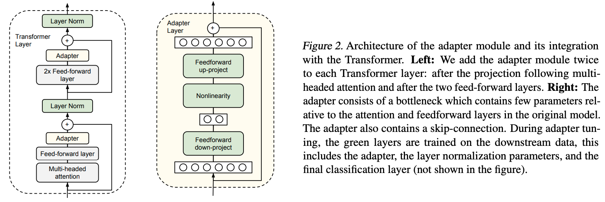

论文地址：

* [https://arxiv.org/abs/1902.00751](https://arxiv.org/abs/1902.00751)

论文代码：

* [https://github.com/google-research/adapter-bert](https://github.com/google-research/adapter-bert)

<!-- more -->

谷歌的研究人员首次在论文《Parameter-Efficient Transfer Learning for NLP》提出针对BERT的PEFT微调方式，拉开了PEFT研究的序幕。他们指出，在面对特定的下游任务时，如果进行Full-fintuning（即预训练模型中的所有参数都进行微调），太过低效；而如果采用固定预训练模型的某些层，只微调接近下游任务的那几层参数，又难以达到较好的效果。  
于是他们设计了如下图所示的Adapter结构，将其嵌入Transformer的结构里面，在训练时，固定住原来预训练模型的参数不变，只对新增的Adapter结构进行微调。同时为了保证训练的高效性（也就是尽可能少的引入更多参数），他们将Adapter设计为这样的结构：首先是一个down-project层将高维度特征映射到低维特征，然后过一个非线形层之后，再用一个up-project结构将低维特征映射回原来的高维特征；同时也设计了skip-connection结构，确保了在最差的情况下能够退化为identity。


模型在最开始初始化的时候需要让Adapter对原大模型影响最小，否则会出现训练失败的情况。即上图中Adapter Layer中绿色的部分的输出需要接近0，只让skip-connection起作用，通过这样的初始化让刚开始加了Adapter的模型和没加Adapter的模型在结果上基本是一致的。这样可以在起点上让模型表现的更好，从而使得微调过程更容易成功。

