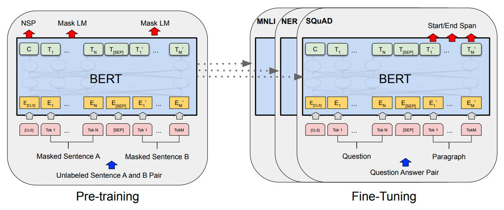
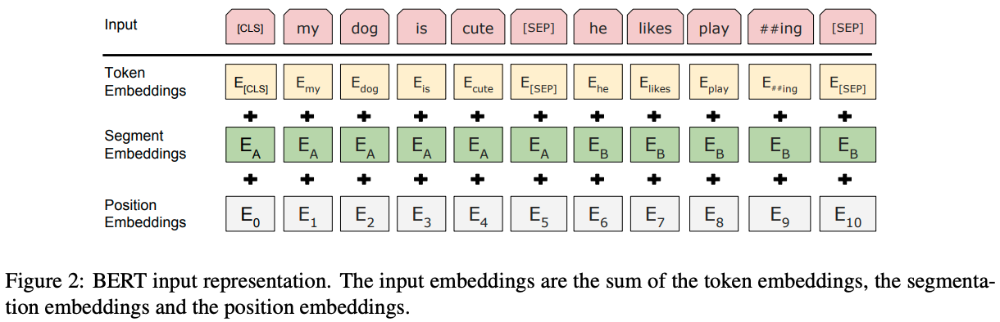

机构：Google  
论文地址：

* [https://arxiv.org/abs/1810.04805v2](https://arxiv.org/abs/1810.04805v2)

论文代码：

* [https://github.com/google-research/bert](https://github.com/google-research/bert)
<!-- more -->

## Abstract

这篇论文介绍一个新的语言表达模型BERT(Bidirectional Encoder Representations from Transformers)。BERT 是用于语言理解的预训练深度双向编码表征的 transformer结构。它被设计为通过在所有网络层中基于左右文本来预训练深度双向表征。因此通过外接一个输出层来 fine-tuned 预训练好的BERT 表征形成一个新的模型，这种做法可以将BERT运用在大量的其他任务上，例如问题回答任务、语言推理任务等。

Bert模型易理解且功能强大，它在11个NLP任务中都表现的最好，在机器阅读理解SQuAD1.1跑出的成绩，在两个指标上全面超越人类。GLUE基准80.04%（7.6%绝对提升），MultiNLI准确率86.7%（5.6%绝对提升）。

## Introduction

语言模型的预训练对于改善许多自然语言处理任务是有效的。这些任务包括句子级别的任务像自然语言推理和释义。句子级任务目的是通过对句子的整体分析来预测句子之间的关系。
目前存在的将预训练好的语言表征运用在下游任务的方法主要有：基于特征（feature-based）的方法和微调（fine-tuning）的方法。基于特征的方法，比如ELMo，将预训练好的表征作为额外的特征加到某个基于任务的架构中。基于微调的方法，比如 OpenAI GPT，引入相关的参数，运用下游的特定任务来微调训练好的参数。
这两种方法在训练前都有相同的目标函数，即使用单向语言模型来学习一般的语言表征。目前的这些方法限制了预训练模型的能力特别是基于微调的方法。最主要的限制在于传统的语言模型都是单向的，这种设计限制了训练时模型结构的选择。例如，OpenAI GPT 使用了一种从左向右的架构，在Transformers 的 self-attention layer 中每个分词只能被添加到它前一个分词之后。这种设计对于处理句子级的任务来说是个次优方案，但是在分词层面的任务中微调训练好的模型时，这种设计可能带来灾难性的结果，因为在这类任务中，从两个方向合并上下文是至关重要的。
作者引入了 BERT通过提出了一个新的预训练目标：“masked language model”（MLM）。遮蔽语言模型随机地遮蔽输入中的一些分词，目标是为了能够在仅基于上下文的情况下预测出被遮蔽的分词的id。不同于以往的从左至右的预训练语言模型，MLM模型允许融合左边和右边两边的上下文，从而可以形成深度双向的Transformer。同时文章引入了预测下一个句子的任务来预训练文本对(text-pair)表征。

这篇文章的贡献：

* 证实了双向预训练对于语言表征的重要性
* 证实了预训练表征能够减少了许多高度工程化的特定任务特征架构的需求
* BERT 在11项自然语言处理任务中取得了最先进的效果

## Related Work

语言表征的预训练由来已久，以下简要回顾了最广泛使用的方法。

**Unsupervised Feature-based Approaches**
`ELMo类型的方法`

预训练的词嵌入方法是NLP系统的组成部分，与从零开始训练的方法相比，与训练方法有更好的表现。为了预训练单词嵌入向量，[Mnih和Hinton等人(2009)](https://proceedings.neurips.cc/paper/2008/file/1e056d2b0ebd5c878c550da6ac5d3724-Paper.pdf)使用了从左到右的语言建模目标，[Mikolov等人(2013)](https://arxiv.org/pdf/1310.4546.pdf)的模型在左右上下文中区分正确和错误单词。

这些方法已经推广到更广的粒度，例如句子级的嵌入或者段落级嵌入。为了训练句子表示，先前的工作通过训练目标为‘对候选的下一个句子进行排序’的模型获得（[Jernite等人(2017)](http://arxiv.org/abs/1705.00557)和[Logeswaran和Lee(2018)](https://openreview.net/forum?id=rJvJXZb0W)），从左到右生成下一个句子单词以表示前一个句子（[Kiros等人(2015)](https://arxiv.org/pdf/1506.06726)），或去噪自编码器派生的目标（[Hill等人(2016)](https://arxiv.org/pdf/1602.03483)）。

ELMo及其前身（Peters等人([2017](https://arxiv.org/pdf/1705.00108)，[2018a](https://arxiv.org/pdf/1802.05365)))从不同的维度概括了传统的单词嵌入研究。它们从左到右和从右到左的语言模型中提取上下文相关的特征。每个词的上下文表示是从左到右和从右到左表示的连接。当将上下文单词嵌入与现有的特定任务架构相结合时，ELMo提出几个主要NLP基准的最新技术，包括问答[Rajpurkar等人(2016)](https://arxiv.org/abs/1606.05250)、情感分析[Socher等人(2013)](http://nlp.stanford.edu/~socherr/EMNLP2013_RNTN.pdf)和命名实体识别[Tjong等人(2003)](https://dl.acm.org/doi/pdf/10.3115/1118853.1118872)。[Melamud等人(2016)](https://arxiv.org/pdf/1810.04805.pdf)建议通过一项任务学习语境表征，使用LSTMs从左右语境预测单个单词。与ELMo相似，它们的模型是基于特征的，并且没有深度的双向性。[Fedus等人(2018)](https://arxiv.org/abs/1801.07736)表明完形填空任务可以用来提高文本生成模型的健壮性。

**Unsupervised Fine-tuning Approaches**
`GPT类型的方法`
与基于特征的方法一样，第一种方法是在这个方向上只从未标记的文本中预训练单词嵌入参数。
最近，产生上下文词级表示的句子或文档编码器已经从未标记的文本中进行了预训练，并针对有监督的下游任务进行了微调。这些方法的优点是几乎不需要从头学习参数。至少在一定程度上是由于这个优势，OpenAI-GPT在GLUE基准测试的许多句子级任务上取得了先前最先进的结果。

**Transfer Learning from Supervised Data**
也有研究显示，在大数据集的监督任务中，如自然语言推理和机器翻译，可以有效地进行转换.计算机视觉研究也证明了从大的预先训练的模型中转移学习的重要性，其中一个有效的方法是用ImageNet对预先训练的模型进行微调。

## Bert

BERT架构中有两个步骤：预训练(pre-training)和微调(fine-tuning)。在预训练阶段，BERT模型在不同的预训练任务中对未标记数据进行训练。对于微调阶段，首先使用预先训练的参数初始化BERT模型，然后使用来自下游任务的标记数据对所有参数进行微调整。每个下游任务都有单独的微调模型，即使它们是用相同的预训练参数初始化的。

BERT的一个显著特点是其在不同任务中的统一架构。预训练的架构和最终的下游任务的架构之间的差别很小。

BERT的参数说明：$L$表示层数(Transformer block 的数量)，$H$表示隐藏层的数量，$A$表示self-attention heads 的数量。主要的两个模型的大小分别为：

* BERT($L=12,H=768,A=12$,Total Parameters=110M)
* BERT($L=24,H=1024,A=16$,Total Parameters=340M)

为了进行比较，作者选择了与OpenAI GPT具有相同模型大小的BERT。BERT Transformer使用双向self-attention，而GPT Transformer使用约束的self-attention，其中每个词只能关注其左侧的上下文。

作者使用了具有30000个词的词汇表进行WordPice词嵌入。每个序列的第一个词总是一个特殊的分类标记`[CLS]`。与此标记对应的最终隐藏状态用作分类任务的聚合序列表示。句子对被打包成一个序列，有两种方法可以区分句子。第一种是用一个标记词`[SEP]`来划分这个句子对，第二种是增加一个可学习的嵌入到每个词中，用于区分该词属于句子A还是句子B。

## Pre-training BERT

**Masked LM**
作者认为深度双向模型比从左到右模型或从左到右模型和从右到左模型的浅层连接更强大。传统的模型都是从左到右或者从右到左训练，这极大地限制了模型的能力。在多层的双向训练中会出现“标签泄漏(since bidirectional conditioning would allow each word to indirectly “see itself”)，作者提出Masked LM方法。对输入的句子随机地 Mask 住 15%的 分词，训练模型去预测句子中被 Mask的词。被 Mask的词对应的最后的向量会被传入到输出的Softmax函数。

这种方法虽然可以得到双向的预训练模型，但是也存在两个问题。

1. 第一个就是pre-training和fine-tunning语料不匹配的问题，因为被Mask住的分词不会在fine-tunning阶段出现。为了解决这个问题，被Mask的词比不总是以`[MASK]`出现。
   * 80%的时间，用 [MASK]代替被选中的词，如 my dog is hairy -> my dog is [MASK]
   * 10%的时间，用一个随机挑选的词代替被选中的词，如 my dog is hairy -> my dog is apple
   * 10%的时间，保持原来的单词不变，如 my dog is hairy -> my dog is hairy

2. 第二个问题就是因为每个Batch中只有15%的分词被预测，所以模型需要训练更多的次数才能收敛。但是模型带来的性能提升比计算消耗更值得。

**Next Sentence Prediction**
`这个子任务后面被证实没什么用，所以一些新的模型将这个任务删去或替换成别的子任务了`
许多自然语言处理的任务如QA、NLI，是基于模型对两个不同文本之间关系的理解的，而语言模型并不能直接反应这种关系。为了使预训练模型能够很好地处理这类任务，作者提出了 next sentence prediction 任务。特别地，在训练集中，有50%的句子B是句子A的真正的下一句(labeled as IsNext)，而另外50%的句子B是从语料中随机抽取的句子(labeled as NotNext)。实验结果表明，增加的这个任务在 QA 和 NLI 都取得了很好的效果。

1. `Input=[CLS] the man went to [MASK] store [SEP] he bought a gallon [MASK] milk [SEP]`
`LABEL=IsNext`

2. `Input=[CLS] the man went to [MASK] store [SEP] penguin [MASK] are flight ##less birds [SEP]`
`LABEL=NotNext`

Pre-training data 预训练过程中使用的语料是 BooksCorpus (800M 词) 和 English Wikipedia (2,500M 词).

## Fine-tuning BERT

Transformer中的self-attention机制允许BERT通过调整适当的输入和输出，对许多下游任务进行建模，无论这些任务涉及单个文本还是文本对。
对于每个任务，只需将特定于任务的输入和输出插入到BERT中，并对所有参数进行端到端的微调。
在输入部分，在预训练阶段的句子A和句子B类似于

1. 在段落中的句子对
2. 蕴含中的前提-假设对
3. 问题回答任务中的问题-文章对
4. 文本分类中的text-∅对。

在输出部分，

* 词级表示被输入到词级任务的输出层，例如序列标记或问题回答
* [CLS]表示被输入到分类的输出层，例如蕴涵或情感分析。
