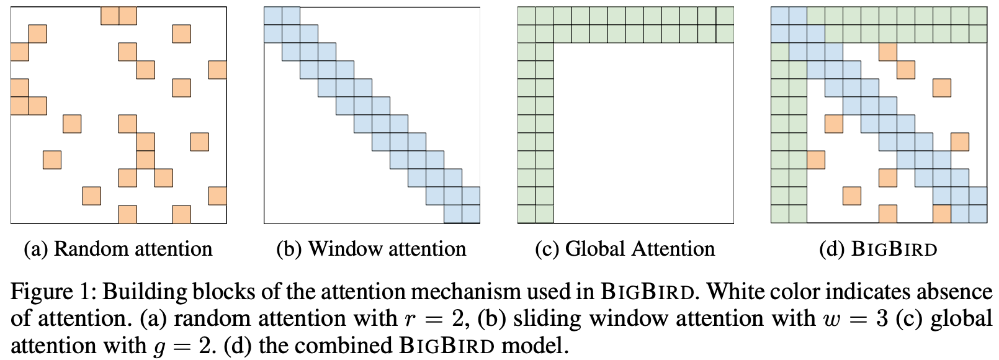
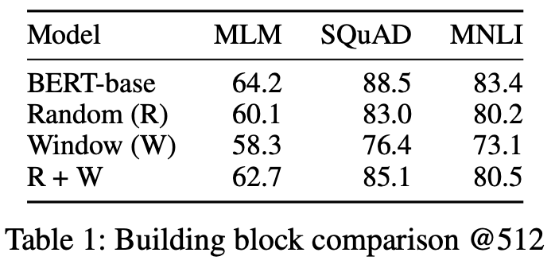

机构：Google Research  
论文地址：

* [https://arxiv.org/pdf/2007.14062.pdf](https://arxiv.org/pdf/2007.14062.pdf)

<!-- more -->

## 摘要

当下各种地表最强的NLP模型都同宗同源于Transformer，但Transformer的完全注意力机制会带来模型的复杂度和序列长度呈二次依赖的问题，即$O(n^2)$。Big Bird模型的核心是使用稀疏注意力机制将二次依赖降至线性。文章中还证明了Big Bird是一个序列函数的通用逼近器，而且是图灵完备的，而且可以保持完全注意力模型的性质。在相同的硬件配置下，Big Bird能够处理的序列长度是BERT的8倍。


一个模型图灵完备意味着一切可以计算的问题模型都能完成，理论上，它可以用来解决任何算法。


## Big Bird架构

由于BERT使用的是完全注意力机制，即每个token都需要关注所有的token，所以内存消耗就是序列长度的二次方。Big Bird中引入了稀疏注意力机制，将二次依赖降至线形，其主要由以下三个部分组成：

1. `Random attention`：随机注意力，每个token随机关注r个token，r为超参数。
2. `Sliding window attention`：局部注意力，每个token关注附近w个token，w为超参数，表示窗口大小。
3. `Global attention`：全局注意力，全局token可以关注到全部的token，同时全部token都会关注到全局token。Global token的定义有两种：
   1. ITC(internal transformer construction)，选用现有的一些token作为全局token。
   2. ETC(extended transformer construction)，通过添加一些token(比如`[CLS]`)作为全局token。

三种注意力的消融实验，三者联合的效果是最好的：

从模型角度来看，Big Bird和Longformer模型非常类似。相对Longformer模型，Big Bird模型增加了`Random attention`，而在`Sliding window attention`没有使用空洞，其他基本都一致。
