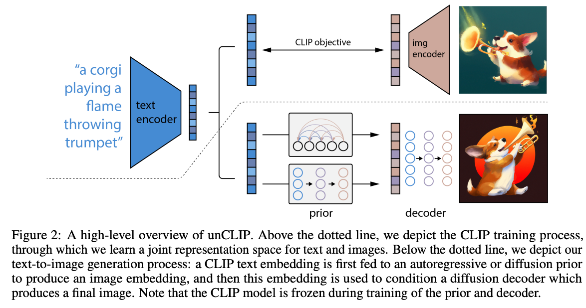
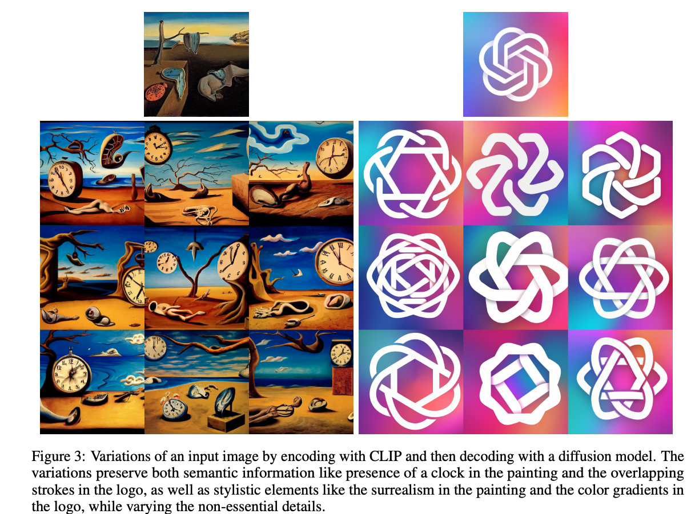
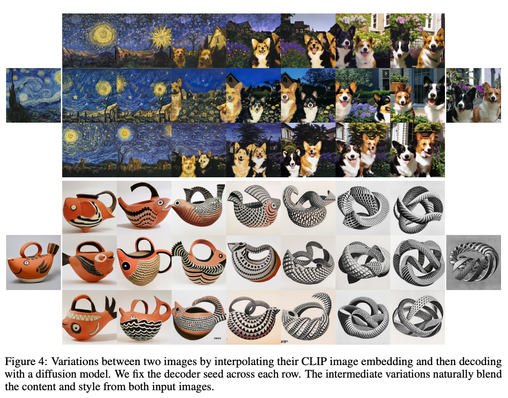
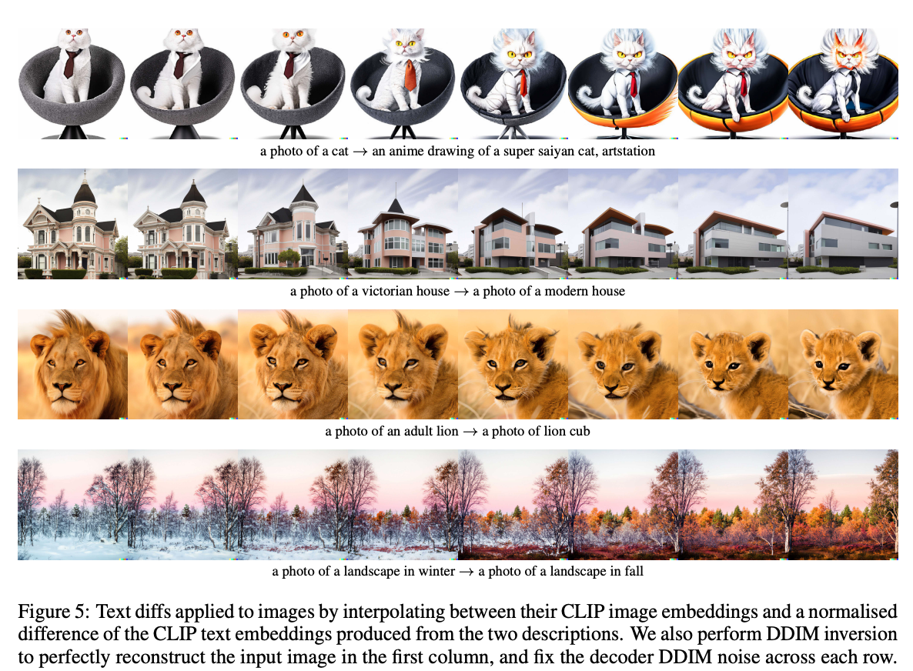

机构： OpenAI  
论文地址：

* [https://arxiv.org/abs/2204.06125](https://arxiv.org/abs/2204.06125)

<!-- more -->

## 模型

DALL·E 2的总体流程图如下：

可以看到，上半部分就是一个CLIP。CLIP模型在被训练好之后，其参数就会完全被冻住，不会再进行训练和finetune。
然后下半部分就是一个两阶段的训练过程：

1. prior训练阶段
   prior训练阶段是将CLIP的图像编码器得到的图像特征作为GroundTruth，然后通过文本编码器得到的文本特征进行预测，是一个有监督的过程，从而将prior部分训练出来。
2. decoder训练阶段
   decoder训练阶段就是训练一个扩散模型的过程。

## DALL·E 2的一些应用

### 生成风格类似的图片

将输入图像通过CLIP的图像编码器得到图像特征，然后通过decoder生成相同风格的图像。

### 进行图像风格融合

将两张图像得到的特征进行插值，可以将两张图像进行融合。

同样的，文本特征也可以进行插值，然后通过prior和decoder生成图片。

