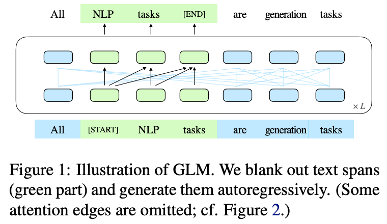
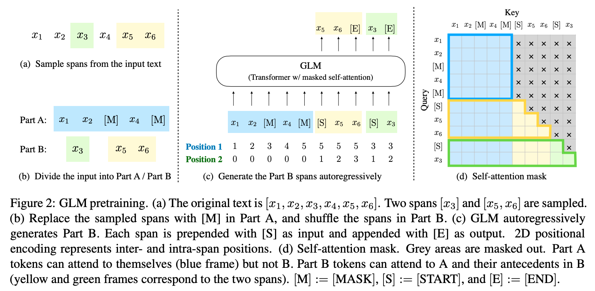
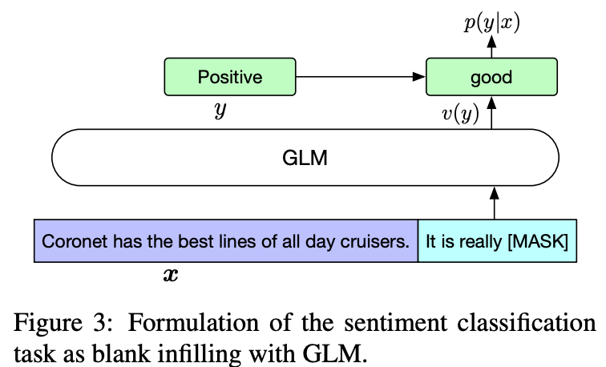

机构：清华  
论文地址：

* [https://arxiv.org/abs/2103.10360#](https://arxiv.org/abs/2103.10360#)

论文代码：

* [https://github.com/THUDM/GLM](https://github.com/THUDM/GLM)

<!-- more -->

ChatGPT已经火了一段时间了，国内也出现了一些平替，其中比较容易使用的是[ChatGLM-6B](https://github.com/THUDM/ChatGLM-6B)，该模型能够让我们基于单卡自己部署。ChatGLM的基座是GLM，下面对GLM论文进行解读。

## 介绍

预训练语言模型大体可以分为三种：自回归（GPT系列）、自编码（BERT系列）、编码-解码（T5、BART）。它们在各自的领域上都表现不俗，但是，目前没有一个预训练模型能很好地完成所有任务。GPT在NLU任务中只可以利用上文信息，无法使用下文信息；BERT无法完成生成类任务；编码-解码类模型没有上述的限制，但需要更多的参数才能match performance。GLM是一个通用的预训练语言模型，它在NLU（自然语言理解）、conditional generation（条件文本生成）和unconditional generation（非条件文本生成）上都有着不俗的表现。

## 预训练过程

### Autoregressive Blank Infilling

GLM的流程图如下：

GLM的核心是Autoregregressive Blank Infilling，即生成文本中的一段或者多段空白。具体细节如下图所示：

对于输入$x=[x_1, ..., x_n]$，采样多个片段${s_1, ..., s_m}$，其中每个片段会包含多个token，如$s_i=[s_{i,1}, ..., s_{i,l_i}]$。每个被采样的片段都会被替换为一个特殊字符`[MASK]`，这样就得到了$x_{corrupt}$。给定$x_{corrupt}$，模型通过自回归的方式预测被`[MASK]`字符替换的片段，由于是自回归的方式，所以模型只能获取$x_{corrupt}$和之前已经被预测出来的片段的信息。此外，为了让片段之间相互关注彼此，文中还将各个被遮掩的片段打乱之后再预测，如上图所示。文中将蓝色部分作为`Part A`，将预测的片段作为`Part B`。

### 多任务预训练

为了能够兼顾NLU和文本生成任务，对于文档级别的输入和句子级别的输入使用不同的方法获取片段：

* `Document-level`：We sample a single span whose length is sampled from a uniform distribution over 50%–100% of the original length. The objective aims for long text generation.
* `Sentence-level`：We restrict that the masked spans must be full sentences. Multiple spans (sentences) are sampled to cover 15% of the original tokens. This objective aims for seq2seq tasks whose predictions are often complete sentences or paragraphs.

## 模型

### 模型结构

GLM使用了Transformer结构，并进行了如下优化：

 1. 调整layer normalization和residual connection的顺序。
 2. 使用一个线性层来进行输出token预测。
 3. 将ReLU激活函数替换为GeLUs

### 位置编码

GLM中使用了两个位置编码来表示token的位置信息：

* 第一个位置编码表示的是$x_{corrupt}$中的位置。对于被`[MASK]`字符替换的token，其第一个位置编码都表示成`[MASK]`字符的位置。
* 第二个位置编码表示片段内的位置。对于Part A中的token，第二个位置编码统一为0。而Part B中片段则表示为[1, length of the span]。

## 微调

对于分类任务，通过prompt来预测类别：

* It's a beautiful day, I'm in a great mood. It is [MASK]. [S] good
* I failed in the exam today. I was very depressed. It is [MASK]. [S] bad

对于文本生成任务，将输入文本视为A部分，直接在文本的最后加入[MASK]，然后进行文本生成：

* Today [MASK] [S] is

## 关于ChatGLM

具体可参考[官方博客](https://chatglm.cn/blog)。

1. 官方首先开源了[GLM-130B](https://github.com/THUDM/GLM-130B/)千亿基座模型，相当于OpenAI的GPT-175B。
2. 官方开源了[ChatGLM-6B](https://github.com/THUDM/ChatGLM-6B)模型，结合模型量化技术，用户可以在消费级的显卡上进行本地部署。经过约 1T 标识符的中英双语训练，辅以监督微调、 反馈自助、人类反馈强化学习等技术的加持，62 亿参数的 ChatGLM-6B 虽然规模不及千亿模型，但大大降低了用户部署的门槛，并且已经能生成相当符合人类偏好的回答。
  
    这里官方还有一个千亿参数的ChatGLM没有开源，可在[这里](https://chatglm.cn)体验。
  
3. ChatGLM 参考了 ChatGPT 的设计思路，在千亿基座模型 GLM-130B1 中注入了代码预训练，通过有监督微调（Supervised Fine-Tuning）、RLHF等技术实现人类意图对齐。

GLM-130B模型的优势：

* 双语： 同时支持中文和英文。
* 高精度（英文）： 在公开的英文自然语言榜单 LAMBADA、MMLU 和 Big-bench-lite 上优于 GPT-3 175B（API: davinci，基座模型）、OPT-175B 和 BLOOM-176B。
* 高精度（中文）： 在7个零样本 CLUE 数据集和5个零样本 FewCLUE 数据集上明显优于 ERNIE TITAN 3.0 260B 和 YUAN 1.0-245B。
* 快速推理： 首个实现 INT4 量化的千亿模型，支持用一台 4 卡 3090 或 8 卡 2080Ti 服务器进行快速且基本无损推理。
* 可复现性： 所有结果（超过 30 个任务）均可通过我们的开源代码和模型参数复现。
* 跨平台： 支持在国产的海光 DCU、华为昇腾 910 和申威处理器及美国的英伟达芯片上进行训练与推理。

ChatGLM-6B 有如下特点：

* 充分的中英双语预训练： ChatGLM-6B 在 1:1 比例的中英语料上训练了 1T 的 token 量，兼具双语能力。
* 优化的模型架构和大小： 吸取 GLM-130B 训练经验，修正了二维 RoPE 位置编码实现，使用传统FFN结构。6B（62亿）的参数大小，也使得研究者和个人开发者自己微调和部署 ChatGLM-6B 成为可能。
* 较低的部署门槛： FP16 半精度下，ChatGLM-6B 需要至少 13GB 的显存进行推理，结合模型量化技术，这一需求可以进一步降低到 10GB（INT8） 和 6GB（INT4）， 使得 ChatGLM-6B 可以部署在消费级显卡上。
* 更长的序列长度： 相比 GLM-10B（序列长度1024），ChatGLM-6B 序列长度达 2048，支持更长对话和应用。
* 人类意图对齐训练： 使用了监督微调（Supervised Fine-Tuning）、反馈自助（Feedback Bootstrap）、人类反馈强化学习（Reinforcement Learning from Human Feedback） 等方式，使模型初具理解人类指令意图的能力。输出格式为 markdown，方便展示。

因此，ChatGLM-6B 具备了一定条件下较好的对话与问答能力。当然，ChatGLM-6B 也有相当多已知的局限和不足：

* 模型容量较小： 6B 的小容量，决定了其相对较弱的模型记忆和语言能力。在面对许多事实性知识任务时，ChatGLM-6B 可能会生成不正确的信息；她也不擅长逻辑类问题（如数学、编程）的解答。
* 可能会产生有害说明或有偏见的内容：ChatGLM-6B 只是一个初步与人类意图对齐的语言模型，可能会生成有害、有偏见的内容。
* 较弱的多轮对话能力：ChatGLM-6B 的上下文理解能力还不够充分，在面对长答案生成，以及多轮对话的场景时，可能会出现上下文丢失和理解错误的情况。
* 英文能力不足：训练时使用的指示大部分都是中文的，只有一小部分指示是英文的。因此在使用英文指示时，回复的质量可能不如中文指示的回复，甚至与中文指示下的回复矛盾。
* 易被误导：ChatGLM-6B 的“自我认知”可能存在问题，很容易被误导并产生错误的言论。例如当前版本模型在被误导的情况下，会在自我认知上发生偏差。即使该模型经过了1万亿标识符（token）左右的双语预训练，并且进行了指令微调和人类反馈强化学习（RLHF），但是因为模型容量较小，所以在某些指示下可能会产生有误导性的内容。
