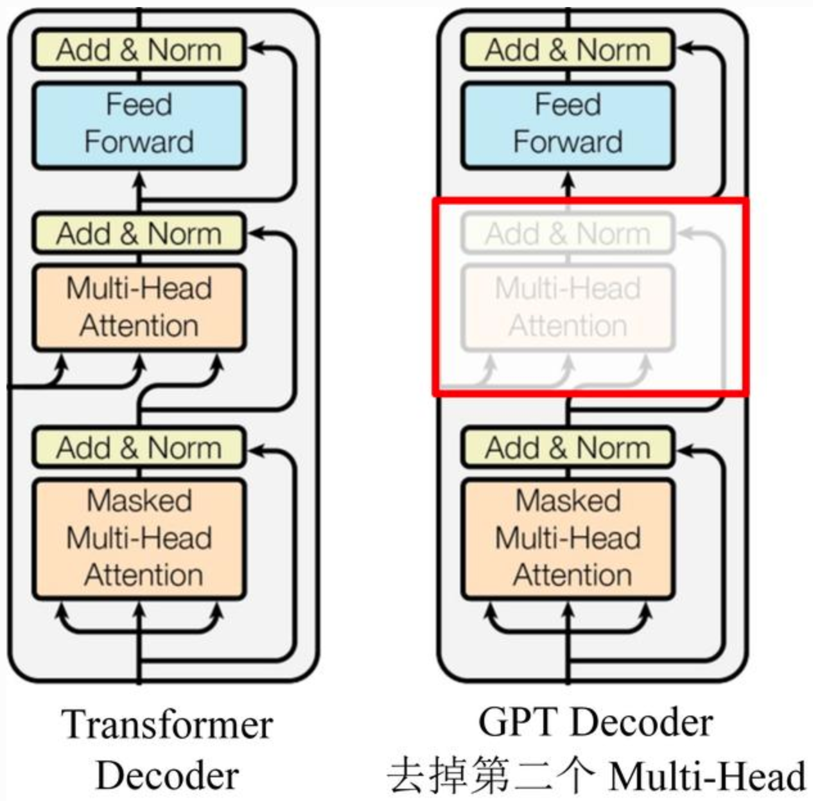
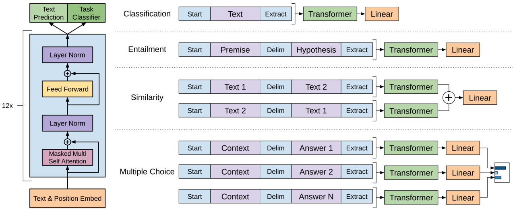
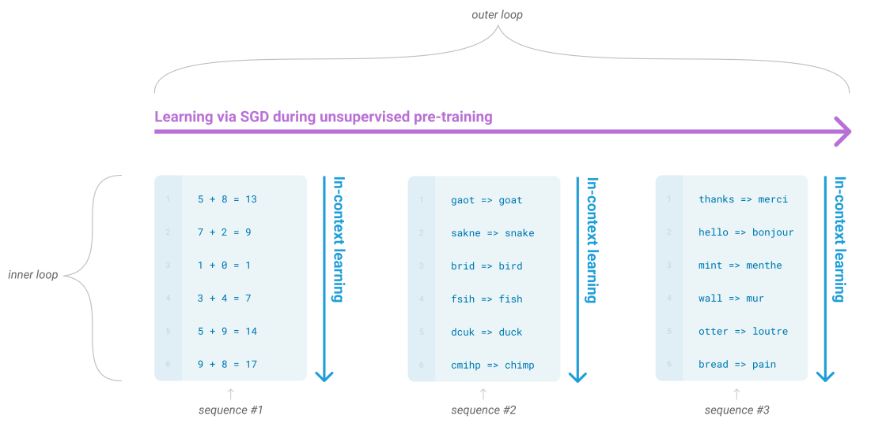
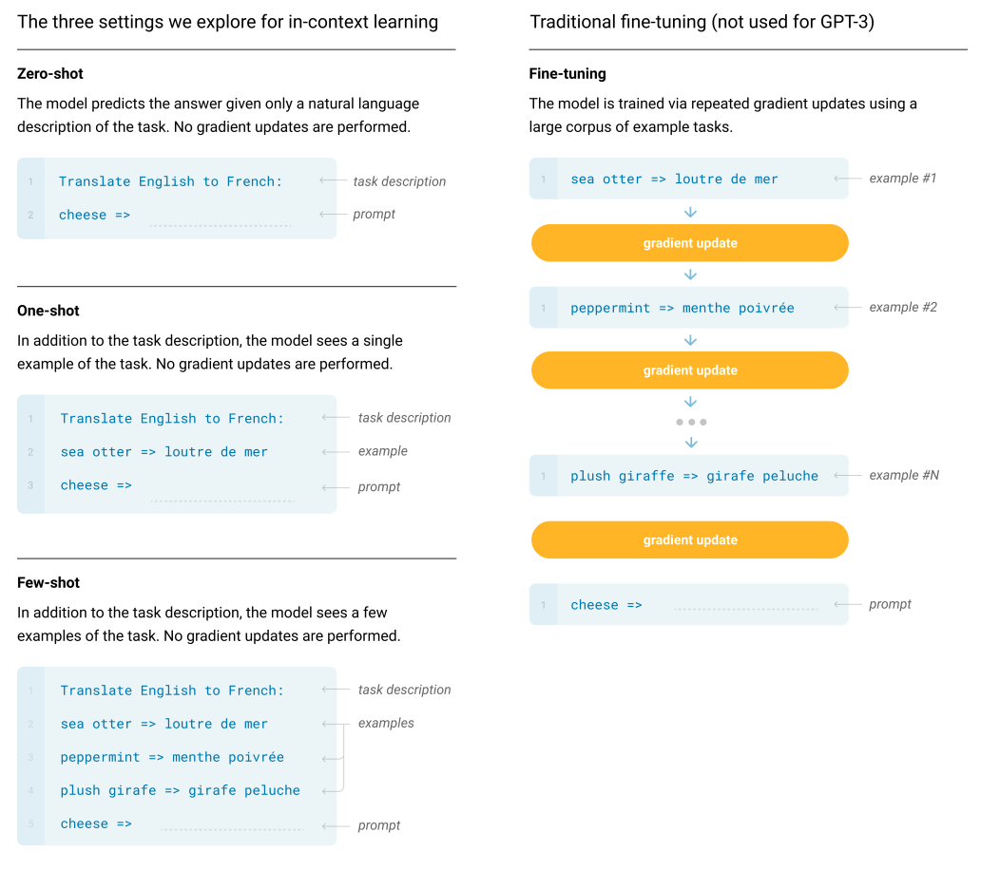
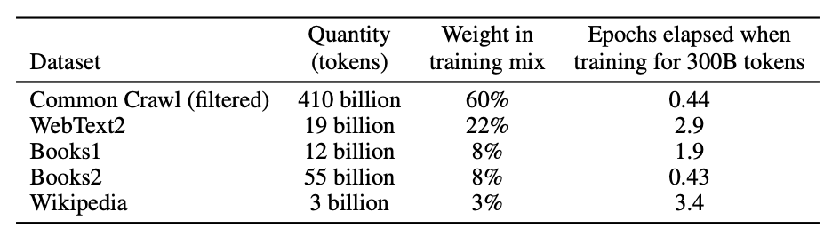
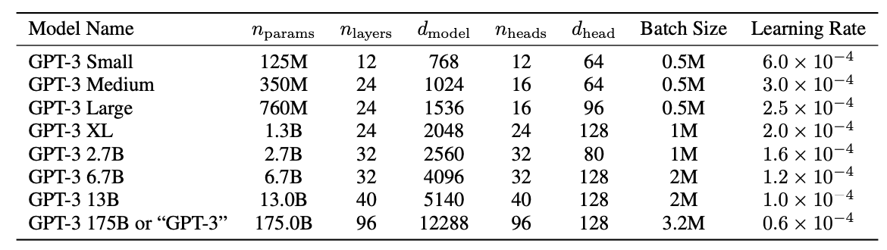

机构：OpenAI  
论文地址：

* [GPT1: Improving Language Understanding by Generative Pre-Training](https://s3-us-west-2.amazonaws.com/openai-assets/research-covers/language-unsupervised/language_understanding_paper.pdf)
* [GPT2: Language Models are Unsupervised Multitask Learners](https://d4mucfpksywv.cloudfront.net/better-language-models/language_models_are_unsupervised_multitask_learners.pdf)
* [GPT3: Language Models are Few-Shot Learners](https://arxiv.org/abs/2005.14165)

论文代码：

* [GPT1: Improving Language Understanding by Generative Pre-Training](https://github.com/openai/finetune-transformer-lm)
* [GPT2: : Language Models are Unsupervised Multitask Learners](https://github.com/openai/gpt-2)
* [GPT3: Language Models are Few-Shot Learners](https://github.com/openai/gpt-3)

<!-- more -->

OpenAI在论文《Improving Language Understanding by Generative Pre-Training》中提出了GPT模型，后面又在论文《Language Models are Unsupervised Multitask Learners》提出了GPT2模型。之后又推出了《Language Models are Few-Shot Learners》，即GPT3。

这三个模型的对比如下：

| 模型 | 发布时间 | 参数量 | 预训练数据量 |
| :---- | :---- | :---- | :----: |
| GPT | 2018年6月 | 1.17亿 | 5GB |
| GPT2 | 2019年2月 | 15亿 | 40GB |
| GPT3 | 2020年5月 | 1750亿 | 45TB |

## GPT模型结构

GPT使用Transformer的Decoder结构，并对Transformer Decoder进行了一些改动，原本的Decoder包含了两个Multi-Head Attention结构，GPT只保留了Mask Multi-Head Attention，如下图所示。

GPT是一个AR模型，需要根据上文预测下一个单词，因此使用Mask Multi-Head Attention对单词的下文进行遮挡，即在使用$[u_1, u_2, ..., u_{i-1}]$预测单词$u_i$的时候，会将$u_i$之后的单词Mask掉，防止信息泄露。

## GPT训练过程

GPT 训练过程分为两个部分，无监督预训练语言模型和有监督的下游任务fine-tuning。

### 无监督的预训练

给定句子$U=[u_1, u_2, ..., u_n]$，GPT训练语言模型时需要最大化下面的似然函数。
$$L_1 = \sum_{i=1}^n logP(u_i|u_1,u_2,...,u_{i-1};\Theta)$$
其中，i是上下文窗口的大小，$\Theta$是模型参数。

训练的过程也非常简单，就是将n个词的词嵌入输入到Transformer中，n个位置分别预测该位置的下一个词。

1. Embedding层（包括Position Embedding和Word Embedding）:
$$h_0 = Embedding(U) = UW_e + W_p$$

2. Transformer层（包括12层）：
$$h_t = Trm(h_{t-1})$$

3. 输出层（预测下一个单词的概率）：
$$P(u) = softmax(h_tW_e^T)$$

### 有监督的Fine-Tuning

预训练之后，我们还需要针对特定任务进行Fine-Tuning。假设监督数据集合$C$的输入$X$是一个序列$x^1,x^2,...,x^m$，输出是一个分类$y$的标签，比如情感分类任务。

我们把$x^1,x^2,...,x^m$输入Transformer模型，得到最上层最后一个时刻的输出$h_l^m$，将其通过一个新增的Linear层进行分类，最后用交叉熵计算损失，从而根据有监督数据调整Transformer的参数以及Linear层的参数：
$$P(y|x^1,x^2,...,x^m)=softmax(h_l^mW_y)$$
微调时最大化下面的似然函数。
$$L_2 = \sum_{(x, y)}logP(y|x_1,x_2,...,x_m;\Theta)$$

GPT在微调时也考虑预训练的损失函数，所以最终需要优化的函数为：
$$L = L_1 + \lambda L_2$$
这里使用的$L_1$就是无监督预训练时的损失，但是使用的数据不是前面无监督的数据，而是当前有监督任务的数据。

### 其他任务的下游改造

针对不同的下游任务，需要对输入格式做不同的改造。

* Classification：对于文本分类任务基本不需要怎么变动。
* Entailment：对于推理问题，可以将先验与假设使用一个分隔符分开。
* Similarity：对于相似度问题，由于模型是单向的，但相似度与顺序无关，所以要将两个句子顺序颠倒后的结果相加来做最后的推测。
* Multiple-Choice：对于问答问题，将上下文、问题放在一起与答案分隔开，然后进行预测。

## GPT特点

### 优点

* 特征抽取器使用了强大的Transformer，能够捕捉到更长的记忆信息，且较传统的RNN更易于并行化。
* 使用两阶段模式进行训练，先训练一个通用的模型，然后在各个子任务上进行微调，减少了传统方法需要针对各个任务定制设计模型的麻烦。

### 缺点

* GPT最大的问题就是其语言模型是单向的，我们只能根据之前的历史来预测当前词，但是没有办法利用后面的信息。比如句子`The animal didn't cross the street because it was too tired`，我们在编码it的语义的时候需要同时利用前后的信息，因为在这个句子中，it可能指代animal也可能指代street。根据tired，我们推断它指代的是animal。但是如果把tired改成wide，那么it就是指代street了。Transformer的Self-Attention理论上是可以同时关注到这两个词的，但是根据前面的介绍，为了使用Transformer学习语言模型，必须用Mask来让它看不到未来的信息，所以GPT无法将下文信息加入到it中。

## GPT1、GPT2、GPT3的区别

### GPT1

#### GPT1的数据集

GPT1使用了BooksCorpus数据集，这个数据集包含7000本没有发布的书籍。作者选这个数据集的原因有二：

1. 数据集拥有更长的上下文依赖关系，使得模型能学到更长期的依赖关系
2. 这些书籍因为没有发布，所以很难在下游数据集上见到，更能验证模型的泛化能力。

#### GPT1的网络结构

GPT1使用了12层的Transformer Decoder结构，使用了masked self-attention heads来防止信息泄漏（768 dimensional states and 12
attention heads），feed-forward中间层维数3072。

### GPT2

GPT2的目标旨在训练一个泛化能力更强的词向量模型，它并没有对GPT1的网络结构进行过多的调整，只是使用了更多的网络参数和更大的数据集。
GPT2的核心思想为：任何有监督任务都是无监督语言模型的一个子集，当模型的容量非常大且数据量足够丰富时，仅仅靠无监督预训练语言模型的学习便可以完成其他有监督学习的任务。
如当模型学习完`Michael Jordan is the best basketball player in the history`之后，便也学会了`Q: who is the best basketball player in the history? A: Michael Jordan`的Q&A任务。

#### GPT2的数据集

GPT2的训练数据取自Reddit上的高赞文章，命名为WebText。数据集共有约800万篇文章，累计体积约40G。为了避免和测试集的冲突，WebText移除了涉及Wikipedia的文章。

#### GPT2的网络结构

The model largely follows the details of the OpenAI GPT model with a few modifications.

* Layer normalization was moved to the input of each sub-block, similar to a pre-activation residual network and an additional layer normalization was added after the final selfattention block.
* A modified initialization which accounts for the accumulation on the residual path with model depth is used.
* We scale the weights of residual layers at initialization by a factor of $1/\sqrt{N}$ where N is the number of residual layers.
* The vocabulary is expanded to 50,257.
* We also increase the context size from 512 to 1024 tokens and a larger batchsize of 512 is used.

### GPT3

GPT3提出了`In Context Learning`，包含：

* Few-shot Learning
* One-shot Learning
* Zero-shot Learning

#### GPT3的数据集

GPT3共使用了5个语料，并根据数据集的不同质量赋予了不同的权重，权重越高的在训练的时候越容易被抽样到，如下表所示：

#### GPT3的网络结构

We use the same model and architecture as GPT-2, including the modified initialization, pre-normalization, and reversible tokenization described therein, with the exception that we use alternating dense and locally banded sparse attention patterns in the layers of the transformer, similar to the Sparse Transformer.
Table shows the sizes and architectures of our 8 models. Here $n_{params}$ is the total number of trainable parameters, $n_{layers}$ is the total number of layers, $d_{model}$ is the number of units in each bottleneck layer (we always have the feedforward layer four times the size of the bottleneck layer, $d_{ff} = 4 ∗ d_{model}$), and $d_{head}$ is the dimension of each attention head. All models use a context window of $n_{ctx}$ = 2048 tokens. We partition the model across GPUs along both the depth and width dimension in order to minimize data-transfer between nodes. The precise architectural parameters for each model are chosen based on computational efficiency and load-balancing in the layout of models across GPU’s.
