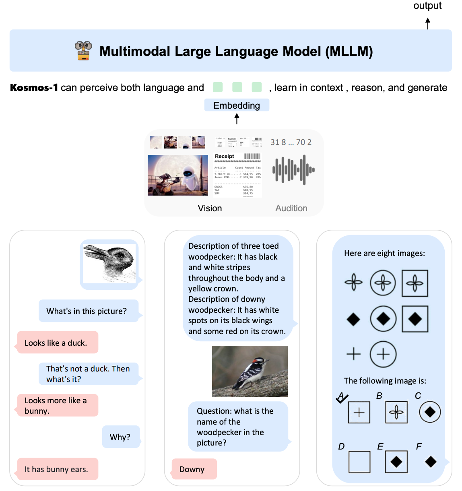
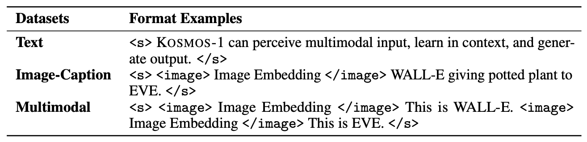
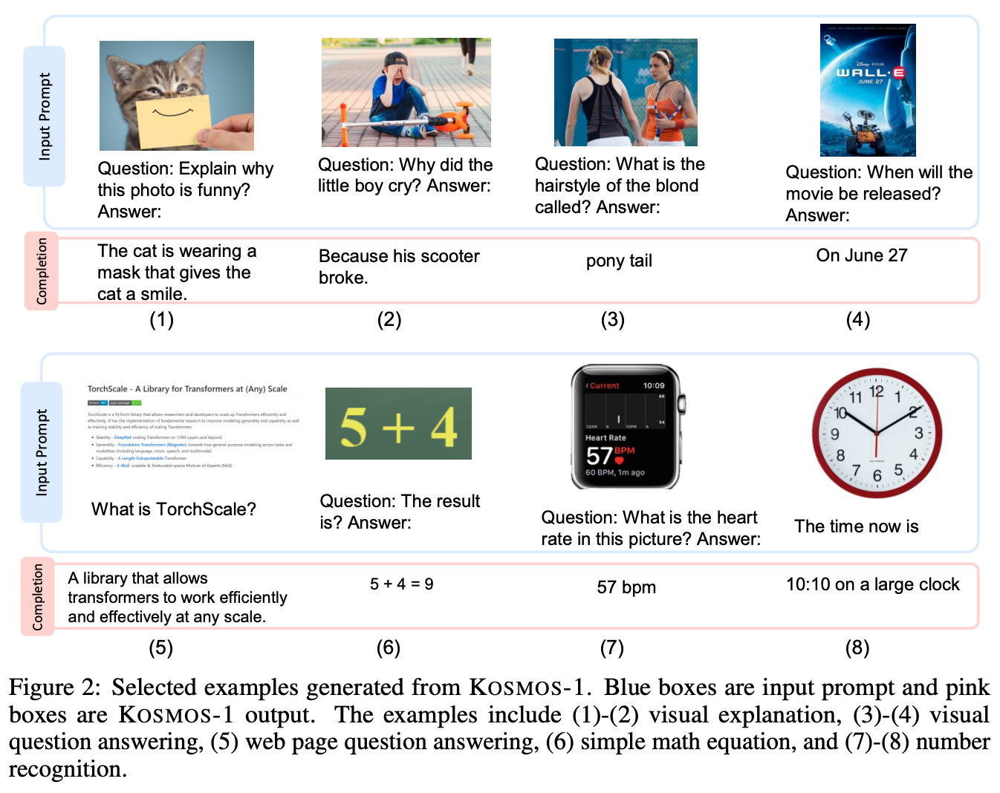
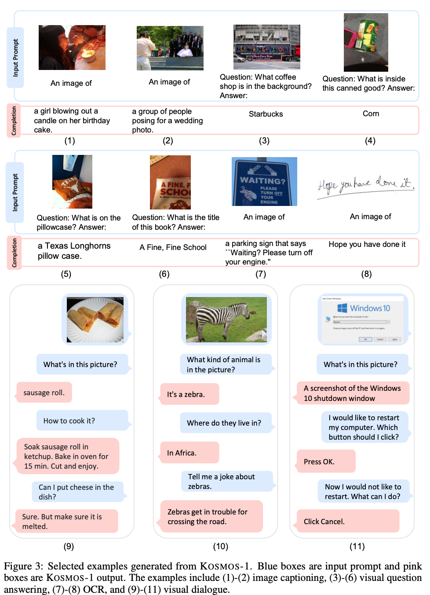

机构：微软  
论文地址：

* [https://arxiv.org/abs/2302.14045](https://arxiv.org/abs/2302.14045)

<!-- more -->

有猜测称`GPT4`的训练方法应当与最近微软发布的`KOSMOS-1`相同，所以今天来解读一下这篇论文。

## 模型结构

KOSMOS-1是一个多模态的LLM，所以称其为MLLM，其可遵循指令（即zero-shot learning）并在上下文中学习（即few-shot learning）。如下图所示：

KOSMOS-1仍然是一个`Transformer-based`的自回归模型。在KOSMOS-1的训练过程中，训练数据包括单模态数据、跨模态配对数据以及交错的多模态数据。一旦模型被训练好，可以分别在单模态和多模态任务上以zero-shot和few-shot的方式评估模型。

### 模型输入

用`<s>`和`</s>`来表示序列的开始和结束。特殊符号`<image>`和`</image>`来指定编码的图像嵌入的开始和结束。例如，`“<s>document</s>”`是一个文本输入，而`“<s>paragraph<image>Image Embedding</image>paragraph</s>”`是一个交错的图文输入。

对于文本输入，直接使用查询表（lookup table）来将他们映射到embedding就可以了。对于图像，可以使用类似ViT的方法进行编码，作者这里使用了[Language models are general-purpose interfaces](https://arxiv.org/abs/2206.06336)这篇文章的方法。

### 模型部件

获得输入序列的embedding后，将它们输入Transformer-Decoder中。这个从左到右的因果模型（causal model）以一种自回归的方式处理序列，即根据之前的时间步来产生下一个token。因果mask（causal mask）用于遮蔽未来的信息。一个Transformer上的softmax分类器用于在词汇表上生成tokens。

和标准的Transformer架构相比，KOSMOS-1进行了以下修改：

* `MAGNETO`: 使用[MAGNETO](https://arxiv.org/abs/2210.06423)，一个Transformer变体，作为模型的backbone。MAGNETO有更好的训练稳定性和跨模态的卓越性能。它为每个子层（即multi-head self-attention和FFN）引入一个额外的LayerNorm。
* `xPos`: 采用[XPos](https://arxiv.org/abs/2212.10554)相对位置编码来实现更好的长上下文建模。该方法可以更好的推广到不同的长度，即在短序列训练而在长序列上测试。此外，XPos优化了注意力分辨率，因此可以精确地捕捉位置信息。XPos方法在内插法和外推法设置中都是高效的。

### 训练目标

模型是用next-token prediction任务来训练的，也就是根据之前的上下文，学习生成下一个token。训练目标是最大化样本中tokens的对数似然。请注意，只有离散的tokens，例如文本符号，才在训练损失中被考虑。

## 模型训练

### 训练数据

KOSMOS-1的训练数据集由文本语料库，图像-描述对以及交错的图像文本数据构成。

#### 文本数据

在The Pile和Common Crawl(CC)上训练模型。The Pile是一个为训练大规模语言模型而构建的大规模英文文本数据集，它由各种数据源产生。我们排除了来自GitHub，arXiv，Stack Exchange和PubMed Central的数据划分。还包括了Common Crawl的快照数据集，CC-Stories和RealNews数据集。整个数据集已经清除了重复和近似重复的文档，并被过滤以排除下游任务数据。

#### 图像-标题对

图像标题对有几个数据集构成，包括英语的LAION-2B，LAION-400M，COYO-700M以及Conceptual Captions。英语的LAION-2B，LAION-400M和COYO-700M是通过提取图像源和相应的替代文本从Common Crawl 网络数据的网页中收集的。Conceptual Captions也是来自互联网网页。

#### 交错的图像文本数据

作者从Common Crawl快照收集交错的多模态数据，这是一个公开可用的网页存档。使用一个过滤过程从快照中的原始的2B网页中选择大约71M和网页。然后从每个选定网页的HTML中提取文本和图像。对于每个文档，将图像数量限制为五个，以减少噪音和冗余。并且还随机丢弃一半的只有一个图像的文档，以增加多样性。通过使用该语料库，使得KOSMOS能够处理交错文本和图像，提高了它的少样本能力。

### 训练设置

The MLLM component has `24 layers` with `2048 hidden dimensions`, `8192 FFN intermediate size`, and `32 attention heads`, resulting in about `1.3B parameters`. We use Magneto’s initialization for optimization stability. For faster convergence, the image representation is obtained from a `pretrained CLIP ViT-L/14 model` with `1024 feature dimensions`. The images are preprocessed into `224×224` resolution during training. We freeze the parameters of the CLIP model except for the last layer
during training. The total number of parameters of KOSMOS-1 is about `1.6B`.

We use a batch size of 1.2 million tokens (0.5 million tokens from text corpora, 0.5 million tokens from image-caption pairs, and 0.2 million tokens from interleaved data) and train KOSMOS-1 for 300k steps, corresponding to about 360 billion tokens. We adopt the AdamW optimizer with β = (0.9, 0.98). We set the weight decay to 0.01 and the dropout rate to 0.1. The learning rate increases to 2e-4 for the first 375 warming-up steps and decays linearly to 0 for the rest of the training steps. We use SentencePiece to tokenize the text. We preprocess the data in the “full-sentence” format, which packs each input sequence with full sentences that are sampled continuously from one or more documents.

### 指令微调

为了更好的使KOSMOS-1和人类指令保持一致，我们进行了纯语言指令调优。具体来说，我们使用格式为（instructions, inputs, and outputs）的指令数据微调模型(The instruction data is language-only, which is mixed with training corpora. The tuning process is conducted as language modeling)。注意，指令和输入是不会计入损失的。

## 结果

