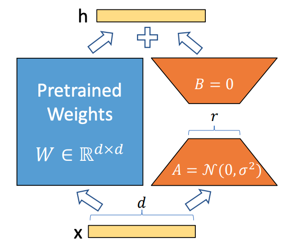

机构：微软  
论文地址：

* [https://arxiv.org/abs/2106.09685](https://arxiv.org/abs/2106.09685)

论文代码：

* [https://github.com/microsoft/LoRA](https://github.com/microsoft/LoRA)

<!-- more -->

## 简介

自然语言处理目前存在一个重要范式：先在一般领域数据进行大规模预训练，然后再在特定的任务领域进行适应性微调（fine-tuning）。  
但是随着预训练语言模型越来越大，这个范式存在以下问题：

1. 当我们finetune大模型是，由于训练成本太高，不太可能重新训练所有的模型参数。
2. 以前的方法都或多或少有其他性能问题：
   * adapter增加了模型的层数，引入了额外的推理延迟。
   * prefix-tuning比较难训练，效果不如直接finetune。而且，prefix-tuning会占用模型的sequence length，使得模型的有效输入变短。

基于上述背景，论文作者得益于前人的一些关于内在维度（intrinsic dimension）的发现，提出了低秩自适应方法（LoRA）。该方法有以下好处：

1. 一个预训练的大模型可以在多个下游任务中被共享。我们可以freeze大模型的权重，而只去训练和保存各个下游任务中的低秩自适应矩阵。
2. 由于LoRA方法将大模型的参数完全冻住，只训练增加的低秩矩阵，因此训练参数很少，相应的训练效率也会很高。
3. 在inference阶段，LoRA方法不会带来额外的推理延迟，推理速度和预训练的大模型完全一致。
4. LoRA可以和之前提出的方法完美的结合，多种方法可以结合在一起使用（如adapter、prefix-tuning）。

## 方法

LoRA方法如下图所示，即冻结预训练大模型的参数，然后通过A、B两个矩阵来模型大模型的参数更新，在下游任务中只更新新增加的矩阵。

微调一个大模型时，如果使用full finetune方法，则公式如下：
$$W=W_0+\Delta W$$
其中，$W_0$是预训练模型的初始化参数，$\Delta W$是需要更新的变化量。在全参数微调中，$\Delta W$的参数量是和$W_0$的参数量一样的。对于一个超大模型（如GPT3）来说，其成本是很高的。

而在LoRA中，其更新公式如下：
$$W=W_0+\Delta W=W_0+BA, W_0 \in \mathbb{R}^{d \times k}, B \in \mathbb{R}^{d \times r}, A \in \mathbb{R}^{r \times k}$$
其中$r$就是低秩自适应矩阵中的秩，$r \ll min(d,k)$。在训练过程中，$W_0$被冻住（不通过梯度进行更新），而需要训练的参数为AB两个矩阵，这样由于$r$的取值很小，需要训练的参数远远小于$W_0$的参数量。


在论文中，作者将A矩阵用随机高斯分布初始化，将B矩阵初始化为0矩阵，保证训练开始时旁路矩阵为0矩阵，使得刚开始的LoRA模型和预训练模型一致。



在推理阶段，只需要将模型的改变和预训练模型相加并替换预训练模型的参数即可，$W=W_0+BA$，不会带来任务额外的参数和推理延迟。

