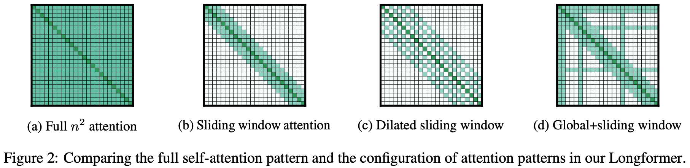

论文地址：

* [https://arxiv.org/pdf/2004.05150.pdf](https://arxiv.org/pdf/2004.05150.pdf)

论文代码：

* [https://github.com/allenai/longformer](https://github.com/allenai/longformer)

<!-- more -->

## 摘要

Transformer结构的模型难以处理长序列文本，这是因为Transformer中的self-attention的复杂度是和输入长度成2次方关系的$(O(n^2))$。文章提出了Longformer以解决上述问题。

## Longformer

如下图（a）所示，传统Transformer的所有token都会互相关注，因此复杂度是$O(n^2)$。而Longformer可以将传统Transformer中self-attention的复杂度从$O(n^2)$降低到$O(n)$，从而可以处理更长的序列。

### 注意力模式

Longformer定义了如下几种形式的改进self-attention。

#### Sliding window

Sliding window如上图(b)所示，每个位置的token只关注其相邻窗口位置的token，相当于CNN的卷积窗口。
给定一个固定窗口大小$w$，每个token关注其左右$\frac{1}{2}$长度的token，则复杂度为$O(n \times w)$。对于一个$l$层的Transformer模型，顶层token的感受野大小为$l \times w$（假设每一层的窗口大小都是$w$），设置合适的窗口大小可以让顶层token关注到所有的输入token。

#### Dilated Sliding Window

Dilated Sliding Window如上图(c)所示。为了进一步提升感受野大小，可以在滑动窗口中加入空洞，相当于CNN中的空洞卷积。给定窗口大小$w$，窗口之间的空洞个数$d$，假设每一层都采用上述参数，则感受野大小为$l \times d \times w$。

此外，作者发现在多头自注意力中，对每个头使用不同的$d$可以有更好的效果。通过设置空洞参数，某些头可以不使用空洞从而可以更加关注附近的信息，而某些头使用空洞去关注长距离的文本信息。

#### Global Attention

全局注意力如上图(d)所示。除了上述两种形式的self-attention之外，作者还定义了全局注意力，即选择一些token关注全局的token。特别的是，全局注意力token是对称的，即全局注意力token会关注所有的token，所有的其他token也会关注全局token。

由于全局注意力token的个数只会相对输入长度较小，且是人为定义的常数，所以全局注意力的复杂度是$O(n)$。

### 实现细节

1. 上述提出的方法的矩阵乘法没有在Pytorch、Tensorflow等框架中实现，作者自己基于cuda进行了实现。
2. 在训练时进行阶段式的训练方法：序列长度和窗口大小逐步提高。每个阶段窗口大小和序列长度增加一倍，学习率减半。
