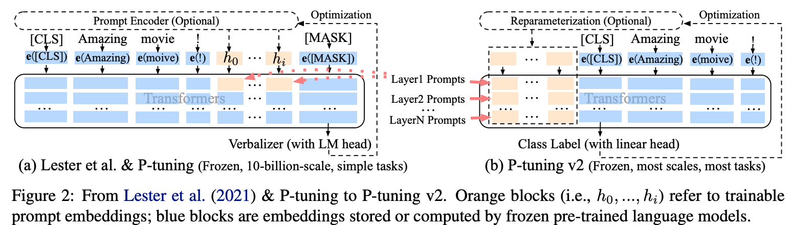
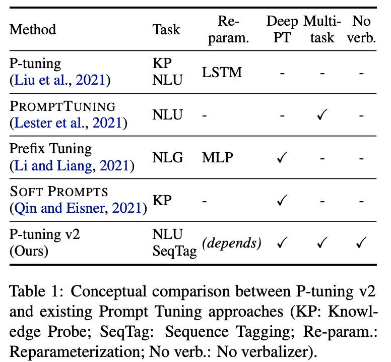

机构：清华  
论文地址：

* [https://arxiv.org/abs/2110.07602](https://arxiv.org/abs/2110.07602)

论文代码：

* [https://github.com/THUDM/P-tuning-v2](https://github.com/THUDM/P-tuning-v2)

<!-- more -->

## 介绍

P-Tuning仅对大模型的Embedding加入新的参数。  
P-Tuning v2，在大模型的Embedding和每一层layer前都加上新的参数。

## 模型

P-tuning存在以下两个缺陷：

1. `Lack of universality across scales`: 对于参数数量在10B以下的模型，p-tuning表现的比fine-tuning要差很多。
2. `Lack of universality across tasks`: 对于分类问题，p-tuning可以表现的较好，但是对于序列标注这种`hard sequence tagging tasks`，p-tuning表现的较差。

针对上述问题，作者提出了P-Tuning v2。

如上图所示，在P-tuning中，`continuous prompts`只在embedding层插入。而在P-tuning v2中，`continuous prompts`在每一个layer层都可以作为`prefix tokens`被插入。这样可以带来两个好处：

1. P-tuning v2拥有更多的可学习参数，可以在微调的时候学到更多的东西。
2. 在更深层中加入的`continuous prompts`可以更好的影响模型的输出。

## 其他细节和结果

### Reparameterization

P-tuning中使用了双向的LSTM对`continuous prompts`进行编码，在P-tuning v2中发现这一改进在有些任务中会带来积极作用，但在有些任务中会带来消极作用。

### Prompt Length

We find that different NLU tasks usually achieve their best performance
with different prompt lengths. Generally, simple classification tasks prefer shorter prompts (less than 20); hard sequence labeling tasks prefer longer ones (around 100).

### Multi-task Learning

可以通过多任务训练共享的`continuous prompts`来对其进行更好的初始化，然后再在特定的下游任务中对`continuous prompts`进行微调。

### 结果和对比

