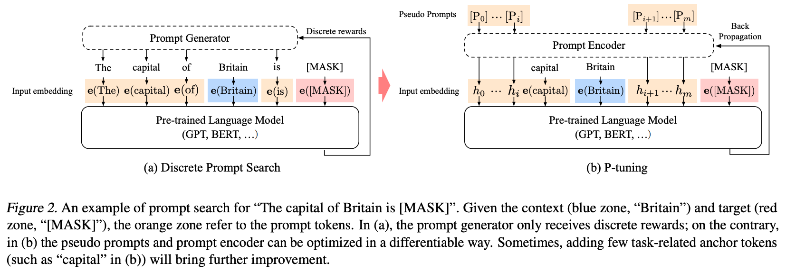

机构：清华  
论文地址：

* [https://arxiv.org/abs/2103.10385](https://arxiv.org/abs/2103.10385)

论文代码：

* [https://github.com/THUDM/P-tuning](https://github.com/THUDM/P-tuning)

<!-- more -->

## 模型

对于一个prompt模版$T = \{[P_{0:i}], x, [P_{i+1:m}], y\}$来说，有如下两种构建prompt的方式：

* 传统的添加离散prompt的方式：
  $$\{e([P_{0:i}]), e(x), e([P_{i+1:m}]), e(y)\}$$
  其中$P_i$是词汇表中的token。
* P-tuning添加连续prompt的方式：
  $$\{h_0, ..., h_i, e(x), h_{i+1}, ..., h_m, e(y)\}$$
  其中$h_i(0\leq i\leq m)$是可训练的embedding向量，然后可以通过如下目标函数优化增加的embedding向量。
  $$\hat{h}_{0:m} = \mathop{\arg\min}\limits_{\theta}L(Model(x,y))$$

## Optimization

在训练连续prompt的过程中有两个问题：

1. `Discreteness:`原始大模型中的embedding已经在预训练中被训练好了，如果将新增加的prompt embedding随机初始化，则很容易陷入局部最优解。
2. `Association:`prompt embedding中的tokens之间应该是互相依赖而非独立的。

为解决如上两个问题，P-tuning额外使用了一个LSTM模型来编码$h_i$，实际输入模型的prompt embedding为下式中的$h^{'}_i$：
$$h^{'}_i = MLP([\overrightarrow{h_i}:\overleftarrow{h_i}]) = MLP([LSTM(h_{0:i}):LSTM(h_{i:m})])$$

而且，在inference中，我们只需要直接使用$h^{'}_i$即可，而不用再使用LSTM模型进行计算。
