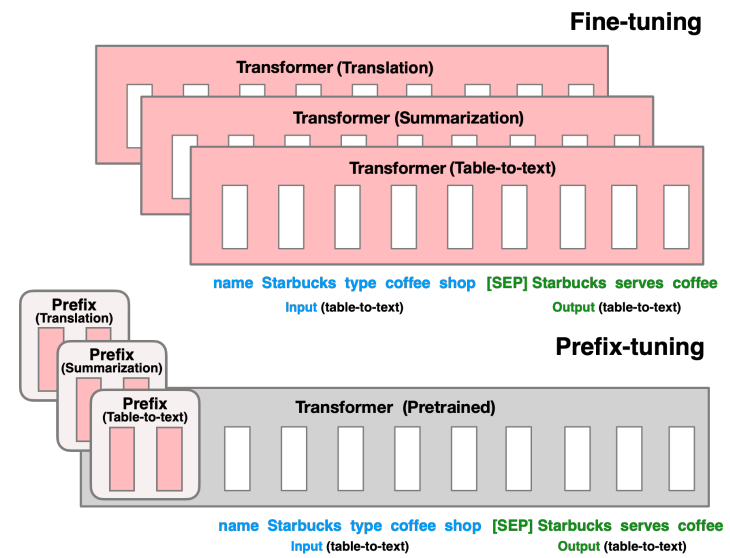
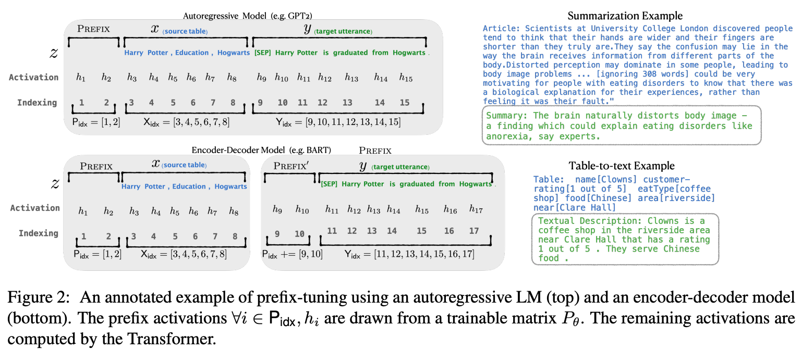
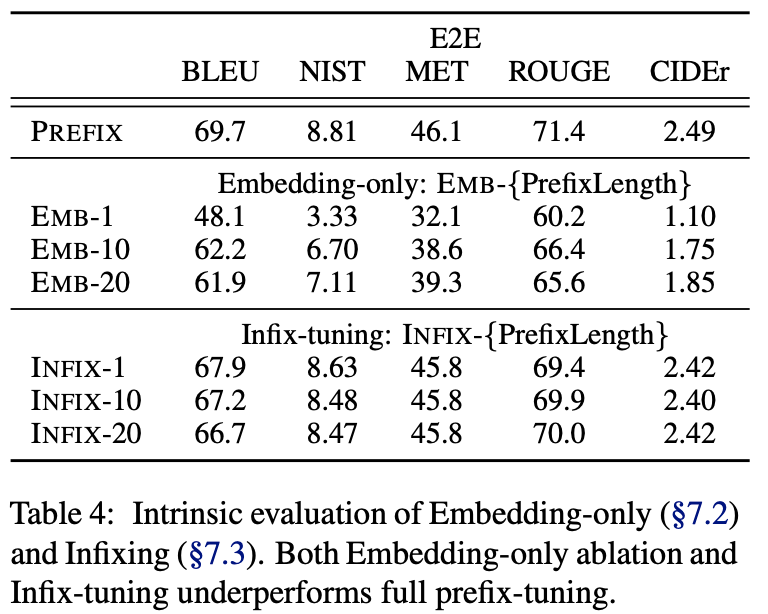
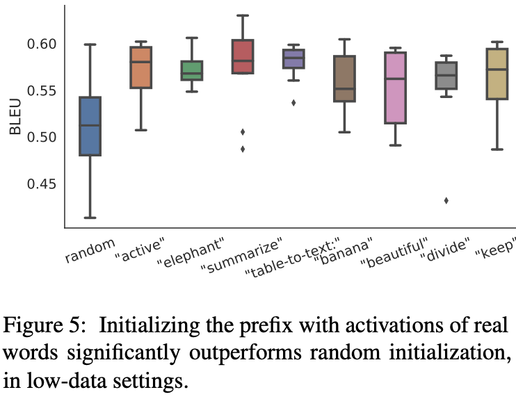

论文地址：

* [https://arxiv.org/abs/2101.00190](https://arxiv.org/abs/2101.00190)

论文代码：

* [https://github.com/XiangLi1999/PrefixTuning](https://github.com/XiangLi1999/PrefixTuning)

<!-- more -->

## 介绍

`Fine-tuning`是使用大规模预训练语言模型来进行下游任务的流行范式，但该方法需要更新和储存语言模型的全部参数，且在下游任务应用时，需要对每一个任务都存储一份修改后的参数。  
`Lightweight fine-tuning`是尝试解决上述问题的方法，其固定住绝大部分的预训练参数，只修改预训练模型的小部分模块。  
`Prompting`是在模型的输入前加上instructions和一些样本使模型输出任务需要的结果。  
而作者提出了`prefix-tuning`在调节模型时的过程中只优化一小段contiuous task-specific vector(prefix)。这种方法有以下优点：

1. 与fine tuning相比，只需要存储一份共享的预训练模型参数和多个task-specific prefix，对于不同的任务只需要不同的prefix。
2. 与Lightweight fine-tuning相比，prefix tuning在相同的表现下需要调节的参数量更小。
3. 与prompting相比，prefix包含的是连续的可训练的参数，而不是真实tokens对应的embedding，其表达的特征更加灵活和丰富。

## Prefix-Tuning

### Method

Prefix-tuning在autoregressive LM（如GPT）前添加prefix得到$z=[PREFIX;X;Y]$，或者在encoder-decoder模型（如T5、BART）的encoder和decoder之前添加prefixs得到$z=[PREFIX;x;PREFIX';y]$，如下图所示。

其中，$P_{idx}$表示prefix indices序列；$|P_{idx}|$表示prefix的长度。Prefix-tuning将初始化一个参数量为$|P_{idx}| \times dim(h_i)$的可训练矩阵：
$$
  h_i =
    \begin{cases}
      P_{\theta}[i,:],  & \text{if $i \in P_{idx}$} \\
      LM_{\phi}(z_i,h_{<i}), & \text{otherwise}
    \end{cases}
$$
training objective与fine-tuning相同，但语言模型的参数$\phi$固定，仅对prefix参数$\theta$进行训练。

### Parametrization of $P_\theta$

在实验上，直接更新$P_\theta$的参数会导致优化不稳定以及表现性能上的下降。因此文中通过使用较小的初始化矩阵$P_{\theta}'$，然后通过大型前馈神经网络来reparametrize矩阵$P_\theta$。
$$P_\theta[i,:]=MLP_{\theta}(P_{\theta}'[i,:])$$
当训练完成后，reparametrization参数被丢掉，仅$prefix(P_\theta)$需要被保存下来。

## Intrinsic Evaluation

### Prefix Length

Prefix长度饿影响如下，更长的prefix长度意味着更多的训练参数和更丰富的表达能力。

### Full vs Embedding-only

Prefix可仅在embedding层插入，也可在每一层layer中插入，结果对比如下：

可以看出：discrete prompting < embedding-only ablation < prefix-tuning。

### Prefixing vs Infixing

在Prefix-tuning中，连续向量在输入前被插入，$[PREFIX;x;y]$。除了在输入前面插入之外，还可以在中间插入，如$[x;INFIX;y]$。  
对比结果如上表，prefix-tuning略优于infix-tuning。这可能是因为在语言模型中prefix-tuning可以同时影响x和y，而infix-tuning只可以影响到y。

### Initialization

prefix参数的初始化也会对效果有较大影响，随机初始化会带来较低的performence和较大的variance。而将prefix初始化为真实token的embedding可以带来较好的效果。
In particular, initializing with task relevant words such as “summarization” and “table-to-text” obtains slightly better performance than task irrelevant words such as “elephant” and “divide”, but using real words is still better than random.

