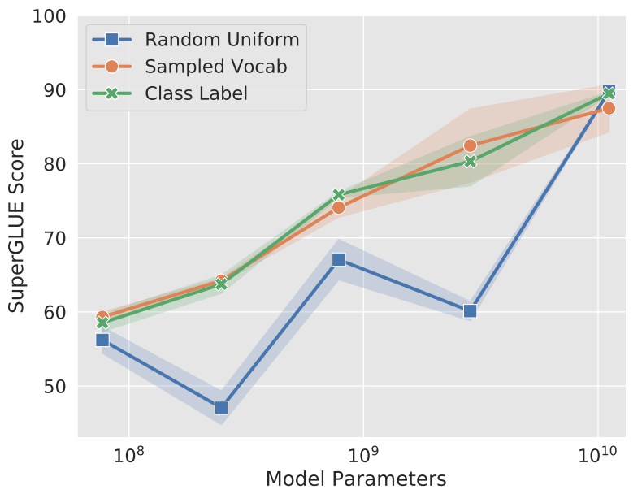

论文地址：

* [https://arxiv.org/abs/2104.08691](https://arxiv.org/abs/2104.08691)

<!-- more -->

## Prompt Tuning

在T5模型中，原始输入为$X_e \in \mathbb{R}^{n \times e}$，Prompt-Tuning将可学习的prompt参数$P_e \in \mathbb{R}^{p \times e}$和原始输入拼接起来得到$[P_e;X_e] \in \mathbb{R}^{(p+n) \times e}$，作为模型新的输入。训练时冻结预训练模型的参数，仅对prompt参数进行训练与更新。

|  |  |
| --- | --- |

## Prompt长度

论文针对 1，5，20，100，150五种不同的prompt参数长度进行了测试。当prompt参数长度超过20时，整体模型的效果提升并不是很明显。当预训练模型较大时，不同prompt参数长度的表现差异较小。

## Prompt初始化方案

Prompt的初始化方案：

1. Random initialization
2. 从T5字典中的5000个最常用tokens中提取
3. 从任务label对应的tokens中提取

## Prompt Ensemble

* Average: 单条prompt的平均。
* Best: 最好的一条prompt。
* Ensemble: 多条prompt投票。

