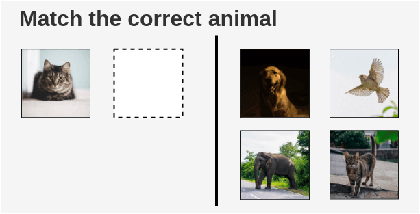
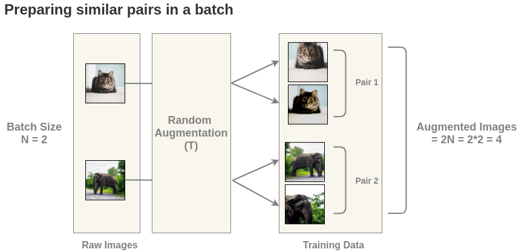
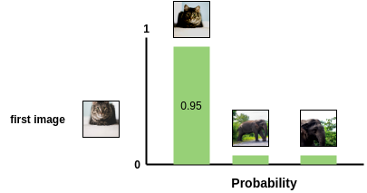
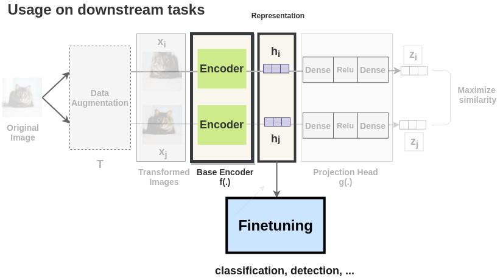

论文地址：

* [https://arxiv.org/abs/2002.05709](https://arxiv.org/abs/2002.05709)

论文代码：

* [https://github.com/google-research/simclr](https://github.com/google-research/simclr)
<!-- more -->

转载自[https://amitness.com/](https://amitness.com/)

## The Illustrated SimCLR Framework

In recent years, numerous self-supervised learning methods have been proposed for learning image representations, each getting better than the previous. But, their performance was still below the supervised counterparts.

This changed when **Chen et. al** proposed a new framework in their research paper “[SimCLR: A Simple Framework for Contrastive Learning of Visual Representations](https://arxiv.org/abs/2002.05709)”. The SimCLR paper not only improves upon the previous state-of-the-art self-supervised learning methods but also beats the supervised learning method on ImageNet classification when scaling up the architecture.
不仅是自监督学习的SOTA，同时还打败了监督学习。

In this article, I will explain the key ideas of the framework proposed in the research paper using diagrams.

## The Nostalgic Intuition

As a kid, I remember we had to solve such puzzles in our textbook.

The way a child would solve it is by looking at the picture of the animal on the left side, know its a cat, then search for a cat on the right side.

“Such exercises were prepared for the child to be able to recognize an object and contrast that to other objects. Can we similarly teach machines?”

It turns out that we can through a technique called Contrastive Learning. It attempts to teach machines to distinguish between similar and dissimilar things.
通过对比学习来让模型知道如何区分相似的样本的不相似的样本。

## Problem Formulation for Machines

To model the above exercise for a machine instead of a child, we see that we require 3 things:

1. `Examples of similar and dissimilar images`
We would require example pairs of images that are similar and images that are different for training a model.

The supervised school of thought would require a human to manually annotate such pairs. To automate this, we could leverage self-supervised learning. But how do we formulate it?

1. `Ability to know what an image represents`
We need some mechanism to get representations that allow the machine to understand an image.

1. `Ability to quantify if two images are similar`
We need some mechanism to compute the similarity of two images.

## The SimCLR Framework Approach

The paper proposes a framework called “`SimCLR`” for modeling the above problem in a self-supervised manner. It blends the concept of `Contrastive Learning` with a few novel ideas to learn visual representations without human supervision.

### SimCLR Framework

The idea of SimCLR framework is very simple. An image is taken and random transformations are applied to it to get a pair of two augmented images $x_i$ and $x_j$. Each image in that pair is passed through an encoder to get representations. Then a non-linear fully connected layer is applied to get representations z. The task is to maximize the similarity between these two representations $z_i$ and $z_j$ for the same image.

### Step by Step Example

Let’s explore the various components of the SimCLR framework with an example. Suppose we have a training corpus of millions of unlabeled images.

1. `Self-supervised Formulation [Data Augmentation]`
First, we generate batches of size N from the raw images. Let’s take a batch of size N = 2 for simplicity. In the paper, they use a large batch size of 8192.

The paper defines a random transformation function T that takes an image and applies a combination of random (crop + flip + color jitter + grayscale).

For each image in this batch, a random transformation function is applied to get a pair of 2 images. Thus, for a batch size of 2, we get $2*N = 2*2 = 4$ total images.

1. `Getting Representations [Base Encoder]`
Each augmented image in a pair is passed through an encoder to get image representations. The encoder used is generic and replaceable with other architectures. The two encoders shown below have shared weights and we get vectors $h_i$ and $h_j$.

In the paper, the authors used ResNet-50 architecture as the ConvNet encoder. The output is a 2048-dimensional vector h.

1. `Projection Head`
The representations $h_i$ and $h_j$ of the two augmented images are then passed through a series of non-linear **Dense** -> **Relu** -> **Dense** layers to apply non-linear transformation and project it into a representation $z_i$ and $z_j$. This is denoted by $g(.)$ in the paper and called projection head.

1. `Tuning Model: [Bringing similar closer]`
Thus, for each augmented image in the batch, we get embedding vectors $z$ for it.

From these embedding, we calculate the loss in following steps:

   * **Calculation of Cosine Similarity**
    Now, the similarity between two augmented versions of an image is calculated using cosine similarity. For two augmented images $x_i$ and $x_j$, the cosine similarity is calculated on its projected representations $z_i$ and $z_j$.
    
    $$
    s_{i,j}=\frac{z_i^Tz_j}{\tau||z_i||||z_j||}
    $$
    $\tau$ is the adjustable temperature parameter. It can scale the inputs and widen the range [-1, 1] of cosine similarity.  
    $||z_i||$ is the norm of the vector.  
    The pairwise cosine similarity between each augmented image in a batch is calculated using the above formula. As shown in the figure, in an ideal case, the similarities between augmented images of cats will be high while the similarity between cat and elephant images will be lower.
    
   * **Loss Calculation**
    SimCLR uses a contrastive loss called **“NT-Xent loss” (Normalized Temperature-Scaled Cross-Entropy Loss)**. Let see intuitively how it works.
    First, the augmented pairs in the batch are taken one by one.
    
    Next, we apply the softmax function to get the probability of these two images being similar.
    
    This softmax calculation is equivalent to getting the probability of the second augmented cat image being the most similar to the first cat image in the pair. Here, all remaining images in the batch are sampled as a dissimilar image (negative pair). Thus, we don’t need specialized architecture, memory bank or queue need by previous approaches like `InstDisc`, `MoCo` or `PIRL`.
    
    Then, the loss is calculated for a pair by taking the negative of the log of the above calculation. This formulation is the Noise Contrastive Estimation(NCE) Loss.
    $$
    l(i, j) = -log\frac{exp(s_{i, j})}{ \sum_{k=1}^{2N} {}_{[k!= i]} exp(s_{i, k})}
    $$
    
    We calculate the loss for the same pair a second time as well where the positions of the images are interchanged.（交换位置，再算一次，保持对称性）
    
    Finally, we compute loss over all the pairs in the batch of size N=2 and take an average.
    $$
    L = \frac{1}{2\textcolor{skyblue}{N}} \sum_{k=1}^{N} [l(2k-1, 2k) + l(2k, 2k-1)]
    $$
    
    Based on the loss, the encoder and projection head representations improves over time and the representations obtained place similar images closer in the space.

## Downstream Tasks

Once the SimCLR model is trained on the contrastive learning task, it can be used for transfer learning. For this, `the representations from the encoder are used instead of representations obtained from the projection head`. These representations can be used for downstream tasks like ImageNet Classification.

