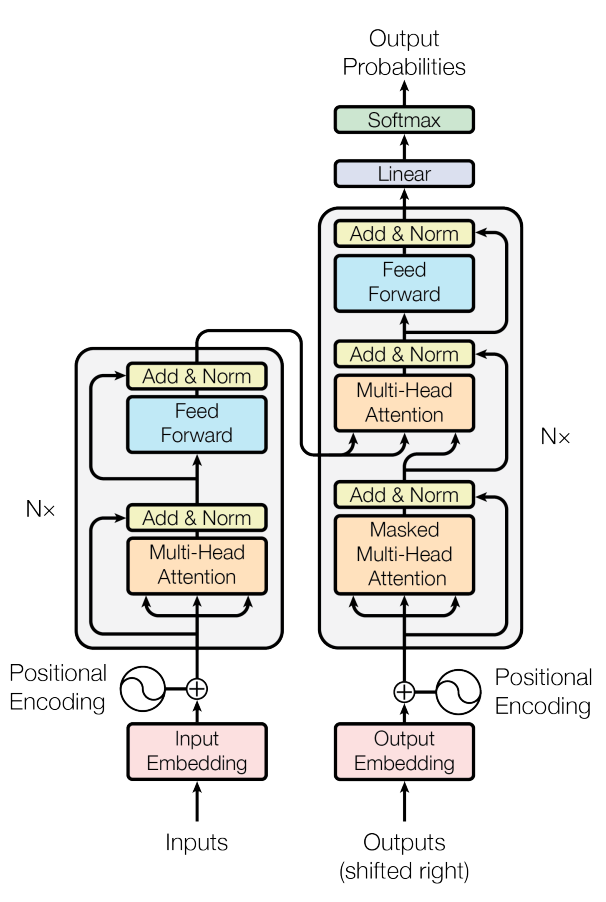

机构：Google Brain  
论文地址：

* [https://arxiv.org/abs/1706.03762](https://arxiv.org/abs/1706.03762)

论文代码：

* [https://github.com/tensorflow/tensor2tensor/blob/master/tensor2tensor/models/transformer.py](https://github.com/tensorflow/tensor2tensor/blob/master/tensor2tensor/models/transformer.py)

<!-- more -->

Transformer模型在Encoder-Decoder结构中抛弃RNN或者CNN模型，只使用attention机制。采用Attention机制的原因是考虑到RNN（或者LSTM，GRU等）的计算是顺序的，也就是说RNN相关算法只能从左向右依次计算或者从右向左依次计算，这种机制带来了两个问题：

* 时间片 t 的计算依赖 t-1 时刻的计算结果，这样限制了模型的并行能力；
* 顺序计算的过程中信息会丢失，尽管LSTM等门机制的结构一定程度上缓解了长期依赖的问题，但是对于特别长期的依赖现象，LSTM依旧无能为力。而如果采用CNN，虽然具备良好的并行条件，但是通过加深层深的方式获得更大的感受野，捕获长距离特征方向仍然很受限。或许后期CNN还有其他方式可以解决这个问题。

Transformer的提出解决了上面两个问题，首先它使用了Attention机制，将序列中的任意两个位置之间的距离是缩小为一个常量；其次它不是类似RNN的顺序结构，因此具有更好的并行性，符合现有的GPU框架。

## 模型介绍

Transformer的结构由**Encoder**和**Decoder**组成：
<div align=center></div>

论文中的验证Transformer的实验室基于机器翻译的，下面我们就以机器翻译为例子详细剖析Transformer的结构，在机器翻译中，Transformer可概括如下图：
<div align=center></div>

Transformer的本质上是一个Encoder-Decoder的结构，那么上图可以表示为下图的结构：
<div align=center></div>

如论文中所设置的，编码器由6个编码block组成，解码器由6个解码block组成。与所有的生成模型相同的是，编码器的输出会作为解码器的输入，如图所示：
<div align=center></div>

### Encoder和Decoder

#### Encoder结构

我们继续分析每个encoder的详细结构：在Transformer的encoder中，数据首先会经过一个叫做`self-attention`的模块得到一个加权之后的特征向量$Z$，这个$Z$ 便是论文公式1中的$Attention(Q,K,V)$ ：
$$Attention(Q,K,V)=softmax(\frac{QK^T}{\sqrt{d_k}}V)$$

第一次看到这个公式你可能会一头雾水，在后面的文章中我们会揭开这个公式背后的实际含义，在这一段暂时将其叫做$Z$ 。

得到 $Z$之后，它会被送到encoder的下一个模块，即Feed Forward Neural Network。这个全连接有两层，第一层的激活函数是ReLU，第二层是一个线性激活函数，可以表示为：
$$FFN(Z)=Relu(Z)W_2+b_2=max(0, ZW_1 + b_1)W_2 + b2$$

Encoder的结构如下图所示：
<div align=center></div>

#### Decoder结构

Decoder的结构如下图所示，它和encoder的不同之处在于Decoder多了一个Encoder-Decoder Attention：

* Self-Attention：当前翻译和已经翻译的前文之间的关系；
* Encoder-Decnoder Attention：当前翻译和编码的特征向量之间的关系。

<div align=center></div>

### 输入编码

上面介绍的就是Transformer的主要框架，下面我们将介绍它的输入数据。如下图所示，首先通过Word2Vec等词嵌入方法将输入语料转化成特征向量，论文中使用的词嵌入的维度为$d_{model}=512$ 。
<div align=center></div>

然后这些词向量将被输入到Encoder层。
<div align=center></div>

在最底层的block中， $x$将直接作为Transformer的输入，而在其他层中，输入则是上一个block的输出。为了画图更简单，我们使用更简单的例子来表示接下来的过程，如图所示：
<div align=center></div>

截止目前为止，我们介绍的Transformer模型并没有捕捉顺序序列的能力，也就是说无论句子的结构怎么打乱，Transformer都会得到类似的结果。换句话说，Transformer只是一个功能更强大的词袋模型而已。

为了解决这个问题，论文中在编码词向量时引入了位置编码（Position Embedding）的特征。具体地说，位置编码会在词向量中加入了单词的位置信息，这样Transformer就能区分不同位置的单词了。

那么怎么编码这个位置信息呢？常见的模式有：a. 根据数据学习；b. 自己设计编码规则。在这里作者采用了第二种方式。那么这个位置编码该是什么样子呢？通常位置编码是一个长度为$d_{model}$的特征向量，这样便于和词向量进行单位加的操作。
<div align=center></div>

### Self-Attention

Self-Attention是Transformer最核心的内容，然而作者并没有详细讲解，下面我们来补充一下作者遗漏的地方。回想Bahdanau等人提出的用Attention，其核心内容是为输入向量的每个单词学习一个权重，例如在下面的例子中我们判断it代指的内容，

```txt
The animal didn't cross the street because it was too tired
```

通过加权之后可以得到类似下图的加权情况，在讲解self-attention的时候我们也会使用类似的表示方式
<div align=center></div>

在self-attention中，每个单词有3个不同的向量，它们分别是Query向量（$Q$），Key向量（$K$ ）和Value向量（ $V$），长度均是64。它们是通过3个不同的权值矩阵由嵌入向量 $X$乘以三个不同的权值矩阵 $W_Q$,$W_K$,$W_V$得到，其中三个矩阵的尺寸也是相同的。均是$512 \times 64$ 。
<div align=center></div>

那么Query，Key，Value是什么意思呢？它们在Attention的计算中扮演着什么角色呢？我们先看一下Attention的计算方法，整个过程可以分成7步：

1. 如上文，将输入单词转化成嵌入向量；
2. 根据嵌入向量得到$q$，$k$ ，$v$ 三个向量；
3. 为每个向量计算一个score：$score=q \cdot k$ ；
4. 为了梯度的稳定，Transformer使用了score归一化，即除以$\sqrt{d_k}$，$d_k$是$k$的维数；
5. 对score施以softmax激活函数；
6. softmax点乘Value值$v$ ，得到加权的每个输入向量的评分$v$ ；
7. 相加之后得到最终的输出结果$z$ ： $z=\sum v$ 。

上面步骤的可以表示为下图的形式。
<div align=center></div>

实际计算过程中是采用基于矩阵的计算方式，那么论文中的$Q$ ，$K$ ， $V$ 的计算方式如图
<div align=center></div>

<div align=center></div>

在self-attention需要强调的最后一点是其采用了残差网络中的short-cut结构，目的是解决深度学习中的退化问题，得到的最终结果如图。
<div align=center>


</div>

### Multi-Head Attention

Multi-Head Attention相当于$h$个不同的self-attention的集成（ensemble），在这里我们以$h=8$ 举例说明。Multi-Head Attention的输出分成3步：

1. 将数据$X$分别输入到8个self-attention中，得到8个加权后的特征矩阵$Z_i,i \in \{1,2,...,8\}$ 。
2. 将8个$Z_i$按列拼成一个大的特征矩阵；
3. 特征矩阵经过一层全连接后得到输出$Z$ 。

<div align=center></div>

同self-attention一样，multi-head attention也加入了short-cut机制。

### Encoder-Decoder Attention

在解码器中，Transformer block比编码器中多了个encoder-cecoder attention。在encoder-decoder attention中，$Q$来自于解码器的上一个输出，$K$和$V$则来自于与编码器的输出。
由于在机器翻译中，解码过程是一个顺序操作的过程，也就是当解码第$k$个特征向量时，我们只能看到第$k-1$及其之前的解码结果，论文中把这种情况下的multi-head attention叫做masked multi-head attention（代码中通过加入一个attention mask实现）。

### Transformer图解过程

总体结构：
<div align=center></div>

Encoder：
<div align=center></div>

Decoder：
<div align=center></div>

