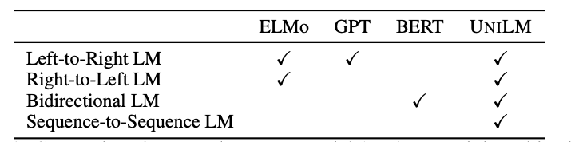
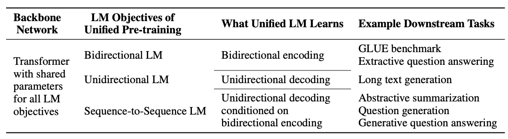
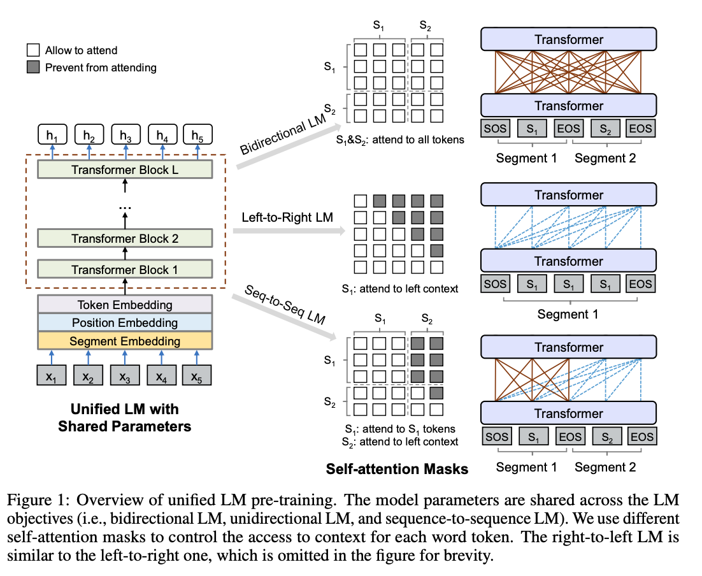

论文地址：

* [https://arxiv.org/abs/1905.03197](https://arxiv.org/abs/1905.03197)

论文代码：

* [https://github.com/microsoft/unilm](https://github.com/microsoft/unilm)

<!-- more -->

## Introduction

目前，预训练语言模型已经大幅提高了各种自然语言处理任务的水平。预训练模型先使用大量数据，通过上下文来预测单词，从而学习到文本的上下文特征表示，然后通过微调来适应后续任务。不同类型的预训练模型一般采用不同的预测任务和训练目标。ELMo模型学习两个单向语言模型（unidirectional LM）：前向语言模型从左到右读取文本进行编码，后向语言模型从右到左读取文本进行编码`（这里不用双向语言模型的原因是双向语言模型会有标签泄露的问题）`。GPT模型使用Transformer解码器从左到右的预测文本序列。BERT模型使用Transformer编码器结合上下文来学习文本表示。

尽管BERT模型已经显著地提高了大量自然语言理解任务的效果，但是由于BERT模型的结构问题，其很难应用到自然语言生成任务上。  
因此，本文作者提出了UniLM，该模型既可以用于自然语言理解任务（NLU），同时也可以用于自然语言生成任务（NLG）。UniLM模型的结构和BERT一致，但是训练方式不同，通过联合训练三种不同目标函数的无监督任务得到。

## Unified Language Model Pre-training

**为了使三种不同的目标函数运用到同一种模型框架中，作者设计了三类完型填空任务，去预测被掩的token。**

模型结构由上图所示，在预训练阶段，UniLM通过三种不同目标函数的模型（双向语言模型、单向语言模型和序列到序列语言模型）去优化同一个（share param）网络。`为了控制预测token可见的上下文，这里使用了不同的attention mask。`

* `单向语言模型：`分为从左到右和从右到左两种。从左到右即仅通过被遮蔽token的左侧文本来预测被遮蔽的token；从右到左，则是仅通过被遮蔽token的右侧文本来预测被遮蔽的token。
* `双向语言模型：`与BERT一致，在预测被遮蔽token时，可以观测到所有的token。
* `序列到序列语言模型：`如果被遮蔽的token在第一个文本序列中，那么仅可以使用第一个文本序列中的所有token，不能使用第二个文本序列的token；如果被遮蔽的token在第二个文本序列中，那么使用第一个文本序列中的所有token和第二个文本序列中被遮蔽token左侧的token预测被遮蔽的token。

## Input Representation

对于单向语言模型，模型输入是一个单独的文本。
对于双向的语言模型和序列到序列的语言模型，模型输入是一个文本对。在第一个文本开始前加上`[SOS]`特殊标志，每一个文本结尾加上`[EOS]`标志，用于表示不同的文本段落。**这里其实和BERT是一样的，只是标志稍微有些不同，将`[CLS]`换成了`[SOS]`，将`[SEP]`换成了`[EOS]`。**在NLG任务上，【EOS】还可以作为文本生成结束的标志。输入表征跟BERT模型也是一致的，由字向量，位置向量和句子段落向量组合而成。

## Pretrain Objectives

作者设计了三种类型的完形填空任务，共同优化同一个模型。在完形填空任务中，在文本重随机选择一些token，使用特殊标记`[MASK]`进行替换，将文本输入到模型中，计算出对应的输出向量，再通过softmax分类器预测`[MASK]`在原文中的token。
UniLM模型参数通过最小化预测token和标准token的交叉熵来优化。三种类型的完型填空任务可以完成不同的语言模型运用相同的程序程序训练。

* `单向语言模型：`有从左到右和从右到左两种，一从左到右为例。每个特殊标记`[MASK]`的预测，仅采用它自身和其左侧的token进行编码。例如，预测$x_1x_2[MASK]x_4$中的`[MASK]`，仅可以使用$x_1$、$x_2$和`[MASK]`自身进行编码。
* `双向语言模型：`和BERT模型一致，每个特殊标记`[MASK]`的预测，可以使用所有的token来进行编码。例如预测$x_1x_2[MASK]x_4$中的`[MASK]`，我们可以使用$x_1$、$x_2$、$x_4$和它自身进行编码。
* `序列到序列语言模型：`如果预测的特殊标记`[MASK]`在第一段文本中，仅可以使用第一段文本中的所有token进行预测。如果预测的token出现在第二段文本中，可以采用第一段中的所有token和第二段中待预测token左侧的token以及自身来进行编码。例如预测序列$[SOS]x_1x_2[MASK1]x_4[EOS]x_5x_6[MASK2]x_8[EOS]$中的`[MASK1]`时，除去[SOS]和[EOS]，可以使用的token有$x_1$、$x_2$、$x_4$和它自身进行编码。预测`[MASK2]`时，除去[SOS]和[EOS]，可以使用$x_1$、$x_2$、$[MASK1]$、$x_4$、$x_5$、$x_6$和它自身进行编码。
