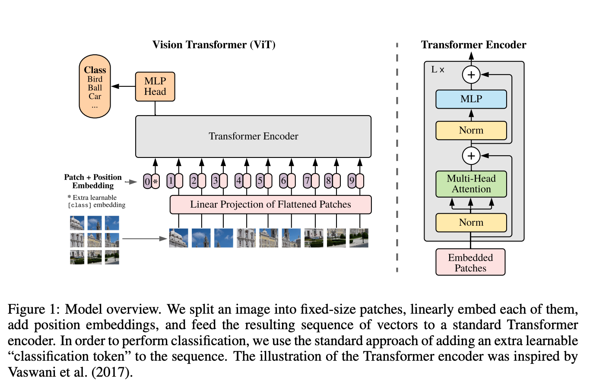

机构： Google  
论文地址：

* [https://arxiv.org/abs/2010.11929#](https://arxiv.org/abs/2010.11929#)

论文代码：

* [https://github.com/google-research/vision_transformer](https://github.com/google-research/vision_transformer)

<!-- more -->

作者阐述了Transformer在NLP领域已经大放异彩了，但是在CV视觉领域还没有得到很好的应用。那么在CV领域使用Transformer是否可行？这篇文章进行了尝试。证明了Transformer在CV领域有很大潜力，可以媲美甚至超出卷积模型。

Transformer的输入是一个序列，要将图像输入Transformer最简单的方法就是将图片的每一个相似flatten然后输入模型。但这种方式是的输入一张200*200分辨率的图像就相当于序列长度为40000，这样复杂度就太高了。所以在ViT中，作者提出将图像打成一个个16*16大小的patch。  
如上图所示，模型使用的就是NLP中的Transformer Encoder，完全没有变动。主要的处理流程如下：

* 将原图分为多个patch，并进行embedding编码:  
  1. 将输入为 [H, W, C] 的图像，依照 [P, P, C] 的大小切成 N 份，再通过linear projection 到 D维，输出尺寸变为 [N, D]。（一张224*224*3的图片，通过一个卷积核大小为16*16、步长为16、输出通道为768的卷积，得到14*14*768的输出。14*14*768的输出，将其按照宽高进行Flatten，其shape变成196*768，表示为196个序列，每个序列长度为768。）
  2. 像 BERT 一样在第0位添加一个可以学习的 embedding 来作为类别的token，输出为 [N+1, D]。（在196*768的数据上，cat一个1*768的分类token在最前面。则shape变成197*768。）
  3. Position-embeddings: 设置一个1*197*768的Position Embedding，对应值相加至token embeddings。
* 经过 L 层 transformer encoder: 和BERT一致。
* 做 classification: 在 class token 那个位置上的输出后接 MLP head 用以做分类classification。
