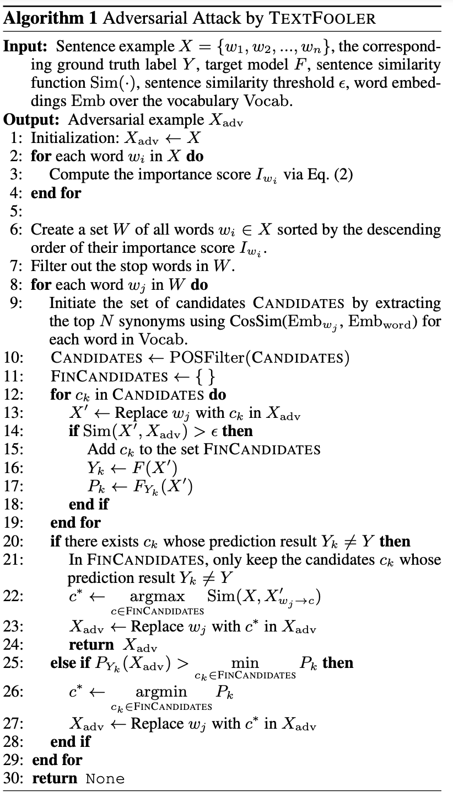
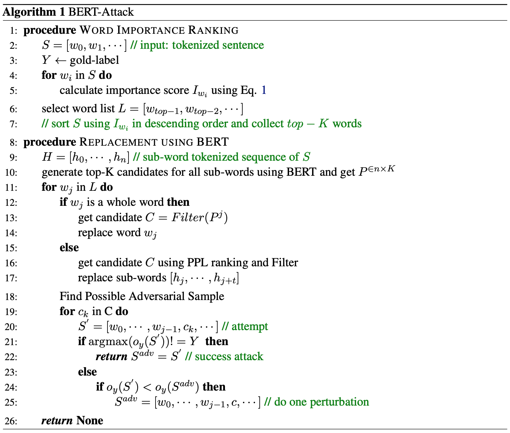
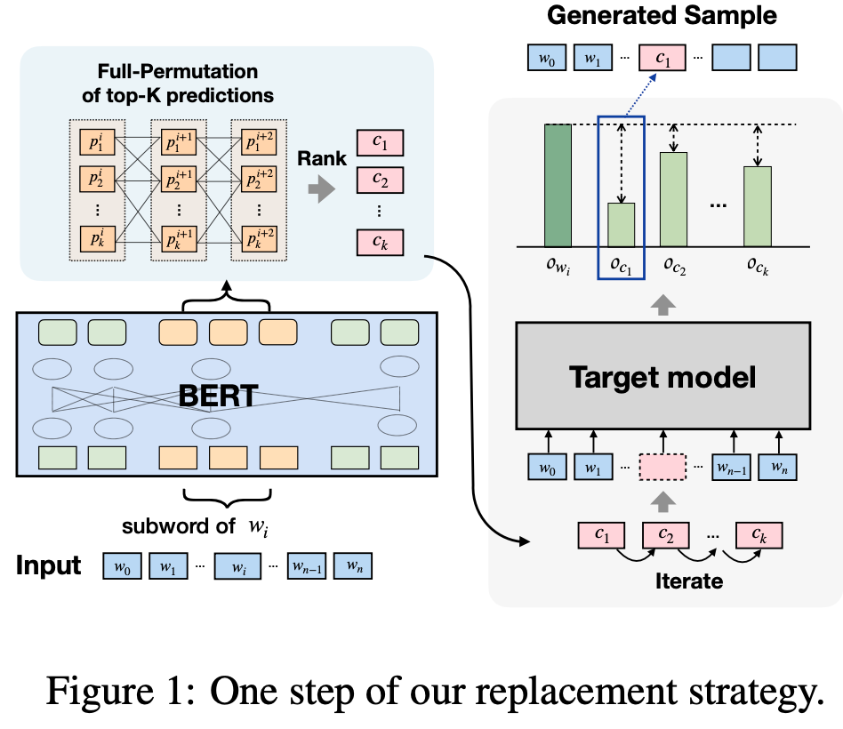
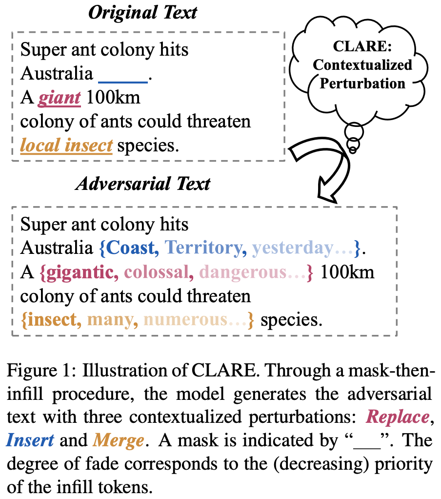
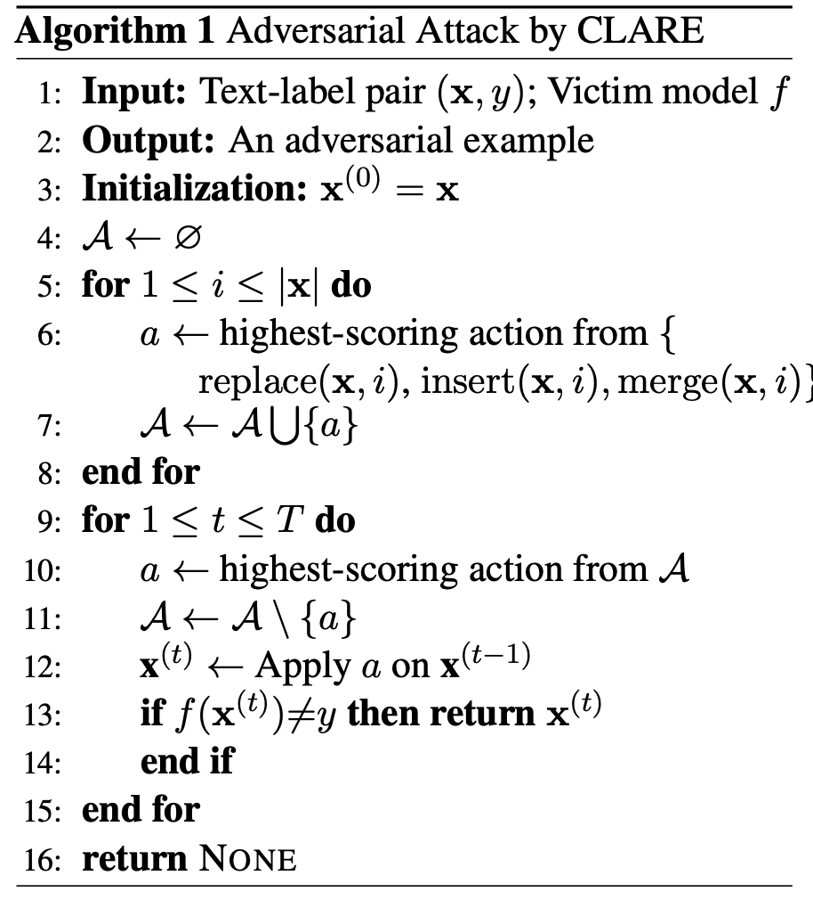

总结一下文本对抗生成的方法。

<!-- more -->


文本对抗攻击一般指我们有一个分类模型以及一些正确命中的样本（可以是训练集里的正样本），然后通过对输入的样本进行扰动，导致分类模型产生错误的判断。在扰动过程中，我们要保持扰动文本和原始文本尽可能相似，并且语义和语法基本不变。


## TextFooler

论文地址：

* [https://arxiv.org/pdf/1907.11932.pdf](https://arxiv.org/pdf/1907.11932.pdf)

论文代码：

* [https://github.com/jind11/TextFooler](https://github.com/jind11/TextFooler)

### Step1: Word Importance Ranking

单词重要程度的计算公式如下所示：
$$
I_{w_i}=
\begin{cases}
    F_Y(X) - F_Y(X_{\backslash w_i}),if \space F(X)=F(X_{\backslash w_i})=Y \\
    (F_Y(X)-F_Y(X_{\backslash w_i})) + (F_{\overline{Y}}(X_{\backslash w_i})-F_{\overline{Y}}(X)),if \space F(X)=Y,F(X_{\backslash w_i})=\overline{Y},Y \neq \overline{Y}
\end{cases}
$$

其中，F为需要攻击的分类模型，Y为ground truth。此外，取得的重要词还过滤掉了停用词。

### Step2: Word Transformer

Step2分为以下几步：

1. `Synonym Extraction`: 通过词向量的余弦相似度来获取同义词，从而进行词替换。
2. `POS Checking`: 对于替换词来说，POS必须一致，从而保证句子语法结构基本不变。
3. `Semantic Similarity Checking`: 通过句向量检查两个句子之间的相似度，从而保证句子语义内容基本不变。
4. `Finalization of Adversarial Examples`: 获取成功攻击分类模型的扰动文本。

算法流程如下：

## BERT-Attack

论文地址：

* [https://arxiv.org/abs/2004.09984](https://arxiv.org/abs/2004.09984)

论文代码：

* [https://github.com/LinyangLee/BERT-Attack](https://github.com/LinyangLee/BERT-Attack)

将BERT作为对抗样本的生成器去误导下游任务中的finetune BERT。
算法流程如下所示：

BERT-Attack主要分为两个步骤：

1. 获取容易攻击的单词，即替换该单词更容易使模型预测发生改变。。
2. 将候选集中的单词替换，从而可以在不改变语义的情况下使模型输出发生改变。

### 获取容易攻击的单词

将输入文本表示为
$$S=[w_0, ..., w_i, ..., w_n]$$
对$i$位置的单词进行遮掩得到
$$S_{\backslash_{w_i}}=[w_0, ..., [MASK], ..., w_n]$$
对于两个输入，下游任务中的微调模型都可以得到一个输出分值$o_y(S)$，其中$y$表示的是下游任务中的标签。定义两个分值之间的差值为该单词的易攻击程度，即：
$$I_{w_i}=o_y(S)-o_y(S_{\backslash_{w_i}})$$
然后我们可以根据每个单词的重要程度对输入单词进行排序，得到待修改单词的列表$L$。由于我们要尽可能少的修改单词进行攻击，所以这里文章中设置了一个超参数$\epsilon$，最多只选取$\epsilon$ percent的单词进行修改。

### 通过BERT进行单词替换

首先建立修改替换的候选集。遍历待修改单词的列表，这里分为两种情况，

1. 如果待修改的是完整的单词，则直接将$top-K$单词放入候选集。
2. 如果待修改的是sub-words，则对整个子词的预测进行全排列，然后选取困惑度前$top-K$的排列加入候选集。

对于sub-words的替换如下图所示：

然后在候选集中选取候选进行替换，如果当前替换改变了下游模型的预测值，则已经得到了对抗攻击的样本。如果单签替换没有改变预测值，则继续替换下一个单词直到改变了下游模型的预测值。


区别于传统BERT中会将预测单词用特殊符号`[MASK]`替换，作者这里不会对需要预测的单词进行遮掩，而是将原始句子直接输入。这样做有以下两个好处：

1. 生成的新句子在语义上会更加连贯。
2. 对于多个替换位置，只需要进行一次inference就可以了，可以节省计算量。



由于通过BERT替换掉某些词可能会导致语义发生很大改变，比如在情感分析任务中，将“我很开心”替换为“我很伤心”会完全改变语义。所以作者对候选词进行了过滤(算法流程中的$Filter$)，剔除了反义词。


## CLARE

论文地址：

* [https://arxiv.org/abs/2009.07502](https://arxiv.org/abs/2009.07502)

论文代码：

* [https://github.com/cookielee77/CLARE](https://github.com/cookielee77/CLARE)

CLARE定义了`Replace`、`Insert`、`Merge`三种操作，通过`mask-then-infill`的方式对输入文本进行扰动。如下图所示：

`mask-then-infill`流程分为两步：

1. 在输入样本的给定位置上进行mask操作。
2. 通过预训练的语言模型对mask的位置进行还原。

下面介绍CLARE定义的三种操作。

### Replace

给定输入样本:
$$x=x_1x_2...x_n$$
对位置i进行mask操作得到:
$$\widetilde{x}=x_1...x_{i-1}[MASK]x_{i+1}...x_n$$
然后通过预训练语言模型对其进行还原得到:
$$replace(x,i)=\widetilde{x}_z=x_1...x_{i-1}zx_{i+1}...x_n$$

对于文本扰动来说，需满足几个条件，作者通过如下方式进行约束：

* 扰动$z$在输入位置i上出现应该是合适且符合语法语义的。
  使用了ROBERTa模型，并且限定了$z$出现的概率要大于阈值，即$p_{MLM}(z|\widetilde{x})>k$。
* $\widetilde{x}_z$应该和$x$相似。
  通过一个模型提取句向量，并使用余弦相似度计算句子之间的相似度。$sim(x,\widetilde{x}_z)>l$。
* $\widetilde{x}_z$会使分类模型出错。
  分类模型$f$对于扰动输入输出的标签概率尽可能低，即$p_f(y|\widetilde{x}_z)尽可能小$。

将阈值$k、l$设置的高可以让经过扰动之后的样本更加贴近原文，但也会使扰动输入对分类模型的攻击的成功率变低。论文中，$k=5 \times 10^{-3},l=0.7$。

经过上述步骤，可以得到扰动$z$的候选集：
$$Z=\{z' \in V | p_{MLM}(z'|\widetilde{x})>k,sim(x,\widetilde{x}_{z'})>l\}$$
其中$V$是预训练模型的词汇表大小，为了尽可能对分类模型攻击成功，对扰动$z$选取标签概率最小的预测，即：
$$z=argmin_{z' \in Z} p_f(y|\widetilde{x}_{z'})$$

### Insert

给定输入样本:
$$x=x_1x_2...x_n$$
在位置i进行insert操作得到：
$$\widetilde{x}=x_1...x_{i}[MASK]x_{i+1}...x_n$$
然后通过预训练语言模型对其进行还原得到:
$$insert(x,i)=\widetilde{x}_z=x_1...x_{i}zx_{i+1}...x_n$$
其余操作和`Replace`一致。

### Merge

给定输入样本:
$$x=x_1x_2...x_n$$
在位置i进行insert操作得到：
$$\widetilde{x}=x_1...x_{i-1}[MASK]x_{i+2}...x_n$$
然后通过预训练语言模型对其进行还原得到:
$$merge(x,i)=\widetilde{x}_z=x_1...x_{i-1}zx_{i+2}...x_n$$
其余操作和`Replace`一致。

对于同一个位置i，只会从`Replace`，`Insert`和`Merge`中选取分数最高的一个操作。其中分数由扰动的成功率来得出，即：
$$s(x,y)(a)=-p_f(y|a(x))$$
其中$a$表示`Replace`，`Insert`和`Merge`三种操作。

具体算法流程如下图所示：

