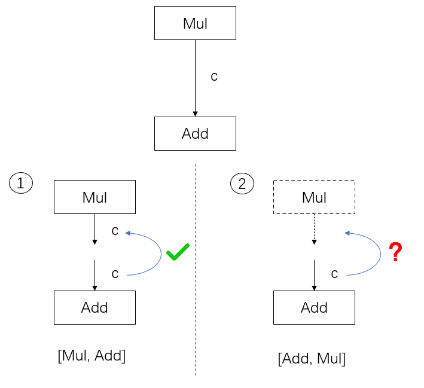

转载自[https://www.zhihu.com/people/openmmlab](https://www.zhihu.com/people/openmmlab)。

介绍以下内容：

* 部署流水线 PyTorch - ONNX - ONNX Runtime/TensorRT 的示例及常见部署问题的解决方法
* PyTorch 模型转换到 ONNX 模型的方法
* 中间表示 ONNX 的定义标准
* 推理引擎 ONNX Runtime、TensorRT 的使用方法

<!-- more -->

## 模型部署简介

### 初识模型部署

在软件工程中，部署指把开发完毕的软件投入使用的过程，包括环境配置、软件安装等步骤。类似地，对于深度学习模型来说，模型部署指让训练好的模型在特定环境中运行的过程。相比于软件部署，模型部署会面临更多的难题：

1. 运行模型所需的环境难以配置。深度学习模型通常是由一些框架编写，比如 PyTorch、TensorFlow。由于框架规模、依赖环境的限制，这些框架不适合在手机、开发板等生产环境中安装。
2. 深度学习模型的结构通常比较庞大，需要大量的算力才能满足实时运行的需求。模型的运行效率需要优化。

为了让模型最终能够部署到某一环境上，开发者们可以使用任意一种`深度学习框架`来定义网络结构，并通过训练确定网络中的参数。之后，模型的结构和参数会被转换成一种只描述网络结构的中间表示，一些针对网络结构的优化会在`中间表示`上进行。最后，用面向硬件的高性能编程框架(如 CUDA，OpenCL）编写，能高效执行深度学习网络中算子的`推理引擎`会把中间表示转换成特定的文件格式，并在对应硬件平台上高效运行模型。

这一条流水线解决了模型部署中的两大问题：使用对接深度学习框架和推理引擎的中间表示，开发者不必担心如何在新环境中运行各个复杂的框架；通过中间表示的网络结构优化和推理引擎对运算的底层优化，模型的运算效率大幅提升。

现在，让我们从一个模型部署的“Hello World”项目入手，见识一下模型部署各方面的知识吧！

### 部署第一个模型

#### 创建Pytorch模型

让我们用 PyTorch 实现一个超分辨率模型，并把模型部署到 ONNX Runtime 这个推理引擎上。

首先，我们需要创建一个有 PyTorch 库的 Python 编程环境。如果你的 PyTorch 环境还没有装好，可以参考官方的入门教程。我们强烈推荐使用 conda 来管理 Python 库。使用 conda 可以靠如下的命令初始化一个 PyTorch 环境：

```bash
# 创建预安装 Python 3.7 的名叫 deploy 虚拟环境 
conda create -n deploy python=3.7 -y 
# 进入虚拟环境 
conda activate deploy 
# 安装 cpu 版本的 PyTorch 
conda install pytorch torchvision cpuonly -c pytorch
```

如果你的设备支持 cuda 编程，我们建议你在配置 cuda 环境后使用 gpu 上的 PyTorch。比如将上面安装 PyTorch 的命令改成：

```bash
# 安装 cuda 11.3 的 PyTorch 
# 如果你用的是其他版本的 cuda，请参考上面 PyTorch 的官方安装教程选择安装命令 
conda install pytorch torchvision cudatoolkit=11.3 -c pytorch
```

本教程会用到其他一些第三方库。你可以用以下命令来安装这些库：

```bash
# 安装 ONNX Runtime, ONNX, OpenCV 
pip install onnxruntime onnx opencv-python
```

在一切都配置完毕后，用下面的代码来创建一个经典的超分辨率模型 SRCNN。

```python
import os 
 
import cv2 
import numpy as np 
import requests 
import torch 
import torch.onnx 
from torch import nn 
 
class SuperResolutionNet(nn.Module): 
    def __init__(self, upscale_factor): 
        super().__init__() 
        self.upscale_factor = upscale_factor 
        self.img_upsampler = nn.Upsample( 
            scale_factor=self.upscale_factor, 
            mode='bicubic', 
            align_corners=False) 
 
        self.conv1 = nn.Conv2d(3,64,kernel_size=9,padding=4) 
        self.conv2 = nn.Conv2d(64,32,kernel_size=1,padding=0) 
        self.conv3 = nn.Conv2d(32,3,kernel_size=5,padding=2) 
 
        self.relu = nn.ReLU() 
 
    def forward(self, x): 
        x = self.img_upsampler(x) 
        out = self.relu(self.conv1(x)) 
        out = self.relu(self.conv2(out)) 
        out = self.conv3(out) 
        return out 
 
# Download checkpoint and test image 
urls = ['https://download.openmmlab.com/mmediting/restorers/srcnn/srcnn_x4k915_1x16_1000k_div2k_20200608-4186f232.pth', 
    'https://raw.githubusercontent.com/open-mmlab/mmediting/master/tests/data/face/000001.png'] 
names = ['srcnn.pth', 'face.png'] 
for url, name in zip(urls, names): 
    if not os.path.exists(name): 
        open(name, 'wb').write(requests.get(url).content) 
 
def init_torch_model(): 
    torch_model = SuperResolutionNet(upscale_factor=3) 
 
    state_dict = torch.load('srcnn.pth')['state_dict'] 
 
    # Adapt the checkpoint 
    for old_key in list(state_dict.keys()): 
        new_key = '.'.join(old_key.split('.')[1:]) 
        state_dict[new_key] = state_dict.pop(old_key) 
 
    torch_model.load_state_dict(state_dict) 
    torch_model.eval() 
    return torch_model 
 
model = init_torch_model() 
input_img = cv2.imread('face.png').astype(np.float32) 
 
# HWC to NCHW 
input_img = np.transpose(input_img, [2, 0, 1]) 
input_img = np.expand_dims(input_img, 0) 
 
# Inference 
torch_output = model(torch.from_numpy(input_img)).detach().numpy() 
 
# NCHW to HWC 
torch_output = np.squeeze(torch_output, 0) 
torch_output = np.clip(torch_output, 0, 255) 
torch_output = np.transpose(torch_output, [1, 2, 0]).astype(np.uint8) 
 
# Show image 
cv2.imwrite("face_torch.png", torch_output)
```

SRCNN 先把图像上采样到对应分辨率，再用 3 个卷积层处理图像。为了方便起见，我们跳过训练网络的步骤，直接下载模型权重（由于 MMEditing 中 SRCNN 的权重结构和我们定义的模型不太一样，我们修改了权重字典的 key 来适配我们定义的模型），同时下载好输入图片。为了让模型输出成正确的图片格式，我们把模型的输出转换成 HWC 格式，并保证每一通道的颜色值都在 0~255 之间。如果脚本正常运行的话，一幅超分辨率的人脸照片会保存在 “face_torch.png” 中。

在 PyTorch 模型测试正确后，我们来正式开始部署这个模型。我们下一步的任务是把 PyTorch 模型转换成用中间表示 ONNX 描述的模型。

#### 中间表示-ONNX

在介绍 ONNX 之前，我们先从本质上来认识一下神经网络的结构。神经网络实际上只是描述了数据计算的过程，其结构可以用计算图表示。比如 a+b 可以用下面的计算图来表示：
<div align=center></div>

为了加速计算，一些框架会使用对神经网络“先编译，后执行”的静态图来描述网络。静态图的缺点是难以描述控制流（比如 if-else 分支语句和 for 循环语句），直接对其引入控制语句会导致产生不同的计算图。比如循环执行 n 次 a=a+b，对于不同的 n，会生成不同的计算图（如下图中n=2和n=3，生成了不同的静态图）：


ONNX （Open Neural Network Exchange）是 Facebook 和微软在2017年共同发布的，用于标准描述计算图的一种格式。目前，在数家机构的共同维护下，ONNX 已经对接了多种深度学习框架和多种推理引擎。因此，ONNX 被当成了深度学习框架到推理引擎的桥梁，就像编译器的中间语言一样。由于各框架兼容性不一，我们通常只用 ONNX 表示更容易部署的静态图。

让我们用下面的代码来把 PyTorch 的模型转换成 ONNX 格式的模型：

```python
x = torch.randn(1, 3, 256, 256) 
 
with torch.no_grad(): 
    torch.onnx.export( 
        model, 
        x, 
        "srcnn.onnx", 
        opset_version=11, 
        input_names=['input'], 
        output_names=['output'])
```

其中，`torch.onnx.export` 是 PyTorch 自带的把模型转换成 ONNX 格式的函数。让我们先看一下前三个必选参数：前三个参数分别是要转换的模型、模型的任意一组输入、导出的 ONNX 文件的文件名。转换模型时，需要原模型和输出文件名是很容易理解的，但为什么需要为模型提供一组输入呢？这就涉及到 ONNX 转换的原理了。从 PyTorch 的模型到 ONNX 的模型，本质上是一种语言上的翻译。直觉上的想法是像编译器一样彻底解析原模型的代码，记录所有控制流。但前面也讲到，我们通常只用 ONNX 记录不考虑控制流的静态图。因此，PyTorch 提供了一种叫做追踪（trace）的模型转换方法：给定一组输入，再实际执行一遍模型，即把这组输入对应的计算图记录下来，保存为 ONNX 格式。export 函数用的就是追踪导出方法，需要给任意一组输入，让模型跑起来。我们的测试图片是三通道，256x256大小的，这里也构造一个同样形状的随机张量。

剩下的参数中，opset_version 表示 ONNX 算子集的版本。深度学习的发展会不断诞生新算子，为了支持这些新增的算子，ONNX会经常发布新的算子集，目前已经更新15个版本。我们令 opset_version = 11，即使用第11个 ONNX 算子集，是因为 SRCNN 中的 bicubic （双三次插值）在 opset11 中才得到支持。剩下的两个参数 input_names, output_names 是输入、输出 tensor 的名称，我们稍后会用到这些名称。

如果上述代码运行成功，目录下会新增一个"srcnn.onnx"的 ONNX 模型文件。我们可以用下面的脚本来验证一下模型文件是否正确。

```python
import onnx 
 
onnx_model = onnx.load("srcnn.onnx") 
try: 
    onnx.checker.check_model(onnx_model) 
except Exception: 
    print("Model incorrect") 
else: 
    print("Model correct")
```

其中，`onnx.load` 函数用于读取一个 ONNX 模型。`onnx.checker.check_model` 用于检查模型格式是否正确，如果有错误的话该函数会直接报错。我们的模型是正确的，控制台中应该会打印出"Model correct"。

接下来，让我们来看一看 ONNX 模型具体的结构是怎么样的。我们可以使用 [Netron](https://netron.app/) 来可视化 ONNX 模型。把 srcnn.onnx 文件从本地的文件系统拖入网站，即可看到如下的可视化结果：

点击 input 或者 output，可以查看 ONNX 模型的基本信息，包括模型的版本信息，以及模型输入、输出的名称和数据类型。

点击某一个算子节点，可以看到算子的具体信息。比如点击第一个 Conv 可以看到：


每个算子记录了算子属性、图结构、权重三类信息。

* `算子属性信息`即图中 attributes 里的信息，对于卷积来说，算子属性包括了卷积核大小(kernel_shape)、卷积步长(strides)等内容。这些算子属性最终会用来生成一个具体的算子。
* `图结构信息`指算子节点在计算图中的名称、邻边的信息。对于图中的卷积来说，该算子节点叫做 Conv_2，输入数据叫做 11，输出数据叫做 12。根据每个算子节点的图结构信息，就能完整地复原出网络的计算图。
* `权重信息`指的是网络经过训练后，算子存储的权重信息。对于卷积来说，权重信息包括卷积核的权重值和卷积后的偏差值。点击图中 conv1.weight, conv1.bias 后面的加号即可看到权重信息的具体内容。

现在，我们有了 SRCNN 的 ONNX 模型。让我们看看最后该如何把这个模型运行起来。

#### 推理引擎 -ONNX Runtime

`ONNX Runtime` 是由微软维护的一个跨平台机器学习推理加速器，也就是我们前面提到的”推理引擎“。ONNX Runtime 是直接对接 ONNX 的，即 ONNX Runtime 可以直接读取并运行 .onnx 文件, 而不需要再把 .onnx 格式的文件转换成其他格式的文件。也就是说，对于 PyTorch - ONNX - ONNX Runtime 这条部署流水线，只要在目标设备中得到 .onnx 文件，并在 ONNX Runtime 上运行模型，模型部署就算大功告成了。

通过刚刚的操作，我们把 PyTorch 编写的模型转换成了 ONNX 模型，并通过可视化检查了模型的正确性。最后，让我们用 ONNX Runtime 运行一下模型，完成模型部署的最后一步。

ONNX Runtime 提供了 Python 接口。接着刚才的脚本，我们可以添加如下代码运行模型：

```python
import onnxruntime 
 
ort_session = onnxruntime.InferenceSession("srcnn.onnx") 
ort_inputs = {'input': input_img} 
ort_output = ort_session.run(['output'], ort_inputs)[0] 
 
ort_output = np.squeeze(ort_output, 0) 
ort_output = np.clip(ort_output, 0, 255) 
ort_output = np.transpose(ort_output, [1, 2, 0]).astype(np.uint8) 
cv2.imwrite("face_ort.png", ort_output)
```

这段代码中，除去后处理操作外，和 ONNX Runtime 相关的代码只有三行。让我们简单解析一下这三行代码。`onnxruntime.InferenceSession`用于获取一个 ONNX Runtime 推理器，其参数是用于推理的 ONNX 模型文件。推理器的 run 方法用于模型推理，其第一个参数为输出张量名的列表，第二个参数为输入值的字典。其中输入值字典的 key 为张量名，value 为 numpy 类型的张量值。输入输出张量的名称需要和`torch.onnx.export` 中设置的输入输出名对应。

如果代码正常运行的话，另一幅超分辨率照片会保存在"face_ort.png"中。这幅图片和刚刚得到的"face_torch.png"是一模一样的。这说明 ONNX Runtime 成功运行了 SRCNN 模型，模型部署完成了！以后有用户想实现超分辨率的操作，我们只需要提供一个 "srcnn.onnx" 文件，并帮助用户配置好 ONNX Runtime 的 Python 环境，用几行代码就可以运行模型了。或者还有更简便的方法，我们可以利用 ONNX Runtime 编译出一个可以直接执行模型的应用程序。我们只需要给用户提供 ONNX 模型文件，并让用户在应用程序选择要执行的 ONNX 模型文件名就可以运行模型了。

### 总结

在这篇教程里，我们利用成熟的模型部署工具，轻松部署了一个初始版本的超分辨率模型 SRCNN。但在实际应用场景中，随着模型结构的复杂度不断加深，碰到的困难的也会越来越多。在下一篇教程里，我们将“升级”一下这个超分辨率模型，让它支持动态的输入。

看完这篇教程，是不是感觉知识太多一下消化不过来？没关系，模型部署本身有非常多的东西要学。为了举例的方便，这篇教程包含了许多未来才会讲到的知识点。事实上，读完这篇教程后，记下以下知识点就够了：

* 模型部署，指把训练好的模型在特定环境中运行的过程。模型部署要解决模型框架兼容性差和模型运行速度慢这两大问题。
* 模型部署的常见流水线是“深度学习框架-中间表示-推理引擎”。其中比较常用的一个中间表示是 ONNX。
* 深度学习模型实际上就是一个计算图。模型部署时通常把模型转换成静态的计算图，即没有控制流（分支语句、循环语句）的计算图。
* PyTorch 框架自带对 ONNX 的支持，只需要构造一组随机的输入，并对模型调用 `torch.onnx.export` 即可完成 PyTorch 到 ONNX 的转换。
* 推理引擎 ONNX Runtime 对 ONNX 模型有原生的支持。给定一个 .onnx 文件，只需要简单使用 ONNX Runtime 的 Python API 就可以完成模型推理。

## 解决模型部署中的难题

上期教程中，我们部署了一个简单的超分辨率模型，一切都十分顺利。但是，上一个模型还有一些缺陷——图片的放大倍数固定是 3，我们无法让图片放大任意的倍数。现在，我们来尝试部署一个支持动态放大倍数的模型，体验一下在模型部署中可能会碰到的困难。

### 模型部署中常见的难题

在之前的学习中，我们在模型部署上顺风顺水，没有碰到任何问题。这是因为 SRCNN 模型只包含几个简单的算子，而这些卷积、插值算子已经在各个中间表示和推理引擎上得到了完美支持。如果模型的操作稍微复杂一点，我们可能就要为兼容模型而付出大量的功夫了。实际上，模型部署时一般会碰到以下几类困难：

* 模型的动态化。出于性能的考虑，各推理框架都默认模型的输入形状、输出形状、结构是静态的。而为了让模型的泛用性更强，部署时需要在尽可能不影响原有逻辑的前提下，让模型的输入输出或是结构动态化。
* 新算子的实现。深度学习技术日新月异，提出新算子的速度往往快于 ONNX 维护者支持的速度。为了部署最新的模型，部署工程师往往需要自己在 ONNX 和推理引擎中支持新算子。
* 中间表示与推理引擎的兼容问题。由于各推理引擎的实现不同，对 ONNX 难以形成统一的支持。为了确保模型在不同的推理引擎中有同样的运行效果，部署工程师往往得为某个推理引擎定制模型代码，这为模型部署引入了许多工作量。

我们会在后续教程详细讲述解决这些问题的方法。

现在，让我们对原来的 SRCNN 模型做一些小的修改，体验一下模型动态化对模型部署造成的困难，并学习解决该问题的一种方法。

### 问题：实现动态放大的超分辨率模型

在原来的 SRCNN 中，图片的放大比例是写死在模型里的：

```python
class SuperResolutionNet(nn.Module): 
    def __init__(self, upscale_factor): 
        super().__init__() 
        self.upscale_factor = upscale_factor 
        self.img_upsampler = nn.Upsample( 
            scale_factor=self.upscale_factor, 
            mode='bicubic', 
            align_corners=False) 
 
... 
 
def init_torch_model(): 
    torch_model = SuperResolutionNet(upscale_factor=3) 
```

我们使用 upscale_factor 来控制模型的放大比例。初始化模型的时候，我们默认令 upscale_factor 为 3，生成了一个放大 3 倍的 PyTorch 模型。这个 PyTorch 模型最终被转换成了 ONNX 格式的模型。如果我们需要一个放大 4 倍的模型，需要重新生成一遍模型，再做一次到 ONNX 的转换。

现在，假设我们要做一个超分辨率的应用。我们的用户希望图片的放大倍数能够自由设置。而我们交给用户的，只有一个 .onnx 文件和运行超分辨率模型的应用程序。我们在不修改 .onnx 文件的前提下改变放大倍数。

因此，我们必须修改原来的模型，令模型的放大倍数变成推理时的输入。在上一篇文章中的 Python 脚本的基础上，我们做一些修改，得到这样的脚本：

```python
import torch 
from torch import nn 
from torch.nn.functional import interpolate 
import torch.onnx 
import cv2 
import numpy as np 
 
 
class SuperResolutionNet(nn.Module): 
 
    def __init__(self): 
        super().__init__() 
 
        self.conv1 = nn.Conv2d(3, 64, kernel_size=9, padding=4) 
        self.conv2 = nn.Conv2d(64, 32, kernel_size=1, padding=0) 
        self.conv3 = nn.Conv2d(32, 3, kernel_size=5, padding=2) 
 
        self.relu = nn.ReLU() 
 
    def forward(self, x, upscale_factor): 
        x = interpolate(x, 
                        scale_factor=upscale_factor, 
                        mode='bicubic', 
                        align_corners=False) 
        out = self.relu(self.conv1(x)) 
        out = self.relu(self.conv2(out)) 
        out = self.conv3(out) 
        return out 
 
 
def init_torch_model(): 
    torch_model = SuperResolutionNet() 
 
    state_dict = torch.load('srcnn.pth')['state_dict'] 
 
    # Adapt the checkpoint 
    for old_key in list(state_dict.keys()): 
        new_key = '.'.join(old_key.split('.')[1:]) 
        state_dict[new_key] = state_dict.pop(old_key) 
 
    torch_model.load_state_dict(state_dict) 
    torch_model.eval() 
    return torch_model 
 
 
model = init_torch_model() 
 
input_img = cv2.imread('face.png').astype(np.float32) 
 
# HWC to NCHW 
input_img = np.transpose(input_img, [2, 0, 1]) 
input_img = np.expand_dims(input_img, 0) 
 
# Inference 
torch_output = model(torch.from_numpy(input_img), 3).detach().numpy() 
 
# NCHW to HWC 
torch_output = np.squeeze(torch_output, 0) 
torch_output = np.clip(torch_output, 0, 255) 
torch_output = np.transpose(torch_output, [1, 2, 0]).astype(np.uint8) 
 
# Show image 
cv2.imwrite("face_torch_2.png", torch_output) 
```

SuperResolutionNet 未修改之前，nn.Upsample 在初始化阶段固化了放大倍数，而 PyTorch 的 interpolate 插值算子可以在运行阶段选择放大倍数。因此，我们在新脚本中使用 interpolate 代替 nn.Upsample，从而让模型支持动态放大倍数的超分。 在第 55 行使用模型推理时，我们把放大倍数设置为 3。最后，图片保存在文件 "face_torch_2.png" 中。一切正常的话，"face_torch_2.png" 和 "face_torch.png" 的内容一模一样。

通过简单的修改，PyTorch 模型已经支持了动态分辨率。现在我们来尝试一下导出模型：

```python
x = torch.randn(1, 3, 256, 256) 
 
with torch.no_grad(): 
    torch.onnx.export(model, (x, 3), 
                      "srcnn2.onnx", 
                      opset_version=11, 
                      input_names=['input', 'factor'], 
                      output_names=['output'])
```

运行这些脚本时，会报一长串错误。没办法，我们碰到了模型部署中的兼容性问题。

### 解决方法：自定义算子

直接使用 PyTorch 模型的话，我们修改几行代码就能实现模型输入的动态化。但在模型部署中，我们要花数倍的时间来设法解决这一问题。现在，让我们顺着解决问题的思路，体验一下模型部署的困难，并学习使用自定义算子的方式，解决超分辨率模型的动态化问题。

刚刚的报错是因为 PyTorch 模型在导出到 ONNX 模型时，模型的输入参数的类型必须全部是 torch.Tensor。而实际上我们传入的第二个参数" 3 "是一个整形变量。这不符合 PyTorch 转 ONNX 的规定。我们必须要修改一下原来的模型的输入。为了保证输入的所有参数都是 torch.Tensor 类型的，我们做如下修改：

```python
... 
 
class SuperResolutionNet(nn.Module): 
 
    def forward(self, x, upscale_factor): 
        x = interpolate(x, 
                        scale_factor=upscale_factor.item(), 
                        mode='bicubic', 
                        align_corners=False) 
 
... 
 
# Inference 
# Note that the second input is torch.tensor(3) 
torch_output = model(torch.from_numpy(input_img), torch.tensor(3)).detach().numpy() 
 
... 
 
with torch.no_grad(): 
    torch.onnx.export(model, (x, torch.tensor(3)), 
                      "srcnn2.onnx", 
                      opset_version=11, 
                      input_names=['input', 'factor'], 
                      output_names=['output']) 
```

由于 PyTorch 中 interpolate 的 scale_factor 参数必须是一个数值，我们使用 torch.Tensor.item() 来把只有一个元素的 torch.Tensor 转换成数值。之后，在模型推理时，我们使用 torch.tensor(3) 代替 3，以使得我们的所有输入都满足要求。现在运行脚本的话，无论是直接运行模型，还是导出 ONNX 模型，都不会报错了。

但是，导出 ONNX 时却报了一条 TraceWarning 的警告。这条警告说有一些量可能会追踪失败。这是怎么回事呢？让我们把生成的 srcnn2.onnx 用 Netron 可视化一下：


可以发现，虽然我们把模型推理的输入设置为了两个，但 ONNX 模型还是长得和原来一模一样，只有一个叫 " input " 的输入。这是由于我们使用了 torch.Tensor.item() 把数据从 Tensor 里取出来，而导出 ONNX 模型时这个操作是无法被记录的，只好报了一条 TraceWarning。这导致 interpolate 插值函数的放大倍数还是被设置成了" 3 "这个固定值，我们导出的" srcnn2.onnx "和最开始的" srcnn.onnx "完全相同。

直接修改原来的模型似乎行不通，我们得从 PyTorch 转 ONNX 的原理入手，强行令 ONNX 模型明白我们的想法了。

仔细观察 Netron 上可视化出的 ONNX 模型，可以发现在 PyTorch 中无论是使用最早的 nn.Upsample，还是后来的 interpolate，PyTorch 里的插值操作最后都会转换成 ONNX 定义的 Resize 操作。也就是说，所谓 PyTorch 转 ONNX，实际上就是把每个 PyTorch 的操作映射成了 ONNX 定义的算子。

点击该算子，可以看到它的详细参数如下：


其中，展开 scales，可以看到 scales 是一个长度为 4 的一维张量，其内容为 [1, 1, 3, 3], 表示 Resize 操作每一个维度的缩放系数；其类型为 Initializer，表示这个值是根据常量直接初始化出来的。如果我们能够自己生成一个 ONNX 的 Resize 算子，让 scales 成为一个可变量而不是常量，就像它上面的 X 一样，那这个超分辨率模型就能动态缩放了。

现有实现插值的 PyTorch 算子有一套规定好的映射到 ONNX Resize 算子的方法，这些映射出的 Resize 算子的 scales 只能是常量，无法满足我们的需求。我们得自己定义一个实现插值的 PyTorch 算子，然后让它映射到一个我们期望的 ONNX Resize 算子上。

下面的脚本定义了一个 PyTorch 插值算子，并在模型里使用了它。我们先通过运行模型来验证该算子的正确性：

```python
import torch 
from torch import nn 
from torch.nn.functional import interpolate 
import torch.onnx 
import cv2 
import numpy as np 
 
 
class NewInterpolate(torch.autograd.Function): 
 
    @staticmethod 
    def symbolic(g, input, scales): 
        return g.op("Resize", 
                    input, 
                    g.op("Constant", 
                         value_t=torch.tensor([], dtype=torch.float32)), 
                    scales, 
                    coordinate_transformation_mode_s="pytorch_half_pixel", 
                    cubic_coeff_a_f=-0.75, 
                    mode_s='cubic', 
                    nearest_mode_s="floor") 
 
    @staticmethod 
    def forward(ctx, input, scales): 
        scales = scales.tolist()[-2:] 
        return interpolate(input, 
                           scale_factor=scales, 
                           mode='bicubic', 
                           align_corners=False) 
 
 
class StrangeSuperResolutionNet(nn.Module): 
 
    def __init__(self): 
        super().__init__() 
 
        self.conv1 = nn.Conv2d(3, 64, kernel_size=9, padding=4) 
        self.conv2 = nn.Conv2d(64, 32, kernel_size=1, padding=0) 
        self.conv3 = nn.Conv2d(32, 3, kernel_size=5, padding=2) 
 
        self.relu = nn.ReLU() 
 
    def forward(self, x, upscale_factor): 
        x = NewInterpolate.apply(x, upscale_factor) 
        out = self.relu(self.conv1(x)) 
        out = self.relu(self.conv2(out)) 
        out = self.conv3(out) 
        return out 
 
 
def init_torch_model(): 
    torch_model = StrangeSuperResolutionNet() 
 
    state_dict = torch.load('srcnn.pth')['state_dict'] 
 
    # Adapt the checkpoint 
    for old_key in list(state_dict.keys()): 
        new_key = '.'.join(old_key.split('.')[1:]) 
        state_dict[new_key] = state_dict.pop(old_key) 
 
    torch_model.load_state_dict(state_dict) 
    torch_model.eval() 
    return torch_model 
 
 
model = init_torch_model() 
factor = torch.tensor([1, 1, 3, 3], dtype=torch.float) 
 
input_img = cv2.imread('face.png').astype(np.float32) 
 
# HWC to NCHW 
input_img = np.transpose(input_img, [2, 0, 1]) 
input_img = np.expand_dims(input_img, 0) 
 
# Inference 
torch_output = model(torch.from_numpy(input_img), factor).detach().numpy() 
 
# NCHW to HWC 
torch_output = np.squeeze(torch_output, 0) 
torch_output = np.clip(torch_output, 0, 255) 
torch_output = np.transpose(torch_output, [1, 2, 0]).astype(np.uint8) 
 
# Show image 
cv2.imwrite("face_torch_3.png", torch_output) 
```

模型运行正常的话，一幅放大3倍的超分辨率图片会保存在"face_torch_3.png"中，其内容和"face_torch.png"完全相同。

在刚刚那个脚本中，我们定义 PyTorch 插值算子的代码如下：

```python
class NewInterpolate(torch.autograd.Function): 
 
    @staticmethod 
    def symbolic(g, input, scales): 
        return g.op("Resize", 
                    input, 
                    g.op("Constant", 
                         value_t=torch.tensor([], dtype=torch.float32)), 
                    scales, 
                    coordinate_transformation_mode_s="pytorch_half_pixel", 
                    cubic_coeff_a_f=-0.75, 
                    mode_s='cubic', 
                    nearest_mode_s="floor") 
 
    @staticmethod 
    def forward(ctx, input, scales): 
        scales = scales.tolist()[-2:] 
        return interpolate(input, 
                           scale_factor=scales, 
                           mode='bicubic', 
                           align_corners=False) 
```

在具体介绍这个算子的实现前，让我们先理清一下思路。我们希望新的插值算子有两个输入，一个是被用于操作的图像，一个是图像的放缩比例。前面讲到，为了对接 ONNX 中 Resize 算子的 scales 参数，这个放缩比例是一个 [1, 1, x, x] 的张量，其中 x 为放大倍数。在之前放大3倍的模型中，这个参数被固定成了[1, 1, 3, 3]。因此，在插值算子中，我们希望模型的第二个输入是一个 [1, 1, w, h] 的张量，其中 w 和 h 分别是图片宽和高的放大倍数。

搞清楚了插值算子的输入，再看一看算子的具体实现。算子的推理行为由算子的 foward 方法决定。该方法的第一个参数必须为 ctx，后面的参数为算子的自定义输入，我们设置两个输入，分别为被操作的图像和放缩比例。为保证推理正确，需要把 [1, 1, w, h] 格式的输入对接到原来的 interpolate 函数上。我们的做法是截取输入张量的后两个元素，把这两个元素以 list 的格式传入 interpolate 的 scale_factor 参数。

接下来，我们要决定新算子映射到 ONNX 算子的方法。映射到 ONNX 的方法由一个算子的 symbolic 方法决定。symbolic 方法第一个参数必须是g，之后的参数是算子的自定义输入，和 forward 函数一样。ONNX 算子的具体定义由 g.op 实现。g.op 的每个参数都可以映射到 ONNX 中的算子属性。

对于其他参数，我们可以照着现在的 Resize 算子填。而要注意的是，我们现在希望 scales 参数是由输入动态决定的。因此，在填入 ONNX 的 scales 时，我们要把 symbolic 方法的输入参数中的 scales 填入。

接着，让我们把新模型导出成 ONNX 模型：

```python
x = torch.randn(1, 3, 256, 256) 
 
with torch.no_grad(): 
    torch.onnx.export(model, (x, factor), 
                      "srcnn3.onnx", 
                      opset_version=11, 
                      input_names=['input', 'factor'], 
                      output_names=['output']) 
```

把导出的 " srcnn3.onnx " 进行可视化：


可以看到，正如我们所期望的，导出的 ONNX 模型有了两个输入！第二个输入表示图像的放缩比例。

之前在验证 PyTorch 模型和导出 ONNX 模型时，我们宽高的缩放比例设置成了 3x3。现在，在用 ONNX Runtime 推理时，我们尝试使用 4x4 的缩放比例：

```python
import onnxruntime 
 
input_factor = np.array([1, 1, 4, 4], dtype=np.float32) 
ort_session = onnxruntime.InferenceSession("srcnn3.onnx") 
ort_inputs = {'input': input_img, 'factor': input_factor} 
ort_output = ort_session.run(None, ort_inputs)[0] 
 
ort_output = np.squeeze(ort_output, 0) 
ort_output = np.clip(ort_output, 0, 255) 
ort_output = np.transpose(ort_output, [1, 2, 0]).astype(np.uint8) 
cv2.imwrite("face_ort_3.png", ort_output) 
```

运行上面的代码，可以得到一个边长放大4倍的超分辨率图片 "face_ort_3.png"。动态的超分辨率模型生成成功了！只要修改 input_factor，我们就可以自由地控制图片的缩放比例。

我们刚刚的工作，实际上是绕过 PyTorch 本身的限制，凭空“捏”出了一个 ONNX 算子。事实上，我们不仅可以创建现有的 ONNX 算子，还可以定义新的 ONNX 算子以拓展 ONNX 的表达能力。后续教程中我们将介绍自定义新 ONNX 算子的方法。

### 总结

通过学习前两篇教程，我们走完了整个部署流水线，成功部署了支持动态放大倍数的超分辨率模型。在这个过程中，我们既学会了如何简单地调用各框架的API实现模型部署，又学到了如何分析并尝试解决模型部署时碰到的难题。

同样，让我们总结一下本篇教程的知识点：

* 模型部署中常见的几类困难有：模型的动态化；新算子的实现；框架间的兼容。
* PyTorch 转 ONNX，实际上就是把每一个操作转化成 ONNX 定义的某一个算子。比如对于 PyTorch 中的 Upsample 和 interpolate，在转 ONNX 后最终都会成为 ONNX 的 Resize 算子。
* 通过修改继承自 torch.autograd.Function 的算子的 symbolic 方法，可以改变该算子映射到 ONNX 算子的行为。


## PyTorch转ONNX详解

在前两期的教程中，我们带领大家成功部署了第一个模型，解决了一些在模型部署中可能会碰到的困难。这一期教程，我们将由浅入深地介绍ONNX相关的知识。ONNX是目前模型部署中最重要的中间表示之一。学懂了ONNX的技术细节，就能规避大量的模型部署问题。  
在把 PyTorch 模型转换成 ONNX 模型时，我们往往只需要轻松地调用一句`torch.onnx.export`就行了。这个函数的接口看上去简单，但它在使用上还有着诸多的“潜规则”。在这篇教程中，我们会详细介绍 PyTorch 模型转 ONNX 模型的原理及注意事项。除此之外，我们还会介绍 PyTorch 与 ONNX 的算子对应关系，以教会大家如何处理 PyTorch 模型转换时可能会遇到的算子支持问题。

### torch.onnx.export 细解

在这一节里，我们将详细介绍PyTorch到ONNX的转换函数——`torch.onnx.export`。我们希望大家能够更加灵活地使用这个模型转换接口，并通过了解它的实现原理来更好地应对该函数的报错。

#### 计算图导出方法

[TorchScript](https://pytorch.org/docs/stable/jit.html)是一种序列化和优化PyTorch模型的格式，在优化过程中，一个`torch.nn.Module`模型会被转换成TorchScript的`torch.jit.ScriptModule`模型。现在，TorchScript也常被当成一种中间表示使用。
`torch.onnx.export`中需要的模型实际上是一个`torch.jit.ScriptModule`。而需要把普通PyTorch模型转成这样的TorchScript模型，有跟踪（trace）和记录（script）两种导出计算图的方法。如果给`torch.onnx.export`传入了一个普通PyTorch模型（`torch.nn.Module`），那么这个模型会默认使用跟踪的方法导出。这一过程如下图所示：


回忆一下我们第一篇教程知识：跟踪法只能通过实际运行一遍模型的方法导出模型的静态图，即无法识别出模型中的控制流（如循环）；记录法则能通过解析模型来正确记录所有的控制流。我们以下面这段代码为例来看一看这两种转换方法的区别：

```python
import torch 
 
class Model(torch.nn.Module): 
    def __init__(self, n): 
        super().__init__() 
        self.n = n 
        self.conv = torch.nn.Conv2d(3, 3, 3) 
 
    def forward(self, x): 
        for i in range(self.n): 
            x = self.conv(x) 
        return x 
 
 
models = [Model(2), Model(3)] 
model_names = ['model_2', 'model_3'] 
 
for model, model_name in zip(models, model_names): 
    dummy_input = torch.rand(1, 3, 10, 10) 
    dummy_output = model(dummy_input) 
    model_trace = torch.jit.trace(model, dummy_input) 
    model_script = torch.jit.script(model) 
 
    # 跟踪法与直接 torch.onnx.export(model, ...)等价 
    torch.onnx.export(model_trace, dummy_input, f'{model_name}_trace.onnx') 
    # 记录法必须先调用 torch.jit.sciprt 
    torch.onnx.export(model_script, dummy_input, f'{model_name}_script.onnx') 
```

在这段代码里，我们定义了一个带循环的模型，模型通过参数`n`来控制输入张量被卷积的次数。之后，我们各创建了一个`n=2`和`n=3`的模型。我们把这两个模型分别用跟踪和记录的方法进行导出。
值得一提的是，由于这里的两个模型（`model_trace`, `model_script`)是 TorchScript 模型，export函数已经不需要再运行一遍模型了。（如果模型是用跟踪法得到的，那么在执行`torch.jit.trace`的时候就运行过一遍了；而用记录法导出时，模型不需要实际运行）参数中的`dummy_input`仅仅是为了获取输入张量的类型和形状。

运行上面的代码，我们把得到的 4 个 onnx 文件用 [Netron](https://netron.app/) 可视化（左边为script，右边为trace）：


由于推理引擎对静态图的支持更好，通常我们在模型部署时不需要显式地把 PyTorch 模型转成 TorchScript 模型，直接把 PyTorch 模型用 torch.onnx.export 跟踪导出即可。了解这部分的知识主要是为了在模型转换报错时能够更好地定位问题是否发生在 PyTorch 转 TorchScript 阶段。

#### 参数讲解

了解完转换函数的原理后，我们来详细介绍一下该函数的主要参数的作用。我们主要会从应用的角度来介绍每个参数在不同的模型部署场景中应该如何设置，而不会去列出每个参数的所有设置方法。该函数详细的 API 文档可参考： [torch.onnx ‒ PyTorch 1.11.0 documentation](https://pytorch.org/docs/stable/onnx.html#functions)

`torch.onnx.export` 在 `torch.onnx.__init__.py`文件中的定义如下：

```python
def export(model, args, f, export_params=True, verbose=False, training=TrainingMode.EVAL, 
           input_names=None, output_names=None, aten=False, export_raw_ir=False, 
           operator_export_type=None, opset_version=None, _retain_param_name=True, 
           do_constant_folding=True, example_outputs=None, strip_doc_string=True, 
           dynamic_axes=None, keep_initializers_as_inputs=None, custom_opsets=None, 
           enable_onnx_checker=True, use_external_data_format=False):
```

前三个必选参数为模型、模型输入、导出的 onnx 文件名，我们对这几个参数已经很熟悉了。我们来着重看一下后面的一些常用可选参数。

##### export_params

模型中是否存储模型权重。一般中间表示包含两大类信息：模型结构和模型权重，这两类信息可以在同一个文件里存储，也可以分文件存储。ONNX 是用同一个文件表示记录模型的结构和权重的。
我们部署时一般都默认这个参数为 True。如果 onnx 文件是用来在不同框架间传递模型（比如 PyTorch 到 Tensorflow）而不是用于部署，则可以令这个参数为 False。

##### input_names, output_names

设置输入和输出张量的名称。如果不设置的话，会自动分配一些简单的名字（如数字）。
ONNX 模型的每个输入和输出张量都有一个名字。很多推理引擎在运行 ONNX 文件时，都需要以“名称-张量值”的数据对来输入数据，并根据输出张量的名称来获取输出数据。在进行跟张量有关的设置（比如添加动态维度）时，也需要知道张量的名字。
在实际的部署流水线中，我们都需要设置输入和输出张量的名称，并保证 ONNX 和推理引擎中使用同一套名称。

##### opset_version

转换时参考哪个 ONNX 算子集版本。后文会详细介绍 PyTorch 与 ONNX 的算子对应关系。

##### dynamic_axes

指定输入输出张量的哪些维度是动态的。
为了追求效率，ONNX 默认所有参与运算的张量都是静态的（张量的形状不发生改变）。但在实际应用中，我们又希望模型的输入张量是动态的，尤其是本来就没有形状限制的全卷积模型。因此，我们需要显式地指明输入输出张量的哪几个维度的大小是可变的。
我们来看一个`dynamic_axes`的设置例子：

```python
import torch 
 
class Model(torch.nn.Module): 
    def __init__(self): 
        super().__init__() 
        self.conv = torch.nn.Conv2d(3, 3, 3) 
 
    def forward(self, x): 
        x = self.conv(x) 
        return x 
 
 
model = Model() 
dummy_input = torch.rand(1, 3, 10, 10) 
model_names = ['model_static.onnx',  
'model_dynamic_0.onnx',  
'model_dynamic_23.onnx'] 
 
dynamic_axes_0 = { 
    'in' : [0], 
    'out' : [0] 
} 
dynamic_axes_23 = { 
    'in' : [2, 3], 
    'out' : [2, 3] 
} 
 
torch.onnx.export(model, dummy_input, model_names[0],  
input_names=['in'], output_names=['out']) 
torch.onnx.export(model, dummy_input, model_names[1],  
input_names=['in'], output_names=['out'], dynamic_axes=dynamic_axes_0) 
torch.onnx.export(model, dummy_input, model_names[2],  
input_names=['in'], output_names=['out'], dynamic_axes=dynamic_axes_23) 
```

首先，我们导出 3 个 ONNX 模型，分别为没有动态维度、第 0 维动态、第 2 第 3 维动态的模型。
在这份代码里，我们是用列表的方式表示动态维度，例如：

```python
dynamic_axes_0 = { 
    'in' : [0], 
    'out' : [0] 
} 
```

由于 ONNX 要求每个动态维度都有一个名字，这样写的话会引出一条 UserWarning，警告我们通过列表的方式设置动态维度的话系统会自动为它们分配名字。一种显式添加动态维度名字的方法如下：

```python
dynamic_axes_0 = { 
    'in' : {0: 'batch'}, 
    'out' : {0: 'batch'} 
} 
```

由于在这份代码里我们没有更多的对动态维度的操作，因此简单地用列表指定动态维度即可。
之后，我们用下面的代码来看一看动态维度的作用：

```python
import onnxruntime 
import numpy as np 
 
origin_tensor = np.random.rand(1, 3, 10, 10).astype(np.float32) 
mult_batch_tensor = np.random.rand(2, 3, 10, 10).astype(np.float32) 
big_tensor = np.random.rand(1, 3, 20, 20).astype(np.float32) 
 
inputs = [origin_tensor, mult_batch_tensor, big_tensor] 
exceptions = dict() 
 
for model_name in model_names: 
    for i, input in enumerate(inputs): 
        try: 
            ort_session = onnxruntime.InferenceSession(model_name) 
            ort_inputs = {'in': input} 
            ort_session.run(['out'], ort_inputs) 
        except Exception as e: 
            exceptions[(i, model_name)] = e 
            print(f'Input[{i}] on model {model_name} error.') 
        else: 
            print(f'Input[{i}] on model {model_name} succeed.') 
```

我们在模型导出计算图时用的是一个形状为`(1, 3, 10, 10)`的张量。现在，我们来尝试以形状分别是`(1, 3, 10, 10)`, `(2, 3, 10, 10)`, `(1, 3, 20, 20)`为输入，用ONNX Runtime运行一下这几个模型，看看哪些情况下会报错，并保存对应的报错信息。得到的输出信息应该如下：

```bash
Input[0] on model model_static.onnx succeed. 
Input[1] on model model_static.onnx error. 
Input[2] on model model_static.onnx error. 
Input[0] on model model_dynamic_0.onnx succeed. 
Input[1] on model model_dynamic_0.onnx succeed. 
Input[2] on model model_dynamic_0.onnx error. 
Input[0] on model model_dynamic_23.onnx succeed. 
Input[1] on model model_dynamic_23.onnx error. 
Input[2] on model model_dynamic_23.onnx succeed. 
```

可以看出，形状相同的`(1, 3, 10, 10)`的输入在所有模型上都没有出错。而对于batch（第 0 维）或者长宽（第 2、3维）不同的输入，只有在设置了对应的动态维度后才不会出错。我们可以错误信息中找出是哪些维度出了问题。比如我们可以用以下代码查看input[1]在`model_static.onnx`中的报错信息：

```python
print(exceptions[(1, 'model_static.onnx')]) 
 
# output 
'''
[ONNXRuntimeError] : 2 : INVALID_ARGUMENT : Got invalid dimensions for input: in for the following indices
 index: 0 Got: 2 Expected: 1
 Please fix either the inputs or the model.
 '''
```

#### 使用提示

通过学习之前的知识，我们基本掌握了`torch.onnx.export`函数的部分实现原理和参数设置方法，足以完成简单模型的转换了。但在实际应用中，使用该函数还会踩很多坑。这里我们模型部署团队把在实战中积累的一些经验分享给大家。

##### 使模型在 ONNX 转换时有不同的行为

有些时候，我们希望模型在导出至 ONNX 时有一些不同的行为。模型在直接用 PyTorch 推理时有一套逻辑，而在导出的ONNX模型中有另一套逻辑。比如，我们可以把一些后处理的逻辑放在模型里，以简化除运行模型之外的其他代码。`torch.onnx.is_in_onnx_export()`可以实现这一任务，该函数仅在执行`torch.onnx.export()`时为真。以下是一个例子：

```python
import torch 
 
class Model(torch.nn.Module): 
    def __init__(self): 
        super().__init__() 
        self.conv = torch.nn.Conv2d(3, 3, 3) 
 
    def forward(self, x): 
        x = self.conv(x) 
        if torch.onnx.is_in_onnx_export(): 
            x = torch.clip(x, 0, 1) 
        return x
```

这里，我们仅在模型导出时把输出张量的数值限制在[0, 1]之间。

##### 利用中断张量跟踪的操作

PyTorch 转 ONNX 的跟踪导出法不是万能的。如果我们在模型中做了一些很“出格”的操作，跟踪法会把某些取决于输入的中间结果变成常量，从而使导出的 ONNX 模型和原来的模型有出入。以下是一个会造成这种“跟踪中断”的例子：

```python
class Model(torch.nn.Module): 
    def __init__(self): 
        super().__init__() 
 
    def forward(self, x): 
        x = x * x[0].item() 
        return x, torch.Tensor([i for i in x]) 
 
model = Model()       
dummy_input = torch.rand(10) 
torch.onnx.export(model, dummy_input, 'a.onnx') 
```

如果你尝试去导出这个模型，会得到一大堆 warning，告诉你转换出来的模型可能不正确。这也难怪，我们在这个模型里使用了.item()把 torch 中的张量转换成了普通的 Python 变量，还尝试遍历 torch 张量，并用一个列表新建一个 torch 张量。这些涉及张量与普通变量转换的逻辑都会导致最终的 ONNX 模型不太正确。
另一方面，我们也可以利用这个性质，在保证正确性的前提下令模型的中间结果变成常量。这个技巧常常用于模型的静态化上，即令模型中所有的张量形状都变成常量。在未来的教程中，我们会在部署实例中详细介绍这些“高级”操作。

##### 使用张量为输入

正如我们第一篇教程所展示的，在较旧(< 1.9.0)的 PyTorch 中把 Python 数值作为`torch.onnx.export()`的模型输入时会报错。出于兼容性的考虑，我们还是推荐以张量为模型转换时的模型输入。

### PyTorch对ONNX的算子支持

在确保`torch.onnx.export()`的调用方法无误后，PyTorch 转 ONNX 时最容易出现的问题就是算子不兼容了。这里我们会介绍如何判断某个PyTorch算子在ONNX中是否兼容，以助大家在碰到报错时能更好地把错误归类。而具体添加算子的方法我们会在之后的文章里介绍。
在转换普通的`torch.nn.Module`模型时，PyTorch 一方面会用跟踪法执行前向推理，把遇到的算子整合成计算图；另一方面，PyTorch 还会把遇到的每个算子翻译成 ONNX 中定义的算子。在这个翻译过程中，可能会碰到以下情况：

* 该算子可以一对一地翻译成一个 ONNX 算子。
* 该算子在 ONNX 中没有直接对应的算子，会翻译成一至多个 ONNX 算子。
* 该算子没有定义翻译成 ONNX 的规则，报错。

那么，该如何查看 PyTorch 算子与 ONNX 算子的对应情况呢？由于 PyTorch 算子是向 ONNX 对齐的，这里我们先看一下 ONNX 算子的定义情况，再看一下 PyTorch 定义的算子映射关系。

#### ONNX算子文档

ONNX 算子的定义情况，都可以在官方的[算子文档](https://github.com/onnx/onnx/blob/main/docs/Operators.md)中查看。这份文档十分重要，我们碰到任何和 ONNX 算子有关的问题都得来“请教”这份文档。


这份文档中最重要的开头的这个算子变更表格。表格的第一列是算子名，第二列是该算子发生变动的算子集版本号，也就是我们之前在`torch.onnx.export`中提到的`opset_version`表示的算子集版本号。通过查看算子第一次发生变动的版本号，我们可以知道某个算子是从哪个版本开始支持的；通过查看某算子小于等于`opset_version`的第一个改动记录，我们可以知道当前算子集版本中该算子的定义规则。


通过点击表格中的链接，我们可以查看某个算子的输入、输出参数规定及使用示例。比如上图是 Relu 在 ONNX 中的定义规则，这份定义表明 Relu 应该有一个输入和一个输入，输入输出的类型相同，均为 tensor。

#### PyTorch对ONNX算子的映射

在 PyTorch 中，和 ONNX 有关的定义全部放在[torch.onnx目录](https://github.com/pytorch/pytorch/tree/main/torch/onnx)中，如下图所示：


其中，`symbolic_opset{n}.py`（符号表文件）即表示 PyTorch 在支持第 n 版 ONNX 算子集时新加入的内容。我们之前讲过， bicubic 插值是在第 11 个版本开始支持的。我们以它为例来看看如何查找算子的映射情况。
首先，使用搜索功能，在`torch/onnx`文件夹搜索"bicubic"，可以发现这个这个插值在第 11 个版本的定义文件中:


之后，我们按照代码的调用逻辑，逐步跳转直到最底层的 ONNX 映射函数：

```python
upsample_bicubic2d = _interpolate("upsample_bicubic2d", 4, "cubic") 
 
-> 
 
def _interpolate(name, dim, interpolate_mode): 
    return sym_help._interpolate_helper(name, dim, interpolate_mode) 
 
-> 
 
def _interpolate_helper(name, dim, interpolate_mode): 
    def symbolic_fn(g, input, output_size, *args): 
        ... 
 
    return symbolic_fn 
```

最后，在`symbolic_fn`中，我们可以看到插值算子是怎么样被映射成多个 ONNX 算子的。其中，每一个`g.op`就是一个 ONNX 的定义。比如其中的 `Resize` 算子就是这样写的：

```python
return g.op("Resize", 
                input, 
                empty_roi, 
                empty_scales, 
                output_size, 
                coordinate_transformation_mode_s=coordinate_transformation_mode, 
                cubic_coeff_a_f=-0.75,  # only valid when mode="cubic" 
                mode_s=interpolate_mode,  # nearest, linear, or cubic 
                nearest_mode_s="floor")  # only valid when mode="nearest" 
```

通过在前面提到的[ONNX算子文档](https://link.zhihu.com/?target=https%3A//github.com/onnx/onnx/blob/main/docs/Operators.md%23resize)中查找 Resize 算子的定义，我们就可以知道这每一个参数的含义了。用类似的方法，我们可以去查询其他 ONNX 算子的参数含义，进而知道 PyTorch 中的参数是怎样一步一步传入到每个 ONNX 算子中的。
掌握了如何查询 PyTorch 映射到 ONNX 的关系后，我们在实际应用时就可以在`torch.onnx.export()`的`opset_version`中先预设一个版本号，碰到了问题就去对应的 PyTorch 符号表文件里去查。如果某算子确实不存在，或者算子的映射关系不满足我们的要求，我们就可能得用其他的算子绕过去，或者自定义算子了。

### 总结

在这篇教程中，我们系统地介绍了 PyTorch 转 ONNX 的原理。我们先是着重讲解了使用最频繁的 torch.onnx.export函数，又给出了查询 PyTorch 对 ONNX 算子支持情况的方法。通过本文，我们希望大家能够成功转换出大部分不需要添加新算子的 ONNX 模型，并在碰到算子问题时能够有效定位问题原因。具体而言，大家读完本文后应该了解以下的知识：

* 跟踪法和记录法在导出带控制语句的计算图时有什么区别。
* `torch.onnx.export()`中该如何设置`input_names`, `output_names`, `dynamic_axes`。
* 使用`torch.onnx.is_in_onnx_export()`来使模型在转换到 ONNX 时有不同的行为。
* 如何查询 ONNX 算子文档（https://github.com/onnx/onnx/blob/main/docs/Operators.md）。
* 如何查询 PyTorch 对某个 ONNX 版本的新特性支持情况。
* 如何判断 PyTorch 对某个 ONNX 算子是否支持，支持的方法是怎样的。

## 在 PyTorch 中支持更多 ONNX 算子

在上一篇教程中，我们系统地学习了 PyTorch 转 ONNX 的方法，可以发现 PyTorch 对 ONNX 的支持还不错。但在实际的部署过程中，难免碰到模型无法用原生 PyTorch 算子表示的情况。这个时候，我们就得考虑扩充 PyTorch，即在 PyTorch 中支持更多 ONNX 算子。

而要使 PyTorch 算子顺利转换到 ONNX ，我们需要保证以下三个环节都不出错：

* 算子在 PyTorch 中有实现
* 有把该 PyTorch 算子映射成一个或多个 ONNX 算子的方法
* ONNX 有相应的算子

可在实际部署中，这三部分的内容都可能有所缺失。其中最坏的情况是：我们定义了一个全新的算子，它不仅缺少 PyTorch 实现，还缺少 PyTorch 到 ONNX 的映射关系。但所谓车到山前必有路，对于这三个环节，我们也分别都有以下的添加支持的方法：

* PyTorch 算子
    - 组合现有算子
    - 添加 TorchScript 算子
    - 添加普通 C++ 拓展算子
* 映射方法
    - 为 ATen 算子添加符号函数
    - 为 TorchScript 算子添加符号函数
    - 封装成 `torch.autograd.Function` 并添加符号函数
* ONNX 算子
    - 使用现有 ONNX 算子
    - 定义新 ONNX 算子
    
那么面对不同的情况时，就需要我们灵活地选用和组合这些方法。听起来是不是很复杂？别担心，本篇文章中，我们将围绕着三种算子映射方法，学习三个添加算子支持的实例，来理清如何合适地为 PyTorch 算子转 ONNX 算子的三个环节添加支持。

### 支持 ATen 算子


[ATen](https://pytorch.org/cppdocs/#aten) 是 PyTorch 内置的 C++ 张量计算库，PyTorch 算子在底层绝大多数计算都是用 ATen 实现的。


实际的部署过程中，我们都有可能会碰到一个最简单的算子缺失问题： 算子在 ATen 中已经实现了，ONNX 中也有相关算子的定义，但是相关算子映射成 ONNX 的规则没有写。在这种情况下，我们只需要为 ATen 算子补充描述映射规则的符号函数就行了。

比如 ONNX 的 Asinh 算子。这个算子在 ATen 中有实现，却缺少了映射到 ONNX 算子的符号函数。如果直接使用`torch.onnx.export`，会报错`torch.onnx.errors.UnsupportedOperatorError`：

```python
import torch


class Model(torch.nn.Module):
    def __init__(self):
        super().__init__()

    def forward(self, x):
        return torch.asinh(x)


model = Model()
input = torch.rand(1, 3, 10, 10)
torch.onnx.export(model, input, 'asinh.onnx')
```

在这里，我们来尝试为它补充符号函数，并导出一个包含这个算子的 ONNX 模型。

#### 获取 ATen 中算子接口定义

为了编写符号函数，我们需要获得 `asinh` 推理接口的输入参数定义。这时，我们要去 `torch/_C/_VariableFunctions.pyi` 和 `torch/nn/functional.pyi` 这两个文件中搜索我们刚刚得到的这个算子名。这两个文件是编译 PyTorch 时本地自动生成的文件，里面包含了 ATen 算子的 PyTorch 调用接口。通过搜索，我们可以知道 `asinh` 在文件 `torch/_C/_VariableFunctions.pyi` 中，其接口定义为:

```python
def asinh(input: Tensor, *, out: Optional[Tensor]=None) -> Tensor: ... 
```

经过这些步骤，我们确认了缺失的算子名为 `asinh`，它是一个有实现的 ATen 算子。我们还记下了 `asinh` 的调用接口。接下来，我们要为它补充符号函数，使它在转换成 ONNX 模型时不再报错。

#### 添加符号函数

到目前为止，我们已经多次接触了定义 PyTorch 到 ONNX 映射规则的符号函数了。现在，我们向大家正式介绍一下符号函数。

符号函数，可以看成是 PyTorch 算子类的一个静态方法。在把 PyTorch 模型转换成 ONNX 模型时，各个 PyTorch 算子的符号函数会被依次调用，以完成 PyTorch 算子到 ONNX 算子的转换。符号函数的定义一般如下：

```python
def symbolic(g: torch._C.Graph, input_0: torch._C.Value, input_1: torch._C.Value, ...): 
```

其中，`torch._C.Graph` 和 `torch._C.Value` 都对应 PyTorch 的 C++ 实现里的一些类。我们在这篇文章不深究它们的细节，只需要知道第一个参数就固定叫 `g`，它表示和计算图相关的内容；后面的每个参数都表示算子的输入，需要和算子的前向推理接口的输入相同。对于 ATen 算子来说，它们的前向推理接口就是上述两个 `.pyi` 文件里的函数接口。

`g` 有一个方法 `op`。在把 PyTorch 算子转换成 ONNX 算子时，需要在符号函数中调用此方法来为最终的计算图添加一个 ONNX 算子。其定义如下：

```python
def op(name: str, input_0: torch._C.Value, input_1: torch._C.Value, ...) 
```

其中，第一个参数是算子名称。如果该算子是普通的 ONNX 算子，只需要把它在 ONNX 官方文档里的名称填进去即可。

在最简单的情况下，我们只要把 PyTorch 算子的输入用`g.op()`一一对应到 ONNX 算子上即可，并把`g.op()`的返回值作为符号函数的返回值。在情况更复杂时，我们转换一个 PyTorch 算子可能要新建若干个 ONNX 算子。

补充完了背景知识，让我们回到 `asinh` 算子上，来为它编写符号函数。我们先去翻阅一下 ONNX 算子文档，学习一下我们在符号函数里的映射关系 `g.op()` 里应该怎么写。`Asinh` 的[文档](https://github.com/onnx/onnx/blob/main/docs/Operators.md#asinh)写道：该算子有一个输入 input，一个输出 output，二者的类型都为张量。

到这里，我们已经完成了信息收集环节。我们在上一小节得知了 `asinh` 的推理接口定义，在这一小节里收集了 ONNX 算子 `Asinh` 的定义。现在，我们可以用代码来补充这二者的映射关系了。在刚刚导出 `asinh` 算子的代码中，我们添加以下内容：

```python
from torch.onnx.symbolic_registry import register_op 
 
def asinh_symbolic(g, input, *, out=None): 
    return g.op("Asinh", input) 
 
register_op('asinh', asinh_symbolic, '', 9) 
```

这里的`asinh_symbolic`就是`asinh`的符号函数。从除`g`以外的第二个输入参数开始，其输入参数应该严格对应它在 ATen 中的定义：

```python
def asinh(input: Tensor, *, out: Optional[Tensor]=None) -> Tensor: ... 
```

在符号函数的函数体中，`g.op("Asinh", input)`则完成了 ONNX 算子的定义。其中，第一个参数`Asinh`是算子在 ONNX 中的名称。至于第二个参数 `input`，如我们刚刚在文档里所见，这个算子只有一个输入，因此我们只要把符号函数的输入参数 `input` 对应过去就行。ONNX 的 `Asinh` 的输出和 ATen 的 `asinh` 的输出是一致的，因此我们直接把 `g.op()` 的结果返回即可。

定义完符号函数后，我们要把这个符号函数和原来的 ATen 算子“绑定”起来。这里，我们要用到 `register_op` 这个 PyTorch API 来完成绑定。如示例所示，只需要一行简单的代码即可把符号函数 `asinh_symbolic` 绑定到算子 `asinh` 上。

`register_op`的第一个参数是目标 ATen 算子名，第二个是要注册的符号函数，这两个参数很好理解。第三个参数是算子的“域”，对于普通 ONNX 算子，直接填空字符串即可。第四个参数表示向哪个算子集版本注册。我们遵照 ONNX 标准，向第 9 号算子集注册。值得注意的是，这里向第 9 号算子集注册，不代表较新的算子集（第 10 号、第 11 号……）都得到了注册。在示例中，我们先只向第 9 号算子集注册。

整理一下，我们最终的代码如下：

```python
import torch 
 
class Model(torch.nn.Module): 
    def __init__(self): 
        super().__init__() 
 
    def forward(self, x): 
        return torch.asinh(x) 
 
from torch.onnx.symbolic_registry import register_op 
 
def asinh_symbolic(g, input, *, out=None): 
    return g.op("Asinh", input) 
 
register_op('asinh', asinh_symbolic, '', 9) 
 
model = Model() 
input = torch.rand(1, 3, 10, 10) 
torch.onnx.export(model, input, 'asinh.onnx') 
```


PyTorch2.x接口变了，代码需要改成如下样式：

```python
import torch


class Model(torch.nn.Module):
    def __init__(self):
        super().__init__()

    def forward(self, x):
        return torch.asinh(x)


def asinh_symbolic(g, input, *, out=None):
    return g.op("Asinh", input)


torch.onnx.register_custom_op_symbolic("aten::asinh", asinh_symbolic, 9)

model = Model()
input = torch.rand(1, 3, 10, 10)
torch.onnx.export(model, input, 'asinh.onnx')
```


成功导出的话，`asinh.onnx`应该长这个样子： 

|||
|--|--|

#### 测试算子

在完成了一份自定义算子后，我们一定要测试一下算子的正确性。一般我们要用PyTorch运行一遍原算子，再用推理引擎（ONNX Runtime）运行一下ONNX算子，最后比对两次运行的结果。对于我们刚刚得到的`asinh.onnx`，可以用如下代码来验证：

```python
import torch
import onnxruntime
import numpy as np


class Model(torch.nn.Module):
    def __init__(self):
        super().__init__()

    def forward(self, x):
        return torch.asinh(x)


def asinh_symbolic(g, input, *, out=None):
    return g.op("Asinh", input)


model = Model()
input = torch.rand(1, 3, 10, 10)
torch_output = model(input).detach().numpy()

sess = onnxruntime.InferenceSession("asinh.onnx")
ort_output = sess.run(None, {"onnx::Asinh_0": input.numpy()})[0]

assert np.allclose(torch_output, ort_output)
```

在这份代码里，我们用 PyTorch 做了一遍推理，并把结果转成了 numpy 格式。之后，我们又用 ONNX Runtime 对 onnx 文件做了一次推理。
最后，我们使用 `np.allclose` 来保证两个结果张量的误差在一个可以允许的范围内。一切正常的话，运行这段代码后，`assert` 所在行不会报错，程序应该没有任何输出。

### 支持 TorchScript 算子

对于一些比较复杂的运算，仅使用 PyTorch 原生算子是无法实现的。这个时候，就要考虑自定义一个 PyTorch 算子，再把它转换到 ONNX 中了。新增 PyTorch 算子的方法有很多，PyTorch 官方比较推荐的一种做法是添加[TorchScript算子](https://pytorch.org/tutorials/advanced/torch_script_custom_ops.html) 。

由于添加算子的方法较繁琐，我们今天跳过新增 TorchScript 算子的内容，以可变形卷积（Deformable Convolution）算子为例，介绍为现有 TorchScript 算子添加 ONNX 支持的方法。


可变形卷积（Deformable Convolution）是在 Torchvision 中实现的 TorchScript 算子，虽然尚未得到广泛支持，但是出现在许多模型中。


有了支持 ATen 算子的经验之后，我们可以知道为算子添加符号函数一般要经过以下几步：

1. 获取原算子的前向推理接口。
2. 获取目标 ONNX 算子的定义。
3. 编写符号函数并绑定。

在为可变形卷积添加符号函数时，我们也可以尝试走一遍这个流程。

#### 使用 TorchScript 算子

和之前一样，我们首先定义一个包含了算子的模型，为之后转换 ONNX 模型做准备。

```python
import torch 
import torchvision 
 
class Model(torch.nn.Module): 
    def __init__(self): 
        super().__init__() 
        self.conv1 = torch.nn.Conv2d(3, 18, 3) 
        self.conv2 = torchvision.ops.DeformConv2d(3, 3, 3) 
 
    def forward(self, x): 
        return self.conv2(x, self.conv1(x))
```

其中，`torchvision.ops.DeformConv2d` 就是 Torchvision 中的可变形卷积层。相比于普通卷积，可变形卷积的其他参数都大致相同，唯一的区别就是在推理时需要多输入一个表示偏移量的张量。

然后，我们查询算子的前向推理接口。`DeformConv2d` 层最终会调用 `deform_conv2d` 这个算子。我们可以在 `torchvision/csrc/ops/deform_conv2d.cpp` 中查到该算子的调用接口：

```python
m.def(TORCH_SELECTIVE_SCHEMA( 
      "torchvision::deform_conv2d(Tensor input,  
      Tensor weight,  
      Tensor offset,  
      ...... 
      bool use_mask) -> Tensor")); 
```

那么接下来，根据之前的经验，我们就是要去 ONNX 官方文档中查找算子的定义了。

#### 自定义 ONNX 算子

很遗憾的是，如果我们去 ONNX 的官方算子页面搜索 "deform"，将搜不出任何内容。目前，ONNX 还没有提供可变形卷积的算子，我们要自己定义一个 ONNX 算子了。

我们在前面讲过，`g.op()` 是用来定义 ONNX 算子的函数。对于 ONNX 官方定义的算子，`g.op()` 的第一个参数就是该算子的名称。而对于一个自定义算子，`g.op()`` 的第一个参数是一个带命名空间的算子名，比如：

```python
g.op("custom::deform_conv2d, ...) 
```

其中，"::"前面的内容就是我们的命名空间。该概念和 C++ 的命名空间类似，是为了防止命名冲突而设定的。如果在 `g.op()` 里不加前面的命名空间，则算子会被默认成 ONNX 的官方算子。

PyTorch 在运行 `g.op()` 时会对官方的算子做检查，如果算子名有误，或者算子的输入类型不正确， `g.op()` 就会报错。为了让我们随心所欲地定义新 ONNX 算子，我们必须设定一个命名空间，给算子取个名，再定义自己的算子。

我们在第一篇教程讲过：ONNX 是一套标准，本身不包括实现。在这里，我们就简略地定义一个 ONNX 可变形卷积算子，而不去写它在某个推理引擎上的实现。在后续的文章中，我们再介绍在各个推理引擎中添加新 ONNX 算子支持的方法。此处，我们只关心如何导出一个包含新 ONNX 算子节点的 onnx 文件。因此，我们可以为新算子编写如下简单的符号函数：

```python
@parse_args("v", "v", "v", "v", "v", "i", "i", "i", "i", "i", "i", "i", "i", "none") 
def symbolic(g,  
        input, 
        weight, 
        offset, 
        mask, 
        bias, 
        stride_h, stride_w, 
        pad_h, pad_w, 
        dil_h, dil_w, 
        n_weight_grps, 
        n_offset_grps, 
        use_mask): 
    return g.op("custom::deform_conv2d", input, offset)
```

在这个符号函数中，我们以刚刚搜索到的算子输入参数作为符号函数的输入参数，并只用 `input` 和 `offset` 来构造一个简单的 ONNX 算子。

这段代码中，最令人疑惑的就是装饰器 `@parse_args` 了。简单来说，TorchScript 算子的符号函数要求标注出每一个输入参数的类型。比如"v"表示 Torch 库里的 `value` 类型，一般用于标注张量，而"i"表示 `int` 类型，"f"表示 `float` 类型，"none"表示该参数为空。具体的类型含义可以在 `torch.onnx.symbolic_helper.py` ([https://github.com/pytorch/pytorch/blob/master/torch/onnx/symbolic_helper.py](https://github.com/pytorch/pytorch/blob/master/torch/onnx/symbolic_helper.py))中查看。这里输入参数中的 `input`, `weight`, `offset`, `mask`, `bias` 都是张量，所以用"v"表示。后面的其他参数同理。我们不必纠结于 `@parse_args` 的原理，根据实际情况对符号函数的参数标注类型即可。

有了符号函数后，我们通过如下的方式注册符号函数：

```python
torch.onnx.register_custom_op_symbolic("torchvision::deform_conv2d", symbolic, 9) 
````

和前面的 `register_op` 类似，注册符号函数时，我们要输入算子名、符号函数、算子集版本。与前面不同的是，这里的算子集版本是最早生效版本，在这里设定版本 9，意味着之后的第 10 号、第 11 号……版本集都能使用这个新算子。

最后，我们完整的模型导出代码如下：

```python
import torch 
import torchvision 
 
class Model(torch.nn.Module): 
    def __init__(self): 
        super().__init__() 
        self.conv1 = torch.nn.Conv2d(3, 18, 3) 
        self.conv2 = torchvision.ops.DeformConv2d(3, 3, 3) 
 
    def forward(self, x): 
        return self.conv2(x, self.conv1(x)) 
 
from torch.onnx import register_custom_op_symbolic 
from torch.onnx.symbolic_helper import parse_args 
 
@parse_args("v", "v", "v", "v", "v", "i", "i", "i", "i", "i", "i", "i", "i", "none") 
def symbolic(g,  
        input, 
        weight, 
        offset, 
        mask, 
        bias, 
        stride_h, stride_w, 
        pad_h, pad_w, 
        dil_h, dil_w, 
        n_weight_grps, 
        n_offset_grps, 
        use_mask): 
    return g.op("custom::deform_conv2d", input, offset) 
 
register_custom_op_symbolic("torchvision::deform_conv2d", symbolic, 9) 
 
model = Model() 
input = torch.rand(1, 3, 10, 10) 
torch.onnx.export(model, input, 'dcn.onnx')
```

代码成功运行的话，我们应该能得到如下的 ONNX 模型：

|||
|--|--|

可以看到，我们自定义的 ONNX 算子 deform_conv2d 包含了两个输入，一个输出，和我们预想得一样。

### 使用 torch.autograd.Function

最后，我们来学习一种简单的为 PyTorch 添加 C++ 算子实现的方法，来代替较为复杂的新增 TorchScript 算子。同时，我们会用 `torch.autograd.Function` 封装这个新算子。`torch.autograd.Function` 能完成算子实现和算子调用的隔离。不管算子是怎么实现的，它封装后的使用体验以及 ONNX 导出方法会和原生的 PyTorch 算子一样。这是我们比较推荐的为算子添加 ONNX 支持的方法。

为了应对更复杂的情况，我们来自定义一个奇怪的 `my_add` 算子。这个算子的输入张量 `a`, `b` ，输出 `2a + b` 的值。我们会先把它在 PyTorch 中实现，再把它导出到 ONNX 中。

#### 为 PyTorch 添加 C++ 拓展

为 PyTorch 添加简单的 C++ 拓展还是很方便的。对于我们定义的 `my_add` 算子，可以用以下的 C++ 源文件来实现。我们把该文件命名为 "my_add.cpp"：

```cpp
// my_add.cpp 
 
#include <torch/torch.h> 
 
torch::Tensor my_add(torch::Tensor a, torch::Tensor b) 
{ 
    return 2 * a + b; 
} 
 
PYBIND11_MODULE(my_lib, m) 
{ 
    m.def("my_add", my_add); 
} 
```

由于在 PyTorch 中添加 C++ 拓展和模型部署关系不大，这里我们仅给出这个简单的示例，并不对其原理做过多讲解。

在这段代码中，`torch::Tensor` 就是 C++ 中 torch 的张量类型，它的加法和乘法等运算符均已重载。因此，我们可以像对普通标量一样对张量做加法和乘法。

轻松地完成了算子的实现后，我们用 `PYBIND11_MODULE` 来为 C++ 函数提供 Python 调用接口。这里的 `my_lib` 是我们未来要在 Python 里导入的模块名。双引号中的 `my_add` 是 Python 调用接口的名称，这里我们对齐 C++ 函数的名称，依然用 "my_add"这个名字。

之后，我们可以编写如下的 Python 代码并命名为 "setup.py"，来编译刚刚的 C++ 文件：

```python
from setuptools import setup 
from torch.utils import cpp_extension 
 
setup(name='my_add', 
      ext_modules=[cpp_extension.CppExtension('my_lib', ['my_add.cpp'])], 
      cmdclass={'build_ext': cpp_extension.BuildExtension}) 
```

这段代码使用了 Python 的 setuptools 编译功能和 PyTorch 的 C++ 拓展工具函数，可以编译包含了 torch 库的 C++ 源文件。这里我们需要填写的只有模块名和模块中的源文件名。我们刚刚把模块命名为 `my_lib`，而源文件只有一个 `my_add.cpp`，因此拓展模块那一行要写成 `ext_modules=[cpp_extension.CppExtension('my_lib', ['my_add.cpp'])]`。

之后，像处理普通的 Python 包一样执行安装命令，我们的 C++ 代码就会自动编译了。

```bash
python setup.py develop 
```

#### 用 torch.autograd.Function 封装

直接用 Python 接口调用 C++ 函数不太“美观”，一种比较优雅的做法是把这个调用接口封装起来。这里我们用 `torch.autograd.Function` 来封装算子的底层调用：

```python
import torch 
import my_lib 
class MyAddFunction(torch.autograd.Function): 
 
    @staticmethod 
    def forward(ctx, a, b): 
        return my_lib.my_add(a, b) 
 
    @staticmethod 
    def symbolic(g, a, b): 
        two = g.op("Constant", value_t=torch.tensor([2])) 
        a = g.op('Mul', a, two) 
        return g.op('Add', a, b) 
```

我们在前面的教程中已经见过 `torch.autograd.Function`，这里我们正式地对其做一个介绍。`Function` 类本身表示 PyTorch 的一个可导函数，只要为其定义了前向推理和反向传播的实现，我们就可以把它当成一个普通 PyTorch 函数来使用。

PyTorch 会自动调度该函数，合适地执行前向和反向计算。对模型部署来说，`Function` 类有一个很好的性质：如果它定义了 `symbolic` 静态方法，该 `Function` 在执行 `torch.onnx.export()` 时就可以根据 `symbolic` 中定义的规则转换成 ONNX 算子。这个 `symbolic` 就是前面提到的符号函数，只是它的名称必须是 `symbolic` 而已。

在 `forward` 函数中，我们用 `my_lib.my_add(a, b)` 就可以调用之前写的C++函数了。这里 `my_lib` 是库名，`my_add` 是函数名，这两个名字是在前面C++的 `PYBIND11_MODULE` 中定义的。

在 `symbolic` 函数中，我们用 `g.op()` 定义了三个算子：常量、乘法、加法。这里乘法和加法的用法和前面提到的 `asinh` 一样，只需要根据 ONNX 算子定义规则把输入参数填入即可。而在定义常量算子时，我们要把 PyTorch 张量的值传入 `value_t` 参数中。

在 ONNX 中，我们需要把新建常量当成一个算子来看待，尽管这个算子并不会以节点的形式出现在 ONNX 模型的可视化结果里。

把算子封装成 `Function` 后，我们可以把 `my_add`算子用起来了。

```python
my_add = MyAddFunction.apply 
 
class MyAdd(torch.nn.Module): 
    def __init__(self): 
        super().__init__() 
 
    def forward(self, a, b): 
        return my_add(a, b) 
```

在这份代码里，我们先用 `my_add = MyAddFunction.apply` 获取了一个奇怪的变量。这个变量是用来做什么的呢？其实，`apply`是`torch.autograd.Function` 的一个方法，这个方法完成了 `Function` 在前向推理或者反向传播时的调度。我们在使用 `Function` 的派生类做推理时，不应该显式地调用 `forward()`，而应该调用其 `apply` 方法。

这里我们使用 `my_add = MyAddFunction.apply` 把这个调用方法取了一个更简短的别名 `my_add`。以后在使用 `my_add` 算子时，我们应该忽略 `MyAddFunction` 的实现细节，而只通过 `my_add` 这个接口来访问算子。这里 `my_add` 的地位，和 PyTorch 的 `asinh`, `interpolate`, `conv2d`等原生函数是类似的。

有了访问新算子的接口后，我们可以进一步把算子封装成一个神经网络中的计算层。我们定义一个叫做的 `MyAdd` 的 `torch.nn.Module`，它封装了`my_add`，就和封装了`conv2d` 的 `torch.nn.Conv2d` 一样。

#### 测试算子

费了好大的功夫来“包装”我们的新算子后，我们终于可以来使用它了。和之前的测试流程一样，让我们用下面的代码来导出一个包含新算子的 ONNX 模型，并验证一下它是否正确。

```python
model = MyAdd() 
input = torch.rand(1, 3, 10, 10) 
torch.onnx.export(model, (input, input), 'my_add.onnx') 
torch_output = model(input, input).detach().numpy() 
 
import onnxruntime 
import numpy as np 
sess = onnxruntime.InferenceSession('my_add.onnx') 
ort_output = sess.run(None, {'a': input.numpy(), 'b': input.numpy()})[0] 
 
assert np.allclose(torch_output, ort_output) 
```

在这份代码中，我们直接把 `MyAdd` 作为要导出的模型。我们计算了一个 PyTorch 模型的运行结果，又导出 ONNX 模型，计算了 ONNX 模型在 ONNX Runtime 上的运算结果。如果一切正常的话，这两个结果是一样的，这份代码不会报任何错误，没有任何输出。

可视化一下 `my_add.onnx`，可以看出，和我们设计得一样，`my_add` 算子被翻译成了两个 ONNX 算子节点（其中常量算子被放入了 `Mul` 的参数中）。

整理一下，整个流程的 Python 代码如下：

```python
import torch 
import my_lib 
class MyAddFunction(torch.autograd.Function): 
 
    @staticmethod 
    def forward(ctx, a, b): 
        return my_lib.my_add(a, b) 
 
    @staticmethod 
    def symbolic(g, a, b): 
        two = g.op("Constant", value_t=torch.tensor([2])) 
        a = g.op('Mul', a, two) 
        return g.op('Add', a, b) 
 
my_add = MyAddFunction.apply 
 
class MyAdd(torch.nn.Module): 
    def __init__(self): 
        super().__init__() 
 
    def forward(self, a, b): 
        return my_add(a, b) 
 
model = MyAdd() 
input = torch.rand(1, 3, 10, 10) 
torch.onnx.export(model, (input, input), 'my_add.onnx') 
torch_output = model(input, input).detach().numpy() 
 
import onnxruntime 
import numpy as np 
sess = onnxruntime.InferenceSession('my_add.onnx') 
ort_output = sess.run(None, {'a': input.numpy(), 'b': input.numpy()})[0] 
 
assert np.allclose(torch_output, ort_output) 
```

### 总结

在这篇教程中，我们围绕“为 ATen 算子添加符号函数”、“为 TorchScript 算子添加符号函数”、“封装成 `torch.autograd.Function` 并添加符号函数”这三种添加映射关系的方法，讲解了 3 个为 PyTorch 和 ONNX 添加支持的实例。在这个过程中，我们学到了很多零散的知识，来总结一下吧。

* ATen 是 PyTorch 的 C++ 张量运算库。通过查询 `torch/_C/_VariableFunctions.pyi` 和 `torch/nn/functional.pyi`，我们可以知道 ATen 算子的 Python 接口定义。
* 用 `register_op` 可以为 ATen 算子补充注册符号函数。
* 用 `register_custom_op_symbolic` 可以为 TorchScript 算子补充注册符号函数
* 如何在 PyTorch 里添加 C++ 拓展。
* 如何用 torch.autograd.Function 封装一个自定义 PyTorch 算子。
* 如何用 `g.op()` 把一个 PyTorch 算子映射成一个或多个 ONNX 算子，或者是自定义的 ONNX 算子。

## ONNX模型的修改与调试

模型部署入门系列教程持续更新啦，在前两期教程中，我们学习了 PyTorch 模型转 ONNX 模型的方法，了解了如何在原生算子表达能力不足时，为 PyTorch 或 ONNX 自定义算子。一直以来，我们都是通过 PyTorch 来导出 ONNX 模型的，基本没有单独探究过 ONNX 模型的构造知识。
不知道大家会不会有这样一些疑问：ONNX 模型在底层是用什么格式存储的？如何不依赖深度学习框架，只用 ONNX 的 API 来构造一个 ONNX 模型？如果没有源代码，只有一个 ONNX 模型，该如何对这个模型进行调试？别急，今天我们就来为大家一一揭晓。
在这期教程里，我们将围绕 ONNX 这一套神经网络定义标准本身，探究 ONNX 模型的构造、读取、子模型提取、调试。首先，我们会学习 ONNX 的底层表示方式。之后，我们会用 ONNX API 构造和读取模型。最后，我们会利用 ONNX 提供的子模型提取功能，学习如何调试 ONNX 模型。

### ONNX的底层实现

#### ONNX的存储格式

ONNX 在底层是用 Protobuf 定义的。Protobuf，全称 Protocol Buffer，是 Google 提出的一套表示和序列化数据的机制。使用 Protobuf 时，用户需要先写一份数据定义文件，再根据这份定义文件把数据存储进一份二进制文件。可以说，数据定义文件就是数据类，二进制文件就是数据类的实例。
这里给出一个 Protobuf 数据定义文件的例子：

```python
message Person { 
  required string name = 1; 
  required int32 id = 2; 
  optional string email = 3; 
} 
```

这段定义表示在 `Person` 这种数据类型中，必须包含 `name`、`id` 这两个字段，选择性包含 `email`字段。根据这份定义文件，用户就可以选择一种编程语言，定义一个含有成员变量 `name`、`id`、`email` 的 `Person` 类，把这个类的某个实例用 Protobuf 存储成二进制文件；反之，用户也可以用二进制文件和对应的数据定义文件，读取出一个 `Person` 类的实例。

而对于 ONNX ，Protobuf 的数据定义文件在其[开源库](https://github.com/onnx/onnx/tree/main/onnx)，这些文件定义了神经网络中模型、节点、张量的数据类型规范；而二进制文件就是我们熟悉的“.onnx"文件，每一个 onnx 文件按照数据定义规范，存储了一个神经网络的所有相关数据。直接用 Protobuf 生成 ONNX 模型还是比较麻烦的。幸运的是，ONNX 提供了很多实用 API，我们可以在完全不了解 Protobuf 的前提下，构造和读取 ONNX 模型。

#### ONNX的结构定义

在用 API 对 ONNX 模型进行操作之前，我们还需要先了解一下 ONNX 的结构定义规则，学习一下 ONNX 在 Protobuf 定义文件里是怎样描述一个神经网络的。
回想一下，神经网络本质上是一个计算图。计算图的节点是算子，边是参与运算的张量。而通过可视化 ONNX 模型，我们知道 ONNX 记录了所有算子节点的属性信息，并把参与运算的张量信息存储在算子节点的输入输出信息中。事实上，ONNX 模型的结构可以用类图大致表示如下：


如图所示，一个 ONNX 模型可以用 `ModelProto` 类表示。`ModelProto` 包含了版本、创建者等日志信息，还包含了存储计算图结构的 `graph`。`GraphProto` 类则由输入张量信息、输出张量信息、节点信息组成。张量信息 `ValueInfoProto` 类包括张量名、基本数据类型、形状。节点信息 `NodeProto` 类包含了算子名、算子输入张量名、算子输出张量名。
让我们来看一个具体的例子。假如我们有一个描述 `output=a*x+b` 的 ONNX 模型 `model`，用 `print(model)` 可以输出以下内容：

```python
ir_version: 8 
graph { 
  node { 
    input: "a" 
    input: "x" 
    output: "c" 
    op_type: "Mul" 
  } 
  node { 
    input: "c" 
    input: "b" 
    output: "output" 
    op_type: "Add" 
  } 
  name: "linear_func" 
  input { 
    name: "a" 
    type { 
      tensor_type { 
        elem_type: 1 
        shape { 
          dim {dim_value: 10} 
          dim {dim_value: 10} 
        } 
      } 
    } 
  } 
  input { 
    name: "x" 
    type { 
      tensor_type { 
        elem_type: 1 
        shape { 
          dim {dim_value: 10} 
          dim {dim_value: 10} 
        } 
      } 
    } 
  } 
  input { 
    name: "b" 
    type { 
      tensor_type { 
        elem_type: 1 
        shape { 
          dim {dim_value: 10} 
          dim {dim_value: 10} 
        } 
      } 
    } 
  } 
  output { 
    name: "output" 
    type { 
      tensor_type { 
        elem_type: 1 
        shape { 
          dim { dim_value: 10} 
          dim { dim_value: 10} 
        } 
      } 
    } 
  } 
} 
opset_import {version: 15}
```

对应上文中的类图，这个模型的信息由 `ir_version`，`opset_import` 等全局信息和 `graph` 图信息组成。而 `graph` 包含一个乘法节点、一个加法节点、三个输入张量 `a, x, b` 以及一个输出张量 `output`。在下一节里，我们会用 API 构造出这个模型，并输出这段结果。

### 读写ONNX模型

#### 构造ONNX模型

在上一小节中，我们知道了 ONNX 模型是按以下的结构组织起来的：

* ModelProto
    - GraphProto
        + NodeProto
        + ValueInfoProto
        
现在，让我们抛开 PyTorch，尝试完全用 ONNX 的 Python API 构造一个描述线性函数`output=a*x+b`的 ONNX 模型。我们将根据上面的结构，自底向上地构造这个模型。

首先，我们可以用 `helper.make_tensor_value_info` 构造出一个描述张量信息的 `ValueInfoProto` 对象。如前面的类图所示，我们要传入张量名、张量的基本数据类型、张量形状这三个信息。在 ONNX 中，不管是输入张量还是输出张量，它们的表示方式都是一样的。因此，这里我们用类似的方式为三个输入 `a, x, b` 和一个输出 `output` 构造 `ValueInfoProto` 对象。如下面的代码所示：

```python
import onnx 
from onnx import helper 
from onnx import TensorProto 
 
a = helper.make_tensor_value_info('a', TensorProto.FLOAT, [10, 10]) 
x = helper.make_tensor_value_info('x', TensorProto.FLOAT, [10, 10]) 
b = helper.make_tensor_value_info('b', TensorProto.FLOAT, [10, 10]) 
output = helper.make_tensor_value_info('output', TensorProto.FLOAT, [10, 10]) 
```

之后，我们要构造算子节点信息 `NodeProto`，这可以通过在 `helper.make_node` 中传入算子类型、输入算子名、输出算子名这三个信息来实现。我们这里先构造了描述 `c=a*x` 的乘法节点，再构造了 `output=c+b` 的加法节点。如下面的代码所示：

```python
mul = helper.make_node('Mul', ['a', 'x'], ['c']) 
add = helper.make_node('Add', ['c', 'b'], ['output']) 
```

在计算机中，图一般是用一个节点集和一个边集表示的。而 ONNX 巧妙地把边的信息保存在了节点信息里，省去了保存边集的步骤。在 ONNX 中，如果某节点的输入名和之前某节点的输出名相同，就默认这两个节点是相连的。如上面的例子所示：`Mul` 节点定义了输出 `c`，`Add` 节点定义了输入 `c`，则 `Mul` 节点和 `Add` 节点是相连的。

正是因为有这种边的隐式定义规则，所以 ONNX 对节点的输入有一定的要求：一个节点的输入，要么是整个模型的输入，要么是之前某个节点的输出。如果我们把 `a, x, b` 中的某个输入节点从计算图中拿出（这个操作会在之后的代码中介绍），或者把 `Mul` 的输出从 `c` 改成 `d`，则最终的 ONNX 模型都是不满足标准的。


一个不满足标准的 ONNX 模型可能无法被推理引擎正确识别。ONNX 提供了 API `onnx.checker.check_model` 来判断一个 ONNX 模型是否满足标准。


接下来，我们用 `helper.make_graph` 来构造计算图 `GraphProto`。`helper.make_graph` 函数需要传入节点、图名称、输入张量信息、输出张量信息这 4 个参数。如下面的代码所示，我们把之前构造出来的 `NodeProto` 对象和 `ValueInfoProto` 对象按照顺序传入即可。

```python
graph = helper.make_graph([mul, add], 'linear_func', [a, x, b], [output]) 
```

这里 `make_graph` 的节点参数有一个要求：计算图的节点必须以拓扑序给出。


拓扑序是与有向图的相关的数学概念。如果按拓扑序遍历所有节点的话，能保证每个节点的输入都能在之前节点的输出里找到（对于 ONNX 模型，我们把计算图的输入张量也看成“之前的输出”）。


如果对这个概念不熟也没有关系，我们以刚刚构造出来的这个计算图为研究对象，通过下图展示的两个例子来直观理解拓扑序。



这里我们只关注 `Mul` 和 `Add` 节点以及它们之间的边 `c`。在情况 1 中：如果我们的节点以 `[Mul, Add]` 顺序给出，那么遍历到 `Add` 时，它的输入 `c` 可以在之前的`Mul`的输出中找到。但是，如情况 2 所示：如果我们的节点以 `[Add, Mul]` 的顺序给出，那么 `Add` 就找不到输入边，计算图也无法成功构造出来了。这里的 `[Mul, Add]` 就是符合有向图的拓扑序的，而 `[Add, Mul]` 则不满足。

最后，我们用 `helper.make_model` 把计算图 `GraphProto` 封装进模型 `ModelProto` 里，一个 ONNX 模型就构造完成了。`make_model` 函数中还可以添加模型制作者、版本等信息，为了简单起见，我们没有添加额外的信息。如下面的代码所示：

```python
model = helper.make_model(graph) 
```

构造完模型之后，我们用下面这三行代码来检查模型正确性、把模型以文本形式输出、存储到一个 ".onnx" 文件里。这里用 `onnx.checker.check_model` 来检查模型是否满足 ONNX 标准是必要的，因为无论模型是否满足标准，ONNX 都允许我们用 `onnx.save` 存储模型。我们肯定不希望生成一个不满足标准的模型。

```python
onnx.checker.check_model(model) 
print(model) 
onnx.save(model, 'linear_func.onnx') 
```

成功执行这些代码的话，程序会以文本格式输出模型的信息，其内容应该和我们在上一节展示的输出一样。
整理一下，用 ONNX Python API 构造模型的代码如下：

```python
import onnx 
from onnx import helper 
from onnx import TensorProto 
 
# input and output 
a = helper.make_tensor_value_info('a', TensorProto.FLOAT, [10, 10]) 
x = helper.make_tensor_value_info('x', TensorProto.FLOAT, [10, 10]) 
b = helper.make_tensor_value_info('b', TensorProto.FLOAT, [10, 10]) 
output = helper.make_tensor_value_info('output', TensorProto.FLOAT, [10, 10]) 
 
# Mul 
mul = helper.make_node('Mul', ['a', 'x'], ['c']) 
 
# Add 
add = helper.make_node('Add', ['c', 'b'], ['output']) 
 
# graph and model 
graph = helper.make_graph([mul, add], 'linear_func', [a, x, b], [output]) 
model = helper.make_model(graph) 
 
# save model 
onnx.checker.check_model(model) 
print(model) 
onnx.save(model, 'linear_func.onnx') 
```

老规矩，我们可以用 ONNX Runtime 运行模型，来看看模型是否正确：

```python
import onnxruntime 
import numpy as np 
 
sess = onnxruntime.InferenceSession('linear_func.onnx') 
a = np.random.rand(10, 10).astype(np.float32) 
b = np.random.rand(10, 10).astype(np.float32) 
x = np.random.rand(10, 10).astype(np.float32) 
 
output = sess.run(['output'], {'a': a, 'b': b, 'x': x})[0] 
 
assert np.allclose(output, a * x + b)
```

一切顺利的话，这段代码不会有任何报错信息。这说明我们的模型等价于执行 `a * x + b` 这个计算。

#### 读写并修改ONNX模型

通过用 API 构造 ONNX 模型，我们已经彻底搞懂了 ONNX 由哪些模块组成。现在，让我们看看该如何读取现有的".onnx"文件并从中提取模型信息。
首先，我们可以用下面的代码读取一个 ONNX 模型：

```python
import onnx 
model = onnx.load('linear_func.onnx') 
print(model) 
```

之前在输出模型时，我们传给 `onnx.save` 的是一个 `ModelProto` 的对象。同理，用上面的 `onnx.load` 读取 ONNX 模型时，我们收获的也是一个 `ModelProto` 的对象。输出这个对象后，我们应该得到和之前完全相同的输出。
接下来，我们来看看怎么把图 `GraphProto`、节点 `NodeProto`、张量信息 `ValueInfoProto` 读取出来：

```python
graph = model.graph 
node = graph.node 
input = graph.input 
output = graph.output 
print(node) 
print(input) 
print(output) 
```

使用如上这些代码，我们可以分别访问模型的图、节点、张量信息。这里大家或许会有疑问：该怎样找出 `graph.node,graph.input` 中 `node, input` 这些属性名称呢？其实，属性的名称就写在每个对象的输出里。我们以 `print(node)` 的输出为例：

```python
[input: "a"
input: "x"
output: "c"
op_type: "Mul"
, input: "c"
input: "b"
output: "output"
op_type: "Add"
]
```

在这段输出中，我们能看出 `node` 其实就是一个列表，列表中的对象有属性 `input, output, op_type`（这里 `input` 也是一个列表，它包含的两个元素都显示出来了）。我们可以用下面的代码来获取 `node` 里第一个节点 `Mul` 的属性：

```python
import onnx

model = onnx.load("linear_func.onnx")
graph = model.graph
node = graph.node

node_0 = node[0]
node_0_inputs = node_0.input
node_0_outputs = node_0.output
op_type = node_0.op_type
print(node_0_inputs)
print(node_0_outputs)
print(op_type)

# Output
['a', 'x']
['c']
Mul
```

当我们想知道 ONNX 模型某数据对象有哪些属性时，我们不必去翻 ONNX 文档，只需要先把数据对象输出一下，然后在输出结果找出属性名即可。

读取 ONNX 模型的信息后，修改 ONNX 模型就是一件很轻松的事了。我们既可以按照上一小节的模型构造方法，新建节点和张量信息，与原有模型组合成一个新的模型，也可以在不违反 ONNX 规范的前提下直接修改某个数据对象的属性。

这里我们来看一个直接修改模型属性的例子：

```python
import onnx 
model = onnx.load('linear_func.onnx') 
 
node = model.graph.node 
node[1].op_type = 'Sub' 
 
onnx.checker.check_model(model) 
onnx.save(model, 'linear_func_2.onnx') 
```

在读入之前的 `linear_func.onnx` 模型后，我们可以直接修改第二个节点的类型 `node[1].op_type`，把加法变成减法。这样，我们的模型描述的是 `a * x - b` 这个线性函数。大家感兴趣的话，可以用 ONNX Runtime 运行新模型 `linear_func_2.onnx`，来验证一下它和 `a * x - b` 是否等价。

### 调试ONNX模型

在实际部署中，如果用深度学习框架导出的 ONNX 模型出了问题，一般要通过修改框架的代码来解决，而不会从 ONNX 入手，我们把 ONNX 模型当成一个不可修改的黑盒看待。
现在，我们已经深入学习了 ONNX 的原理，可以尝试对 ONNX 模型本身进行调试了。在这一节里，让我们看看该如何巧妙利用 ONNX 提供的子模型提取功能，对 ONNX 模型进行调试。

#### 子模型提取

ONNX 官方为开发者提供了子模型提取（extract）的功能。子模型提取，顾名思义，就是从一个给定的 ONNX 模型中，拿出一个子模型。这个子模型的节点集、边集都是原模型中对应集合的子集。让我们来用 PyTorch 导出一个复杂一点的 ONNX 模型，并在它的基础上执行提取操作：

```python
import torch

class Model(torch.nn.Module):

    def __init__(self):
        super().__init__()
        self.convs1 = torch.nn.Sequential(torch.nn.Conv2d(3, 3, 3),
                                          torch.nn.Conv2d(3, 3, 3),
                                          torch.nn.Conv2d(3, 3, 3))
        self.convs2 = torch.nn.Sequential(torch.nn.Conv2d(3, 3, 3),
                                          torch.nn.Conv2d(3, 3, 3))
        self.convs3 = torch.nn.Sequential(torch.nn.Conv2d(3, 3, 3),
                                          torch.nn.Conv2d(3, 3, 3))
        self.convs4 = torch.nn.Sequential(torch.nn.Conv2d(3, 3, 3),
                                          torch.nn.Conv2d(3, 3, 3),
                                          torch.nn.Conv2d(3, 3, 3))
    def forward(self, x):
        x = self.convs1(x)
        x1 = self.convs2(x)
        x2 = self.convs3(x)
        x = x1 + x2
        x = self.convs4(x)
        return x

model = Model()
input = torch.randn(1, 3, 20, 20)

torch.onnx.export(model, input, 'whole_model.onnx')
```

这个模型的可视化结果如下图所示（提取子模型需要输入边的序号，为了大家方面阅读，这幅图标出了之后要用到的边的序号）：


在前面的章节中，我们学过，ONNX 的边用同名张量表示的。也就是说，这里的边序号，实际上是前一个节点的输出张量序号和后一个节点的输入张量序号。由于这个模型是用 PyTorch 导出的，这些张量序号都是 PyTorch 自动生成的。

接着，我们可以下面的代码提取出一个子模型：

```python
import onnx

onnx.utils.extract_model('whole_model.onnx', 'partial_model.onnx', ['22'], ['28'])
```

子模型的可视化结果如下图所示：


通过观察代码和输出图，应该不难猜出这段代码的作用是把原计算图从边 22 到边 28 的子图提取出来，并组成一个子模型。`onnx.utils.extract_model` 就是完成子模型提取的函数，它的参数分别是原模型路径、输出模型路径、子模型的输入边（输入张量）、子模型的输出边（输出张量）。

直观地来看，子模型提取就是把输入边到输出边之间的全部节点都取出来。那么，这个功能在使用上有什么限制呢？基于 `whole_model.onnx`, 我们来看一看三个子模型提取的示例。

**添加额外输出**

我们在提取时新设定了一个输出张量，如下面的代码所示：

```python
onnx.utils.extract_model('whole_model.onnx', 'submodel_1.onnx', ['22'], ['27', '31'])
```

我们可以看到子模型会添加一条把张量输出的新边，如下图所示：


**添加冗余输入**

如果我们还是像开始一样提取边 22 到边 28 之间的子模型，但是多添加了一个输入 input.1，那么提取出的子模型会有一个冗余的输入 input.1，如下面的代码所示：

```python
onnx.utils.extract_model('whole_model.onnx', 'submodel_2.onnx', ['22', 'input.1'], ['28'])
```

从下图中可以看出：无论给这个输入传入什么值，都不会影响子模型的输出。可以认为如果只用子模型的部分输入就能得到输出，那么那些”较早“的多出来的输入就是冗余的。


**输入信息不足**

这次，我们尝试提取的子模型输入是边 24，输出是边 28。如下面的代码和图所示：

```python
# Error
onnx.utils.extract_model('whole_model.onnx', 'submodel_3.onnx', ['24'], ['28'])
```


从图中可以看出，想通过边 24 计算边 28 的结果，至少还需要输入边 26，或者更上面的边。仅凭借边 24 是无法计算出边 28 的结果的，因此这样提取子模型会报错。

通过上面几个使用示例，我们可以整理出子模型提取的实现原理：新建一个模型，把给定的输入和输出填入。之后把图的所有有向边反向，从输出边开始遍历节点，碰到输入边则停止，把这样遍历得到的节点做为子模型的节点。

如果还没有彻底弄懂这个提取原理，没关系，我们只要尽量保证在填写子模型的输入输出时，让输出恰好可以由输入决定即可。

#### 输出ONNX中间节点的值

在使用 ONNX 模型时，最常见的一个需求是能够用推理引擎输出中间节点的值。这多见于深度学习框架模型和 ONNX 模型的精度对齐中，因为只要能够输出中间节点的值，就能定位到精度出现偏差的算子。我们来看看如何用子模型提取实现这一任务。

在刚刚的第一个子模型提取示例中，我们添加了一条原来模型中不存在的输出边。用同样的原理，我们可以在保持原有输入输出不变的同时，新增加一些输出，提取出一个能输出中间节点的”子模型“。例如：

```python
onnx.utils.extract_model('whole_model.onnx', 'more_output_model.onnx', ['input.1'], ['31', '23', '25', '27'])
```

在这个子模型中，我们在保持原有的输入 input.1，输出 31 的同时，把其他几个边加入了输出中。如下图所示：


这样，用 ONNX Runtime 运行 more_output_model.onnx 这个模型时，我们就能得到更多的输出了。 为了方便调试，我们还可以把原模型拆分成多个互不相交的子模型。这样，在每次调试时，可以只对原模型的部分子模块调试。比如：

```python
onnx.utils.extract_model('whole_model.onnx', 'debug_model_1.onnx', ['input.1'], ['23'])
onnx.utils.extract_model('whole_model.onnx', 'debug_model_2.onnx', ['23'], ['25'])
onnx.utils.extract_model('whole_model.onnx', 'debug_model_3.onnx', ['23'], ['27'])
onnx.utils.extract_model('whole_model.onnx', 'debug_model_4.onnx', ['25', '27'], ['31'])
```

在这个例子中，我们把原来较为复杂的模型拆成了四个较为简单的子模型，如下图所示。在调试时，我们可以先调试顶层的子模型，确认顶层子模型无误后，把它的输出做为后面子模型的输入。

比如对于这些子模型，我们可以先调试第一个子模型，并存储输出 23。之后把张量 23 做为第二个和第三个子模型的输入，调试这两个模型。最后用同样方法调试第四个子模型。可以说，有了子模型提取功能，哪怕是面对一个庞大的模型，我们也能够从中提取出有问题的子模块，细致地只对这个子模块调试。


子模型提取固然是一个便利的 ONNX 调试工具。但是，在实际的情况中，我们一般是用 PyTorch 等框架导出 ONNX 模型。这里有两个问题：

1. 一旦 PyTorch 模型改变，ONNX 模型的边序号也会改变。这样每次提取同样的子模块时都要重新去 ONNX 模型里查序号，如此繁琐的调试方法是不会在实践中采用的。
2. 即使我们能保证 ONNX 的边序号不发生改变，我们也难以把 PyTorch 代码和 ONNX 节点对应起来——当模型结构变得十分复杂时，要识别 ONNX 中每个节点的含义是不可能的。

### 总结

在这篇教程中，我们抛开了 PyTorch，学习了 ONNX 模型本身的知识。老规矩，我们来总结一下这篇教程的知识点：

* ONNX 使用 Protobuf 定义规范和序列化模型。
* 一个 ONNX 模型主要由 `ModelProto`,`GraphProto`,`NodeProto`,`ValueInfoProto` 这几个数据类的对象组成。
* 使用 `onnx.helper.make_xxx`，我们可以构造 ONNX 模型的数据对象。
* `onnx.save()` 可以保存模型，`onnx.load()` 可以读取模型，`onnx.checker.check_model()` 可以检查模型是否符合规范。
* `onnx.utils.extract_model()` 可以从原模型中取出部分节点，和新定义的输入、输出边构成一个新的子模型。
* 利用子模型提取功能，我们可以输出原 ONNX 模型的中间结果，实现对 ONNX 模型的调试。

至此，我们对 ONNX 相关知识的学习就告一段落了。回顾一下，我们先学习了 PyTorch 转 ONNX 有关 API 的用法；接着，我们学习了如何用自定义算子解决 PyTorch 和 ONNX 表达能力不足的问题；最后我们单独学习了 ONNX 模型的调试方法。通过对 ONNX 由浅入深的学习，我们基本可以应对模型部署中和 ONNX 有关的绝大多数问题了。

如果大家想了解更多有关 ONNX API 的知识，可以去阅读 ONNX 的[官方 Python API 文档](https://github.com/onnx/onnx/blob/main/docs/PythonAPIOverview.md)。

## 实现 PyTorch-ONNX 精度对齐工具

### 设计思路

### 代码实现

#### Debug算子

#### Debugger类

#### 生成调试节点

#### 提取调试模型

#### 运行调试模型

#### 输出调试信息

#### 使用方法

### 总结
