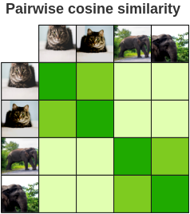
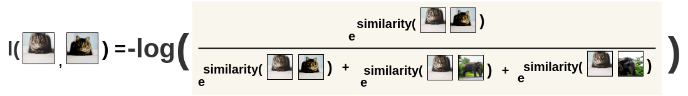
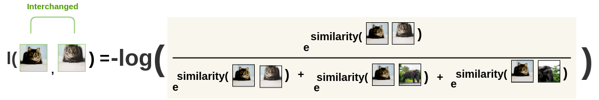
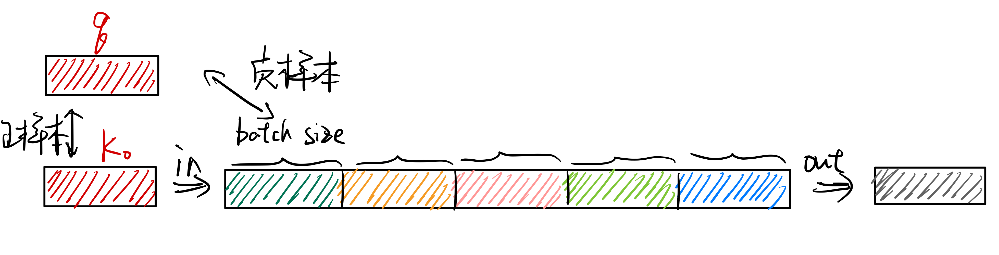

对比学习论文的一些总结和综述。
<!-- more -->

## 对比学习简介

## SimCLR

论文地址：

* [https://arxiv.org/abs/2002.05709](https://arxiv.org/abs/2002.05709)

论文代码：

* [https://github.com/google-research/simclr](https://github.com/google-research/simclr)

人类是可以通过对比来学习特征知识的，如下图所示：

通过给定左边猫的图像，人类可以通过对比得到右边哪一张图像是猫，哪一些不是。那么是否可以让机器也学会对比，通过区分相似样本和不相似样本来得到图像、文本的特征——对比学习。

SimCLR的流程如下所示，一张图像经过不同的数据增强得到两张不相同但具有相同语义的图像$x_i$和$x_j$。然后这两张图像通过一个Encoder得到中间向量表征$h_i$和$h_j$，之后中间向量表征再通过一个非线性层得到向量表征$z_i$和$z_j$。最后去最大化这两张具有相同语义信息的图像的向量表征$z_i$和$z_j$来优化模型。

但是上面只通过正样本进行学习是没有办法将模型训练起来的，这是因为只用正样本对会使模型学到一个捷径解，即不管输入什么，都输出相同的向量表示，这样就会造成模型坍塌。所以需要同时加入正样本对和负样本对，这里的负样本数据来自同一个$batch$中不匹配的数据。这里以$batch\_size=2$为例：

这样就得到了$2N=4$张图像，对每一个图像对算相似度得到相似度矩阵，需要最大化正样本对的相似度。

SimCLR的损失函数为InfoNCE：
$$l(i, j) = -log\frac{exp(s_{i, j})}{ \sum_{k=1}^{2N} {}_{[k!= i]} exp(s_{i, k})}$$
$$L = \frac{1}{2\textcolor{skyblue}{N}} \sum_{k=1}^{N} [l(2k-1, 2k) + l(2k, 2k-1)]$$
$$s_{i,j}=\frac{z_i^Tz_j}{\tau||z_i||||z_j||}$$

首先计算图像i对图像j的损失：

然后交换位置，再算一次，保持对称性：

最后将所有对的损失求平均：

当SimCLR训练完成后，就可以将模型冻住，使用中间向量特征完成下游任务。

## MoCo

论文地址：

* [https://arxiv.org/abs/1911.05722](https://arxiv.org/abs/1911.05722)

论文代码：

* [https://github.com/facebookresearch/moco](https://github.com/facebookresearch/moco)

首先来看一下MoCo和SimCLR的区别：

可以看到，MoCo和SimCLR不同的地方主要有两个方面：

1. 负样本并不是在同一个batch中取，而是通过一个队列进行存储，从而将负样本数量和batch size解耦。
2. 正负样本的编码器并没有共享参数，而是使用动量更新的方法来更新负样本编码器。

MoCo通过使用队列将负样本存储起来，如下图所示。将最新得到的负样本特征加入队列，并将最早的负样本特征移出队列，从而去维护一个负样本队列。这样负样本的数量就是队列的大小，队列中的负样本可以来自多个batch。

但是使用队列存储负样本就会出现一个问题，每个不同batch的数据都是来自不同时刻的模型，如下图所示：

如果像simCLR一样直接将$\theta_q$的参数复制给$\theta_k$，即$\theta_k \leftarrow \theta_q$，则会出现负样本队列中数据特征不一致的问题。因为负样本队列中的数据来自不同的batch，而且$\theta_q$是根据梯度在快速更新的，如果$\theta_k$的参数也快速更新，则队列中$\theta_{k-1}$、$\theta_{k-2}$等模型得到的特征分布会和$\theta_k$的得到的特征分布有很大的区别，这样模型就会学到一个捷径解，即根据特征分布的不同来区分正负样本，而不是理解样本的语义信息。
因此，MoCo在这里使用了动量更新来改变$\theta_k$模型的参数：
$$\theta_k = m\theta_{k-1} + (1-m)\theta_q$$
从而使$\theta_k$模型缓慢更新，保证了队列中负样本队列中特征分布的一致性。在论文中，作者将$m$设为了0.999。

最后，放一张MoCo的伪代码图：

## BYOL

论文地址：

* [https://arxiv.org/abs/2006.07733](https://arxiv.org/abs/2006.07733)

论文代码：

* [https://github.com/deepmind/deepmind-research/tree/master/byol](https://github.com/deepmind/deepmind-research/tree/master/byol)

在对比学习中，负样本是一个约束，如果在算损失函数时只有正样本，即让所有相似样本的特征尽可能的接近，那么就会出现一个很明显的捷径解。对于模型来说，不论输入什么样本，都返回同样的特征，那么损失就会为0，模型不用再学习语义信息。而只有加上负样本的约束，不光相似的样本要有相似的特征，不相似的物体同样也需要有不相似的特征，这样模型才有动力去学习样本的语义信息。因此，负样本在对比学习中至关重要，它能防止模型学到捷径解。但BYOL的方法可以在没有负样本的情况下进行对比学习，只有正样本参与训练。

在SimCLR中，任务流程如下所示：

在MoCo中，任务流程如下所示：

在BYOL中，任务流程如下图所示：

可以看到BYOL增加了一个Predictor，并且将InfoNCE Loss改为了MSE Loss，使用$\theta$模型得到的结果，去预测$\xi$模型的结果，将匹配的问题换成了一个预测的问题，并且还取得了很好效果：

BYOL可以不使用负样本进行学习非常神奇，所以有人对论文进行复现，发现了一个比较有意思的现象。对BYOL的这一现象进行了解释，[Understanding Self-Supervised and Contrastive Learning with "Bootstrap Your Own Latent" (BYOL)](https://generallyintelligent.com/blog/2020-08-24-understanding-self-supervised-contrastive-learning/)。

该博客的作者在复现BYOL论文的时候遗漏了一个小细节，出现了模型坍塌的现象。
在SimCLR中，Projector $g_{\theta}$由一个MLP构成，其组成结构如右边所示：

在MoCo中，Projector $g_{\theta}$同样由一个MLP构成，但其内部结构略有不同（没有用BatchNorm），如右边所示：

在BYOL中，Projector $g_{\theta}$和Predictor $q_{\xi}$由同样结构的MLP组成，如右边所示：

这篇博客的作者在复现BYOL时使用了MoCo的代码，少加了一个BatchNorm层，就导致了模型的坍塌。所以作者又做了一些额外的实验进行对比：

| Name | Projection MLP Norm | Prediction MLP Norm | Loss Function | Contrastive | Performance |
| :--- | :--- | :--- | :--- | :--- | :--- |
| Contrastive Loss | None | None | Cross Entropy | Explicit | 44.1 |
| BYOL | Batch Norm | Batch Norm | L2 | Implicit | 57.7 |
| Projection BN Only | Batch Norm | None | L2 | Implicit | 55.3 |
| Prediction BN Only | None | Batch Norm | L2 | Implicit | 48 |
| No Normalization | None | None | L2 | None | 28.3 |
| Layer Norm | Layer Norm | Layer Norm | L2 | None | 29.4 |
| Random | — | — | — | None | 28.8 |

所以最后作者总结BYOL在训练时可以只用正样本而模型不坍塌，是因为BatchNorm计算了整个batch里面样本的均值和方差去做归一化，这意味着当模型在计算某个正样本的Loss的时候，其实也看到了这个batch里面的其他样本的特征，相当于整个batch里面样本构成了一个隐式的负样本。所以在加入BatchNorm之后，BYOL其实不光是只用了正样本，其实也在和batch内的平均样本进行对比，相当于也使用了负样本。

但是BYOL的作者看到该博客后又发了一篇[论文](https://arxiv.org/abs/2010.10241)来进行解释：

使用GroupNorm和weight standarlization（GN with WS）来训练模型，在没有使用batch信息的情况下模型照样可以训练，没有坍塌。

## SimSiam

论文地址：

* [https://arxiv.org/abs/2011.10566](https://arxiv.org/abs/2011.10566)

SimSiam就是把BYOL中的动量更新去掉，两个编码器共享权重：

伪代码如下：

## SimBERT

开源地址：

* [https://github.com/ZhuiyiTechnology/simbert](https://github.com/ZhuiyiTechnology/simbert)

介绍SimBERT之前，需要先了解一下[UniLM](https://arxiv.org/abs/1905.03197)这篇文章。它通过设计特殊的`Self-attention Mask`来使Transformer Encoder模型成为单向、双向以及序列到序列的模型。如下所示：

而SimBERT就是使用了UniLM中Seq-to-Seq LM的Mask方式。用如下例子举例：

`[CLS] 你 想 吃 啥 [SEP]`这几个token之间是双向的Attention，他们可以关注到这句话的所有token，而`白 切 鸡 [SEP]`这几个token则是单向的Attention，他们只能关注到当前时刻之前的token。
而且，由于特殊的`Self-attention Mask`，`[CLS] 你 想 吃 啥 [SEP]`这6个token只在它们之间相互做Attention，而跟`白 切 鸡 [SEP]`这几个token完全没关系，这就意味着，尽管后面拼接了`白 切 鸡 [SEP]`，但这不会影响到前6个token的编码向量，前6个token的编码向量等价于只有`[CLS] 你 想 吃 啥 [SEP]`时的编码结果。如果让`[CLS]`的向量代表着句向量，那么它就是`你 想 吃 啥`的句向量。

SimBERT属于有监督训练，通过爬取百度知道推荐的相似问句得到相似句子对，其训练过程中有两个任务，分别如下：

1. 通过相似句子对得到的句子向量做对比学习。
2. 通过输入一个句子来预测该句子的相似句子。

由于`[CLS]`向量实际上就代表着输入的句子向量，所以可以作为对比学习中的句向量表示。

## SimCSE

论文地址：

* [https://arxiv.org/abs/2104.08821](https://arxiv.org/abs/2104.08821)

论文代码：

* [https://github.com/princeton-nlp/SimCSE](https://github.com/princeton-nlp/SimCSE)

对于无监督的部分，最核心的创新点就是使用droupout来对文本增加噪音，从而构造一个正样本对，而负样本对则是在batch中选取的其它句子。其实对于图像任务来说，做数据增强其实非常简单，有各种的手段。但是对于NLP任务来说做数据增强且不影响句子的语义会更加的困难，传统的方法有词替换，裁剪以及回译，但是作者发现这些方法都没有简单的dropout效果好。结果如下:

## Clip

论文地址：

* [https://arxiv.org/abs/2103.00020](https://arxiv.org/abs/2103.00020)

论文代码：

* [https://github.com/openai/CLIP](https://github.com/openai/CLIP)

先来看一下模型总览图：

Clip将配对的图片文本对作为对比学习的正样本。在训练过程中，输入是相互匹配的文本图片对。图片通过图片的编码器（Res50、ViT）得到图片的特征，文本通过文本的编码器（Transformer Encoder）得到文本的特征。假设每个batch大小为$N$，即有$N$个配对的图片文本对，则可以得到$N * N$大小的相似度矩阵，然后去进行对比学习。

在下游任务中，Clip使用zero shot方式进行预测，通过prompt生成对应类别的句子，然后将句子通过文本编码器得到文本特征。在推理的时候，任意输入一张图片，通过图片编码器得到图片的特征，只需计算图片特征和句子特征的相似度，选择最相似的文本作为分类结果即可。而且，当Clip真正使用的时候，文本处的标签是可以随时变化的（变更标签、新增表现），而模型参数完全不需要重新训练(相当于是做开放集的预测)。

这里看一张有意思的图：

一开始OpenAI训练Clip的方法是通过GPT式的生成方法来做的，就是输入图片，将对应的文本预测出来。但由于效率问题改成了通过对比学习的方式来训练。但根据微软[KOSMOS-1](https://arxiv.org/abs/2302.14045)这篇论文，GPT4中用到的技术很有可能就是将文本和图片输入模型，然后通过生成的方式输出文本从而进行训练。

Clip的伪代码如下：

