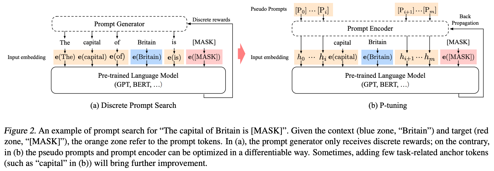
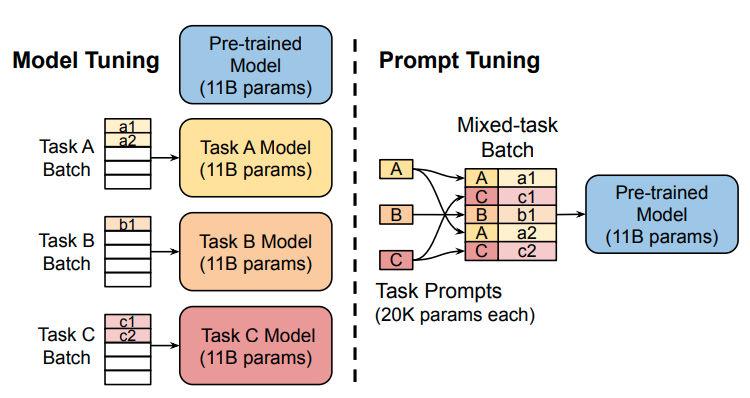
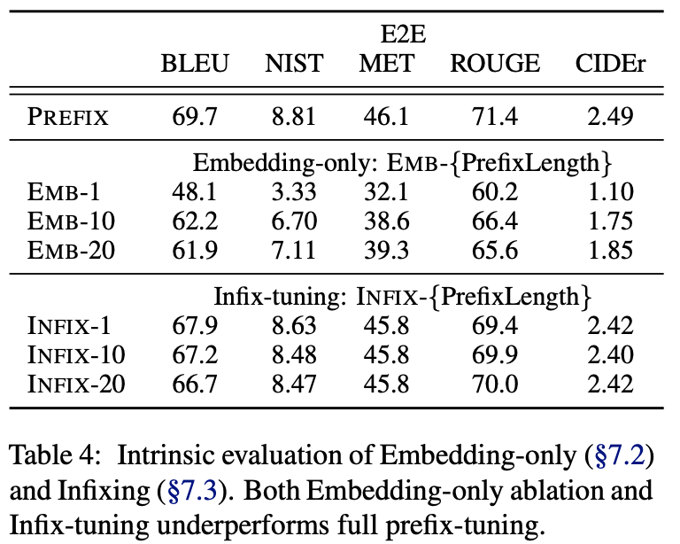

最近，深度学习的研究中出现了许多大型预训练模型，例如GPT-3、BERT等，这些模型可以在多种自然语言处理任务中取得优异的性能表现。而其中，ChatGPT模型因为在对话生成方面的表现而备受瞩目，成为了自然语言处理领域的热门研究方向。  
然而，这些大型预训练模型的训练成本非常高昂，需要庞大的计算资源和大量的数据，一般人难以承受。这也导致了一些研究人员难以重复和验证先前的研究成果。为了解决这个问题，研究人员开始研究Parameter-Efficient Fine-Tuning (PEFT)技术。PEFT技术旨在通过最小化微调参数的数量和计算复杂度，来提高预训练模型在新任务上的性能，从而缓解大型预训练模型的训练成本。这样一来，即使计算资源受限，也可以利用预训练模型的知识来迅速适应新任务，实现高效的迁移学习。因此，PEFT技术可以在提高模型效果的同时，大大缩短模型训练时间和计算成本，让更多人能够参与到深度学习研究中来。下面我们将深入探讨PEFT的一些主要做法。

<!-- more -->

## Adapter Tuning

论文地址：

* [https://arxiv.org/abs/1902.00751](https://arxiv.org/abs/1902.00751)

论文代码：

* [https://github.com/google-research/adapter-bert](https://github.com/google-research/adapter-bert)

谷歌的研究人员首次在论文《Parameter-Efficient Transfer Learning for NLP》提出针对BERT的PEFT微调方式，拉开了PEFT研究的序幕。他们指出，在面对特定的下游任务时，如果进行Full-fintuning（即预训练模型中的所有参数都进行微调），太过低效；而如果采用固定预训练模型的某些层，只微调接近下游任务的那几层参数，又难以达到较好的效果。  
于是他们设计了如下图所示的Adapter结构，将其嵌入Transformer的结构里面，在训练时，固定住原来预训练模型的参数不变，只对新增的Adapter结构进行微调。同时为了保证训练的高效性（也就是尽可能少的引入更多参数），他们将Adapter设计为这样的结构：首先是一个down-project层将高维度特征映射到低维特征，然后过一个非线形层之后，再用一个up-project结构将低维特征映射回原来的高维特征；同时也设计了skip-connection结构，确保了在最差的情况下能够退化为identity。



模型在最开始初始化的时候需要让Adapter对原大模型影响最小，否则会出现训练失败的情况。即上图中Adapter Layer中绿色的部分的输出需要接近0，只让skip-connection起作用，通过这样的初始化让刚开始加了Adapter的模型和没加Adapter的模型在结果上基本是一致的。这样可以在起点上让模型表现的更好，从而使得微调过程更容易成功。


## P-Tuning

### P-Tuning v1

论文地址：

* [https://arxiv.org/abs/2103.10385](https://arxiv.org/abs/2103.10385)

论文代码：

* [https://github.com/THUDM/P-tuning](https://github.com/THUDM/P-tuning)

#### 模型



对于一个prompt模版$T = \{[P_{0:i}], x, [P_{i+1:m}], y\}$来说，有如下两种构建prompt的方式：

* 传统的添加离散prompt的方式：
  $$\{e([P_{0:i}]), e(x), e([P_{i+1:m}]), e(y)\}$$
  其中$P_i$是词汇表中的token。
* P-tuning添加连续prompt的方式：
  $$\{h_0, ..., h_i, e(x), h_{i+1}, ..., h_m, e(y)\}$$
  其中$h_i(0\leq i\leq m)$是可训练的embedding向量，然后可以通过如下目标函数优化增加的embedding向量。
  $$\hat{h}_{0:m} = \mathop{\arg\min}\limits_{\theta}L(Model(x,y))$$

#### Optimization

在训练连续prompt的过程中有两个问题：

1. `Discreteness:`原始大模型中的embedding已经在预训练中被训练好了，如果将新增加的prompt embedding随机初始化，则很容易陷入局部最优解。
2. `Association:`prompt embedding中的tokens之间应该是互相依赖而非独立的。

为解决如上两个问题，P-tuning额外使用了一个LSTM模型来编码$h_i$，实际输入模型的prompt embedding为下式中的$h^{'}_i$：
$$h^{'}_i = MLP([\overrightarrow{h_i}:\overleftarrow{h_i}]) = MLP([LSTM(h_{0:i}):LSTM(h_{i:m})])$$

而且，在inference中，我们只需要直接使用$h^{'}_i$即可，而不用再使用LSTM模型进行计算。

### P-Tuning v2

论文地址：

* [https://arxiv.org/abs/2110.07602](https://arxiv.org/abs/2110.07602)

论文代码：

* [https://github.com/THUDM/P-tuning-v2](https://github.com/THUDM/P-tuning-v2)

#### 介绍

P-Tuning仅对大模型的Embedding加入新的参数。  
P-Tuning v2，在大模型的Embedding和每一层layer前都加上新的参数。

#### 模型

P-tuning存在以下两个缺陷：

1. `Lack of universality across scales`: 对于参数数量在10B以下的模型，p-tuning表现的比fine-tuning要差很多。
2. `Lack of universality across tasks`: 对于分类问题，p-tuning可以表现的较好，但是对于序列标注这种`hard sequence tagging tasks`，p-tuning表现的较差。

针对上述问题，作者提出了P-Tuning v2。


如上图所示，在P-tuning中，`continuous prompts`只在embedding层插入。而在P-tuning v2中，`continuous prompts`在每一个layer层都可以作为`prefix tokens`被插入。这样可以带来两个好处：

1. P-tuning v2拥有更多的可学习参数，可以在微调的时候学到更多的东西。
2. 在更深层中加入的`continuous prompts`可以更好的影响模型的输出。

#### 其他细节和结果

##### Reparameterization

P-tuning中使用了双向的LSTM对`continuous prompts`进行编码，在P-tuning v2中发现这一改进在有些任务中会带来积极作用，但在有些任务中会带来消极作用。

##### Prompt Length

We find that different NLU tasks usually achieve their best performance
with different prompt lengths. Generally, simple classification tasks prefer shorter prompts (less than 20); hard sequence labeling tasks prefer longer ones (around 100).

##### Multi-task Learning

可以通过多任务训练共享的`continuous prompts`来对其进行更好的初始化，然后再在特定的下游任务中对`continuous prompts`进行微调。

##### 结果

结果和对比如下：


## Prompt Tuning

论文地址：

* [https://arxiv.org/abs/2104.08691](https://arxiv.org/abs/2104.08691)

在T5模型中，原始输入为$X_e \in \mathbb{R}^{n \times e}$，Prompt-Tuning将可学习的prompt参数$P_e \in \mathbb{R}^{p \times e}$和原始输入拼接起来得到$[P_e;X_e] \in \mathbb{R}^{(p+n) \times e}$，作为模型新的输入。训练时冻结预训练模型的参数，仅对prompt参数进行训练与更新。

|  |  |
| --- | --- |

### Prompt长度

论文针对 1，5，20，100，150五种不同的prompt参数长度进行了测试。当prompt参数长度超过20时，整体模型的效果提升并不是很明显。当预训练模型较大时，不同prompt参数长度的表现差异较小。

<div align=center>

</div>

### Prompt初始化方案

Prompt的初始化方案：

1. Random initialization
2. 从T5字典中的5000个最常用tokens中提取
3. 从任务label对应的tokens中提取

<div align=center>

</div>

### Prompt Ensemble

* Average: 单条prompt的平均。
* Best: 最好的一条prompt。
* Ensemble: 多条prompt投票。


## Prefix Tuning

论文地址：

* [https://arxiv.org/abs/2101.00190](https://arxiv.org/abs/2101.00190)

论文代码：

* [https://github.com/XiangLi1999/PrefixTuning](https://github.com/XiangLi1999/PrefixTuning)

### 介绍

`Fine-tuning`是使用大规模预训练语言模型来进行下游任务的流行范式，但该方法需要更新和储存语言模型的全部参数，且在下游任务应用时，需要对每一个任务都存储一份修改后的参数。  
`Lightweight fine-tuning`是尝试解决上述问题的方法，其固定住绝大部分的预训练参数，只修改预训练模型的小部分模块。  
`Prompting`是在模型的输入前加上instructions和一些样本使模型输出任务需要的结果。  
而作者提出了`prefix-tuning`在调节模型时的过程中只优化一小段contiuous task-specific vector(prefix)。这种方法有以下优点：

1. 与fine tuning相比，只需要存储一份共享的预训练模型参数和多个task-specific prefix，对于不同的任务只需要不同的prefix。
2. 与Lightweight fine-tuning相比，prefix tuning在相同的表现下需要调节的参数量更小。
3. 与prompting相比，prefix包含的是连续的可训练的参数，而不是真实tokens对应的embedding，其表达的特征更加灵活和丰富。


### Prefix-Tuning

#### Method

Prefix-tuning在autoregressive LM（如GPT）前添加prefix得到$z=[PREFIX;X;Y]$，或者在encoder-decoder模型（如T5、BART）的encoder和decoder之前添加prefixs得到$z=[PREFIX;x;PREFIX';y]$，如下图所示。

其中，$P_{idx}$表示prefix indices序列；$|P_{idx}|$表示prefix的长度。Prefix-tuning将初始化一个参数量为$|P_{idx}| \times dim(h_i)$的可训练矩阵：
$$
  h_i =
    \begin{cases}
      P_{\theta}[i,:],  & \text{if $i \in P_{idx}$} \\
      LM_{\phi}(z_i,h_{<i}), & \text{otherwise}
    \end{cases}
$$
training objective与fine-tuning相同，但语言模型的参数$\phi$固定，仅对prefix参数$\theta$进行训练。

#### Parametrization of $P_\theta$

在实验上，直接更新$P_\theta$的参数会导致优化不稳定以及表现性能上的下降。因此文中通过使用较小的初始化矩阵$P_{\theta}'$，然后通过大型前馈神经网络来reparametrize矩阵$P_\theta$。
$$P_\theta[i,:]=MLP_{\theta}(P_{\theta}'[i,:])$$
当训练完成后，reparametrization参数被丢掉，仅$prefix(P_\theta)$需要被保存下来。

### Intrinsic Evaluation

#### Prefix Length

Prefix长度饿影响如下，更长的prefix长度意味着更多的训练参数和更丰富的表达能力。


#### Full vs Embedding-only

Prefix可仅在embedding层插入，也可在每一层layer中插入，结果对比如下：

可以看出：discrete prompting < embedding-only ablation < prefix-tuning。

#### Prefixing vs Infixing

在Prefix-tuning中，连续向量在输入前被插入，$[PREFIX;x;y]$。除了在输入前面插入之外，还可以在中间插入，如$[x;INFIX;y]$。  
对比结果如上表，prefix-tuning略优于infix-tuning。这可能是因为在语言模型中prefix-tuning可以同时影响x和y，而infix-tuning只可以影响到y。

#### Initialization

prefix参数的初始化也会对效果有较大影响，随机初始化会带来较低的performence和较大的variance。而将prefix初始化为真实token的embedding可以带来较好的效果。
In particular, initializing with task relevant words such as “summarization” and “table-to-text” obtains slightly better performance than task irrelevant words such as “elephant” and “divide”, but using real words is still better than random.


## LoRA

论文地址：

* [https://arxiv.org/abs/2106.09685](https://arxiv.org/abs/2106.09685)

论文代码：

* [https://github.com/microsoft/LoRA](https://github.com/microsoft/LoRA)

### 简介

自然语言处理目前存在一个重要范式：先在一般领域数据进行大规模预训练，然后再在特定的任务领域进行适应性微调（fine-tuning）。  
但是随着预训练语言模型越来越大，这个范式存在以下问题：

1. 当我们finetune大模型是，由于训练成本太高，不太可能重新训练所有的模型参数。
2. 以前的方法都或多或少有其他性能问题：
   * adapter增加了模型的层数，引入了额外的推理延迟。
   * prefix-tuning比较难训练，效果不如直接finetune。而且，prefix-tuning会占用模型的sequence length，使得模型的有效输入变短。

基于上述背景，论文作者得益于前人的一些关于内在维度（intrinsic dimension）的发现，提出了低秩自适应方法（LoRA）。该方法有以下好处：

1. 一个预训练的大模型可以在多个下游任务中被共享。我们可以freeze大模型的权重，而只去训练和保存各个下游任务中的低秩自适应矩阵。
2. 由于LoRA方法将大模型的参数完全冻住，只训练增加的低秩矩阵，因此训练参数很少，相应的训练效率也会很高。
3. 在inference阶段，LoRA方法不会带来额外的推理延迟，推理速度和预训练的大模型完全一致。
4. LoRA可以和之前提出的方法完美的结合，多种方法可以结合在一起使用（如adapter、prefix-tuning）。

### 方法

LoRA方法如下图所示，即冻结预训练大模型的参数，然后通过A、B两个矩阵来模型大模型的参数更新，在下游任务中只更新新增加的矩阵。


微调一个大模型时，如果使用full finetune方法，则公式如下：
$$W=W_0+\Delta W$$
其中，$W_0$是预训练模型的初始化参数，$\Delta W$是需要更新的变化量。在全参数微调中，$\Delta W$的参数量是和$W_0$的参数量一样的。对于一个超大模型（如GPT3）来说，其成本是很高的。

而在LoRA中，其更新公式如下：
$$W=W_0+\Delta W=W_0+BA, W_0 \in \mathbb{R}^{d \times k}, B \in \mathbb{R}^{d \times r}, A \in \mathbb{R}^{r \times k}$$
其中$r$就是低秩自适应矩阵中的秩，$r \ll min(d,k)$。在训练过程中，$W_0$被冻住（不通过梯度进行更新），而需要训练的参数为AB两个矩阵，这样由于$r$的取值很小，需要训练的参数远远小于$W_0$的参数量。


在论文中，作者将A矩阵用随机高斯分布初始化，将B矩阵初始化为0矩阵，保证训练开始时旁路矩阵为0矩阵，使得刚开始的LoRA模型和预训练模型一致。



在推理阶段，只需要将模型的改变和预训练模型相加并替换预训练模型的参数即可，$W=W_0+BA$，不会带来任务额外的参数和推理延迟。


## PEFT代码实现

使用[Hugging Face封装代码](https://github.com/huggingface/peft)，目前支持的方法：

* LoRA: LORA: LOW-RANK ADAPTATION OF LARGE LANGUAGE MODELS
* Prefix Tuning: Prefix-Tuning: Optimizing Continuous Prompts for Generation, P-Tuning v2: Prompt Tuning Can Be Comparable to Fine-tuning Universally Across Scales and Tasks
* P-Tuning: GPT Understands, Too
* Prompt Tuning: The Power of Scale for Parameter-Efficient Prompt Tuning
* AdaLoRA: Adaptive Budget Allocation for Parameter-Efficient Fine-Tuning

```python
from transformers import AutoModelForSeq2SeqLM
from peft import get_peft_config, get_peft_model, LoraConfig, TaskType
model_name_or_path = "bigscience/mt0-large"
tokenizer_name_or_path = "bigscience/mt0-large"

peft_config = LoraConfig(
    task_type=TaskType.SEQ_2_SEQ_LM, inference_mode=False, r=8, lora_alpha=32, lora_dropout=0.1
)

model = AutoModelForSeq2SeqLM.from_pretrained(model_name_or_path)
model = get_peft_model(model, peft_config)
model.print_trainable_parameters()
```
